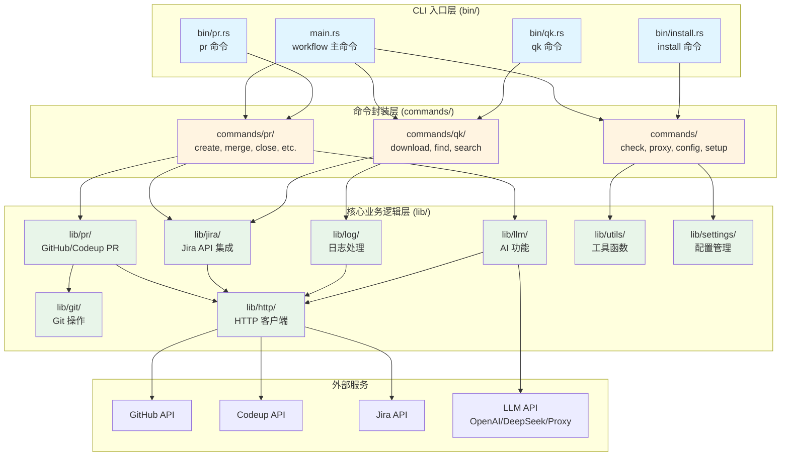

# Workflow - Rust CLI 工具

工作流自动化工具的 Rust 实现版本。

## 📚 文档

完整的架构文档和使用说明请查看 [docs/README.md](./docs/README.md)。

主要文档包括：
- [docs/ARCHITECTURE.md](./docs/ARCHITECTURE.md) - 总体架构设计文档
- [docs/PR_ARCHITECTURE.md](./docs/PR_ARCHITECTURE.md) - PR 模块架构文档
- [docs/QK_ARCHITECTURE.md](./docs/QK_ARCHITECTURE.md) - 快速日志操作模块架构文档
- [docs/LLM_ARCHITECTURE.md](./docs/LLM_ARCHITECTURE.md) - LLM 统一配置驱动架构文档
- [docs/CONFIG_ARCHITECTURE.md](./docs/CONFIG_ARCHITECTURE.md) - 配置管理模块架构文档
- [docs/INSTALL_ARCHITECTURE.md](./docs/INSTALL_ARCHITECTURE.md) - 安装/卸载模块架构文档
- [docs/PROXY_ARCHITECTURE.md](./docs/PROXY_ARCHITECTURE.md) - 代理管理模块架构文档
- [docs/CHECK_ARCHITECTURE.md](./docs/CHECK_ARCHITECTURE.md) - 环境检查模块架构文档

## 🚀 快速开始

### 安装

#### 方式一：使用 Homebrew（推荐）

```bash
# 添加 tap（如果已创建）
brew tap zevwings/workflow

# 安装
brew install workflow
```

> **注意**：
> - 需要先在 GitHub 上创建 `homebrew-workflow` tap 仓库，并将 `Formula/workflow.rb` 文件推送到该仓库。
> - 如果使用 GitHub Actions 自动发布，需要配置 `HOMEBREW_TAP_TOKEN` secret（见下方说明）。

#### 方式二：使用 Makefile

使用 Makefile 安装所有二进制文件到系统：

```bash
make install
```

这会安装以下命令到 `/usr/local/bin`：
- `workflow` - 主命令
- `pr` - PR 操作命令
- `qk` - 快速日志操作命令

**重要提示**：
- 安装后如果命令无法识别，请重新加载 shell：`hash -r` 或重启终端
- 如果系统默认的 `pr` 命令（Unix 文本格式化工具）干扰，确保 `/usr/local/bin` 在 PATH 中位于 `/usr/bin` 之前

### 编译项目

```bash
cargo build --release
# 或使用 Makefile
make release
```

### 运行测试

```bash
cargo test
```

### 运行 CLI

```bash
cargo run -- --help
```

## 🏗️ 架构总览



## 📦 项目结构

```
workflow/
├── Cargo.toml           # 项目配置和依赖管理
├── Makefile             # 构建和安装脚本
├── Formula/             # Homebrew Formula 定义
│   └── workflow.rb      # Homebrew 安装配方
├── src/
│   ├── main.rs          # 主 CLI 入口（workflow 命令）
│   ├── lib.rs           # 库入口，重新导出所有公共 API
│   ├── lib/             # 核心库模块（业务逻辑层）
│   │   ├── git/         # Git 操作（命令封装、仓库检测、类型定义）
│   │   ├── http/        # HTTP 客户端（支持认证和代理）
│   │   ├── jira/        # Jira API 集成（客户端、状态管理、工作历史）
│   │   ├── pr/          # PR 相关功能（GitHub/Codeup 支持、提供者抽象）
│   │   ├── llm/         # LLM 集成（AI 功能，支持 OpenAI/DeepSeek/Proxy）
│   │   ├── log/         # 日志处理（下载、搜索、提取）
│   │   ├── settings/    # 配置管理（环境变量单例）
│   │   └── utils/       # 工具函数（浏览器、剪贴板、日志、代理等）
│   ├── bin/             # 独立可执行文件（CLI 入口层）
│   │   ├── pr.rs        # PR 命令入口（独立的 pr 命令）
│   │   ├── qk.rs        # 快速日志操作入口（独立的 qk 命令）
│   │   └── install.rs   # 安装命令入口（独立的 install 命令）
│   └── commands/        # 命令实现（命令封装层）
│       ├── pr/          # PR 相关命令（create, merge, close, status, list, update）
│       ├── qk/          # 快速日志操作命令（download, find, search）
│       ├── check.rs     # 检查命令（git_status, network）
│       ├── proxy.rs     # 代理管理命令（on, off, check）
│       ├── config.rs    # 配置查看命令
│       ├── setup.rs     # 初始化设置命令
│       ├── install.rs   # 安装命令实现
│       └── uninstall.rs # 卸载命令实现
└── docs/                # 文档目录
    ├── README.md        # 文档索引
    ├── ARCHITECTURE.md  # 总体架构设计文档
    ├── PR_ARCHITECTURE.md      # PR 模块架构文档
    ├── QK_ARCHITECTURE.md      # 快速日志操作模块架构文档
    ├── LLM_ARCHITECTURE.md     # LLM 统一配置驱动架构文档
    ├── CONFIG_ARCHITECTURE.md  # 配置管理模块架构文档
    ├── INSTALL_ARCHITECTURE.md # 安装/卸载模块架构文档
    ├── PROXY_ARCHITECTURE.md   # 代理管理模块架构文档
    └── CHECK_ARCHITECTURE.md   # 环境检查模块架构文档
```

## 配置

在首次使用之前，需要配置必要的设置。推荐使用交互式设置命令：

```bash
workflow setup
```

这将引导你完成所有配置项的设置，并自动保存到 TOML 配置文件（`~/.workflow/config/workflow.toml`）。

### 配置文件位置

- **主配置文件**：`~/.workflow/config/workflow.toml` - 包含用户、Jira、GitHub、日志、代理、Codeup、LLM/AI 等配置

### 必填配置

以下配置项是**必须**设置的：

| 配置项 | 说明 | 示例 |
|-------|------|------|
| `user.email` | 用户邮箱地址 | `user@example.com` |
| `jira.api_token` | Jira API Token | 从 Jira 设置中获取 |
| `jira.service_address` | Jira 服务地址 | `https://your-company.atlassian.net` |
| `github.api_token` | GitHub API Token（用于 PR 操作） | 从 GitHub 设置中获取 |

### 可选配置

以下配置项是**可选**的，根据你的使用场景选择配置：

#### GitHub 配置

| 配置项 | 说明 | 默认值 |
|-------|------|--------|
| `github.branch_prefix` | GitHub 分支前缀 | - |

#### 日志配置

| 配置项 | 说明 | 默认值 |
|-------|------|--------|
| `log.output_folder_name` | 日志输出文件夹名称 | `logs` |
| `log.download_base_dir` | 下载基础目录 | `~/Downloads/Workflow` |

#### LLM/AI 配置

| 配置项 | 说明 | 默认值 |
|-------|------|--------|
| `llm.provider` | LLM 提供者（`openai`/`deepseek`/`proxy`） | `openai` |
| `llm.key` | LLM API Key（所有提供者通用） | - |
| `llm.url` | LLM 服务 URL（仅 `proxy` 提供者需要） | - |
| `llm.model` | LLM 模型名称（可选，`openai` 默认 `gpt-4.0`，`deepseek` 默认 `deepseek-chat`，`proxy` 必填） | - |
| `llm.response_format` | 响应格式路径（用于从响应中提取内容，空字符串表示使用默认的 OpenAI 格式） | 空（不保存到配置文件） |

#### Codeup 配置

| 配置项 | 说明 | 默认值 |
|-------|------|--------|
| `codeup.project_id` | Codeup 项目 ID | - |
| `codeup.csrf_token` | Codeup CSRF Token | - |
| `codeup.cookie` | Codeup Cookie | - |

### 查看配置

查看当前所有配置：

```bash
workflow config
```

### 手动配置

如果不想使用交互式设置，也可以手动编辑 TOML 配置文件：

```bash
# 编辑主配置文件
vim ~/.workflow/config/workflow.toml
```

配置文件示例：

```toml
# ~/.workflow/config/workflow.toml
[user]
email = "user@example.com"

[jira]
api_token = "your-jira-token"
service_address = "https://your-company.atlassian.net"

[github]
api_token = "your-github-token"
branch_prefix = "feature"

[log]
output_folder_name = "logs"
download_base_dir = "~/Downloads/Workflow"

[llm]
provider = "openai"
key = "your-llm-api-key"
# model = "gpt-4.0"  # 可选，openai 默认 gpt-4.0
# response_format = ""  # 可选，空字符串表示使用默认的 OpenAI 格式，不保存到配置文件

# 如果使用 proxy 提供者，需要配置 url：
# [llm]
# provider = "proxy"
# url = "https://your-proxy-url"
# key = "your-proxy-key"
# model = "your-model-name"  # proxy 提供者必填
```

## 📋 命令清单

### 检查工具
```bash
workflow check                     # 运行环境检查（Git 状态和网络连接）
```

> **注意**：pre-commit 检查已集成到 Git 提交流程中。当执行 `git commit` 时，如果工程中存在 pre-commit hooks（`.git/hooks/pre-commit` 或 `.pre-commit-config.yaml`），系统会自动执行 pre-commit 检查。

### 代理管理
```bash
workflow proxy on                  # 开启代理
workflow proxy off                 # 关闭代理
workflow proxy check               # 检查代理状态和配置
```

### 配置管理
```bash
workflow setup                     # 初始化或更新配置（交互式设置）
workflow config                    # 查看当前配置（显示所有配置项）
workflow update                    # 更新 Workflow CLI（重新构建并更新所有组件）
workflow update --version 1.1.2    # 更新到指定版本
workflow uninstall                 # 卸载 Workflow CLI（删除二进制文件、补全脚本、配置文件）
```

### GitHub 账号管理
```bash
workflow github list               # 列出所有 GitHub 账号
workflow github current            # 显示当前激活的 GitHub 账号
workflow github add                # 添加新的 GitHub 账号（交互式）
workflow github remove             # 删除 GitHub 账号（交互式选择）
workflow github switch             # 切换当前 GitHub 账号（交互式选择）
workflow github update             # 更新 GitHub 账号信息（交互式选择并更新）
```

### 日志级别管理
```bash
workflow log set                   # 设置日志级别（交互式选择：none/error/warn/info/debug）
workflow log check                 # 检查当前日志级别（显示当前、默认和配置文件中的级别）
```

### Shell Completion 管理
```bash
workflow completion generate       # 生成 completion 脚本（自动检测 shell 并应用）
workflow completion check          # 检查 completion 状态（显示已安装的 shell 和已配置的 completion）
workflow completion remove         # 移除 completion 配置（交互式选择要移除的 shell）
```

### 清理命令
```bash
workflow clean                     # 清理日志下载目录（需要确认）
workflow clean --dry-run           # 预览清理操作，不实际删除
workflow clean --list              # 只列出将要删除的内容
```

### 安装命令
```bash
install                            # 安装 Workflow CLI 到系统（默认安装二进制文件 + shell completions）
install --binaries                 # 只安装二进制文件到 /usr/local/bin
install --completions              # 只安装 shell completion 脚本
```

> **注意**：`install` 命令是一个独立的可执行文件，用于将编译好的二进制文件安装到系统。如果同时指定 `--binaries` 和 `--completions`，或不指定任何选项，则安装全部内容。


### PR 操作
```bash
# 创建 PR
pr create [JIRA_TICKET]              # 创建 PR（可选 Jira ticket，AI 生成标题）
pr create --title "..."               # 手动指定标题
pr create --description "..."         # 指定简短描述
pr create --dry-run                   # 干运行（不实际创建）

# 合并 PR
pr merge [PR_ID]                      # 合并 PR（可选指定 PR ID，否则自动检测当前分支）
pr merge --force                      # 强制合并

# 关闭 PR
pr close [PR_ID]                      # 关闭 PR（可选指定 PR ID，否则自动检测当前分支）

# 查看 PR 状态
pr status [PR_ID_OR_BRANCH]           # 显示 PR 状态信息（可选参数，不提供时自动检测当前分支）

# 列出 PR
pr list                               # 列出所有 PR
pr list --state open                  # 按状态过滤（open/closed/merged）
pr list --limit 10                    # 限制结果数量

# 更新代码
pr update                             # 更新代码（使用 PR 标题作为提交信息）

# 集成分支
pr integrate <SOURCE_BRANCH>          # 将指定分支合并到当前分支
pr integrate <SOURCE_BRANCH> --ff-only # 只允许 fast-forward 合并
pr integrate <SOURCE_BRANCH> --squash # 使用 squash 合并
pr integrate <SOURCE_BRANCH> --no-push # 不推送到远程（默认会推送）
```

### 日志操作 (qk)
```bash
# 显示 ticket 信息（不提供子命令时）
qk PROJ-123                          # 显示 Jira ticket 信息

# 下载日志
qk PROJ-123 download                  # 下载日志文件
qk PROJ-123 download --all            # 下载所有附件（不仅仅是日志附件）

# 查找请求 ID
qk PROJ-123 find [REQUEST_ID]        # 查找请求 ID（可选，不提供会交互式输入）

# 搜索关键词
qk PROJ-123 search [SEARCH_TERM]     # 搜索关键词（可选，不提供会交互式输入）

# 清理日志目录
qk PROJ-123 clean                    # 清理指定 JIRA ID 的日志目录（需要确认）
qk PROJ-123 clean --dry-run          # 预览清理操作，不实际删除
qk PROJ-123 clean --list             # 只列出将要删除的内容
```

> **注意**：`qk` 命令会根据 JIRA ID 自动解析日志文件路径，无需手动指定文件路径。如果不提供子命令，将显示 ticket 信息。


> **注意**：Codeup 仓库的 PR 查看和合并功能正在开发中，GitHub 仓库已完整支持。详细说明请查看 [PR 模块架构文档](./docs/PR_ARCHITECTURE.md)。

## 🚀 发布

### GitHub Actions 自动发布

项目使用 GitHub Actions 自动构建和发布。当推送到 `master` 分支或创建版本 tag 时，会自动触发发布流程。

#### 配置 HOMEBREW_TAP_TOKEN

为了自动更新 Homebrew Formula，需要在 GitHub 仓库中配置 `HOMEBREW_TAP_TOKEN` secret。

**配置步骤：**

1. **创建 Personal Access Token (PAT)**：
   - 访问：https://github.com/settings/tokens
   - 点击 "Generate new token" → 选择 "Generate new token (classic)"
   - 配置 Token：
     - Note（描述）：例如 "Homebrew Tap Token for workflow.rs"
     - Expiration（过期时间）：根据需要选择（建议至少 90 天或更长）
     - Select scopes：勾选 `repo`（Full control of private repositories）
   - 点击 "Generate token"
   - 复制生成的 token（只显示一次，请保存）

2. **在仓库中设置 Secret**：
   - 进入仓库设置页面：`Settings` → `Secrets and variables` → `Actions`
   - 点击 "New repository secret"
   - Name：输入 `HOMEBREW_TAP_TOKEN`
   - Secret：粘贴第一步复制的 token
   - 点击 "Add secret"

**重要提示：**
- Token 必须包含 `repo` scope
- Token 所属账号需要有访问 `homebrew-workflow` 仓库的权限
- 如果 `homebrew-workflow` 是私有仓库，确保 token 有访问权限
- Workflow 会自动验证 token 的有效性和权限

**验证配置：**

运行 GitHub Actions 时，workflow 会自动验证：
- Token 是否存在
- Token 是否有效（通过 GitHub API `/user` 端点）
- Token 是否有访问目标仓库的权限（通过 GitHub API `/repos/zevwings/homebrew-workflow` 端点）

如果验证失败，workflow 会提供详细的错误信息和解决建议。

### 发布流程

1. **自动创建 Tag**：当代码合并到 `master` 分支时，自动根据 `Cargo.toml` 中的版本号创建 tag
2. **构建二进制**：为多个平台构建 release 二进制文件
3. **创建 Release**：在 GitHub 上创建 Release，并上传构建产物
4. **更新 Homebrew Formula**：自动更新 `homebrew-workflow` 仓库中的 Formula 文件

## 🔧 开发

### 开发环境设置

首次开发前，请先安装所需的开发工具：

```bash
make setup
```

这会自动安装：
- `rustfmt` - 代码格式化工具
- `clippy` - 代码检查工具
- `rust-analyzer` - 语言服务器（从源码构建）

> **注意**：如果您的平台没有预编译的 rust-analyzer 二进制文件，`make setup` 会自动从源码构建安装。这可能需要几分钟时间。

### 添加依赖

```bash
cargo add <package-name>
```

### 代码格式化

```bash
cargo fmt
```

### Lint 检查

```bash
cargo clippy
# 或使用 Makefile 进行完整检查
make lint
```

## 📝 贡献

请参考以下文档了解更多信息：
- [docs/README.md](./docs/README.md) - 完整文档索引
- [docs/ARCHITECTURE.md](./docs/ARCHITECTURE.md) - 了解架构设计和核心模块详情


