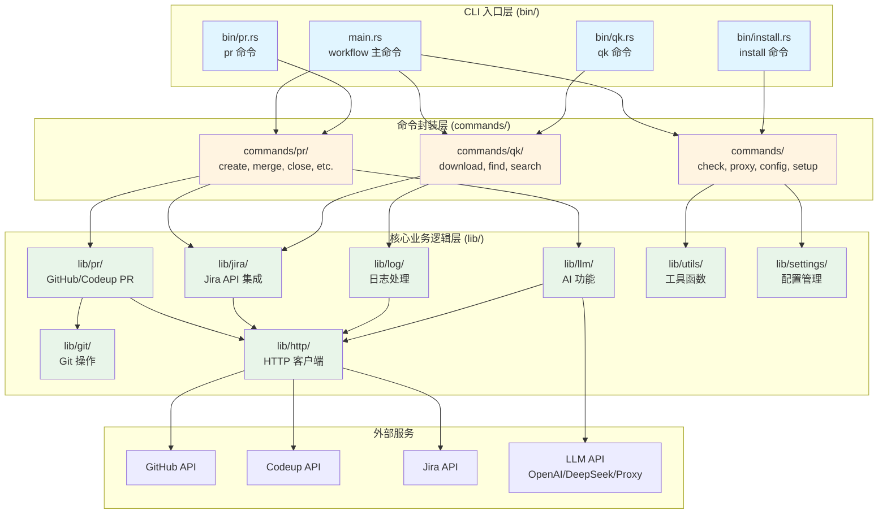

# Workflow - Rust CLI 工具

工作流自动化工具的 Rust 实现版本。

## 📚 文档

- [docs/ARCHITECTURE.md](./docs/ARCHITECTURE.md) - 架构设计文档（包含 AI 模块设计）

## 🚀 快速开始

### 安装

#### 方式一：使用 Homebrew（推荐）

```bash
# 添加 tap（如果已创建）
brew tap zevwings/workflow

# 安装
brew install workflow
```

> **注意**：需要先在 GitHub 上创建 `homebrew-workflow` tap 仓库，并将 `Formula/workflow.rb` 文件推送到该仓库。

#### 方式二：使用 Makefile

使用 Makefile 安装所有二进制文件到系统：

```bash
make install
```

这会安装以下命令到 `/usr/local/bin`：
- `workflow` - 主命令
- `pr` - PR 操作命令
- `qk` - 快速日志操作命令

**重要提示**：
- 安装后如果命令无法识别，请重新加载 shell：`hash -r` 或重启终端
- 如果系统默认的 `pr` 命令（Unix 文本格式化工具）干扰，确保 `/usr/local/bin` 在 PATH 中位于 `/usr/bin` 之前

### 编译项目

```bash
cargo build --release
# 或使用 Makefile
make release
```

### 运行测试

```bash
cargo test
```

### 运行 CLI

```bash
cargo run -- --help
```

## 🏗️ 架构总览



## 📦 项目结构

```
workflow/
├── Cargo.toml           # 项目配置和依赖管理
├── Makefile             # 构建和安装脚本
├── Formula/             # Homebrew Formula 定义
│   └── workflow.rb      # Homebrew 安装配方
├── src/
│   ├── main.rs          # 主 CLI 入口（workflow 命令）
│   ├── lib.rs           # 库入口，重新导出所有公共 API
│   ├── lib/             # 核心库模块（业务逻辑层）
│   │   ├── git/         # Git 操作（命令封装、仓库检测、类型定义）
│   │   ├── http/        # HTTP 客户端（支持认证和代理）
│   │   ├── jira/        # Jira API 集成（客户端、状态管理、工作历史）
│   │   ├── pr/          # PR 相关功能（GitHub/Codeup 支持、提供者抽象）
│   │   ├── llm/         # LLM 集成（AI 功能，支持 OpenAI/DeepSeek/Proxy）
│   │   ├── log/         # 日志处理（下载、搜索、提取）
│   │   ├── settings/    # 配置管理（环境变量单例）
│   │   └── utils/       # 工具函数（浏览器、剪贴板、日志、代理等）
│   ├── bin/             # 独立可执行文件（CLI 入口层）
│   │   ├── pr.rs        # PR 命令入口（独立的 pr 命令）
│   │   ├── qk.rs        # 快速日志操作入口（独立的 qk 命令）
│   │   └── install.rs   # 安装命令入口（独立的 install 命令）
│   └── commands/        # 命令实现（命令封装层）
│       ├── pr/          # PR 相关命令（create, merge, close, status, list, update）
│       ├── qk/          # 快速日志操作命令（download, find, search）
│       ├── check.rs     # 检查命令（git_status, network）
│       ├── proxy.rs     # 代理管理命令（on, off, check）
│       ├── config.rs    # 配置查看命令
│       ├── setup.rs     # 初始化设置命令
│       ├── install.rs   # 安装命令实现
│       └── uninstall.rs # 卸载命令实现
└── docs/                # 文档目录
    └── ARCHITECTURE.md  # 架构设计（包含 AI 模块和数据存储）
```

## 配置

在首次使用之前，需要配置必要的设置。推荐使用交互式设置命令：

```bash
workflow setup
```

这将引导你完成所有配置项的设置，并自动保存到 TOML 配置文件（`~/.workflow/config/workflow.toml` 和 `~/.workflow/config/llm.toml`）。

### 配置文件位置

- **主配置文件**：`~/.workflow/config/workflow.toml` - 包含用户、Jira、GitHub、日志、代理、Codeup 等配置
- **LLM 配置文件**：`~/.workflow/config/llm.toml` - 包含 LLM/AI 相关配置（可选）

### 必填配置

以下配置项是**必须**设置的：

| 配置项 | 说明 | 示例 |
|-------|------|------|
| `user.email` | 用户邮箱地址 | `user@example.com` |
| `jira.api_token` | Jira API Token | 从 Jira 设置中获取 |
| `jira.service_address` | Jira 服务地址 | `https://your-company.atlassian.net` |

### 可选配置

以下配置项是**可选**的，根据你的使用场景选择配置：

#### GitHub 配置

| 配置项 | 说明 | 默认值 |
|-------|------|--------|
| `github.api_token` | GitHub API Token（用于 PR 操作） | - |
| `github.branch_prefix` | GitHub 分支前缀 | - |

#### 日志配置

| 配置项 | 说明 | 默认值 |
|-------|------|--------|
| `log.output_folder_name` | 日志输出文件夹名称 | `logs` |
| `log.delete_when_completed` | 操作完成后是否删除日志 | `false` |
| `log.download_base_dir` | 下载基础目录 | `~/Downloads/Workflow` |

#### LLM/AI 配置（在 `llm.toml` 中）

| 配置项 | 说明 | 默认值 |
|-------|------|--------|
| `llm_provider` | LLM 提供者（`openai`/`deepseek`/`proxy`） | `openai` |
| `openai_key` | OpenAI API Key | - |
| `deepseek_key` | DeepSeek API Key | - |
| `llm_proxy_url` | LLM 代理 URL（使用代理时） | - |
| `llm_proxy_key` | LLM 代理 Key（使用代理时） | - |

#### Codeup 配置

| 配置项 | 说明 | 默认值 |
|-------|------|--------|
| `codeup.project_id` | Codeup 项目 ID | - |
| `codeup.csrf_token` | Codeup CSRF Token | - |
| `codeup.cookie` | Codeup Cookie | - |

### 查看配置

查看当前所有配置：

```bash
workflow config
```

### 手动配置

如果不想使用交互式设置，也可以手动编辑 TOML 配置文件：

```bash
# 编辑主配置文件
vim ~/.workflow/config/workflow.toml

# 编辑 LLM 配置文件（可选）
vim ~/.workflow/config/llm.toml
```

配置文件示例：

```toml
# ~/.workflow/config/workflow.toml
[user]
email = "user@example.com"

[jira]
api_token = "your-jira-token"
service_address = "https://your-company.atlassian.net"

[github]
api_token = "your-github-token"
branch_prefix = "feature"

[log]
output_folder_name = "logs"
delete_when_completed = false
download_base_dir = "~/Downloads/Workflow"
```

```toml
# ~/.workflow/config/llm.toml
llm_provider = "openai"
openai_key = "your-openai-key"
deepseek_key = "your-deepseek-key"
```

## 📋 命令清单

### 检查工具
```bash
workflow check                     # 运行环境检查（Git 状态和网络连接）
```

> **注意**：pre-commit 检查已集成到 Git 提交流程中。当执行 `git commit` 时，如果工程中存在 pre-commit hooks（`.git/hooks/pre-commit` 或 `.pre-commit-config.yaml`），系统会自动执行 pre-commit 检查。

### 代理管理
```bash
workflow proxy on                  # 开启代理
workflow proxy off                 # 关闭代理
workflow proxy check               # 检查代理状态和配置
```

### 配置管理
```bash
workflow setup                     # 初始化或更新配置（交互式设置）
workflow config                    # 查看当前配置（显示所有配置项）
workflow uninstall                 # 卸载 Workflow CLI（删除二进制文件、补全脚本、配置文件）
```

### 清理命令
```bash
workflow clean                     # 清理日志下载目录（需要确认）
workflow clean --dry-run           # 预览清理操作，不实际删除
workflow clean --list              # 只列出将要删除的内容
```

### 安装命令
```bash
install                            # 安装 Workflow CLI 到系统（编译并安装所有二进制文件）
```


### PR 操作
```bash
pr create [PROJ-123]     # 创建 PR（可选 Jira ticket，AI 生成标题）
pr create --title "..."  # 手动指定标题
pr create --description "..." # 指定简短描述
pr create --dry-run      # 干运行（不实际创建）
pr merge [PR_ID]         # 合并 PR（可选指定 PR ID，否则自动检测当前分支）
pr merge --force         # 强制合并
pr close [PR_ID]         # 关闭 PR（可选指定 PR ID，否则自动检测当前分支）
pr status [PR_ID_OR_BRANCH] # 显示 PR 状态信息（可选参数）
pr list                   # 列出所有 PR
pr list --state open     # 按状态过滤（open/closed/merged）
pr list --limit 10       # 限制结果数量
pr update                 # 更新代码（使用 PR 标题作为提交信息）
```

### 日志操作 (qk)
```bash
qk PROJ-123 download      # 下载日志文件
qk PROJ-123 find [id]     # 查找请求 ID（可选，不提供会交互式输入）
qk PROJ-123 search [term] # 搜索关键词（可选，不提供会交互式输入）
```

> **注意**：`qk` 命令会根据 JIRA ID 自动解析日志文件路径，无需手动指定文件路径。


> **注意**：Codeup 仓库的 PR 查看和合并功能正在开发中，GitHub 仓库已完整支持。

## 🔧 开发

### 开发环境设置

首次开发前，请先安装所需的开发工具：

```bash
make setup
```

这会自动安装：
- `rustfmt` - 代码格式化工具
- `clippy` - 代码检查工具
- `rust-analyzer` - 语言服务器（从源码构建）

> **注意**：如果您的平台没有预编译的 rust-analyzer 二进制文件，`make setup` 会自动从源码构建安装。这可能需要几分钟时间。

### 添加依赖

```bash
cargo add <package-name>
```

### 代码格式化

```bash
cargo fmt
```

### Lint 检查

```bash
cargo clippy
# 或使用 Makefile 进行完整检查
make lint
```

## 📝 贡献

请参考以下文档了解更多信息：
- [docs/ARCHITECTURE.md](./docs/ARCHITECTURE.md) - 了解架构设计和核心模块详情


