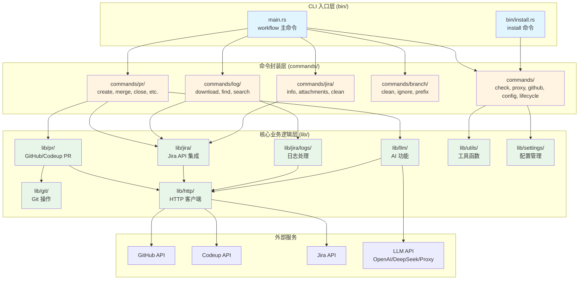

# Workflow - Rust CLI 工具


工作流自动化工具的 Rust 实现版本。

## 🌐 跨平台支持

Workflow CLI 完全支持以下平台：
- **macOS** (Intel 和 Apple Silicon)
- **Linux** (x86_64, ARM64, 包括静态链接版本)
- **Windows** (x86_64, ARM64)

### 平台特定说明

#### macOS / Linux
- 二进制文件安装到 `/usr/local/bin`
- 配置文件存储在 `~/.workflow/config/`
- 补全脚本存储在 `~/.workflow/completions/`
- 安装/卸载可能需要 `sudo` 权限
- **剪贴板功能限制**：
  - Linux ARM64 和 musl 静态链接版本不支持剪贴板功能（XCB 库依赖问题）
  - 其他平台（macOS、Linux x86_64、Windows）完全支持剪贴板功能

#### Windows
- 二进制文件安装到 `%LOCALAPPDATA%\Programs\workflow\bin`
- 配置文件存储在 `%APPDATA%\workflow\config\`
- 补全脚本存储在 `%APPDATA%\workflow\completions\`
- 支持 PowerShell (PowerShell Core 和 Windows PowerShell)
- 安装/卸载可能需要管理员权限

## 🚀 快速开始

### 安装

#### 方式一：使用 Homebrew（推荐）

```bash
# 添加 tap（如果已创建）
brew tap zevwings/workflow

# 安装
brew install workflow
```

> **注意**：
> - 需要先在 GitHub 上创建 `homebrew-workflow` tap 仓库，并将 `Formula/workflow.rb` 文件推送到该仓库。
> - 如果使用 GitHub Actions 自动发布，需要配置 `HOMEBREW_TAP_TOKEN` secret（见下方说明）。

#### 方式二：使用安装脚本（推荐，macOS/Linux）

使用一键安装脚本自动下载并安装最新版本：

```bash
# 安装最新版本
/bin/bash -c "$(curl -fsSL https://raw.githubusercontent.com/zevwings/workflow.rs/master/scripts/install.sh)"

# 安装指定版本
VERSION=v1.6.4 /bin/bash -c "$(curl -fsSL https://raw.githubusercontent.com/zevwings/workflow.rs/master/scripts/install.sh)"
```

**功能特性**：
- ✅ 自动检测操作系统和架构（macOS Intel/Apple Silicon, Linux x86_64/ARM64）
- ✅ 自动下载最新版本或指定版本
- ✅ SHA256 校验和验证确保文件完整性
- ✅ 自动安装二进制文件和 shell completion 脚本
- ✅ 错误处理和重试机制
- ✅ 临时文件自动清理

**安装流程**：
1. **平台检测**：自动检测操作系统（macOS/Linux）和架构（x86_64/ARM64）
2. **版本获取**：从 GitHub Releases API 获取最新版本，或使用指定的版本
3. **下载**：下载对应平台的二进制包（`.tar.gz`）
4. **验证**：下载并验证 SHA256 校验和
5. **解压**：解压二进制包到临时目录
6. **安装**：运行 `./install` 二进制文件进行安装
7. **清理**：自动清理临时文件

**系统要求**：
- `curl` - 用于下载文件
- `tar` - 用于解压归档文件
- `sudo` - macOS/Linux 安装到系统目录时需要（脚本会自动提示）

**卸载**：

```bash
# 使用卸载脚本
/bin/bash -c "$(curl -fsSL https://raw.githubusercontent.com/zevwings/workflow.rs/master/scripts/uninstall.sh)"

# 或使用已安装的命令
workflow uninstall
```

卸载脚本功能：
- ✅ 自动检测已安装的 Workflow CLI
- ✅ 优先使用 `workflow uninstall` 命令（如果可用）
- ✅ 手动卸载作为备选方案
- ✅ 清理二进制文件、配置文件和 completion 脚本
- ✅ 交互式确认，避免误删

卸载流程：
1. **检测安装**：检查 `workflow` 命令是否在 PATH 中
2. **确认卸载**：提示用户确认是否卸载
3. **执行卸载**：
   - 优先使用 `workflow uninstall` 命令（如果可用）
   - 如果命令不可用，执行手动卸载
4. **清理文件**：
   - 删除二进制文件（`/usr/local/bin/workflow`, `/usr/local/bin/install`）
   - 可选删除配置文件（`~/.workflow/`）
   - 删除 completion 脚本
   - 从 shell 配置文件中移除 completion 配置

#### 方式三：使用安装脚本（Windows）

使用 PowerShell 安装脚本自动下载并安装最新版本：

**PowerShell (推荐)**:
```powershell
# 安装最新版本
Invoke-WebRequest -Uri "https://raw.githubusercontent.com/zevwings/workflow.rs/master/scripts/install.ps1" -OutFile install.ps1; .\install.ps1

# 或一行命令
powershell -ExecutionPolicy Bypass -Command "Invoke-WebRequest -Uri 'https://raw.githubusercontent.com/zevwings/workflow.rs/master/scripts/install.ps1' -OutFile install.ps1; .\install.ps1"
```

**安装指定版本**:
```powershell
$env:VERSION="v1.6.4"; powershell -ExecutionPolicy Bypass -Command "Invoke-WebRequest -Uri 'https://raw.githubusercontent.com/zevwings/workflow.rs/master/scripts/install.ps1' -OutFile install.ps1; .\install.ps1"
```

**功能特性**：
- ✅ 自动检测 Windows 架构（x86_64/ARM64）
- ✅ 自动下载最新版本或指定版本
- ✅ SHA256 校验和验证确保文件完整性
- ✅ 自动安装二进制文件和 PowerShell completion 脚本
- ✅ 错误处理和重试机制
- ✅ 临时文件自动清理
- ✅ PATH 环境变量检查

**安装流程**：
1. **平台检测**：自动检测 Windows 架构（x86_64/ARM64）
2. **版本获取**：从 GitHub Releases API 获取最新版本，或使用指定的版本
3. **下载**：下载对应平台的二进制包（`.zip`）
4. **验证**：下载并验证 SHA256 校验和
5. **解压**：解压二进制包到临时目录
6. **安装**：运行 `install.exe` 二进制文件进行安装
7. **清理**：自动清理临时文件

**系统要求**：
- PowerShell 5.0 或更高版本
- 网络连接（用于下载）
- 管理员权限（可能需要，取决于安装目录权限）

**卸载**：

```powershell
# 使用卸载脚本（PowerShell 推荐）
Invoke-WebRequest -Uri "https://raw.githubusercontent.com/zevwings/workflow.rs/master/scripts/uninstall.ps1" -OutFile uninstall.ps1; .\uninstall.ps1

# 或一行命令
powershell -ExecutionPolicy Bypass -Command "Invoke-WebRequest -Uri 'https://raw.githubusercontent.com/zevwings/workflow.rs/master/scripts/uninstall.ps1' -OutFile uninstall.ps1; .\uninstall.ps1"

# 或使用已安装的命令
workflow uninstall
```

卸载脚本功能：
- ✅ 自动检测已安装的 Workflow CLI
- ✅ 优先使用 `workflow uninstall` 命令（如果可用）
- ✅ 手动卸载作为备选方案
- ✅ 清理二进制文件、配置文件和 completion 脚本
- ✅ 从 PATH 环境变量中移除安装目录
- ✅ 交互式确认，避免误删

卸载流程：
1. **检测安装**：检查 `workflow` 命令是否在 PATH 中
2. **确认卸载**：提示用户确认是否卸载
3. **执行卸载**：
   - 优先使用 `workflow uninstall` 命令（如果可用）
   - 如果命令不可用，执行手动卸载
4. **清理文件**：
   - 删除二进制文件（`%LOCALAPPDATA%\Programs\workflow\bin\workflow.exe`, `install.exe`）
   - 可选删除配置文件（`%APPDATA%\workflow\`）
   - 删除 completion 脚本
   - 从 PowerShell profile 中移除 completion 配置
   - 从 PATH 环境变量中移除安装目录

#### 方式四：使用 Makefile（仅 macOS/Linux）

使用 Makefile 安装所有二进制文件到系统：

```bash
make install
```

这会安装以下命令到 `/usr/local/bin`（macOS/Linux）或 `%LOCALAPPDATA%\Programs\workflow\bin`（Windows）：
- `workflow` - 主命令（包含所有子命令：pr, log, jira 等）

**重要提示**：
- macOS/Linux：安装后如果命令无法识别，请重新加载 shell：`hash -r` 或重启终端
- Windows：确保安装目录已添加到 PATH 环境变量中

### 安装/卸载故障排除

#### 安装失败

1. **网络问题**：检查网络连接，脚本会自动重试 3 次
2. **权限问题**：
   - macOS/Linux：确保有 `sudo` 权限以安装到系统目录
   - Windows：确保有管理员权限（取决于安装目录权限）
3. **工具缺失**：
   - macOS/Linux：确保已安装 `curl` 和 `tar`
   - Windows：确保 PowerShell 版本为 5.0 或更高

#### 卸载失败

1. **权限问题**：某些文件可能需要管理员权限才能删除
2. **手动清理**：如果自动卸载失败，可以手动删除：
   - **macOS/Linux**：
     - 二进制文件：`/usr/local/bin/workflow`, `/usr/local/bin/install`
     - 配置文件：`~/.workflow/`
     - Shell 配置：从 `~/.zshrc` 或 `~/.bashrc` 中移除相关行
   - **Windows**：
     - 二进制文件：`%LOCALAPPDATA%\Programs\workflow\bin\workflow.exe`, `install.exe`
     - 配置文件：`%APPDATA%\workflow\`
     - PowerShell 配置：从 PowerShell profile 中移除相关行
     - PATH 环境变量：从 PATH 中移除 `%LOCALAPPDATA%\Programs\workflow\bin`

### 编译项目

```bash
cargo build --release
# 或使用 Makefile
make release
```

### 运行测试

```bash
cargo test
```

### 运行 CLI

```bash
cargo run -- --help
```

## 配置

在首次使用之前，需要配置必要的设置。推荐使用交互式设置命令：

```bash
workflow setup
```

这将引导你完成所有配置项的设置，并自动保存到 TOML 配置文件（`~/.workflow/config/workflow.toml`）。

### 配置文件位置

- **macOS/Linux**：`~/.workflow/config/workflow.toml`
- **Windows**：`%APPDATA%\workflow\config\workflow.toml`

配置文件包含用户、Jira、GitHub、日志、代理、Codeup、LLM/AI 等配置。

### 必填配置

以下配置项是**必须**设置的：

| 配置项 | 说明 | 示例 |
|-------|------|------|
| `user.email` | 用户邮箱地址 | `user@example.com` |
| `jira.api_token` | Jira API Token | 从 Jira 设置中获取 |
| `jira.service_address` | Jira 服务地址 | `https://your-company.atlassian.net` |
| `github.api_token` | GitHub API Token（用于 PR 操作） | 从 GitHub 设置中获取 |

### 可选配置

以下配置项是**可选**的，根据你的使用场景选择配置：

#### GitHub 配置

| 配置项 | 说明 | 默认值 |
|-------|------|--------|
| `github.accounts` | GitHub 账号列表 | - |
| `github.current` | 当前激活的账号名称 | - |

#### 日志配置

| 配置项 | 说明 | 默认值 |
|-------|------|--------|
| `log.output_folder_name` | 日志输出文件夹名称 | `logs` |
| `log.download_base_dir` | 下载基础目录 | `~/Documents/Workflow` |

#### LLM/AI 配置

| 配置项 | 说明 | 默认值 |
|-------|------|--------|
| `llm.provider` | LLM 提供者（`openai`/`deepseek`/`proxy`） | `openai` |
| `llm.key` | LLM API Key（所有提供者通用） | - |
| `llm.url` | LLM 服务 URL（仅 `proxy` 提供者需要） | - |
| `llm.model` | LLM 模型名称（可选，`openai` 默认 `gpt-4.0`，`deepseek` 默认 `deepseek-chat`，`proxy` 必填） | - |
| `llm.response_format` | 响应格式路径（用于从响应中提取内容，空字符串表示使用默认的 OpenAI 格式） | 空（不保存到配置文件） |

#### Codeup 配置

| 配置项 | 说明 | 默认值 |
|-------|------|--------|
| `codeup.project_id` | Codeup 项目 ID | - |
| `codeup.csrf_token` | Codeup CSRF Token | - |
| `codeup.cookie` | Codeup Cookie | - |

### 查看配置

查看当前所有配置：

```bash
workflow config
```

### 手动配置

如果不想使用交互式设置，也可以手动编辑 TOML 配置文件：

**macOS/Linux**：
```bash
# 编辑主配置文件
vim ~/.workflow/config/workflow.toml
```

**Windows**：
```powershell
# 编辑主配置文件（使用 PowerShell）
notepad $env:APPDATA\workflow\config\workflow.toml
```

配置文件示例：

```toml
# ~/.workflow/config/workflow.toml
[user]
email = "user@example.com"

[jira]
api_token = "your-jira-token"
service_address = "https://your-company.atlassian.net"

[github]
api_token = "your-github-token"

[log]
output_folder_name = "logs"
download_base_dir = "~/Documents/Workflow"

[llm]
provider = "openai"
key = "your-llm-api-key"
# model = "gpt-4.0"  # 可选，openai 默认 gpt-4.0
# response_format = ""  # 可选，空字符串表示使用默认的 OpenAI 格式，不保存到配置文件

# 如果使用 proxy 提供者，需要配置 url：
# [llm]
# provider = "proxy"
# url = "https://your-proxy-url"
# key = "your-proxy-key"
# model = "your-model-name"  # proxy 提供者必填
```

## 📋 命令清单

### 检查工具
```bash
workflow check                     # 运行环境检查（Git 状态和网络连接）
```

> **注意**：pre-commit 检查已集成到 Git 提交流程中。当执行 `git commit` 时，如果工程中存在 pre-commit hooks（`.git/hooks/pre-commit` 或 `.pre-commit-config.yaml`），系统会自动执行 pre-commit 检查。

### 代理管理
```bash
workflow proxy on                  # 开启代理
workflow proxy off                 # 关闭代理
workflow proxy check               # 检查代理状态和配置
```

### 配置管理
```bash
workflow setup                     # 初始化或更新配置（交互式设置）
workflow config                    # 查看当前配置（显示所有配置项）
workflow config show               # 查看当前配置（显示所有配置项）
workflow config validate           # 验证配置文件（检查完整性和有效性）
workflow config validate --fix     # 验证并自动修复配置错误
workflow config validate --strict  # 严格模式（将所有警告视为错误）
workflow config export <OUTPUT>    # 导出配置文件（支持 TOML/JSON/YAML）
workflow config export <OUTPUT> --section jira  # 只导出指定配置段
workflow config export <OUTPUT> --no-secrets    # 导出时排除敏感信息
workflow config import <INPUT>     # 导入配置文件（合并模式）
workflow config import <INPUT> --overwrite      # 导入配置文件（覆盖模式）
workflow config import <INPUT> --section jira   # 只导入指定配置段
workflow config import <INPUT> --dry-run        # 预览导入变更（不实际导入）
workflow update                    # 更新 Workflow CLI（重新构建并更新所有组件）
workflow update --version 1.6.4    # 更新到指定版本
workflow uninstall                 # 卸载 Workflow CLI（删除二进制文件、补全脚本、配置文件）
workflow version                   # 显示 Workflow CLI 版本
workflow migrate                   # 执行配置迁移（自动检测并迁移所有待迁移版本）
workflow migrate --dry-run         # 预览迁移操作
workflow migrate --keep-old        # 迁移后保留旧配置文件
```

### GitHub 账号管理
```bash
workflow github list               # 列出所有 GitHub 账号
workflow github current            # 显示当前激活的 GitHub 账号
workflow github add                # 添加新的 GitHub 账号（交互式）
workflow github remove             # 删除 GitHub 账号（交互式选择）
workflow github switch             # 切换当前 GitHub 账号（交互式选择）
workflow github update             # 更新 GitHub 账号信息（交互式选择并更新）
```

### 日志级别管理
```bash
workflow log set                   # 设置日志级别（交互式选择：none/error/warn/info/debug）
workflow log check                 # 检查当前日志级别（显示当前、默认和配置文件中的级别）
```

### LLM 配置管理
```bash
workflow llm show                        # 显示当前 LLM 配置（显示提供者、API Key（已掩码）、模型、语言设置）
workflow llm setup                       # 设置 LLM 配置（交互式配置提供者、代理 URL、API Key、模型、语言设置）
```

### Shell Completion 管理
```bash
workflow completion generate       # 生成 completion 脚本（自动检测 shell 并应用）
workflow completion check          # 检查 completion 状态（显示已安装的 shell 和已配置的 completion）
workflow completion remove         # 移除 completion 配置（交互式选择要移除的 shell）
```

### 分支管理
```bash
# 创建新分支
workflow branch create [JIRA_ID]              # 创建新分支（可选 JIRA ticket，使用 LLM 生成分支名）
workflow branch create --from-default         # 从默认分支（main/master）创建
workflow branch create [JIRA_ID] --dry-run   # 预览模式

# 切换分支
workflow branch switch [BRANCH_NAME]          # 切换到指定分支（不存在时询问是否创建）
workflow branch switch                        # 交互式选择分支（分支数量 > 25 时自动启用搜索）

# 重命名分支
workflow branch rename                        # 交互式重命名分支（支持本地和远程分支）

# 清理本地分支
workflow branch clean              # 清理已合并的分支（保留 main/master、develop、当前分支和忽略列表中的分支）
workflow branch clean --dry-run    # 预览将要删除的分支，不实际删除

# 管理分支忽略列表
workflow branch ignore add <BRANCH_NAME>      # 添加分支到忽略列表
workflow branch ignore remove <BRANCH_NAME>  # 从忽略列表移除分支
workflow branch ignore list                   # 列出当前仓库的忽略分支

# 管理分支前缀（仓库级别）
workflow repo setup                            # 配置项目级设置（包括分支前缀）
workflow repo show                             # 显示项目级配置（包括分支前缀）
workflow repo clean                            # 清理本地分支和本地 tag（保留 main/master、develop、当前分支和忽略列表中的分支）
workflow repo clean --dry-run                  # 预览将要删除的分支和 tag，不实际删除

# 同步分支
workflow branch sync <SOURCE_BRANCH>          # 将指定分支同步到当前分支（merge）
workflow branch sync <SOURCE_BRANCH> --rebase # 使用 rebase 同步
workflow branch sync <SOURCE_BRANCH> --squash  # 使用 squash 合并
workflow branch sync <SOURCE_BRANCH> --ff-only # 只允许 fast-forward 合并

# 删除分支
workflow branch delete [BRANCH_NAME]          # 删除指定分支（交互式选择）
workflow branch delete [BRANCH_NAME] --local-only  # 只删除本地分支
workflow branch delete [BRANCH_NAME] --remote-only # 只删除远程分支
workflow branch delete [BRANCH_NAME] --dry-run     # 预览模式
workflow branch delete [BRANCH_NAME] --force       # 强制删除（跳过确认）
```

### Tag 管理
```bash
# 删除 Tag
workflow tag delete [TAG_NAME]                # 删除指定 tag（本地和远程）
workflow tag delete [TAG_NAME] --local        # 只删除本地 tag
workflow tag delete [TAG_NAME] --remote       # 只删除远程 tag
workflow tag delete --pattern "v1.*"          # 删除匹配模式的 tag
workflow tag delete [TAG_NAME] --dry-run      # 预览模式
workflow tag delete [TAG_NAME] --force        # 强制删除（跳过确认）
```

### Commit 管理
```bash
# 修改最后一次 commit
workflow commit amend                              # 交互式修改最后一次 commit
workflow commit amend --message "New message"      # 修改 commit 消息
workflow commit amend --no-edit                    # 不编辑消息直接提交
workflow commit amend --no-verify                  # 跳过 pre-commit hooks

# 修改 commit 消息（不改变内容）
workflow commit reword                              # 修改 HEAD 的 commit 消息（默认）
workflow commit reword HEAD                         # 明确指定 HEAD
workflow commit reword HEAD~2                      # 修改倒数第二个 commit
workflow commit reword abc1234                     # 通过 SHA 修改指定 commit

# 压缩多个 commits
workflow commit squash                             # 交互式选择要压缩的 commits
```

### Stash 管理
```bash
# 列出所有 stash
workflow stash list                                # 列出所有 stash 条目
workflow stash list --stat                         # 显示统计信息

# 应用 stash（保留条目）
workflow stash apply                               # 应用最新的 stash（交互式选择）

# 删除 stash
workflow stash drop                                # 交互式选择要删除的 stash

# 应用并删除 stash
workflow stash pop                                # 应用并删除最新的 stash（交互式选择）

# 保存当前更改到 stash
workflow stash push                               # 将当前工作区和暂存区的更改保存到 stash（可选消息）
```

### 别名管理
```bash
# 列出所有别名
workflow alias list                                # 列出所有已定义的别名

# 添加别名
workflow alias add <name> <command>                # 直接模式：添加别名（例如：workflow alias add ci "pr create"）
workflow alias add                                 # 交互式模式：通过对话框输入别名名称和命令

# 删除别名
workflow alias remove <name>                       # 直接模式：删除指定别名
workflow alias remove                              # 交互式模式：通过对话框选择要删除的别名
```

> **注意**：别名功能允许您为常用命令创建简短别名。例如，创建别名 `ci` 映射到 `pr create` 后，可以直接使用 `workflow ci` 来创建 PR。别名会在命令解析前自动展开。

### 安装命令
```bash
install                            # 安装 Workflow CLI 到系统（默认安装二进制文件 + shell completions）
install --binaries                 # 只安装二进制文件到 /usr/local/bin
install --completions              # 只安装 shell completion 脚本
```

> **注意**：`install` 命令是一个独立的可执行文件，用于将编译好的二进制文件安装到系统。如果同时指定 `--binaries` 和 `--completions`，或不指定任何选项，则安装全部内容。


### PR 操作
```bash
# 创建 PR
workflow pr create [JIRA_TICKET]              # 创建 PR（可选 Jira ticket，AI 生成标题）
workflow pr create --title "..."               # 手动指定标题
workflow pr create --description "..."         # 指定简短描述
workflow pr create --dry-run                   # 干运行（不实际创建）

# 合并 PR
workflow pr merge [PR_ID]                      # 合并 PR（可选指定 PR ID，否则自动检测当前分支）
workflow pr merge --force                      # 强制合并

# 关闭 PR
workflow pr close [PR_ID]                      # 关闭 PR（可选指定 PR ID，否则自动检测当前分支）

# 查看 PR 状态
workflow pr status [PR_ID_OR_BRANCH]           # 显示 PR 状态信息（可选参数，不提供时自动检测当前分支）

# 列出 PR
workflow pr list                               # 列出所有 PR
workflow pr list --state open                  # 按状态过滤（open/closed/merged）
workflow pr list --limit 10                    # 限制结果数量

# 更新代码
workflow pr update                             # 更新代码（使用 PR 标题作为提交信息）

# 同步分支
workflow pr sync <SOURCE_BRANCH>              # 将指定分支同步到当前分支（merge）
workflow pr sync <SOURCE_BRANCH> --rebase     # 使用 rebase 同步
workflow pr sync <SOURCE_BRANCH> --squash      # 使用 squash 合并
workflow pr sync <SOURCE_BRANCH> --ff-only     # 只允许 fast-forward 合并
workflow pr sync <SOURCE_BRANCH> --no-push     # 不推送到远程（默认会推送）

# Rebase 分支
workflow pr rebase <TARGET_BRANCH>             # Rebase 当前分支到目标分支（默认推送）
workflow pr rebase <TARGET_BRANCH> --no-push   # 只 rebase 到本地，不推送
workflow pr rebase <TARGET_BRANCH> --dry-run   # 预览模式

# Pick 提交（跨分支移植代码）
workflow pr pick <FROM_BRANCH> <TO_BRANCH>     # 从源分支 cherry-pick 提交到目标分支并创建新 PR
workflow pr pick <FROM_BRANCH> <TO_BRANCH> --dry-run  # 预览模式

# 总结 PR
workflow pr summarize [PR_ID]                 # 使用 LLM 总结 PR（可选指定 PR ID，否则自动检测当前分支）
workflow pr summarize --language zh            # 指定总结语言（en, zh, zh-CN, zh-TW 等）

# 批准 PR
workflow pr approve [PR_ID]                    # 批准 PR（可选指定 PR ID，否则自动检测当前分支）

# 添加评论
workflow pr comment [PR_ID] <MESSAGE>          # 添加评论到 PR（可选指定 PR ID，否则自动检测当前分支）

# Reword PR 标题和描述
workflow pr reword [PR_ID]                      # 基于 PR diff 自动生成并更新标题和描述
workflow pr reword --title                     # 仅更新标题
workflow pr reword --description               # 仅更新描述
workflow pr reword --dry-run                   # 预览模式（不实际更新）
```

### Jira 操作
```bash
# 显示 ticket 信息
workflow jira info [PROJ-123]                 # 显示 Jira ticket 信息（JIRA ID 可选，不提供会交互式输入）
workflow jira info [PROJ-123] --json          # JSON 格式输出
workflow jira info [PROJ-123] --markdown      # Markdown 格式输出

# 显示关联信息
workflow jira related [PROJ-123]              # 显示关联的 PR 和分支信息（JIRA ID 可选，不提供会交互式输入）
workflow jira related [PROJ-123] --json       # JSON 格式输出
workflow jira related [PROJ-123] --markdown   # Markdown 格式输出

# 显示变更历史
workflow jira changelog [PROJ-123]            # 显示变更历史（JIRA ID 可选，不提供会交互式输入）
workflow jira changelog [PROJ-123] --json     # JSON 格式输出
workflow jira changelog [PROJ-123] --markdown  # Markdown 格式输出

# 添加评论
workflow jira comment [PROJ-123]              # 添加评论到 Jira ticket（JIRA ID 可选，不提供会交互式输入）

# 显示评论
workflow jira comments [PROJ-123]             # 显示评论（JIRA ID 可选，不提供会交互式输入）

# 下载所有附件
workflow jira attachments [PROJ-123]          # 下载所有附件（JIRA ID 可选，不提供会交互式输入）

# 清理日志目录
workflow jira clean                            # 交互式输入 JIRA ID（直接按 Enter 则清理全部），清理指定 ticket
workflow jira clean PROJ-123                  # 清理指定 JIRA ID 的日志目录（需要确认）
workflow jira clean --all                     # 清理整个日志基础目录（需要确认）
workflow jira clean --dry-run PROJ-123        # 预览清理操作，不实际删除
workflow jira clean --list PROJ-123           # 只列出将要删除的内容

# 日志操作
workflow jira log download [PROJ-123]               # 下载日志文件（JIRA ID 可选，不提供会交互式输入）
workflow jira log find [PROJ-123] [REQUEST_ID]     # 查找请求 ID（所有参数可选，不提供会交互式输入）
workflow jira log search [PROJ-123] [SEARCH_TERM]  # 搜索关键词（所有参数可选，不提供会交互式输入）
```

> **注意**：日志操作命令会根据 JIRA ID 自动解析日志文件路径，无需手动指定文件路径。


> **注意**：Codeup 仓库的 PR 查看和合并功能正在开发中，GitHub 仓库已完整支持。详细说明请查看 [PR 模块架构文档](./docs/architecture/lib/PR_ARCHITECTURE.md)。

## 🚀 发布

### GitHub Actions 自动发布

项目使用 GitHub Actions 自动构建和发布。当推送到 `master` 分支或创建版本 tag 时，会自动触发发布流程。

#### 配置 HOMEBREW_TAP_TOKEN

为了自动更新 Homebrew Formula，需要在 GitHub 仓库中配置 `HOMEBREW_TAP_TOKEN` secret。

**配置步骤：**

1. **创建 Personal Access Token (PAT)**：
   - 访问：https://github.com/settings/tokens
   - 点击 "Generate new token" → 选择 "Generate new token (classic)"
   - 配置 Token：
     - Note（描述）：例如 "Homebrew Tap Token for workflow.rs"
     - Expiration（过期时间）：根据需要选择（建议至少 90 天或更长）
     - Select scopes：勾选 `repo`（Full control of private repositories）
   - 点击 "Generate token"
   - 复制生成的 token（只显示一次，请保存）

2. **在仓库中设置 Secret**：
   - 进入仓库设置页面：`Settings` → `Secrets and variables` → `Actions`
   - 点击 "New repository secret"
   - Name：输入 `HOMEBREW_TAP_TOKEN`
   - Secret：粘贴第一步复制的 token
   - 点击 "Add secret"

**重要提示：**
- Token 必须包含 `repo` scope
- Token 所属账号需要有访问 `homebrew-workflow` 仓库的权限
- 如果 `homebrew-workflow` 是私有仓库，确保 token 有访问权限
- Workflow 会自动验证 token 的有效性和权限

**验证配置：**

运行 GitHub Actions 时，workflow 会自动验证：
- Token 是否存在
- Token 是否有效（通过 GitHub API `/user` 端点）
- Token 是否有访问目标仓库的权限（通过 GitHub API `/repos/zevwings/homebrew-workflow` 端点）

如果验证失败，workflow 会提供详细的错误信息和解决建议。

### 发布流程

1. **自动创建 Tag**：当代码合并到 `master` 分支时，自动根据 `Cargo.toml` 中的版本号创建 tag
2. **构建二进制**：为多个平台构建 release 二进制文件
3. **创建 Release**：在 GitHub 上创建 Release，并上传构建产物
4. **更新 Homebrew Formula**：自动更新 `homebrew-workflow` 仓库中的 Formula 文件

## 🔧 开发

### 开发环境设置

首次开发前，请先安装所需的开发工具：

```bash
make setup
```

这会自动安装：
- `rustfmt` - 代码格式化工具
- `clippy` - 代码检查工具
- `rust-analyzer` - 语言服务器（从源码构建）

> **注意**：如果您的平台没有预编译的 rust-analyzer 二进制文件，`make setup` 会自动从源码构建安装。这可能需要几分钟时间。

### 添加依赖

```bash
cargo add <package-name>
```

### 代码格式化

```bash
cargo fmt
```

### Lint 检查

```bash
cargo clippy
# 或使用 Makefile 进行完整检查
make lint
```

### 开发规范

详细的开发规范请参考 [开发规范文档](./docs/guidelines/DEVELOPMENT_GUIDELINES.md)，包括：
- 代码风格规范（格式化、Lint、命名约定）
- 错误处理规范
- 文档规范
- Git 工作流和提交规范
- 测试规范
- 代码审查指南

## 📚 文档

完整的架构文档和使用说明请查看 [docs/README.md](./docs/README.md)。

主要文档包括：
- [docs/architecture/ARCHITECTURE.md](./docs/architecture/ARCHITECTURE.md) - 总体架构设计文档
- [docs/architecture/lib/PR_ARCHITECTURE.md](./docs/architecture/lib/PR_ARCHITECTURE.md) - PR 模块架构文档
- [docs/architecture/commands/LOG_COMMAND_ARCHITECTURE.md](./docs/architecture/commands/LOG_COMMAND_ARCHITECTURE.md) - 日志操作命令架构文档
- [docs/architecture/commands/JIRA_COMMAND_ARCHITECTURE.md](./docs/architecture/commands/JIRA_COMMAND_ARCHITECTURE.md) - Jira 操作命令架构文档
- [docs/architecture/lib/LLM_ARCHITECTURE.md](./docs/architecture/lib/LLM_ARCHITECTURE.md) - LLM 统一配置驱动架构文档
- [docs/architecture/commands/CONFIG_COMMAND_ARCHITECTURE.md](./docs/architecture/commands/CONFIG_COMMAND_ARCHITECTURE.md) - 配置管理命令架构文档
- [docs/architecture/commands/LIFECYCLE_COMMAND_ARCHITECTURE.md](./docs/architecture/commands/LIFECYCLE_COMMAND_ARCHITECTURE.md) - 生命周期管理命令架构文档
- [docs/architecture/lib/PROXY_ARCHITECTURE.md](./docs/architecture/lib/PROXY_ARCHITECTURE.md) - 代理管理模块架构文档
- [docs/architecture/commands/BRANCH_COMMAND_ARCHITECTURE.md](./docs/architecture/commands/BRANCH_COMMAND_ARCHITECTURE.md) - 分支管理命令架构文档
- [docs/architecture/commands/CHECK_COMMAND_ARCHITECTURE.md](./docs/architecture/commands/CHECK_COMMAND_ARCHITECTURE.md) - 环境检查命令架构文档
- [docs/architecture/commands/GITHUB_COMMAND_ARCHITECTURE.md](./docs/architecture/commands/GITHUB_COMMAND_ARCHITECTURE.md) - GitHub 账号管理命令架构文档
- [docs/architecture/commands/PROXY_COMMAND_ARCHITECTURE.md](./docs/architecture/commands/PROXY_COMMAND_ARCHITECTURE.md) - 代理管理命令架构文档
- [docs/architecture/commands/MIGRATE_COMMAND_ARCHITECTURE.md](./docs/architecture/commands/MIGRATE_COMMAND_ARCHITECTURE.md) - 迁移命令架构文档


## 🏗️ 架构总览



## 📝 贡献

请参考以下文档了解更多信息：
- [docs/README.md](./docs/README.md) - 完整文档索引
- [docs/architecture/ARCHITECTURE.md](./docs/architecture/ARCHITECTURE.md) - 了解架构设计和核心模块详情

---

**最后更新**: 2025-12-18
