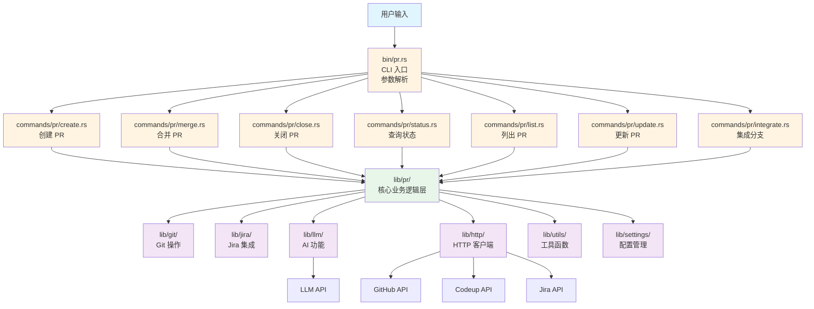
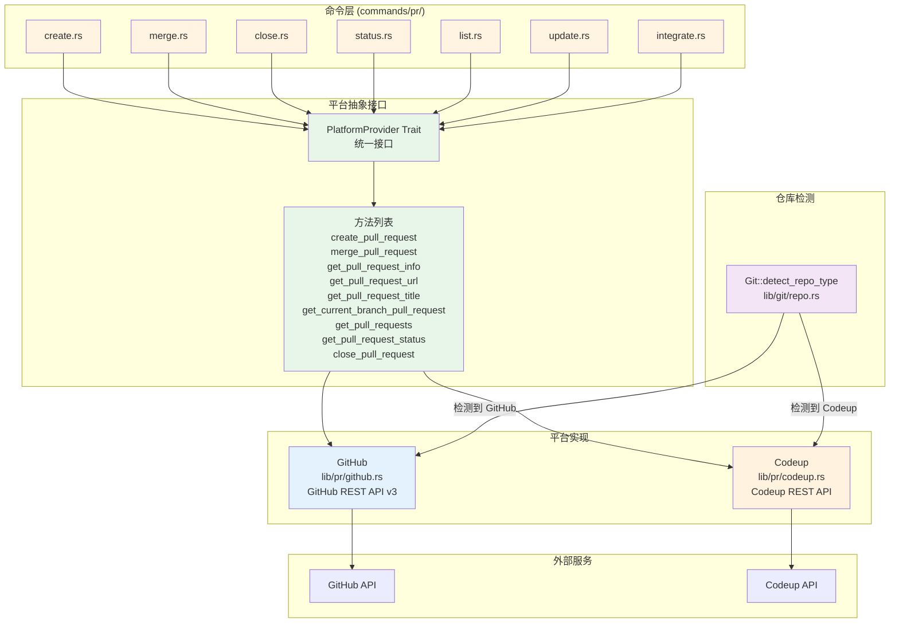
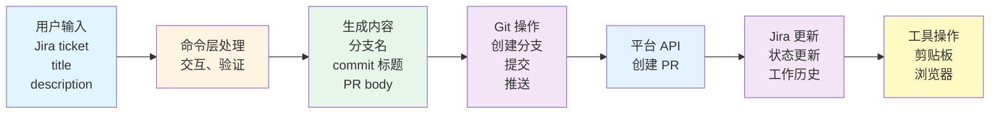
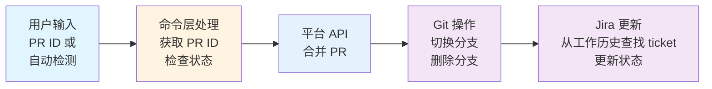

# PR 模块架构文档

## 📋 概述

PR 模块是 Workflow CLI 的核心功能之一，提供 Pull Request 的创建、合并、关闭、查询等操作。支持 GitHub 和 Codeup 两种代码托管平台，并集成了 Jira 状态管理功能。

---

## 📁 相关文件

### CLI 入口层

```
src/bin/pr.rs
```
- **职责**：独立的 PR 命令入口，负责命令行参数解析和命令分发
- **功能**：使用 `clap` 解析命令行参数，将请求分发到对应的命令处理函数

### 命令封装层 (`commands/pr/`)

```
src/commands/pr/
├── mod.rs          # PR 命令模块声明
├── helpers.rs      # PR 辅助函数（PR ID 解析等）
├── create.rs       # 创建 PR 命令
├── merge.rs        # 合并 PR 命令
├── close.rs        # 关闭 PR 命令
├── status.rs       # PR 状态查询命令
├── list.rs         # 列出 PR 命令
├── update.rs       # 更新 PR 命令
└── integrate.rs    # 集成分支命令
```

**职责**：
- 解析命令参数
- 处理用户交互（输入、选择等）
- 格式化输出
- 调用核心业务逻辑层 (`lib/pr/`) 的功能

### 核心业务逻辑层 (`lib/pr/`)

```
src/lib/pr/
├── mod.rs          # PR 模块声明和导出
├── provider.rs     # PR 平台抽象接口 (PlatformProvider trait)
├── github.rs       # GitHub PR 实现
├── codeup.rs       # Codeup PR 实现
├── helpers.rs      # PR 辅助函数
└── constants.rs    # PR 相关常量（变更类型等）
```

**职责**：
- 定义统一的 PR 平台接口 (`PlatformProvider` trait)
- 实现 GitHub 和 Codeup 的 PR 操作
- 提供 PR 相关的辅助函数（生成分支名、commit 标题、PR body 等）

### 依赖模块

- **`lib/git/`**：Git 操作（检测仓库类型、分支操作等）
- **`lib/jira/`**：Jira 集成（状态更新、工作历史管理等）
- **`lib/llm/`**：AI 功能（生成 PR 标题）
- **`lib/http/`**：HTTP 客户端（API 请求）
- **`lib/utils/`**：工具函数（浏览器、剪贴板等）
- **`lib/settings/`**：配置管理（环境变量读取）

---

## 🔄 调用流程

### 整体架构流程

```
用户输入
  ↓
bin/pr.rs (CLI 入口，参数解析)
  ↓
commands/pr/*.rs (命令封装层，处理交互)
  ↓
lib/pr/*.rs (核心业务逻辑层)
  ↓
lib/git/, lib/jira/, lib/http/ 等 (依赖模块)
```

#### 架构流程图



### 1. 创建 PR (`pr create`)

#### 调用流程

```
bin/pr.rs::PRCommands::Create
  ↓
commands/pr/create.rs::PullRequestCreateCommand::create()
  ↓
  1. CheckCommand::run_all()                    # 运行检查（git status, network）
  2. resolve_jira_ticket()                      # 获取或输入 Jira ticket
  3. ensure_jira_status()                       # 检查并配置 Jira 状态
  4. resolve_title()                            # 获取或生成 PR 标题
     ├─ 如果提供 title，直接使用
     └─ 否则使用 AI 生成（lib/llm/）
  5. generate_commit_title_and_branch_name()     # 生成 commit 标题和分支名
     └─ lib/pr/helpers.rs::generate_branch_name()
     └─ lib/pr/helpers.rs::generate_commit_title()
  6. resolve_description()                      # 获取描述
  7. select_change_types()                      # 选择变更类型
  8. generate_pull_request_body()               # 生成 PR body
     └─ lib/pr/helpers.rs::generate_pull_request_body()
  9. create_or_update_branch()                  # 创建或更新分支
     └─ lib/git/::Git::create_branch()
     └─ lib/git/::Git::commit()
     └─ lib/git/::Git::push()
  10. create_or_get_pull_request()              # 创建或获取 PR
      ├─ lib/git/::Git::detect_repo_type()      # 检测仓库类型
      ├─ lib/pr/github.rs::GitHub::create_pull_request()  # GitHub
      └─ lib/pr/codeup.rs::Codeup::create_pull_request()  # Codeup
  11. update_jira_ticket()                      # 更新 Jira
      └─ lib/jira/::Jira::update_status()
      └─ lib/jira/status.rs::WorkHistory::save()  # 保存工作历史
  12. copy_and_open_pull_request()              # 复制 URL 并打开浏览器
      └─ lib/utils/clipboard.rs::Clipboard::copy()
      └─ lib/utils/browser.rs::Browser::open()
```

#### 创建 PR 流程图

```mermaid
flowchart LR
    Start([开始]) --> Check{运行检查}
    Check --> ResolveTicket[解析 Jira Ticket]
    ResolveTicket --> EnsureStatus[确保 Jira 状态]
    EnsureStatus --> ResolveTitle{获取 PR 标题}

    ResolveTitle -->|提供 --title| UseTitle[使用提供的标题]
    ResolveTitle -->|未提供| AIGenerate[AI 生成标题]
    AIGenerate -->|成功| UseTitle
    AIGenerate -->|失败| ManualInput[手动输入标题]
    ManualInput --> UseTitle

    UseTitle --> GenerateBranch[生成分支名和 commit]
    GenerateBranch --> GetDesc[获取描述]
    GetDesc --> SelectTypes[选择变更类型]
    SelectTypes --> GenerateBody[生成 PR Body]

    GenerateBody --> DryRun{是否为<br/>dry-run?}
    DryRun -->|是| DryRunEnd[输出预览信息]
    DryRun -->|否| CreateBranch[创建/更新分支]

    CreateBranch --> GitOps[Git 操作]
    GitOps --> DetectRepo{检测仓库类型}

    DetectRepo -->|GitHub| GitHubAPI[GitHub API]
    DetectRepo -->|Codeup| CodeupAPI[Codeup API]

    GitHubAPI --> UpdateJira[更新 Jira]
    CodeupAPI --> UpdateJira

    UpdateJira --> JiraStatus[更新 Jira 状态]
    JiraStatus --> SaveHistory[保存工作历史]
    SaveHistory --> CopyOpen[复制 URL 并打开浏览器]
    CopyOpen --> End([完成])
    DryRunEnd --> End

    style Start fill:#e1f5ff
    style End fill:#c8e6c9
    style Check fill:#fff9c4
    style ResolveTitle fill:#fff9c4
    style DryRun fill:#fff9c4
    style DetectRepo fill:#fff9c4
    style GitHubAPI fill:#e3f2fd
    style CodeupAPI fill:#e3f2fd
    style UpdateJira fill:#f3e5f5
```



#### 关键步骤说明

1. **Jira Ticket 处理**：
   - 如果提供 ticket，验证格式
   - 如果没有提供，提示用户输入
   - 检查并配置 Jira 状态（从 `jira-status.toml` 读取配置）

2. **PR 标题生成**：
   - 如果提供 `--title`，直接使用
   - 否则从 Jira ticket 获取描述，使用 AI 生成标题
   - 如果 AI 生成失败，回退到手动输入

3. **分支和 Commit**：
   - 生成分支名：`{JIRA_TICKET}--{title}`（如果配置了前缀，添加前缀）
   - 生成 commit 标题：`{JIRA_TICKET}: {title}` 或 `# {title}`

4. **PR Body 生成**：
   - 包含变更类型复选框
   - 包含简短描述
   - 包含 Jira 链接（如果有 ticket）
   - 包含依赖信息（如果有）

5. **平台适配**：
   - 自动检测仓库类型（GitHub/Codeup）
   - 调用对应的平台实现

### 2. 合并 PR (`pr merge`)

#### 调用流程

```
bin/pr.rs::PRCommands::Merge
  ↓
commands/pr/merge.rs::PullRequestMergeCommand::merge()
  ↓
  1. CheckCommand::run_all()                    # 运行检查
  2. get_pull_request_id()                      # 获取 PR ID
     ├─ 如果提供 PR ID，直接使用
     └─ 否则从当前分支获取
        ├─ lib/pr/github.rs::GitHub::get_current_branch_pull_request()
        └─ lib/pr/codeup.rs::Codeup::get_current_branch_pull_request()
  3. Git::current_branch()                      # 保存当前分支名
  4. Git::get_default_branch()                  # 获取默认分支
  5. merge_pull_request()                       # 合并 PR
     ├─ 检查 PR 状态（已合并则跳过）
     ├─ lib/pr/github.rs::GitHub::merge_pull_request()
     └─ lib/pr/codeup.rs::Codeup::merge_pull_request()
  6. cleanup_after_merge()                      # 清理本地分支
     └─ lib/git/::Git::checkout()
     └─ lib/git/::Git::delete_branch()
  7. update_jira_status()                       # 更新 Jira 状态
     ├─ lib/jira/status.rs::WorkHistory::get()  # 从工作历史获取 ticket
     ├─ 如果历史中没有，从 PR 标题提取 ticket
     └─ lib/jira/::Jira::update_status()
```

#### 合并 PR 流程图

```mermaid
flowchart LR
    Start([开始]) --> Check[运行检查]
    Check --> DetectRepo[检测仓库类型]
    DetectRepo --> GetPRID{获取 PR ID}

    GetPRID -->|提供 PR ID| UsePRID[使用提供的 PR ID]
    GetPRID -->|未提供| AutoDetect{从当前分支自动检测}

    AutoDetect -->|GitHub| GitHubGetPR[GitHub API]
    AutoDetect -->|Codeup| CodeupGetPR[Codeup API]

    GitHubGetPR --> UsePRID
    CodeupGetPR --> UsePRID

    UsePRID --> SaveBranch[保存当前分支名]
    SaveBranch --> GetDefault[获取默认分支]
    GetDefault --> CheckStatus{检查 PR 状态<br/>是否已合并?}

    CheckStatus -->|已合并| SkipMerge[跳过合并步骤]
    CheckStatus -->|未合并| MergePR{合并 PR}

    MergePR -->|GitHub| GitHubMerge[GitHub API]
    MergePR -->|Codeup| CodeupMerge[Codeup API]

    GitHubMerge --> Cleanup
    CodeupMerge --> Cleanup
    SkipMerge --> Cleanup

    Cleanup[清理本地分支] --> Checkout[切换到默认分支]
    Checkout --> DeleteBranch[删除本地分支]

    DeleteBranch --> UpdateJira[更新 Jira 状态]
    UpdateJira --> GetHistory{从工作历史<br/>获取 ticket}

    GetHistory -->|找到| UseHistory[使用工作历史中的 ticket]
    GetHistory -->|未找到| ExtractTitle[从 PR 标题提取 ticket]

    UseHistory --> UpdateStatus[更新 Jira 状态]
    ExtractTitle --> UpdateStatus
    UpdateStatus --> End([完成])

    style Start fill:#e1f5ff
    style End fill:#c8e6c9
    style GetPRID fill:#fff9c4
    style CheckStatus fill:#fff9c4
    style GetHistory fill:#fff9c4
    style GitHubGetPR fill:#e3f2fd
    style CodeupGetPR fill:#e3f2fd
    style GitHubMerge fill:#e3f2fd
    style CodeupMerge fill:#e3f2fd
    style UpdateJira fill:#f3e5f5
```



#### 关键步骤说明

1. **PR ID 获取**：
   - 如果提供 PR ID，直接使用
   - 否则从当前分支自动检测（调用平台 API 查找对应的 PR）

2. **合并前检查**：
   - 检查 PR 状态，如果已合并则跳过合并步骤
   - 但继续执行后续清理和 Jira 更新步骤

3. **合并后清理**：
   - 切换到默认分支
   - 删除本地分支（远程分支由平台自动删除）

4. **Jira 状态更新**：
   - 从工作历史 (`work-history.json`) 查找对应的 Jira ticket
   - 如果历史中没有，尝试从 PR 标题提取 ticket ID
   - 更新 Jira 状态为 `merged-pr` 配置的状态

### 3. 关闭 PR (`pr close`)

#### 调用流程

```
bin/pr.rs::PRCommands::Close
  ↓
commands/pr/close.rs::PullRequestCloseCommand::close()
  ↓
  1. get_pull_request_id()                      # 获取 PR ID（同 merge）
  2. Git::current_branch()                      # 保存当前分支名
  3. Git::get_default_branch()                  # 获取默认分支
  4. check_if_already_closed()                  # 检查 PR 是否已关闭
     └─ lib/pr/*.rs::get_pull_request_status()
  5. close_pull_request()                       # 关闭 PR（如果未关闭）
     ├─ lib/pr/github.rs::GitHub::close_pull_request()
     └─ lib/pr/codeup.rs::Codeup::close_pull_request()
  6. delete_remote_branch()                     # 删除远程分支
     └─ lib/git/::Git::delete_remote_branch()
  7. cleanup_after_close()                      # 清理本地分支
     └─ lib/git/::Git::checkout()
     └─ lib/git/::Git::delete_branch()
```

#### 关闭 PR 流程图

```mermaid
flowchart LR
    Start([开始]) --> DetectRepo[检测仓库类型]
    DetectRepo --> GetPRID{获取 PR ID}

    GetPRID -->|提供 PR ID| UsePRID[使用提供的 PR ID]
    GetPRID -->|未提供| AutoDetect{从当前分支自动检测}

    AutoDetect -->|GitHub| GitHubGetPR[GitHub API]
    AutoDetect -->|Codeup| CodeupGetPR[Codeup API]

    GitHubGetPR --> UsePRID
    CodeupGetPR --> UsePRID

    UsePRID --> SaveBranch[保存当前分支名]
    SaveBranch --> GetDefault[获取默认分支]
    GetDefault --> CheckDefault{当前分支<br/>是否为默认分支?}

    CheckDefault -->|是| Error[错误：不允许关闭默认分支]
    CheckDefault -->|否| CheckClosed{检查 PR 状态<br/>是否已关闭?}

    CheckClosed -->|已关闭| SkipClose[跳过关闭步骤]
    CheckClosed -->|未关闭| ClosePR{关闭 PR}

    ClosePR -->|GitHub| GitHubClose[GitHub API]
    ClosePR -->|Codeup| CodeupClose[Codeup API]

    GitHubClose --> DeleteRemote
    CodeupClose --> DeleteRemote
    SkipClose --> DeleteRemote

    DeleteRemote[删除远程分支] --> Cleanup[清理本地分支]

    Cleanup --> Checkout[切换到默认分支]
    Checkout --> DeleteBranch[删除本地分支]
    DeleteBranch --> End([完成])
    Error --> End

    style Start fill:#e1f5ff
    style End fill:#c8e6c9
    style GetPRID fill:#fff9c4
    style CheckDefault fill:#ffcdd2
    style CheckClosed fill:#fff9c4
    style GitHubGetPR fill:#e3f2fd
    style CodeupGetPR fill:#e3f2fd
    style GitHubClose fill:#e3f2fd
    style CodeupClose fill:#e3f2fd
    style Error fill:#ffcdd2
```



#### 关键步骤说明

1. **安全检查**：
   - 如果当前分支是默认分支，不允许关闭

2. **关闭前检查**：
   - 检查 PR 状态，如果已关闭则跳过关闭步骤
   - 但继续执行后续清理步骤

3. **错误处理**：
   - 如果关闭失败，检查是否是"已关闭"错误（竞态条件）
   - 如果是，继续执行清理步骤

4. **清理操作**：
   - 删除远程分支
   - 切换到默认分支
   - 删除本地分支

### 4. 查询 PR 状态 (`pr status`)

#### 调用流程

```
bin/pr.rs::PRCommands::Status
  ↓
commands/pr/status.rs::PullRequestStatusCommand::show()
  ↓
  1. get_pr_identifier()                       # 获取 PR 标识符
     ├─ 如果提供 ID 或分支名，直接使用
     └─ 否则从当前分支获取
  2. show_pr_info()                             # 显示 PR 信息
     ├─ lib/pr/github.rs::GitHub::get_pull_request_info()
     └─ lib/pr/codeup.rs::Codeup::get_pull_request_info()
```

#### 关键步骤说明

1. **PR 标识符获取**：
   - GitHub：只支持数字 ID
   - Codeup：支持 ID 或分支名
   - 如果不提供，从当前分支自动检测

2. **信息展示**：
   - 调用平台 API 获取 PR 详细信息
   - 格式化输出（状态、作者、评论等）

### 5. 列出 PR (`pr list`)

#### 调用流程

```
bin/pr.rs::PRCommands::List
  ↓
commands/pr/list.rs::GetPullRequestsCommand::list()
  ↓
  1. Git::detect_repo_type()                   # 检测仓库类型
  2. get_pull_requests()                        # 获取 PR 列表
     ├─ lib/pr/github.rs::GitHub::get_pull_requests()
     └─ lib/pr/codeup.rs::Codeup::get_pull_requests()
```

#### 关键步骤说明

1. **过滤和限制**：
   - 支持按状态过滤（open, closed, merged）
   - 支持限制返回数量

2. **平台差异**：
   - GitHub 和 Codeup 都支持列表功能
   - 其他平台可能不支持（返回错误）

### 6. 更新 PR (`pr update`)

#### 调用流程

```
bin/pr.rs::PRCommands::Update
  ↓
commands/pr/update.rs::PullRequestUpdateCommand::update()
  ↓
  1. Git::detect_repo_type()                   # 检测仓库类型
  2. get_pull_request_title()                   # 获取 PR 标题
     ├─ 从当前分支获取 PR ID
     └─ 调用平台 API 获取 PR 标题
  3. Git::commit()                              # 提交更改（使用 PR 标题作为消息）
  4. Git::push()                                # 推送到远程
```

#### 关键步骤说明

1. **PR 标题获取**：
   - 从当前分支自动检测 PR ID
   - 调用平台 API 获取 PR 标题
   - 如果找不到 PR，使用默认消息 "update"

2. **提交和推送**：
   - 使用 PR 标题作为 commit 消息
   - 自动暂存所有文件
   - 推送到远程分支

### 7. 集成分支 (`pr integrate`)

#### 调用流程

```
bin/pr.rs::PRCommands::Integrate
  ↓
commands/pr/integrate.rs::PullRequestIntegrateCommand::integrate()
  ↓
  1. CheckCommand::run_all()                    # 运行检查（可选，失败时可继续）
  2. Git::current_branch()                      # 获取当前分支
  3. check_working_directory()                  # 检查工作区状态
     ├─ 如果有未提交更改，提示 stash 或取消
     └─ 如果选择 stash，执行 Git::stash_push()
  4. prepare_source_branch()                    # 验证并准备源分支
     ├─ 检查是否为默认分支（不允许）
     ├─ 检查分支是否存在（本地或远程）
     ├─ 如果只在远程，执行 Git::fetch()
     └─ 返回分支信息（类型、合并引用）
  5. determine_merge_strategy()                  # 确定合并策略
     ├─ --ff-only → FastForwardOnly
     ├─ --squash → Squash
     └─ 默认 → Merge
  6. Git::merge_branch()                         # 执行合并
  7. check_and_update_current_branch_pr()      # 检查并更新当前分支的 PR
     ├─ 如果当前分支有 PR，推送代码更新 PR
     └─ 如果是远程分支合并，恢复 stash
  8. check_and_close_source_branch_pr()        # 检查并关闭源分支的 PR
     ├─ 从工作历史查找源分支的 PR ID
     └─ 如果找到，调用平台 API 关闭 PR
  9. delete_merged_branch()                     # 删除被合并的源分支
     ├─ 删除本地分支
     └─ 删除远程分支
  10. 如果指定了 --push，推送到远程（本地分支合并时）
```

#### 集成分支流程图

```mermaid
flowchart LR
    Start([开始]) --> Check[运行检查<br/>可选]
    Check --> GetCurrent[获取当前分支]
    GetCurrent --> CheckWorkDir{检查工作区<br/>是否有未提交更改?}

    CheckWorkDir -->|有更改| StashChoice{选择处理方式}
    CheckWorkDir -->|无更改| PrepareBranch

    StashChoice -->|Stash| Stash[Stash 更改]
    StashChoice -->|取消| Abort[取消操作]
    Stash --> PrepareBranch

    PrepareBranch[验证源分支] --> CheckDefault{是否为<br/>默认分支?}
    CheckDefault -->|是| Error[错误：不允许]
    CheckDefault -->|否| CheckExists{分支是否存在?}

    CheckExists -->|不存在| Error2[错误：分支不存在]
    CheckExists -->|只在远程| Fetch[Fetch 远程]
    CheckExists -->|本地存在| DetermineStrategy

    Fetch --> DetermineStrategy[确定合并策略<br/>ff-only/squash/merge]
    DetermineStrategy --> Merge[执行合并]

    Merge --> CheckSuccess{合并成功?}
    CheckSuccess -->|失败| CheckConflict{有冲突?}
    CheckSuccess -->|成功| CheckRemote{源分支<br/>是远程分支?}

    CheckConflict -->|有冲突| ManualResolve[提示手动解决]
    CheckConflict -->|无冲突| Error3[返回错误]

    CheckRemote -->|是| UpdatePR[更新当前分支 PR]
    CheckRemote -->|否| RestoreStash{有 Stash?}

    UpdatePR --> CloseSourcePR[关闭源分支 PR]
    RestoreStash -->|有| PopStash[恢复 Stash]
    RestoreStash -->|无| CheckPush

    PopStash --> CheckPush{需要推送?<br/>--no-push?}
    CheckPush -->|是| Push[推送到远程]
    CheckPush -->|否| CloseSourcePR

    Push --> CloseSourcePR
    CloseSourcePR --> DeleteBranch[删除源分支<br/>本地和远程]
    DeleteBranch --> End([完成])

    ManualResolve --> End
    Error --> End
    Error2 --> End
    Error3 --> End
    Abort --> End

    style Start fill:#e1f5ff
    style End fill:#c8e6c9
    style CheckWorkDir fill:#fff9c4
    style CheckDefault fill:#ffcdd2
    style CheckSuccess fill:#fff9c4
    style CheckRemote fill:#fff9c4
    style Merge fill:#e3f2fd
    style UpdatePR fill:#e3f2fd
    style CloseSourcePR fill:#e3f2fd
    style Error fill:#ffcdd2
    style Error2 fill:#ffcdd2
    style Error3 fill:#ffcdd2
```



#### 关键步骤说明

1. **工作区检查**：
   - 检查是否有未提交的更改
   - 如果有，提示用户选择 stash 或取消操作
   - 如果选择 stash，自动保存更改，合并后恢复

2. **源分支验证**：
   - 不允许将默认分支合并到当前分支
   - 检查分支是否存在（本地或远程）
   - 如果分支只在远程，自动 fetch 获取最新引用

3. **合并策略**：
   - `--ff-only`：只允许 fast-forward 合并，否则失败
   - `--squash`：将源分支的所有提交压缩为一个提交
   - 默认：使用标准的 merge commit

4. **合并后处理**：
   - **远程分支合并**：如果当前分支有 PR，自动推送更新 PR
   - **本地分支合并**：根据 `--no-push` 标志决定是否推送
   - 自动恢复 stash（如果有）

5. **PR 管理**：
   - 如果源分支有 PR，自动关闭它
   - 通过工作历史查找源分支的 PR ID

6. **分支清理**：
   - 合并成功后，自动删除源分支（本地和远程）
   - 如果删除失败，提供手动删除的提示

7. **错误处理**：
   - 合并冲突时，提供详细的解决步骤
   - 合并失败时，自动恢复 stash（如果有）

---

## 🏗️ 平台抽象设计

### PlatformProvider Trait

所有 PR 平台（GitHub、Codeup）都实现 `PlatformProvider` trait，提供统一的接口：

```rust
pub trait PlatformProvider {
    fn create_pull_request(...) -> Result<String>;
    fn merge_pull_request(...) -> Result<()>;
    fn get_pull_request_info(...) -> Result<String>;
    fn get_pull_request_url(...) -> Result<String>;
    fn get_pull_request_title(...) -> Result<String>;
    fn get_current_branch_pull_request() -> Result<Option<String>>;
    fn get_pull_requests(...) -> Result<String>;
    fn get_pull_request_status(...) -> Result<PullRequestStatus>;
    fn close_pull_request(...) -> Result<()>;
}
```

#### 平台抽象设计图



### 平台实现

- **GitHub** (`lib/pr/github.rs`)：
  - 使用 GitHub REST API v3
  - 需要 `GITHUB_TOKEN` 环境变量
  - 支持所有 trait 方法

- **Codeup** (`lib/pr/codeup.rs`)：
  - 使用 Codeup REST API
  - 需要 `CODEUP_PROJECT_ID`、`CODEUP_CSRF_TOKEN`、`CODEUP_COOKIE` 环境变量
  - 支持所有 trait 方法

### 仓库类型检测

通过 `lib/git/` 模块检测仓库类型：

```rust
let repo_type = Git::detect_repo_type()?;
match repo_type {
    RepoType::GitHub => { /* 使用 GitHub 实现 */ }
    RepoType::Codeup => { /* 使用 Codeup 实现 */ }
    _ => { /* 不支持 */ }
}
```

---

## 🔗 与其他模块的集成

### Jira 集成

- **创建 PR 时**：
  - 检查并配置 Jira 状态（从 `jira-status.toml` 读取）
  - 创建 PR 后更新 Jira 状态为 `created-pr` 配置的状态
  - 保存工作历史（PR ID → Jira ticket 映射）

- **合并 PR 时**：
  - 从工作历史查找对应的 Jira ticket
  - 如果历史中没有，从 PR 标题提取 ticket ID
  - 更新 Jira 状态为 `merged-pr` 配置的状态

### Git 集成

- **分支操作**：创建、删除、切换分支
- **提交操作**：提交更改、推送远程
- **仓库检测**：检测仓库类型、获取默认分支、获取远程 URL

### AI 集成

- **标题生成**：从 Jira ticket 获取描述，使用 LLM 生成简洁的英文 PR 标题
- **错误处理**：如果 AI 生成失败，回退到手动输入

### 工具集成

- **剪贴板**：复制 PR URL 到剪贴板
- **浏览器**：自动打开 PR 页面

---

## 📊 数据流

### 创建 PR 数据流



### 合并 PR 数据流



---

## 🎯 设计模式

### 1. 策略模式

通过 `PlatformProvider` trait 实现平台抽象，不同平台有不同的实现策略。

### 2. 模板方法模式

命令层定义统一的流程（如 `create()`、`merge()`），具体步骤由不同的方法实现。

### 3. 依赖注入

通过 trait 和模块化设计，命令层依赖抽象的 `PlatformProvider`，而不是具体的平台实现。

---

## 🔍 错误处理

### 分层错误处理

1. **CLI 层**：参数验证错误
2. **命令层**：用户交互错误、业务逻辑错误
3. **核心层**：API 调用错误、Git 操作错误
4. **依赖层**：HTTP 错误、Jira 错误等

### 容错机制

- **AI 生成失败**：回退到手动输入
- **PR 已合并**：跳过合并步骤，继续后续操作
- **PR 已关闭**：跳过关闭步骤，继续清理操作
- **工作历史缺失**：从 PR 标题提取 Jira ticket ID

---

## 📝 扩展性

### 添加新平台

1. 在 `lib/pr/` 下创建新的平台实现文件（如 `gitlab.rs`）
2. 实现 `PlatformProvider` trait
3. 在 `lib/pr/mod.rs` 中导出
4. 在 `lib/git/repo.rs` 中添加仓库类型检测逻辑

### 添加新命令

1. 在 `commands/pr/` 下创建新的命令文件
2. 实现命令结构体和处理方法
3. 在 `commands/pr/mod.rs` 中导出
4. 在 `bin/pr.rs` 中添加命令枚举和处理逻辑

---

## 🚀 性能优化

### API 调用优化

- 合并 PR 前先检查状态，避免重复合并
- 关闭 PR 前先检查状态，避免重复关闭

### Git 操作优化

- 只在必要时创建分支
- 批量操作（如提交和推送一起执行）

---

## 📚 相关文档

- [主架构文档](./ARCHITECTURE.md)
- [Jira 集成文档](./ARCHITECTURE.md#jira-集成)
- [Git 模块文档](./ARCHITECTURE.md#git-模块)

