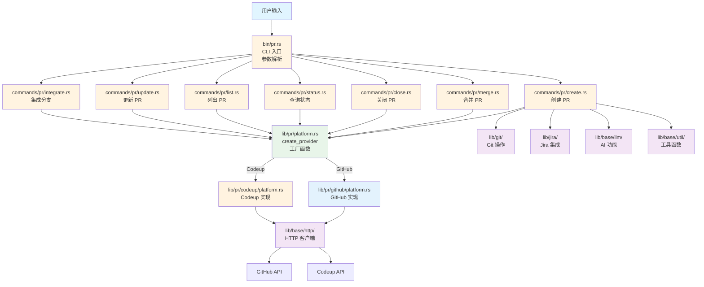
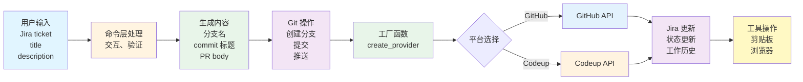
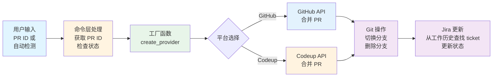

# PR 模块架构文档

## 📋 概述

PR 模块是 Workflow CLI 的核心功能之一，提供 Pull Request 的创建、合并、关闭、查询等操作。支持 GitHub 和 Codeup 两种代码托管平台，并集成了 Jira 状态管理功能。该模块采用分层架构设计，通过 `PlatformProvider` trait 实现平台抽象，使用工厂函数实现多态分发。

**模块统计：**
- 总代码行数：约 2000+ 行
- 文件数量：15+ 个
- 支持平台：GitHub、Codeup
- 主要结构体：`PlatformProvider` trait、`GitHub`、`Codeup`、`PullRequestLLM`

---

## 📁 模块结构

```
src/lib/pr/
├── mod.rs              # PR 模块声明和导出 (18行)
├── platform.rs         # PlatformProvider trait 和工厂函数 (150行)
├── helpers.rs          # PR 辅助函数 (282行)
├── llm.rs              # LLM 功能（PR 标题生成）(253行)
│
├── github/             # GitHub 平台实现
│   ├── mod.rs          # GitHub 模块导出
│   ├── platform.rs    # GitHub 平台实现
│   ├── requests.rs     # GitHub API 请求结构体
│   ├── responses.rs    # GitHub API 响应结构体
│   └── errors.rs       # GitHub 错误处理
│
└── codeup/             # Codeup 平台实现
    ├── mod.rs          # Codeup 模块导出
    ├── platform.rs    # Codeup 平台实现
    ├── requests.rs    # Codeup API 请求结构体
    ├── responses.rs   # Codeup API 响应结构体
    └── errors.rs      # Codeup 错误处理
```

### CLI 入口层

```
src/bin/pr.rs
```
- **职责**：独立的 PR 命令入口，负责命令行参数解析和命令分发
- **功能**：使用 `clap` 解析命令行参数，将请求分发到对应的命令处理函数

### 命令封装层 (`commands/pr/`)

```
src/commands/pr/
├── mod.rs          # PR 命令模块声明
├── helpers.rs      # PR 辅助函数（PR ID 解析等）
├── create.rs       # 创建 PR 命令 (712行)
├── merge.rs        # 合并 PR 命令 (143行)
├── close.rs        # 关闭 PR 命令 (141行)
├── status.rs       # PR 状态查询命令 (50行)
├── list.rs         # 列出 PR 命令 (21行)
├── update.rs       # 更新 PR 命令 (57行)
└── integrate.rs    # 集成分支命令 (343行)
```

**职责**：
- 解析命令参数
- 处理用户交互（输入、选择等）
- 格式化输出
- 调用核心业务逻辑层 (`lib/pr/`) 的功能

### 依赖模块

- **`lib/git/`**：Git 操作（检测仓库类型、分支操作等）
- **`lib/jira/`**：Jira 集成（状态更新、工作历史管理等）
- **`lib/base/llm/`**：AI 功能（生成 PR 标题）
- **`lib/base/http/`**：HTTP 客户端（API 请求）
- **`lib/base/util/`**：工具函数（浏览器、剪贴板等）
- **`lib/base/settings/`**：配置管理（环境变量读取）

---

## 🏗️ 架构设计

### 设计原则

1. **平台抽象**：通过 `PlatformProvider` trait 实现统一的平台接口
2. **多态分发**：使用工厂函数 `create_provider()` 实现动态分发
3. **模块化设计**：按平台拆分模块，职责清晰
4. **统一错误处理**：平台特定错误处理统一封装
5. **代码复用**：请求/响应结构体分离，便于维护

### 核心组件

#### 1. 平台抽象层 (`platform.rs`)

**职责**：定义统一的 PR 平台接口和工厂函数

- **`PlatformProvider` trait**：定义所有平台必须实现的 9 个方法
  - `create_pull_request()` - 创建 PR
  - `merge_pull_request()` - 合并 PR
  - `get_pull_request_info()` - 获取 PR 信息
  - `get_pull_request_url()` - 获取 PR URL
  - `get_pull_request_title()` - 获取 PR 标题
  - `get_current_branch_pull_request()` - 获取当前分支的 PR ID
  - `get_pull_requests()` - 列出 PR（可选）
  - `get_pull_request_status()` - 获取 PR 状态
  - `close_pull_request()` - 关闭 PR

- **`create_provider()` 工厂函数**：
  - 自动检测仓库类型（GitHub/Codeup）
  - 返回 `Box<dyn PlatformProvider>` trait 对象
  - 实现真正的多态分发

- **`PullRequestStatus` 结构体**：PR 状态信息（state, merged, merged_at）

- **`TYPES_OF_CHANGES` 常量**：PR 变更类型定义

#### 2. GitHub 平台实现 (`github/`)

**职责**：GitHub REST API v3 的完整实现

- **`platform.rs`**：实现 `PlatformProvider` trait
- **`requests.rs`**：GitHub API 请求结构体
- **`responses.rs`**：GitHub API 响应结构体
- **`errors.rs`**：GitHub 特定错误处理

**关键特性**：
- 使用 GitHub REST API v3
- 需要 `GITHUB_TOKEN` 环境变量
- 支持所有 trait 方法

#### 3. Codeup 平台实现 (`codeup/`)

**职责**：Codeup REST API 的完整实现

- **`platform.rs`**：实现 `PlatformProvider` trait
- **`requests.rs`**：Codeup API 请求结构体
- **`responses.rs`**：Codeup API 响应结构体
- **`errors.rs`**：Codeup 特定错误处理

**关键特性**：
- 使用 Codeup REST API
- 需要 `CODEUP_PROJECT_ID`、`CODEUP_CSRF_TOKEN`、`CODEUP_COOKIE` 环境变量
- 支持所有 trait 方法

#### 4. 辅助函数层 (`helpers.rs`)

**职责**：提供 PR 相关的通用辅助函数

**主要函数**：
- `extract_pull_request_id_from_url()` - 从 URL 提取 PR ID
- `extract_github_repo_from_url()` - 从 URL 提取 GitHub 仓库信息
- `generate_branch_name()` - 生成分支名
- `generate_commit_title()` - 生成 commit 标题
- `generate_pull_request_body()` - 生成 PR body
- `get_current_branch_pr_id()` - 获取当前分支的 PR ID
- `detect_repo_type()` - 检测仓库类型（向后兼容）

#### 5. LLM 功能层 (`llm.rs`)

**职责**：提供 PR 标题的 AI 生成功能

- **`PullRequestLLM`**：PR LLM 客户端包装器
- **`PullRequestContent`**：PR 内容结构体
- **主要方法**：`generate_title()` - 从 Jira ticket 描述生成 PR 标题

---

## 🔄 调用流程

### 整体架构流程

```
用户输入
  ↓
bin/pr.rs (CLI 入口，参数解析)
  ↓
commands/pr/*.rs (命令封装层，处理交互)
  ↓
lib/pr/platform.rs (工厂函数 create_provider())
  ↓
lib/pr/github/platform.rs 或 lib/pr/codeup/platform.rs (平台实现)
  ↓
lib/base/http/ (HTTP 客户端)
  ↓
GitHub API 或 Codeup API
```

#### 架构流程图



### 典型调用示例

#### 1. 创建 PR (`pr create`)

```
bin/pr.rs::PRCommands::Create
  ↓
commands/pr/create.rs::PullRequestCreateCommand::create()
  ↓
  1. CheckCommand::run_all()                    # 运行检查（git status, network）
  2. resolve_jira_ticket()                      # 获取或输入 Jira ticket
  3. ensure_jira_status()                       # 检查并配置 Jira 状态
  4. resolve_title()                            # 获取或生成 PR 标题
     ├─ 如果提供 title，直接使用
     └─ 否则使用 AI 生成（lib/pr/llm.rs）
  5. generate_commit_title_and_branch_name()     # 生成 commit 标题和分支名
     └─ lib/pr/helpers.rs::generate_branch_name()
     └─ lib/pr/helpers.rs::generate_commit_title()
  6. resolve_description()                      # 获取描述
  7. select_change_types()                      # 选择变更类型
  8. generate_pull_request_body()               # 生成 PR body
     └─ lib/pr/helpers.rs::generate_pull_request_body()
  9. create_or_update_branch()                  # 创建或更新分支
     └─ lib/git/::GitBranch::checkout_branch()
     └─ lib/git/::GitCommit::commit()
     └─ lib/git/::GitBranch::push()
  10. create_or_get_pull_request()              # 创建或获取 PR
      ├─ lib/pr/platform.rs::create_provider()  # 工厂函数
      └─ provider.create_pull_request()         # 多态调用
  11. update_jira_ticket()                      # 更新 Jira
      └─ lib/jira/::JiraTicket::transition()
      └─ lib/jira/status.rs::WorkHistory::save()
  12. copy_and_open_pull_request()              # 复制 URL 并打开浏览器
      └─ lib/base/util/clipboard.rs::Clipboard::copy()
      └─ lib/base/util/browser.rs::Browser::open()
```

#### 2. 合并 PR (`pr merge`)

```
bin/pr.rs::PRCommands::Merge
  ↓
commands/pr/merge.rs::PullRequestMergeCommand::merge()
  ↓
  1. CheckCommand::run_all()                    # 运行检查
  2. get_pull_request_id()                      # 获取 PR ID
     ├─ 如果提供 PR ID，直接使用
     └─ 否则从当前分支获取
        └─ provider.get_current_branch_pull_request()
  3. GitBranch::current_branch()                # 保存当前分支名
  4. GitBranch::get_default_branch()             # 获取默认分支
  5. merge_pull_request()                       # 合并 PR
     ├─ 检查 PR 状态（已合并则跳过）
     └─ provider.merge_pull_request()
  6. cleanup_after_merge()                      # 清理本地分支
     └─ lib/git/::GitBranch::checkout_branch()
     └─ lib/git/::GitBranch::delete()
  7. update_jira_status()                       # 更新 Jira 状态
     ├─ lib/jira/status.rs::WorkHistory::read_work_history()
     └─ lib/jira/::JiraTicket::transition()
```

#### 3. 关闭 PR (`pr close`)

```
bin/pr.rs::PRCommands::Close
  ↓
commands/pr/close.rs::PullRequestCloseCommand::close()
  ↓
  1. get_pull_request_id()                      # 获取 PR ID
  2. GitBranch::current_branch()                # 保存当前分支名
  3. GitBranch::get_default_branch()             # 获取默认分支
  4. check_if_already_closed()                  # 检查 PR 是否已关闭
     └─ provider.get_pull_request_status()
  5. close_pull_request()                       # 关闭 PR（如果未关闭）
     └─ provider.close_pull_request()
  6. GitBranch::delete_remote()                  # 删除远程分支
  7. cleanup_after_close()                      # 清理本地分支
     └─ lib/git/::GitBranch::checkout_branch()
     └─ lib/git/::GitBranch::delete()
```

---

## 📦 模块职责

### PlatformProvider Trait

**职责**：定义统一的 PR 平台接口

**核心方法**：
- `create_pull_request()` - 创建 PR，返回 PR URL
- `merge_pull_request()` - 合并 PR
- `get_pull_request_info()` - 获取 PR 详细信息
- `get_pull_request_url()` - 获取 PR URL
- `get_pull_request_title()` - 获取 PR 标题
- `get_current_branch_pull_request()` - 获取当前分支的 PR ID
- `get_pull_requests()` - 列出 PR（可选方法）
- `get_pull_request_status()` - 获取 PR 状态
- `close_pull_request()` - 关闭 PR

**设计优势**：
- 使用实例方法（`&self`），支持 trait 对象
- 通过工厂函数实现多态分发
- 消除命令层的代码重复

### GitHub 平台实现

**职责**：GitHub REST API v3 的完整实现

**核心功能**：
- 实现所有 `PlatformProvider` trait 方法
- 统一的 HTTP 请求处理
- GitHub 特定的错误处理
- 请求/响应结构体分离

**使用场景**：
- 自动检测到 GitHub 仓库时使用
- 需要 `GITHUB_TOKEN` 环境变量

### Codeup 平台实现

**职责**：Codeup REST API 的完整实现

**核心功能**：
- 实现所有 `PlatformProvider` trait 方法
- 统一的 HTTP 请求处理
- Codeup 特定的错误处理
- 请求/响应结构体分离

**使用场景**：
- 自动检测到 Codeup 仓库时使用
- 需要 `CODEUP_PROJECT_ID`、`CODEUP_CSRF_TOKEN`、`CODEUP_COOKIE` 环境变量

### Helpers 模块

**职责**：提供 PR 相关的通用辅助函数

**核心功能**：
- URL 解析（提取 PR ID、仓库信息）
- 分支名和 commit 标题生成
- PR body 生成
- 仓库类型检测（向后兼容）

**使用场景**：
- 命令层和核心层都可以使用
- 平台无关的通用逻辑

### LLM 模块

**职责**：提供 PR 标题的 AI 生成功能

**核心功能**：
- 从 Jira ticket 描述生成简洁的英文 PR 标题
- 使用统一的 LLM 客户端
- 错误处理和回退机制

**使用场景**：
- PR 创建时自动生成标题
- 如果 AI 生成失败，回退到手动输入

---

## 🔗 与其他模块的集成

### Jira 集成

- **创建 PR 时**：
  - `JiraStatus::configure_interactive()` - 检查并配置 Jira 状态
  - `JiraTicket::transition()` - 更新 Jira 状态为 `created-pr` 配置的状态
  - `JiraWorkHistory::write_work_history()` - 保存工作历史记录（PR ID → Jira ticket 映射）

- **合并 PR 时**：
  - `JiraWorkHistory::read_work_history()` - 从工作历史查找对应的 Jira ticket
  - 如果历史中没有，从 PR 标题提取 ticket ID
  - `JiraTicket::transition()` - 更新 Jira 状态为 `merged-pr` 配置的状态

### Git 集成

- **分支操作**：创建、删除、切换分支
- **提交操作**：提交更改、推送远程
- **仓库检测**：检测仓库类型、获取默认分支、获取远程 URL

**关键方法**：
- `GitRepo::detect_repo_type()` - 检测仓库类型（GitHub/Codeup）
- `GitBranch::checkout_branch()` - 创建或切换分支
- `GitCommit::commit()` - 提交更改
- `GitBranch::push()` - 推送到远程

### LLM 集成

- **标题生成**：从 Jira ticket 获取描述，使用 LLM 生成简洁的英文 PR 标题
- **错误处理**：如果 AI 生成失败，回退到手动输入

**关键方法**：
- `PullRequestLLM::generate_title()` - 生成 PR 标题

### 工具集成

- **剪贴板**：复制 PR URL 到剪贴板
- **浏览器**：自动打开 PR 页面

**关键方法**：
- `Clipboard::copy()` - 复制到剪贴板
- `Browser::open()` - 打开浏览器

---

## 🎯 设计模式

### 1. 策略模式

通过 `PlatformProvider` trait 实现平台抽象，不同平台有不同的实现策略。

**优势**：
- 添加新平台只需实现 trait，无需修改命令层代码
- 命令层代码与具体平台解耦

### 2. 工厂模式

通过 `create_provider()` 工厂函数实现多态分发。

**优势**：
- 自动检测仓库类型
- 返回 trait 对象，实现真正的多态
- 消除命令层的重复代码

### 3. 模板方法模式

命令层定义统一的流程（如 `create()`、`merge()`），具体步骤由不同的方法实现。

**优势**：
- 流程清晰，易于理解和维护
- 便于添加新的处理步骤

### 4. 依赖注入

通过 trait 和模块化设计，命令层依赖抽象的 `PlatformProvider`，而不是具体的平台实现。

**优势**：
- 符合依赖倒置原则
- 提高代码可测试性
- 降低耦合度

---

## 🔍 错误处理

### 分层错误处理

1. **CLI 层**：参数验证错误
2. **命令层**：用户交互错误、业务逻辑错误
3. **核心层**：API 调用错误、Git 操作错误
4. **平台层**：平台特定的错误处理（GitHub/Codeup）
5. **依赖层**：HTTP 错误、Jira 错误等

### 容错机制

- **AI 生成失败**：回退到手动输入
- **PR 已合并**：跳过合并步骤，继续后续操作
- **PR 已关闭**：跳过关闭步骤，继续清理操作
- **工作历史缺失**：从 PR 标题提取 Jira ticket ID
- **仓库类型未知**：返回明确的错误提示

### 平台特定错误处理

- **GitHub**：解析 GitHub API 错误响应，提供详细的错误信息
- **Codeup**：解析 Codeup API 错误响应，提供详细的错误信息

---

## 📊 数据流

### 创建 PR 数据流



### 合并 PR 数据流



---

## 📝 扩展性

### 添加新平台

1. 在 `lib/pr/` 下创建新的平台目录（如 `gitlab/`）
2. 创建以下文件：
   - `mod.rs` - 模块导出
   - `platform.rs` - 实现 `PlatformProvider` trait
   - `requests.rs` - API 请求结构体
   - `responses.rs` - API 响应结构体
   - `errors.rs` - 错误处理
3. 在 `lib/pr/platform.rs` 的 `create_provider()` 函数中添加新平台的分支
4. 在 `lib/git/repo.rs` 中添加仓库类型检测逻辑
5. 在 `lib/pr/mod.rs` 中导出新平台

**示例**：
```rust
// lib/pr/platform.rs
pub fn create_provider() -> Result<Box<dyn PlatformProvider>> {
    match GitRepo::detect_repo_type()? {
        RepoType::GitHub => Ok(Box::new(GitHub)),
        RepoType::Codeup => Ok(Box::new(Codeup)),
        RepoType::GitLab => Ok(Box::new(GitLab)),  // 新增
        RepoType::Unknown => anyhow::bail!("Unsupported repository type"),
    }
}
```

### 添加新命令

1. 在 `commands/pr/` 下创建新的命令文件（如 `reopen.rs`）
2. 实现命令结构体和处理方法
3. 在 `commands/pr/mod.rs` 中导出
4. 在 `bin/pr.rs` 中添加命令枚举和处理逻辑

### 添加新的辅助函数

1. 在 `lib/pr/helpers.rs` 中添加新函数
2. 在 `lib/pr/mod.rs` 中导出（如需要）
3. 更新文档

---

## 📚 相关文档

- [主架构文档](./ARCHITECTURE.md)
- [Jira 模块架构文档](./JIRA_ARCHITECTURE.md) - Jira 集成详情
- [Git 模块架构文档](./GIT_ARCHITECTURE.md) - Git 操作详情
- [LLM 模块架构文档](./LLM_ARCHITECTURE.md) - AI 功能详情

---

## 📋 使用示例

### 基本使用

```rust
use workflow::pr::create_provider;

// 创建平台提供者（自动检测仓库类型）
let provider = create_provider()?;

// 创建 PR
let pr_url = provider.create_pull_request(
    "Fix bug in login",
    "This PR fixes a bug in the login functionality",
    "feature/fix-login",
    None,
)?;

// 获取 PR 信息
let info = provider.get_pull_request_info("123")?;

// 合并 PR
provider.merge_pull_request("123", true)?;

// 关闭 PR
provider.close_pull_request("123")?;
```

### 获取当前分支的 PR

```rust
use workflow::pr::create_provider;

let provider = create_provider()?;

// 获取当前分支的 PR ID
if let Some(pr_id) = provider.get_current_branch_pull_request()? {
    println!("Current branch has PR: {}", pr_id);

    // 获取 PR 状态
    let status = provider.get_pull_request_status(&pr_id)?;
    println!("PR status: {}, merged: {}", status.state, status.merged);
}
```

### 列出 PR

```rust
use workflow::pr::create_provider;

let provider = create_provider()?;

// 列出所有打开的 PR
let prs = provider.get_pull_requests(Some("open"), Some(10))?;
println!("{}", prs);
```

### 使用辅助函数

```rust
use workflow::pr::helpers::{
    generate_branch_name,
    generate_commit_title,
    generate_pull_request_body,
};

// 生成分支名
let branch_name = generate_branch_name("PROJ-123", "Add new feature", None)?;

// 生成 commit 标题
let commit_title = generate_commit_title("PROJ-123", "Add new feature", false)?;

// 生成 PR body
let pr_body = generate_pull_request_body(
    "This is a new feature",
    &["New feature (non-breaking change which adds functionality)"],
    Some("PROJ-123"),
    None,
)?;
```

### 使用 LLM 生成标题

```rust
use workflow::pr::PullRequestLLM;

let llm = PullRequestLLM::new()?;
let title = llm.generate_title("PROJ-123", "This is a description of the feature")?;
println!("Generated title: {}", title);
```

---

## ✅ 总结

PR 模块采用清晰的分层架构设计：

1. **平台抽象层**：`PlatformProvider` trait 定义统一的平台接口
2. **工厂函数**：`create_provider()` 实现多态分发，自动检测仓库类型
3. **平台实现层**：GitHub 和 Codeup 分别实现 trait，模块化组织
4. **辅助函数层**：提供通用的 PR 相关辅助函数
5. **LLM 功能层**：提供 PR 标题的 AI 生成功能

**设计优势**：
- ✅ **多态支持**：通过 trait 对象实现真正的多态
- ✅ **代码复用**：消除命令层的重复代码
- ✅ **易于扩展**：添加新平台只需实现 trait
- ✅ **模块化**：按平台拆分，职责清晰
- ✅ **类型安全**：使用 trait 和类型系统保证类型安全

通过平台抽象和工厂模式，实现了代码复用、易于维护和扩展的目标。
