# PR 命令调用关系图

本文档展示了从 `bin/pr.rs` 开始的完整调用关系。

```mermaid
graph TB
    %% 入口层
    subgraph Entry["bin/ 入口层"]
        PR_BIN[bin/pr.rs<br/>Cli::parse<br/>main]
    end

    %% 命令封装层
    subgraph Commands["commands/pr/ 命令封装层"]
        CREATE[commands/pr/create.rs<br/>PullRequestCreateCommand::create]
        MERGE[commands/pr/merge.rs<br/>PullRequestMergeCommand::merge]
        STATUS[commands/pr/status.rs<br/>PullRequestStatusCommand::show]
        LIST[commands/pr/list.rs<br/>GetPullRequestsCommand::list]
        UPDATE[commands/pr/update.rs<br/>PullRequestUpdateCommand::update]
    end

    %% 核心业务逻辑层
    subgraph Lib["lib/ 核心业务逻辑层"]
        subgraph Git["lib/git/"]
            GIT_CMD[git/commands.rs<br/>Git]
            GIT_REPO[git/repo.rs<br/>detect_repo_type<br/>get_remote_url<br/>has_uncommitted_changes]
            GIT_TYPES[git/types.rs<br/>RepoType]
        end

        subgraph PR["lib/pr/"]
            PR_PROVIDER[pr/provider.rs<br/>PlatformProvider trait]
            PR_GITHUB[pr/github.rs<br/>GitHub impl]
            PR_CODEUP[pr/codeup.rs<br/>Codeup impl]
            PR_HELPERS[pr/helpers.rs<br/>generate_branch_name<br/>generate_commit_title<br/>generate_pull_request_body]
        end

        subgraph Jira["lib/jira/"]
            JIRA_CLIENT[jira/client.rs<br/>JiraClient<br/>assign_ticket<br/>move_ticket<br/>add_comment]
            JIRA_STATUS[jira/status.rs<br/>JiraStatus<br/>read_pull_request_created_status<br/>write_work_history]
            JIRA_HELPERS[jira/helpers.rs<br/>extract_jira_project]
        end

        subgraph LLM["lib/llm/"]
            LLM_MOD[llm/mod.rs<br/>LLM<br/>get_issue_desc<br/>generate_branch_name]
        end

        subgraph Utils["lib/utils/"]
            UTILS_BROWSER[utils/browser.rs<br/>Browser::open]
            UTILS_CLIPBOARD[utils/clipboard.rs<br/>Clipboard::copy]
            UTILS_LOGGER[utils/logger.rs<br/>log_info<br/>log_success<br/>log_warning<br/>log_error]
        end

        subgraph Settings["lib/settings/"]
            SETTINGS[settings/settings.rs<br/>Settings::get]
        end

        subgraph Check["commands/check.rs"]
            CHECK[commands/check.rs<br/>CheckCommand::run_all]
        end
    end

    %% 入口到命令层
    PR_BIN -->|Create| CREATE
    PR_BIN -->|Merge| MERGE
    PR_BIN -->|Status| STATUS
    PR_BIN -->|List| LIST
    PR_BIN -->|Update| UPDATE

    %% Create 命令的调用
    CREATE -->|检查| CHECK
    CREATE -->|Git 操作| GIT_CMD
    CREATE -->|仓库类型| GIT_REPO
    CREATE -->|生成分支名| PR_HELPERS
    CREATE -->|LLM 生成| LLM_MOD
    CREATE -->|创建 PR| PR_PROVIDER
    CREATE -->|Jira 操作| JIRA_CLIENT
    CREATE -->|Jira 状态| JIRA_STATUS
    CREATE -->|浏览器| UTILS_BROWSER
    CREATE -->|剪贴板| UTILS_CLIPBOARD
    CREATE -->|日志| UTILS_LOGGER
    CREATE -->|配置| SETTINGS

    %% Merge 命令的调用
    MERGE -->|检查| CHECK
    MERGE -->|Git 操作| GIT_CMD
    MERGE -->|仓库类型| GIT_REPO
    MERGE -->|合并 PR| PR_PROVIDER
    MERGE -->|Jira 状态| JIRA_STATUS
    MERGE -->|日志| UTILS_LOGGER

    %% Status 命令的调用
    STATUS -->|Git 操作| GIT_CMD
    STATUS -->|仓库类型| GIT_REPO
    STATUS -->|获取 PR 信息| PR_PROVIDER
    STATUS -->|日志| UTILS_LOGGER

    %% List 命令的调用
    LIST -->|Git 操作| GIT_CMD
    LIST -->|仓库类型| GIT_REPO
    LIST -->|列出 PR| PR_PROVIDER
    LIST -->|日志| UTILS_LOGGER

    %% Update 命令的调用
    UPDATE -->|Git 操作| GIT_CMD
    UPDATE -->|仓库类型| GIT_REPO
    UPDATE -->|获取 PR 标题| PR_PROVIDER
    UPDATE -->|日志| UTILS_LOGGER

    %% PR Provider 的实现
    PR_PROVIDER -.->|实现| PR_GITHUB
    PR_PROVIDER -.->|实现| PR_CODEUP

    %% Git 模块内部关系
    GIT_CMD -->|使用| GIT_REPO
    GIT_CMD -->|使用| GIT_TYPES
    GIT_REPO -->|返回| GIT_TYPES

    %% 样式
    classDef entryClass fill:#e1f5ff,stroke:#01579b,stroke-width:2px
    classDef commandClass fill:#f3e5f5,stroke:#4a148c,stroke-width:2px
    classDef libClass fill:#e8f5e9,stroke:#1b5e20,stroke-width:2px
    classDef traitClass fill:#fff3e0,stroke:#e65100,stroke-width:2px,stroke-dasharray: 5 5

    class PR_BIN entryClass
    class CREATE,MERGE,STATUS,LIST,UPDATE commandClass
    class GIT_CMD,GIT_REPO,GIT_TYPES,PR_GITHUB,PR_CODEUP,PR_HELPERS,JIRA_CLIENT,JIRA_STATUS,JIRA_HELPERS,LLM_MOD,UTILS_BROWSER,UTILS_CLIPBOARD,UTILS_LOGGER,SETTINGS,CHECK libClass
    class PR_PROVIDER traitClass
```



## 调用流程说明

### 1. Create 命令流程
```
bin/pr.rs (Cli::parse)
  └─> commands/pr/create.rs (PullRequestCreateCommand::create)
      ├─> commands/check.rs (CheckCommand::run_all)
      ├─> lib/jira/status.rs (JiraStatus::read_pull_request_created_status)
      ├─> lib/llm/llm.rs (LLM::get_issue_desc, LLM::generate_branch_name)
      ├─> lib/git/commands.rs (Git::has_uncommitted_changes, Git::commit, Git::push)
      ├─> lib/git/repo.rs (Git::detect_repo_type, Git::current_branch)
      ├─> lib/pr/helpers.rs (generate_branch_name, generate_commit_title)
      ├─> lib/pr/provider.rs (PlatformProvider::create_pull_request)
      │   ├─> lib/pr/github.rs (GitHub::create_pull_request) [如果 RepoType::GitHub]
      │   └─> lib/pr/codeup.rs (Codeup::create_pull_request) [如果 RepoType::Codeup]
      ├─> lib/jira/client.rs (Jira::assign_ticket, Jira::move_ticket, Jira::add_comment)
      ├─> lib/utils/browser.rs (Browser::open)
      └─> lib/utils/clipboard.rs (Clipboard::copy)
```

### 2. Merge 命令流程
```
bin/pr.rs (Cli::parse)
  └─> commands/pr/merge.rs (PullRequestMergeCommand::merge)
      ├─> commands/check.rs (CheckCommand::run_all)
      ├─> lib/git/repo.rs (Git::detect_repo_type)
      ├─> lib/pr/provider.rs (PlatformProvider::merge_pull_request)
      │   ├─> lib/pr/github.rs (GitHub::merge_pull_request) [如果 RepoType::GitHub]
      │   └─> lib/pr/codeup.rs (Codeup::merge_pull_request) [如果 RepoType::Codeup]
      ├─> lib/jira/status.rs (JiraStatus::read_work_history, JiraStatus::read_pull_request_merged_status)
      └─> lib/jira/client.rs (Jira::move_ticket)
```

### 3. Status 命令流程
```
bin/pr.rs (Cli::parse)
  └─> commands/pr/status.rs (PullRequestStatusCommand::show)
      ├─> lib/git/repo.rs (Git::detect_repo_type)
      ├─> lib/pr/provider.rs (PlatformProvider::get_current_branch_pull_request)
      │   ├─> lib/pr/github.rs (GitHub::get_current_branch_pull_request) [如果 RepoType::GitHub]
      │   └─> lib/pr/codeup.rs (Codeup::get_current_branch_pull_request) [如果 RepoType::Codeup]
      └─> lib/pr/provider.rs (PlatformProvider::get_pull_request_info)
          ├─> lib/pr/github.rs (GitHub::get_pull_request_info) [如果 RepoType::GitHub]
          └─> lib/pr/codeup.rs (Codeup::get_pull_request_info) [如果 RepoType::Codeup]
```

### 4. List 命令流程
```
bin/pr.rs (Cli::parse)
  └─> commands/pr/list.rs (GetPullRequestsCommand::list)
      ├─> lib/git/repo.rs (Git::detect_repo_type)
      └─> lib/pr/provider.rs (PlatformProvider::get_pull_requests)
          ├─> lib/pr/github.rs (GitHub::get_pull_requests) [如果 RepoType::GitHub]
          └─> lib/pr/codeup.rs (Codeup::get_pull_requests) [如果 RepoType::Codeup]
```

### 5. Update 命令流程
```
bin/pr.rs (Cli::parse)
  └─> commands/pr/update.rs (PullRequestUpdateCommand::update)
      ├─> lib/git/repo.rs (Git::detect_repo_type)
      ├─> lib/pr/provider.rs (PlatformProvider::get_current_branch_pull_request)
      │   ├─> lib/pr/github.rs (GitHub::get_current_branch_pull_request) [如果 RepoType::GitHub]
      │   └─> lib/pr/codeup.rs (Codeup::get_current_branch_pull_request) [如果 RepoType::Codeup]
      ├─> lib/pr/provider.rs (PlatformProvider::get_pull_request_title)
      │   ├─> lib/pr/github.rs (GitHub::get_pull_request_title) [如果 RepoType::GitHub]
      │   └─> lib/pr/codeup.rs (Codeup::get_pull_request_title) [如果 RepoType::Codeup]
      └─> lib/git/commands.rs (Git::update)
```

## 关键模块说明

### PlatformProvider Trait
- **位置**: `lib/pr/provider.rs`
- **作用**: 定义 PR 平台的统一接口
- **实现**:
  - `GitHub` (`lib/pr/github.rs`)
  - `Codeup` (`lib/pr/codeup.rs`)

### Git 模块
- **commands.rs**: Git 命令封装（commit, push, checkout 等）
- **repo.rs**: 仓库信息获取（类型检测、远程 URL、未提交更改检查）
- **types.rs**: 仓库类型枚举（GitHub, Codeup, Unknown）

### Jira 模块
- **client.rs**: Jira API 客户端（分配任务、移动状态、添加评论）
- **status.rs**: Jira 状态配置和工作历史管理
- **helpers.rs**: Jira 相关辅助函数（提取项目名等）

### LLM 模块
- **llm.rs**: LLM 集成（获取 Issue 描述、生成分支名）

### Utils 模块
- **browser.rs**: 浏览器操作（打开 URL）
- **clipboard.rs**: 剪贴板操作（复制文本）
- **logger.rs**: 日志输出（info, success, warning, error）

