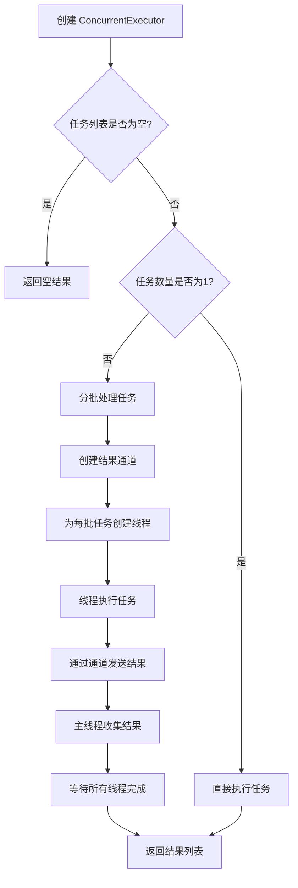
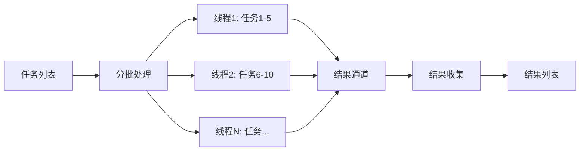

# 并发任务执行器模块架构文档

## 📋 概述

并发任务执行器模块是 Workflow CLI 的基础设施模块之一，提供通用的并发任务执行功能。该模块采用标准库线程池实现，支持并行执行多个任务、并发数限制、结果收集和进度回调，适用于任何需要并发执行的场景，包括但不限于文件下载、批量 API 请求、数据处理等。

**注意**：该模块使用标准库 `std::thread` 和 `std::sync::mpsc` 实现，不依赖外部异步运行时（如 `tokio`），适合在同步代码库中使用。

**模块统计：**
- 总代码行数：约 389 行（包含测试代码）
- 文件数量：2 个
- 主要组件：2 个（`ConcurrentExecutor`、`TaskResult`）
- 支持方法：3 个（`new()`、`execute()`、`execute-_with-_progress()`）
- 测试用例：4 个

---

## 📁 模块结构

### 核心模块文件

```
src/lib/base/concurrent/
├── mod.rs          # 模块导出和公共 API (33行)
└── executor.rs     # 并发执行器实现 (356行)
```

**总计：约 389 行代码**

### 依赖模块

- **`std::thread`**：标准库线程支持
- **`std::sync::mpsc`**：多生产者单消费者通道，用于结果收集
- **`std::sync::{Arc, Mutex}`**：线程安全的共享数据
- **`anyhow`**：错误处理

### 模块集成

#### JIRA 附件下载集成

- **并发下载**：
  - `JiraAttachmentDownloader::download-_attachments-_concurrent()` 使用 `ConcurrentExecutor::new()` 创建执行器
  - 使用 `ConcurrentExecutor::execute()` 并行下载多个附件
  - 使用 `TaskResult` 处理成功和失败的结果

**关键方法**：
- `JiraAttachmentDownloader::download-_attachments-_concurrent()` - 使用 `ConcurrentExecutor` 实现并发下载

#### 其他潜在使用场景

- **批量 API 请求**：可以用于并发发送多个 API 请求
- **文件处理**：可以用于并发处理多个文件
- **数据处理**：可以用于并发处理数据转换任务
- **其他 I/O 密集型任务**：任何需要并发执行的同步任务

---

## 🏗️ 架构设计

### 设计原则

1. **通用性**：使用泛型设计，支持任何类型的任务和结果
2. **简单性**：基于标准库实现，无外部依赖，易于理解和维护
3. **性能优化**：单任务时直接执行，避免线程开销
4. **线程安全**：使用 `Send + Sync` 约束确保线程安全
5. **错误隔离**：单个任务失败不影响其他任务执行

### 核心组件

#### 1. 任务结果枚举 (`TaskResult<T, E>`) (`executor.rs`)

**职责**：表示任务执行的结果（成功或失败）

**定义**：
```rust
pub enum TaskResult<T, E> {
    Success(T),   // 任务成功完成
    Failure(E),  // 任务执行失败
}
```

**关键特性**：
- 使用泛型 `T` 和 `E` 支持任意类型的结果和错误
- 实现 `Debug` 和 `Clone` trait，便于调试和结果传递
- 类型安全的结果表示

**使用场景**：
- 任务执行结果的统一表示
- 结果收集和错误处理

#### 2. 并发执行器 (`ConcurrentExecutor`) (`executor.rs`)

**职责**：管理并发任务的执行，包括并发数控制、任务分发、结果收集

**主要方法**：
- `new(max-_concurrent: usize)` - 创建新的并发执行器，设置最大并发数
- `execute<T, E>(tasks: Vec<(String, Box<dyn Fn() -> Result<T, E> + Send + Sync>)>)` - 执行多个任务（并行）
- `execute-_with-_progress<T, E, F>(tasks, on-_progress)` - 执行多个任务（并行），带进度回调

**关键特性**：
- **并发数限制**：通过 `max-_concurrent` 参数控制同时执行的任务数
- **分批处理**：将任务分成多个批次，每批最多 `max-_concurrent` 个并行执行
- **单任务优化**：如果只有一个任务，直接执行，避免线程开销
- **结果收集**：使用 `mpsc::channel` 收集各线程的执行结果
- **进度回调**：支持可选的进度回调函数，实时反馈任务执行状态

**使用场景**：
- 文件下载（如 JIRA 附件下载）
- 批量 API 请求
- 文件处理任务
- 其他需要并发执行的 I/O 或计算任务

### 设计模式

#### 1. 工作池模式（Worker Pool Pattern）

使用分批处理实现工作池模式，将任务分批分配给线程执行。

**实现方式**：
- 将任务列表分成多个批次（chunks）
- 每批最多 `max-_concurrent` 个任务
- 每个批次在一个线程中串行执行，不同批次并行执行

**优势**：
- 简单实现，无需复杂的线程池管理
- 有效控制并发数，避免资源过载
- 适合任务数量已知的场景

#### 2. 生产者-消费者模式（Producer-Consumer Pattern）

使用通道（channel）实现生产者-消费者模式，线程作为生产者发送结果，主线程作为消费者收集结果。

**实现方式**：
- 使用 `mpsc::channel` 创建结果通道
- 工作线程执行任务后通过通道发送结果
- 主线程从通道接收并收集所有结果

**优势**：
- 线程安全的结果收集
- 支持异步结果返回
- 无需手动同步

### 错误处理

#### 分层错误处理

1. **任务级错误**：单个任务执行失败，返回 `TaskResult::Failure(E)`，不影响其他任务
2. **线程级错误**：线程创建或等待失败，返回 `anyhow::Result` 错误

#### 容错机制

- **空任务列表**：直接返回空结果，不创建线程
- **单任务优化**：单个任务直接执行，避免线程创建失败的风险
- **通道错误**：使用 `tx.send().ok()` 忽略通道发送错误（通常发生在接收端已关闭时）
- **线程 join 错误**：捕获并转换为 `anyhow::Error`，确保错误信息清晰

---

## 🔄 调用流程与数据流

### 整体架构流程



### 典型调用示例

#### 1. 基本并发执行

```
1. 创建执行器：ConcurrentExecutor::new(max-_concurrent)
2. 准备任务列表：Vec<(String, Box<dyn Fn() -> Result<T, E> + Send + Sync>)>
3. 执行任务：executor.execute(tasks)
4. 处理结果：遍历结果列表，根据 TaskResult 处理成功和失败
```

#### 2. 带进度回调的并发执行

```
1. 创建执行器：ConcurrentExecutor::new(max-_concurrent)
2. 准备任务列表和进度回调：tasks + Arc<Mutex<Option<F>>>
3. 执行任务：executor.execute-_with-_progress(tasks, on-_progress)
4. 进度回调：每个任务完成时调用回调函数
5. 处理结果：遍历结果列表，处理成功和失败
```

### 数据流



**数据流向说明**：
1. **输入**：任务列表 `Vec<(String, Box<dyn Fn() -> Result<T, E>>)>`
2. **处理**：任务分批 → 线程执行 → 结果发送到通道
3. **输出**：结果列表 `Vec<(String, TaskResult<T, E>)>`

---

## 📋 使用示例

### 基本使用

```rust
use workflow::base::concurrent::{ConcurrentExecutor, TaskResult};
use anyhow::Result;

// 创建执行器，最大并发数为 5
let executor = ConcurrentExecutor::new(5);

// 准备任务列表
let tasks: Vec<(String, Box<dyn Fn() -> Result<String, String> + Send + Sync>)> = vec![
    ("task1".to-_string(), Box::new(|| -> Result<String, String> {
        Ok("result1".to-_string())
    })),
    ("task2".to-_string(), Box::new(|| -> Result<String, String> {
        Ok("result2".to-_string())
    })),
];

// 执行任务
let results = executor.execute(tasks)?;

// 处理结果
for (name, result) in results {
    match result {
        TaskResult::Success(value) => println!("{}: success - {}", name, value),
        TaskResult::Failure(err) => println!("{}: failed - {}", name, err),
    }
}
```

### 带进度回调的使用

```rust
use workflow::base::concurrent::{ConcurrentExecutor, TaskResult};
use std::sync::{Arc, Mutex};
use anyhow::Result;

let executor = ConcurrentExecutor::new(5);

// 准备进度回调
let progress-_callback = Arc::new(Mutex::new(Some(|name: &str, success: bool, err: Option<&str>| {
    if success {
        println!("Task {} completed successfully", name);
    } else {
        println!("Task {} failed: {}", name, err.unwrap-_or("unknown error"));
    }
})));

// 准备任务列表
let tasks = vec![
    ("task1".to-_string(), Box::new(|| -> Result<String, String> {
        Ok("result1".to-_string())
    }) as Box<dyn Fn() -> Result<String, String> + Send + Sync>),
];

// 执行任务（带进度回调）
let results = executor.execute-_with-_progress(tasks, Some(progress-_callback))?;
```

### JIRA 附件下载使用示例

```rust
use workflow::base::concurrent::{ConcurrentExecutor, TaskResult};

// 在 JiraAttachmentDownloader 中使用
let executor = ConcurrentExecutor::new(max-_concurrent);

// 准备下载任务
let mut tasks = Vec::new();
for attachment in attachments {
    let task = Box::new(move || -> Result<PathBuf, String> {
        // 下载逻辑
        download-_attachment(attachment)
    }) as Box<dyn Fn() -> Result<PathBuf, String> + Send + Sync>;
    tasks.push((attachment.filename.clone(), task));
}

// 执行下载任务
let results = executor.execute(tasks)?;

// 处理结果
for (filename, result) in results {
    match result {
        TaskResult::Success(path) => {
            println!("Downloaded: {} to {}", filename, path.display());
        }
        TaskResult::Failure(err) => {
            eprintln!("Failed to download {}: {}", filename, err);
        }
    }
}
```

---

## 📝 扩展性

### 添加新功能

1. **添加新的执行方法**：
   - 在 `ConcurrentExecutor` 实现中添加新方法
   - 遵循现有的设计模式（分批处理、通道通信）
   - 添加相应的测试用例

2. **支持任务优先级**：
   - 修改任务列表为优先级队列
   - 在分批处理时考虑优先级
   - 可能需要引入新的依赖（如 `std::collections::BinaryHeap`）

3. **支持任务取消**：
   - 添加取消标志（`Arc<AtomicBool>`）
   - 在任务执行前检查取消标志
   - 提供 `cancel()` 方法

**示例**：添加任务超时支持

```rust
impl ConcurrentExecutor {
    /// 执行任务，支持超时
    pub fn execute-_with-_timeout<T, E>(
        &self,
        tasks: Vec<(String, Box<dyn Fn() -> Result<T, E> + Send + Sync>)>,
        timeout: Duration,
    ) -> Result<Vec<(String, TaskResult<T, E>)>> {
        // 实现超时逻辑
        // 可以使用 std::time::Instant 跟踪时间
        // 超时的任务返回 TaskResult::Failure
    }
}
```

---

## 📚 相关文档

- [主架构文档](../architecture.md)
- [JIRA 模块架构文档](./JIRA_architecture.md) - 使用并发执行器进行附件下载
- [并发处理需求文档](../../requirements/CONCURRENCY.md) - 并发处理需求说明

---

## ✅ 总结

并发任务执行器模块采用清晰的工作池模式和生产者-消费者模式设计：

1. **通用性**：使用泛型设计，支持任何类型的任务和结果
2. **简单性**：基于标准库实现，无外部依赖
3. **性能优化**：单任务优化、分批处理、并发数控制
4. **线程安全**：使用 `Send + Sync` 约束和通道通信确保线程安全
5. **错误隔离**：单个任务失败不影响其他任务

**设计优势**：
- ✅ 通用性强，适用于多种并发场景
- ✅ 实现简单，易于理解和维护
- ✅ 性能优化，避免不必要的线程开销
- ✅ 线程安全，使用 Rust 的类型系统保证安全性
- ✅ 错误处理完善，支持错误隔离和结果收集

**当前实现状态**：
- 已实现基本并发执行功能
- 已实现进度回调支持
- 已在 JIRA 附件下载中使用
- 支持任意类型的任务和结果

---

**最后更新**: 2025-12-11
