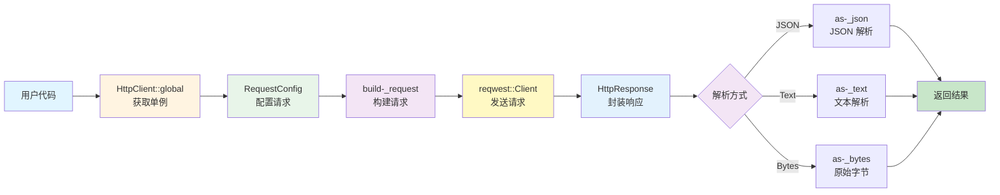
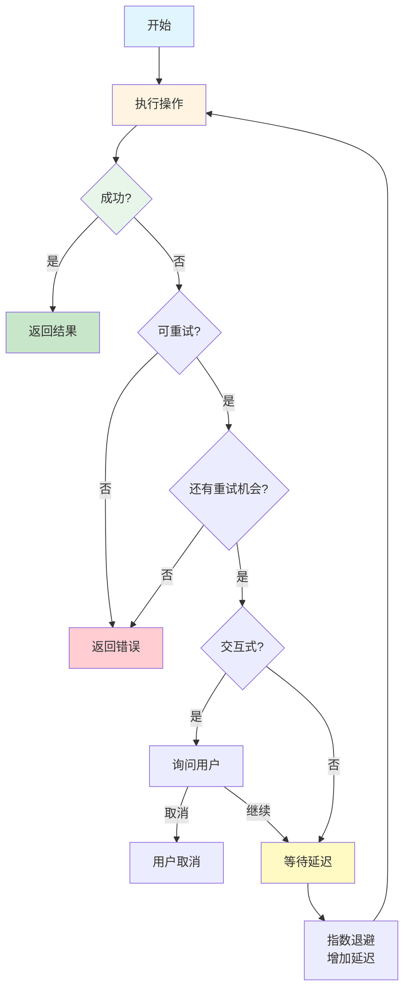

# HTTP 模块架构文档

## 📋 概述

HTTP 模块是 Workflow CLI 的基础设施模块之一，提供完整的 HTTP 请求功能，包括 HTTP 客户端封装、认证支持、响应解析和重试机制。该模块采用模块化设计，通过统一的接口和延迟解析机制，实现了高性能、易用性和可扩展性。

**模块统计：**
- 总代码行数：约 1200+ 行
- 文件数量：8 个
- 主要结构体：6 个（HttpClient, HttpResponse, RequestConfig, Authorization, HttpRetry, HttpRetryConfig）
- 支持 HTTP 方法：GET、POST、PUT、DELETE、PATCH
- 支持解析格式：JSON、Text

---

## 📁 Lib 层架构（核心业务逻辑）

### 文件组织

```
src/lib/base/http/
├── mod.rs          # 模块导出和公共 API (35行)
├── client.rs       # HTTP 客户端 (HttpClient, 298行)
├── config.rs       # 请求配置 (RequestConfig, 192行)
├── response.rs     # HTTP 响应 (HttpResponse, 222行)
├── auth.rs         # Basic Authentication (Authorization, 34行)
├── method.rs       # HTTP 方法枚举 (HttpMethod, 42行)
├── parser.rs       # 响应解析器 (ResponseParser, JsonParser, TextParser, 85行)
└── retry.rs        # HTTP 重试工具 (HttpRetry, HttpRetryConfig, 347行)
```

**总计：约 1200+ 行代码**

### 依赖模块

- **reqwest**：底层 HTTP 客户端库
- **serde/serde-_json**：JSON 序列化和反序列化
- **anyhow**：错误处理
- **dialoguer**：用户交互（重试机制）
- **tokio**：异步运行时

### 模块集成

#### Jira 模块集成

- **API 调用**：
  - `JiraHttpClient` 使用 `HttpClient::global()` 发送请求
  - 使用 `Authorization` 进行 Basic Authentication
  - 使用 `RequestConfig` 配置请求参数
  - 使用 `HttpResponse::ensure-_success()` 统一错误处理

**关键方法**：
- `JiraIssueApi::get-_issue()` - 使用 `HttpClient::get()`
- `JiraIssueApi::transition-_issue()` - 使用 `HttpClient::post()`
- `JiraUserApi::get-_current-_user()` - 使用 `HttpClient::get()`

#### PR 模块集成

- **GitHub API 调用**：
  - `GitHub` 平台实现使用 `HttpClient::global()` 发送请求
  - 使用 `RequestConfig` 配置请求（Headers、Body）
  - 使用 `HttpResponse::as-_json()` 解析响应

- **Codeup API 调用**：
  - `Codeup` 平台实现使用 `HttpClient::global()` 发送请求
  - 使用 `RequestConfig` 配置请求（Headers、Body、Query）
  - 使用 `HttpResponse::as-_json()` 解析响应

**关键方法**：
- `GitHub::create-_pull-_request()` - 使用 `HttpClient::post()`
- `Codeup::merge-_pull-_request()` - 使用 `HttpClient::put()`

#### 其他使用场景

- **网络检查**：使用 `HttpClient::global()` 检查网络连接
- **版本检查**：使用 `HttpClient::global()` 检查更新，使用 `HttpRetry` 进行重试

---

## 🔄 集成关系

HTTP 模块是 Workflow CLI 的基础设施模块，为所有需要网络请求的模块提供统一的 HTTP 客户端。该模块通过以下方式与其他模块集成：

1. **单例模式**：使用 `HttpClient::global()` 获取全局单例，所有模块共享同一个 HTTP 客户端实例
2. **统一接口**：提供统一的请求接口（`get()`、`post()`、`put()`、`delete()`、`patch()`），屏蔽底层实现细节
3. **认证支持**：通过 `Authorization` 和 `RequestConfig` 支持多种认证方式（Basic Auth、Bearer Token 等）
4. **错误处理**：通过 `HttpResponse::ensure-_success()` 提供统一的错误处理机制
5. **重试机制**：通过 `HttpRetry` 提供可配置的重试功能

### 主要集成场景

- **Jira 模块**：`JiraHttpClient` 使用 `HttpClient::global()` 发送请求，使用 `Authorization` 进行 Basic Authentication
- **PR 模块**：GitHub 和 Codeup 平台实现使用 `HttpClient::global()` 发送 API 请求
- **网络检查**：使用 `HttpClient::global()` 检查网络连接状态
- **版本检查**：使用 `HttpClient::global()` 和 `HttpRetry` 检查更新

---

## 🏗️ 架构设计

### 设计原则

1. **单例模式**：使用 `OnceLock` 实现线程安全的全局单例，复用连接池
2. **延迟解析**：响应体延迟解析，支持多次解析不同格式
3. **类型安全**：使用泛型和 trait 实现类型安全的请求和响应处理
4. **链式调用**：`RequestConfig` 支持链式调用，提供流畅的 API
5. **模块化设计**：按功能拆分模块，职责清晰

### 核心组件

#### 1. HTTP 客户端层 (`client.rs`)

**职责**：提供统一的 HTTP 请求接口

- **`HttpClient`** - HTTP 客户端
  - 单例模式（`OnceLock`），线程安全
  - 复用连接池，提高性能
  - 支持 GET、POST、PUT、DELETE、PATCH 方法
  - 支持流式请求（`stream()` 方法）

**主要方法**：
- `global()` - 获取全局单例
- `get<Q>(url, config)` - 执行 GET 请求
- `post<B, Q>(url, config)` - 执行 POST 请求
- `put<B, Q>(url, config)` - 执行 PUT 请求
- `delete<Q>(url, config)` - 执行 DELETE 请求
- `patch<B, Q>(url, config)` - 执行 PATCH 请求
- `stream<B, Q>(method, url, config)` - 流式请求

#### 2. 请求配置层 (`config.rs`)

**职责**：提供灵活的请求配置

- **`RequestConfig<B, Q>`** - 请求配置结构体
  - 支持请求体（`body`）
  - 支持查询参数（`query`）
  - 支持 Basic Authentication（`auth`）
  - 支持自定义 Headers（`headers`）
  - 支持超时设置（`timeout`，默认 30 秒）

**主要方法**：
- `new()` - 创建默认配置
- `body(body)` - 设置请求体
- `query(query)` - 设置查询参数
- `auth(auth)` - 设置认证信息
- `headers(headers)` - 设置 HTTP Headers
- `timeout(timeout)` - 设置超时时间

#### 3. 响应处理层 (`response.rs`)

**职责**：封装 HTTP 响应，提供延迟解析

- **`HttpResponse`** - HTTP 响应结构体
  - 缓存响应体字节，支持多次解析
  - 延迟解析机制，按需解析不同格式
  - 提供状态码检查和错误处理

**主要方法**：
- `from-_reqwest-_response(response)` - 从 reqwest 响应创建
- `is-_success()` - 检查是否为成功响应（200-299）
- `is-_error()` - 检查是否为错误响应
- `as-_json<T>()` - 解析为 JSON
- `as-_text()` - 解析为文本
- `as-_bytes()` - 获取原始字节
- `ensure-_success()` - 确保响应成功，否则返回错误
- `ensure-_success-_with(error-_handler)` - 使用自定义错误处理器

#### 4. 认证层 (`auth.rs`)

**职责**：提供 Basic Authentication 支持

- **`Authorization`** - Basic Authentication 认证信息
  - 用户名（通常是邮箱地址）
  - 密码（通常是 API token）

**主要方法**：
- `new(username, password)` - 创建认证信息

#### 5. HTTP 方法层 (`method.rs`)

**职责**：定义 HTTP 方法枚举

- **`HttpMethod`** - HTTP 方法枚举
  - Get、Post、Put、Delete、Patch
  - 支持字符串转换（`FromStr`、`Display`）

#### 6. 响应解析层 (`parser.rs`)

**职责**：提供可扩展的响应解析机制

- **`ResponseParser<T>`** - 响应解析器 Trait
  - 定义统一的解析接口
  - 支持自定义解析器实现

- **`JsonParser`** - JSON 解析器
  - 将响应体解析为 JSON
  - 处理空响应和错误响应

- **`TextParser`** - 文本解析器
  - 将响应体解析为 UTF-8 文本
  - 检查状态码

#### 7. 重试机制层 (`retry.rs`)

**职责**：提供 HTTP 请求重试功能

- **`HttpRetry`** - HTTP 重试工具
  - 指数退避算法
  - 智能错误判断（可重试 vs 不可重试）
  - 用户交互支持（询问是否继续重试）
  - 倒计时显示

- **`HttpRetryConfig`** - 重试配置
  - 最大重试次数（默认：3）
  - 初始延迟（默认：1 秒）
  - 最大延迟（默认：30 秒）
  - 退避倍数（默认：2.0）
  - 交互式确认（默认：true）

**主要方法**：
- `retry<F, T>(operation, config, operation-_name)` - 执行重试操作
- `is-_retryable-_error(error)` - 判断错误是否可重试
- `countdown-_with-_cancel(seconds, operation-_name)` - 倒计时等待

### 设计模式

#### 1. 单例模式

**`HttpClient::global()`** 使用 `OnceLock` 实现线程安全的全局单例：

```rust
pub fn global() -> Result<&'static Self> {
    static CLIENT: OnceLock<Result<HttpClient>> = OnceLock::new();
    CLIENT
        .get-_or-_init(HttpClient::new)
        .as-_ref()
        .map-_err(|e| anyhow::anyhow!("Failed to create HTTP client: {}", e))
}
```

**优势**：
- 复用连接池，提高性能
- 减少资源消耗
- 线程安全

#### 2. 建造者模式

**`RequestConfig`** 使用链式调用实现建造者模式：

```rust
let config = RequestConfig::new()
    .body(&body)
    .query(&query)
    .auth(&auth)
    .headers(&headers)
    .timeout(Duration::from-_secs(60));
```

**优势**：
- 提供流畅的 API
- 可选参数配置
- 类型安全

#### 3. 策略模式

**`ResponseParser`** trait 实现策略模式，支持不同的解析策略：

```rust
pub trait ResponseParser<T> {
    fn parse(bytes: &[u8], status: u16) -> Result<T>;
}

// JSON 解析策略
impl<T> ResponseParser<T> for JsonParser where T: Deserialize { ... }

// 文本解析策略
impl ResponseParser<String> for TextParser { ... }
```

**优势**：
- 可扩展性（支持添加新的解析格式）
- 类型安全
- 延迟解析

#### 4. 延迟解析模式

**`HttpResponse`** 缓存响应体字节，支持多次解析：

```rust
pub struct HttpResponse {
    body-_bytes: Vec<u8>,  // 缓存响应体字节
    // ...
}

impl HttpResponse {
    pub fn as-_json<T>(&self) -> Result<T> { ... }
    pub fn as-_text(&self) -> Result<String> { ... }
    pub fn as-_bytes(&self) -> &[u8] { ... }
}
```

**优势**：
- 支持多次解析不同格式
- 避免重复读取响应体
- 提高性能

#### 5. 重试模式

**`HttpRetry`** 实现重试模式，支持指数退避和用户交互：

```rust
HttpRetry::retry(
    || { /* 操作 */ },
    &config,
    "操作名称"
)?;
```

**优势**：
- 自动处理网络错误
- 用户可控制的重试流程
- 智能错误判断

### 错误处理

#### 分层错误处理

1. **HTTP 客户端层**：
   - 网络错误（连接失败、超时）
   - 请求构建错误

2. **响应处理层**：
   - `HttpResponse::ensure-_success()` - 统一检查状态码
   - `HttpResponse::as-_json()` - JSON 解析错误
   - `HttpResponse::as-_text()` - 文本解码错误

3. **重试层**：
   - 智能判断错误是否可重试
   - 不可重试错误（4xx）立即返回
   - 可重试错误（5xx、网络错误）进行重试

#### 容错机制

- **网络错误**：自动重试（如果使用 `HttpRetry`）
- **4xx 客户端错误**：立即返回，不重试
- **5xx 服务器错误**：自动重试
- **JSON 解析失败**：提供详细的错误信息，包含响应预览
- **空响应**：尝试解析为 `null` 或 `{}`

#### 错误类型判断

**可重试的错误**：
- 网络超时
- 连接失败
- 5xx 服务器错误
- 429 Too Many Requests

**不可重试的错误**：
- 4xx 客户端错误（400、401、403、404 等）
- JSON 解析错误
- 其他非网络错误

---

## 🔄 调用流程与数据流

### 整体架构流程

```
用户代码
  ↓
HttpClient::global() (获取全局单例)
  ↓
HttpClient::get/post/put/delete/patch() (执行请求)
  ↓
RequestConfig (配置请求：body, query, auth, headers, timeout)
  ↓
build-_request() (构建请求)
  ↓
reqwest::Client (发送请求)
  ↓
HttpResponse::from-_reqwest-_response() (封装响应)
  ↓
HttpResponse::as-_json/as-_text/as-_bytes() (延迟解析)
  ↓
ResponseParser (解析响应体)
  ↓
返回结果
```

### 典型调用示例

#### 1. 简单的 GET 请求

```
用户代码
  ↓
let client = HttpClient::global()?;
  ↓
let config = RequestConfig::new().query(&[("page", "1")]);
  ↓
let response = client.get("https://api.example.com", config)?;
  ↓
let data: MyType = response.ensure-_success()?.as-_json()?;
```

#### 2. 带认证的 POST 请求

```
用户代码
  ↓
let client = HttpClient::global()?;
  ↓
let auth = Authorization::new("user@example.com", "api-_token");
let body = serde-_json::json!({"key": "value"});
let config = RequestConfig::new()
    .body(&body)
    .auth(&auth);
  ↓
let response = client.post("https://api.example.com", config)?;
  ↓
let data: MyType = response.ensure-_success()?.as-_json()?;
```

#### 3. 带重试的请求

```
用户代码
  ↓
let config = HttpRetryConfig::new();
  ↓
HttpRetry::retry(
    || {
        let client = HttpClient::global()?;
        let response = client.get("https://api.example.com", RequestConfig::new())?;
        Ok(response.ensure-_success()?.as-_json::<MyType>()?)
    },
    &config,
    "获取数据"
)?;
```

### 数据流

#### HTTP 请求数据流



#### 重试机制数据流



---

## 📝 扩展性

### 添加新的 HTTP 方法

1. 在 `method.rs` 中添加新的枚举变体
2. 在 `client.rs` 的 `build-_request()` 方法中添加对应的分支
3. 在 `client.rs` 中添加对应的公共方法（如 `head()`、`options()`）

### 添加新的解析格式

1. 在 `parser.rs` 中实现 `ResponseParser<T>` trait
2. 在 `response.rs` 中添加便捷方法（如 `as-_xml()`、`as-_yaml()`）
3. 在 `mod.rs` 中导出新的解析器

**示例**：
```rust
// parser.rs
pub struct XmlParser;

impl<T> ResponseParser<T> for XmlParser where T: Deserialize {
    fn parse(bytes: &[u8], status: u16) -> Result<T> {
        // XML 解析逻辑
    }
}

// response.rs
impl HttpResponse {
    pub fn as-_xml<T>(&self) -> Result<T> where T: Deserialize {
        self.parse-_with(XmlParser)
    }
}
```

### 添加新的认证方式

1. 在 `auth.rs` 中添加新的认证结构体
2. 在 `config.rs` 的 `RequestConfig` 中添加认证字段
3. 在 `client.rs` 的 `build-_request()` 方法中添加认证逻辑

### 自定义重试策略

1. 扩展 `HttpRetryConfig` 添加新的配置选项
2. 修改 `HttpRetry::retry()` 实现新的重试逻辑
3. 或创建新的重试工具实现不同的策略

---

## 📚 相关文档

- [主架构文档](../architecture.md)
- [Jira 模块架构文档](./jira.md) - Jira 模块如何使用 HTTP 客户端
- [PR 模块架构文档](./pr.md) - PR 模块如何使用 HTTP 客户端
- [LLM 模块架构文档](./llm.md) - LLM 模块如何使用 HTTP 客户端

---

## 📋 使用示例

### 基本使用

```rust
use workflow::base::http::{HttpClient, RequestConfig};

// 获取全局客户端
let client = HttpClient::global()?;

// GET 请求
let config = RequestConfig::new()
    .query(&[("page", "1"), ("per-_page", "10")]);
let response = client.get("https://api.example.com", config)?;
let data: MyType = response.ensure-_success()?.as-_json()?;

// POST 请求
let body = serde-_json::json!({"key": "value"});
let config = RequestConfig::new().body(&body);
let response = client.post("https://api.example.com", config)?;
let data: MyType = response.ensure-_success()?.as-_json()?;
```

### 带认证的请求

```rust
use workflow::base::http::{HttpClient, RequestConfig, Authorization};

let client = HttpClient::global()?;
let auth = Authorization::new("user@example.com", "api-_token");
let config = RequestConfig::new()
    .body(&body)
    .auth(&auth);
let response = client.post("https://api.example.com", config)?;
```

### 带自定义 Headers 的请求

```rust
use workflow::base::http::{HttpClient, RequestConfig};
use reqwest::header::HeaderMap;

let client = HttpClient::global()?;
let mut headers = HeaderMap::new();
headers.insert("X-Custom-Header", "value".parse().unwrap());
let config = RequestConfig::new().headers(&headers);
let response = client.get("https://api.example.com", config)?;
```

### 带超时的请求

```rust
use workflow::base::http::{HttpClient, RequestConfig};
use std::time::Duration;

let client = HttpClient::global()?;
let config = RequestConfig::new()
    .timeout(Duration::from-_secs(60));
let response = client.get("https://api.example.com", config)?;
```

### 使用重试机制

```rust
use workflow::base::http::{HttpClient, RequestConfig, HttpRetry, HttpRetryConfig};

let config = HttpRetryConfig::new();
let result = HttpRetry::retry(
    || {
        let client = HttpClient::global()?;
        let response = client.get("https://api.example.com", RequestConfig::new())?;
        Ok(response.ensure-_success()?.as-_json::<MyType>()?)
    },
    &config,
    "获取数据"
)?;
```

### 流式请求

```rust
use workflow::base::http::{HttpClient, HttpMethod, RequestConfig};
use std::io::Read;

let client = HttpClient::global()?;
let config = RequestConfig::new();
let mut response = client.stream(HttpMethod::Get, "https://example.com/api", config)?;
let mut buffer = vec![0u8; 8192];
response.read(&mut buffer)?;
```

### 错误处理

```rust
use workflow::base::http::{HttpClient, RequestConfig};

let client = HttpClient::global()?;
let response = client.get("https://api.example.com", RequestConfig::new())?;

// 方式 1：使用 ensure-_success()
let data: MyType = response.ensure-_success()?.as-_json()?;

// 方式 2：使用 ensure-_success-_with() 自定义错误处理
let data: MyType = response
    .ensure-_success-_with(|r| {
        anyhow::anyhow!("API 调用失败: HTTP {}", r.status)
    })?
    .as-_json()?;

// 方式 3：手动检查
if response.is-_success() {
    let data: MyType = response.as-_json()?;
} else {
    log-_error!("请求失败: {} {}", response.status, response.status-_text);
    let error-_body = response.as-_text().unwrap-_or-_default();
    log-_error!("错误详情: {}", error-_body);
```

---

## ✅ 总结

HTTP 模块采用清晰的模块化设计：

1. **单例模式**：`HttpClient::global()` 实现线程安全的全局单例，复用连接池
2. **延迟解析**：`HttpResponse` 缓存响应体字节，支持多次解析不同格式
3. **链式调用**：`RequestConfig` 支持链式调用，提供流畅的 API
4. **可扩展性**：`ResponseParser` trait 支持添加新的解析格式
5. **重试机制**：`HttpRetry` 提供智能重试，支持指数退避和用户交互

**设计优势**：
- ✅ **高性能**：单例模式复用连接池，延迟解析避免重复读取
- ✅ **易用性**：链式调用 API，统一的错误处理
- ✅ **类型安全**：使用泛型和 trait 保证类型安全
- ✅ **可扩展性**：支持添加新的 HTTP 方法、解析格式和认证方式
- ✅ **容错性**：智能重试机制，自动处理网络错误

通过模块化设计和统一接口，实现了高性能、易用性和可扩展性的目标。

---

**最后更新**: 2025-12-16
