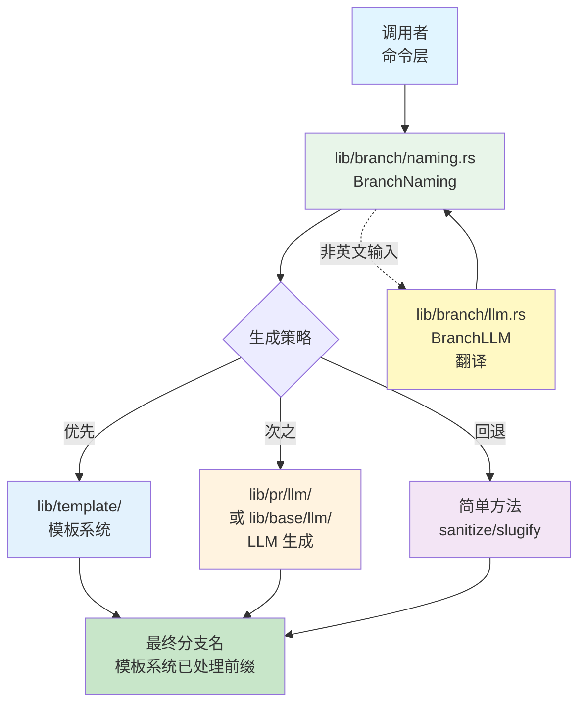
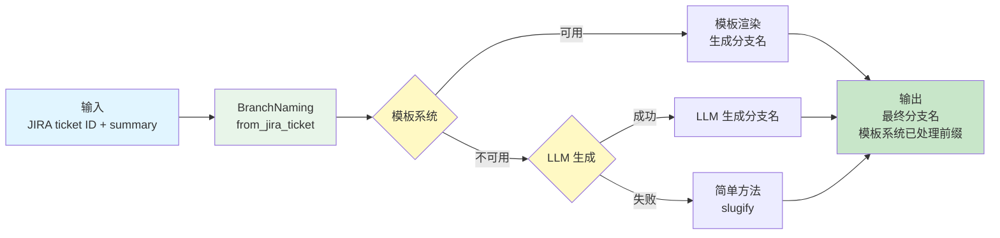
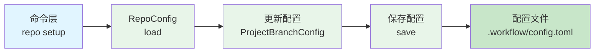

# Branch 模块架构文档

## 📋 概述

Branch 模块（`lib/branch/`）是 Workflow CLI 的核心库模块，提供分支命名和管理功能。该模块专注于分支名称生成、分支前缀管理、分支配置管理以及分支类型定义，支持从 JIRA ticket、标题文本、模板系统等多种方式生成分支名，并提供智能的分支名称清理和翻译功能。

**注意**：本文档仅描述 `lib/branch/` 模块的架构。关于分支命令层的详细内容，请参考 [Branch 命令模块架构文档](../commands/BRANCH_COMMAND_ARCHITECTURE.md)。

**模块统计：**
- 总代码行数：约 700+ 行
- 文件数量：4 个
- 主要组件：`BranchNaming`、`BranchType`、`BranchLLM`
- 支持功能：分支名生成（模板系统、LLM、简单回退）、分支类型定义、非英文翻译

**注意**：分支配置管理已迁移到 `lib/repo/config.rs`，使用 `RepoConfig` 和 `ProjectBranchConfig` 进行管理。

---

## 📁 模块结构

### 核心模块文件

```
src/lib/branch/
├── mod.rs          # Branch 模块声明和导出 (46行)
├── naming.rs       # 分支命名服务（从 JIRA ticket、标题、类型生成）(455行)
├── types.rs        # 分支类型定义（feature/bugfix/refactoring/hotfix/chore）(178行)
├── llm.rs          # Branch LLM 服务（非英文翻译）(56行)
└── sync.rs         # 分支同步功能
```

**注意**：分支配置管理已迁移到 `lib/repo/config.rs`，使用 `RepoConfig` 和 `ProjectBranchConfig` 进行管理。

### 依赖模块

- **`lib/git/`**：Git 操作（获取分支列表、提取仓库名）
  - `GitBranch::get_all_branches()` - 获取所有分支（用于 LLM 生成）
  - `GitRepo::extract_repo_name()` - 提取仓库名（用于配置管理）
- **`lib/jira/`**：JIRA 集成（JIRA ticket 信息获取）
  - 通过命令层传入 JIRA ticket ID 和 summary
- **`lib/template/`**：模板系统（分支名模板渲染）
  - `load_branch_template()` - 加载分支模板
  - `load_branch_template_by_type()` - 按类型加载模板
  - `TemplateEngine` - 模板渲染引擎
- **`lib/base/llm/`**：LLM 客户端（分支名生成、翻译）
  - `LLMClient` - LLM API 调用
- **`lib/base/dialog/`**：用户交互（分支类型选择）
  - `SelectDialog` - 选择对话框
  - `InputDialog` - 输入对话框
- **`lib/base/settings/`**：配置管理（配置文件路径）
  - `Paths::project_config()` - 项目级配置文件路径
- **`lib/pr/llm/`**：PR LLM 服务（分支名生成回退）
  - `PullRequestLLM::generate()` - 生成分支名（作为回退方案）

### 模块集成

- **`commands/branch/`**：分支命令层
  - `create.rs` - 使用 `BranchNaming`、`BranchType` 创建分支
  - `switch.rs` - 分支切换命令（使用 `GitBranch` 进行分支操作）
  - `rename.rs` - 分支重命名命令（使用 `GitBranch` 进行分支操作）
  - `ignore.rs` - 使用 `RepoConfig` 管理忽略列表
- **`commands/pr/`**：PR 命令层
  - `create.rs` - 使用 `BranchNaming`、`BranchType` 生成分支名
  - `pick.rs` - 使用 `BranchNaming`、`BranchType` 生成分支名
  - `helpers.rs` - 提供 stash 处理辅助函数（`handle_stash_pop_result()`），被 `branch switch` 命令使用

---

## 🏗️ 架构设计

### 设计原则

1. **策略模式**：分支名生成采用模板系统 → LLM → 简单回退的多层策略
2. **配置分离**：分支配置按仓库分组，支持不同仓库不同配置
3. **智能前缀**：自动检测并避免重复前缀（JIRA ticket 前缀、仓库前缀）
4. **类型安全**：使用枚举定义分支类型，提供类型转换和验证
5. **容错设计**：LLM 失败时自动回退到简单方法，翻译失败时使用原始输入

### 核心组件

#### 1. 分支命名服务 (`naming.rs`)

**职责**：提供从多种来源生成分支名的功能

**主要方法**：
- `from_jira_ticket()` - 从 JIRA ticket 生成分支名（模板系统 → LLM → 简单回退）
- `from_type_and_slug()` - 从分支类型和 slug 生成分支名（使用模板系统）
- `from_title()` - 从标题生成分支名
- `sanitize()` - 清理字符串为分支名格式（仅保留 ASCII 字母数字）
- `slugify()` - 转换为 slug 格式（保留更多字符）
- `sanitize_and_translate_branch_name()` - 清理并翻译分支名（处理非英文输入）

**关键特性**：
- 支持三种生成策略：模板系统优先，LLM 次之，简单方法最后
- 自动处理非英文字符（使用 LLM 翻译）
- 支持两种格式：`prefix/ticket-slug` 和 `ticket--slug`
- 模板系统自动处理前缀（JIRA ticket 前缀和仓库前缀）

**使用场景**：
- `branch create` 命令：从 JIRA ticket 创建分支
- `pr create` 命令：生成 PR 分支名
- `pr pick` 命令：从源 PR 生成新分支名

#### 2. 分支类型定义 (`types.rs`)

**职责**：定义分支类型枚举和提供选择功能

**核心枚举**：
- `BranchType` - 分支类型（Feature、Bugfix、Refactoring、Hotfix、Chore）

**主要方法**：
- `all()` - 获取所有分支类型
- `as_str()` - 转换为字符串（用于模板选择）
- `display_name()` - 获取显示名称（带描述）
- `from_str()` - 从字符串解析
- `prompt_selection()` - 交互式选择分支类型

**关键特性**：
- 支持多种字符串格式（如 "bug"、"fix" 都映射到 Bugfix）
- 提供中英文显示名称
- 支持交互式选择（使用 `SelectDialog`）

**使用场景**：
- `branch create` 命令：选择分支类型
- `pr create` 命令：选择分支类型
- 模板系统：根据分支类型选择模板

#### 5. Branch LLM 服务 (`llm.rs`)

**职责**：提供使用 LLM 处理分支名称的功能

**主要方法**：
- `translate_to_english()` - 将非英文文本翻译为英文

**关键特性**：
- 使用统一的 LLM 客户端（支持多种提供商）
- 使用翻译系统提示词
- 自动清理响应（去除引号、多余空格）

**使用场景**：
- `BranchNaming::sanitize_and_translate_branch_name()` - 处理非英文输入

### 设计模式

#### 1. 策略模式（分支名生成）

分支名生成采用三层策略：
1. **模板系统**：优先使用模板系统生成分支名（如果可用）
2. **LLM 生成**：模板系统不可用时，使用 LLM 生成
3. **简单回退**：LLM 失败时，使用简单的 slugify 方法

**优势**：
- 灵活性强：支持多种生成方式
- 容错性好：自动回退到简单方法
- 可扩展：易于添加新的生成策略

#### 2. 配置分组模式

分支配置按仓库分组，每个仓库有独立的配置：
- 分支前缀（可选）
- 忽略列表
- 提示标记（内部字段）

**优势**：
- 支持多仓库：不同仓库可以有不同的配置
- 配置隔离：仓库之间互不影响
- 易于管理：配置结构清晰

#### 3. 智能前缀检测

自动检测并避免重复前缀：
- 检测 JIRA ticket 前缀是否已存在
- 检测仓库前缀是否已存在
- 检测仓库前缀是否已作为分支类型使用

**优势**：
- 避免重复：不会生成 `feature/feature/...` 这样的分支名
- 智能合并：自动处理各种前缀组合情况

### 错误处理

#### 分层错误处理

1. **配置层错误**：配置加载/保存失败时，返回错误但不会中断流程（`check_and_prompt_prefix()`）
2. **LLM 层错误**：LLM 调用失败时，自动回退到简单方法
3. **模板层错误**：模板渲染失败时，自动回退到 LLM 或简单方法
4. **验证层错误**：分支名验证失败时，返回明确的错误信息

#### 容错机制

- **LLM 失败**：自动回退到简单 slugify 方法
- **翻译失败**：使用原始输入，让 `sanitize()` 处理
- **配置加载失败**：使用默认配置（空配置）
- **用户取消输入**：标记为已提示，避免重复提示

---

## 🔄 调用流程与数据流

### 整体架构流程

```
调用者（命令层）
  ↓
lib/branch/naming.rs (BranchNaming)
  ↓
策略选择：
  1. 模板系统 (lib/template/) - 自动处理前缀
  2. LLM 生成 (lib/pr/llm/ 或 lib/base/llm/)
  3. 简单回退 (sanitize/slugify)
  ↓
模板系统自动处理前缀（JIRA ticket 前缀和仓库前缀）
  ↓
最终分支名（带前缀）
```

#### 架构流程图



### 典型调用示例

#### 1. 从 JIRA ticket 生成分支名

```
commands/branch/create.rs
  ↓
BranchNaming::from_jira_ticket("PROJ-123", "Add user auth", Some("Feature"), true)
  ↓
尝试模板系统：
  load_branch_template("Feature")
  ↓
  成功 → TemplateEngine::render_string()
  失败 → 尝试 LLM
    ↓
    PullRequestLLM::generate()
    ↓
    成功 → 格式化分支名
    失败 → 简单方法 (slugify)
  ↓
模板系统自动处理前缀（JIRA ticket 前缀和仓库前缀）
  ↓
返回最终分支名
```

#### 2. 从分支类型和 slug 生成分支名

```
commands/pr/create.rs
  ↓
BranchType::prompt_selection() (用户选择类型)
  ↓
BranchNaming::sanitize_and_translate_branch_name(input) (清理输入)
  ↓
  检测非英文字符 → BranchLLM::translate_to_english()
  清理为分支名格式 → sanitize()
  ↓
BranchNaming::from_type_and_slug("feature", "my-branch", Some("PROJ-123"))
  ↓
  加载模板：load_branch_template_by_type("feature")
  渲染模板：TemplateEngine::render_string()
  ↓
模板系统自动处理前缀（JIRA ticket 前缀和仓库前缀）
  ↓
返回最终分支名
```


### 数据流

#### 从 JIRA ticket 生成分支名数据流



#### 配置管理数据流

**注意**：分支配置管理已迁移到 `lib/repo/config.rs`。配置通过 `workflow repo setup` 命令进行管理。



---

## 📋 使用示例

### 基本使用

```rust
use workflow::branch::BranchNaming;

// 从 JIRA ticket 生成分支名（模板系统自动处理前缀）
let branch_name = BranchNaming::from_jira_ticket(
    "PROJ-123",
    "Add user authentication",
    Some("Feature"),
    true,
)?;
// branch_name 已包含所有前缀（JIRA ticket 前缀和仓库前缀）
```

### 从分支类型和 slug 生成

```rust
use workflow::branch::{BranchNaming, BranchType};

// 清理并翻译用户输入
let slug = BranchNaming::sanitize_and_translate_branch_name("添加用户认证")?;
// 返回: "add-user-authentication"

// 从类型和 slug 生成分支名
let branch_name = BranchNaming::from_type_and_slug(
    "feature",
    &slug,
    Some("PROJ-123"),
)?;
// 返回: "feature/PROJ-123-add-user-authentication" (取决于模板)
```

### 从标题生成分支名

```rust
use workflow::branch::BranchNaming;

// 从标题生成分支名（自动应用仓库前缀）
let branch_name = BranchNaming::from_title(
    Some("PROJ-123"),
    "Add new feature",
)?;
// 返回: "repo-prefix/PROJ-123-add-new-feature" (如果配置了仓库前缀)
```

### 管理分支配置

```rust
use workflow::branch::config::BranchConfig;

// 加载配置
let mut config = BranchConfig::load()?;

// 设置仓库分支前缀
config.set_branch_prefix_for_repo(
    "owner/repo".to_string(),
    Some("feature".to_string()),
)?;

// 添加忽略分支
config.add_ignore_branch("owner/repo".to_string(), "develop".to_string())?;

// 保存配置
config.save()?;

// 获取当前仓库分支前缀
use workflow::repo::config::RepoConfig;

if let Some(prefix) = RepoConfig::get_branch_prefix() {
    println!("Current repo prefix: {}", prefix);
}
```

### 选择分支类型

```rust
use workflow::branch::BranchType;

// 交互式选择分支类型
let branch_type = BranchType::prompt_selection()?;

// 从字符串解析
let branch_type = BranchType::from_str("feature").unwrap();

// 获取所有分支类型
let all_types = BranchType::all();
for ty in all_types {
    println!("{}: {}", ty.as_str(), ty.display_name());
}
```

### 使用 LLM 翻译

```rust
use workflow::branch::llm::BranchLLM;

// 翻译非英文文本为英文
let translated = BranchLLM::translate_to_english("添加用户认证")?;
// 返回: "Add user authentication"
```

---

## 📝 扩展性

### 添加新的分支类型

1. 在 `lib/branch/types.rs` 的 `BranchType` 枚举中添加新变体
2. 在 `as_str()` 方法中添加字符串映射
3. 在 `display_name()` 方法中添加显示名称
4. 在 `from_str()` 方法中添加解析逻辑
5. 在 `all()` 方法中添加新类型

**示例**：
```rust
// lib/branch/types.rs
#[derive(Debug, Clone, Copy, PartialEq, Eq)]
pub enum BranchType {
    Feature,
    Bugfix,
    Refactoring,
    Hotfix,
    Chore,
    Experimental,  // 新增
}

impl BranchType {
    pub fn as_str(&self) -> &'static str {
        match self {
            // ...
            BranchType::Experimental => "experimental",
        }
    }

    // ... 其他方法也需要更新
}
```

### 添加新的分支名生成策略

1. 在 `lib/branch/naming.rs` 的 `from_jira_ticket()` 方法中添加新策略
2. 实现新的生成函数
3. 在策略链中插入新策略（按优先级顺序）

**示例**：
```rust
// lib/branch/naming.rs
impl BranchNaming {
    pub fn from_jira_ticket(...) -> Result<String> {
        // 1. 尝试模板系统
        // 2. 尝试新策略（如：从历史分支学习）
        match Self::try_learning_from_history(ticket_id, summary) {
            Ok(name) => return Ok(name),
            Err(_) => {}
        }
        // 3. 尝试 LLM
        // 4. 简单回退
    }

    fn try_learning_from_history(...) -> Result<String> {
        // 实现新策略
    }
}
```

### 添加新的配置项

1. 在 `lib/branch/config.rs` 的 `RepositoryConfig` 结构体中添加新字段
2. 添加相应的 getter/setter 方法
3. 更新配置文件的序列化/反序列化逻辑（如果需要）

**示例**：
```rust
// lib/branch/config.rs
#[derive(Debug, Clone, Default, Serialize, Deserialize)]
pub struct RepositoryConfig {
    pub branch_prefix: Option<String>,
    pub branch_ignore: Vec<String>,
    pub branch_prefix_prompted: bool,
    pub branch_naming_style: Option<String>,  // 新增配置项
}

impl BranchConfig {
    pub fn set_branch_naming_style(&mut self, repo_name: String, style: Option<String>) -> Result<()> {
        let repo_config = self.repositories.entry(repo_name).or_default();
        repo_config.branch_naming_style = style;
        Ok(())
    }
}
```

---

## 📚 相关文档

- [主架构文档](../ARCHITECTURE.md)
- [Branch 命令模块架构文档](../commands/BRANCH_COMMAND_ARCHITECTURE.md) - 分支命令层详情
- [Git 模块架构文档](./GIT_ARCHITECTURE.md) - Git 操作详情
- [Jira 模块架构文档](./JIRA_ARCHITECTURE.md) - Jira 集成详情
- [LLM 模块架构文档](./LLM_ARCHITECTURE.md) - AI 功能详情
- [PR 模块架构文档](./PR_ARCHITECTURE.md) - PR 相关功能（使用分支模块）

---

## ✅ 总结

Branch 模块采用清晰的分层架构和策略模式设计：

1. **分支命名服务**：提供多种生成策略（模板系统 → LLM → 简单回退）
2. **分支前缀管理**：统一处理前缀逻辑，智能避免重复
3. **分支类型定义**：类型安全的分支类型枚举
4. **LLM 集成**：支持非英文翻译和智能生成

**设计优势**：
- ✅ **策略模式**：灵活的分支名生成策略，易于扩展
- ✅ **智能前缀**：自动检测并避免重复前缀
- ✅ **配置集中**：分支配置统一通过 `lib/repo/config.rs` 管理
- ✅ **容错设计**：多层回退机制，确保总能生成分支名
- ✅ **类型安全**：使用枚举和类型系统保证类型安全
- ✅ **用户友好**：自动提示配置，支持非英文输入翻译

通过分层架构和策略模式，实现了灵活、可扩展、容错性强的分支命名和管理功能。命令层（`commands/branch/` 和 `commands/pr/`）使用本模块提供的接口，实现了完整的分支生命周期管理功能。
