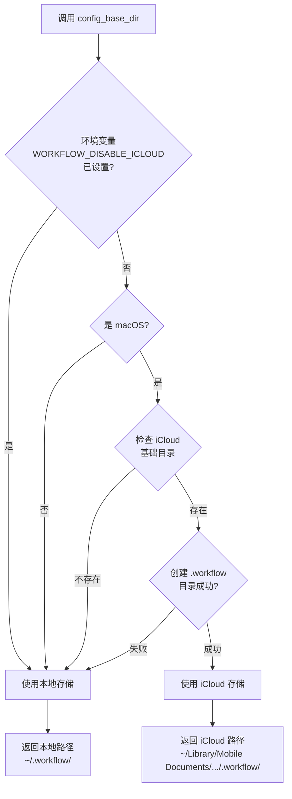

# iCloud 存储模块架构文档

## 📋 概述

本文档描述 Workflow CLI 的 iCloud 存储模块架构，包括：
- iCloud Drive 存储位置自动选择机制
- 配置文件的跨设备同步支持
- 本地存储回退机制
- 存储位置查询和信息展示

该模块是 Settings 模块的一部分，通过 `Paths` 结构体提供统一的路径管理，自动在 iCloud 和本地存储之间选择最佳位置。

**模块统计：**
- 总代码行数：约 150 行（iCloud 相关代码）
- 文件数量：1 个核心文件（`src/lib/base/settings/paths.rs`）
- 主要组件：3 个私有方法 + 3 个公开 API
- 支持平台：macOS（iCloud），其他平台（本地存储）

**注意**：iCloud 存储功能仅在 macOS 上可用，其他平台自动使用本地存储。

---

## 📁 模块结构

### 核心模块文件

```
src/lib/base/settings/
└── paths.rs        # 路径管理（包含 iCloud 支持，约 600 行）
```

### 依赖模块

- **`dirs` crate**：跨平台主目录获取（`dirs::home_dir()`）
- **`std::fs`**：文件系统操作（目录创建、权限设置）
- **`std::env`**：环境变量读取（`WORKFLOW_DISABLE_ICLOUD`）

### 模块集成

#### Settings 模块

- **`lib/base/settings/paths.rs`**：路径管理
  - `Paths::config_dir()` - 获取配置目录（支持 iCloud）
  - `Paths::workflow_dir()` - 获取工作流目录（支持 iCloud）
  - `Paths::work_history_dir()` - 获取工作历史目录（强制本地）
  - `Paths::completion_dir()` - 获取补全脚本目录（强制本地）

#### 其他模块使用

- **配置管理**：所有配置文件通过 `Paths::config_dir()` 获取路径
- **工作历史**：通过 `Paths::work_history_dir()` 获取路径（本地存储）
- **补全脚本**：通过 `Paths::completion_dir()` 获取路径（本地存储）

---

## 🏗️ 架构设计

### 设计原则

1. **自动选择**：系统自动选择最佳存储位置，用户无需手动配置
2. **透明回退**：iCloud 不可用时自动回退到本地存储，确保功能可用
3. **选择性同步**：配置同步到 iCloud，工作历史等保持本地（避免冲突）
4. **平台兼容**：非 macOS 平台自动使用本地存储，无需特殊处理
5. **用户控制**：支持通过环境变量 `WORKFLOW_DISABLE_ICLOUD` 强制使用本地存储

### 核心组件

#### 1. `try_icloud_base_dir()` (私有方法)

**职责**：尝试获取 iCloud 基础目录（仅 macOS）

**实现逻辑**：
```rust
#[cfg(target_os = "macos")]
fn try_icloud_base_dir() -> Option<PathBuf> {
    // 1. 获取用户主目录
    let home = Self::home_dir().ok()?;

    // 2. 构建 iCloud Drive 基础路径
    let icloud_base = home
        .join("Library")
        .join("Mobile Documents")
        .join("com~apple~CloudDocs");

    // 3. 检查 iCloud Drive 是否可用
    if !icloud_base.exists() || !icloud_base.is_dir() {
        return None;
    }

    // 4. 尝试创建 .workflow 目录
    let workflow_dir = icloud_base.join(".workflow");
    if fs::create_dir_all(&workflow_dir).is_err() {
        return None;
    }

    // 5. 设置目录权限为 700（仅用户可访问）
    #[cfg(unix)]
    {
        let _ = fs::set_permissions(&workflow_dir, fs::Permissions::from_mode(0o700));
    }

    Some(workflow_dir)
}
```

**关键特性**：
- 仅在 macOS 上编译（使用 `#[cfg(target_os = "macos")]`）
- 检查 iCloud Drive 目录是否存在
- 自动创建 `.workflow` 目录
- 设置安全的目录权限（700）

**使用场景**：
- 在 `config_base_dir()` 中调用，尝试获取 iCloud 路径
- 如果返回 `None`，自动回退到本地存储

#### 2. `local_base_dir()` (私有方法)

**职责**：获取本地基础目录（总是可用）

**实现逻辑**：
```rust
fn local_base_dir() -> Result<PathBuf> {
    let home = Self::home_dir()?;
    let workflow_dir = home.join(".workflow");

    // 确保目录存在
    fs::create_dir_all(&workflow_dir)
        .context("Failed to create local .workflow directory")?;

    // 设置目录权限为 700（仅用户可访问）
    #[cfg(unix)]
    {
        fs::set_permissions(&workflow_dir, fs::Permissions::from_mode(0o700))
            .context("Failed to set workflow directory permissions")?;
    }

    Ok(workflow_dir)
}
```

**关键特性**：
- 跨平台支持（所有平台都可用）
- 自动创建目录（如果不存在）
- 设置安全的目录权限

**使用场景**：
- 作为 iCloud 不可用时的回退方案
- 非 macOS 平台的默认存储位置
- 工作历史和补全脚本的存储位置（强制本地）

#### 3. `config_base_dir()` (私有方法)

**职责**：获取配置基础目录（支持 iCloud）

**决策逻辑**：
```rust
fn config_base_dir() -> Result<PathBuf> {
    // 1. 检查用户是否明确禁用 iCloud
    if std::env::var("WORKFLOW_DISABLE_ICLOUD").is_ok() {
        return Self::local_base_dir();
    }

    // 2. macOS 上尝试 iCloud
    #[cfg(target_os = "macos")]
    {
        if let Some(icloud_dir) = Self::try_icloud_base_dir() {
            return Ok(icloud_dir);
        }
    }

    // 3. 回退到本地
    Self::local_base_dir()
}
```

**关键特性**：
- 环境变量控制：`WORKFLOW_DISABLE_ICLOUD` 可强制使用本地存储
- 平台检测：仅在 macOS 上尝试 iCloud
- 自动回退：iCloud 不可用时自动使用本地存储

**使用场景**：
- 被 `config_dir()` 调用，获取配置基础目录
- 被 `workflow_dir()` 调用，获取工作流基础目录

### 设计模式

#### 1. 策略模式（存储位置选择）

**模式说明**：
根据平台和环境自动选择存储策略（iCloud 或本地存储）

**优势**：
- ✅ 用户无需手动配置
- ✅ 自动适应不同环境
- ✅ 提供回退机制，确保功能可用

**实现**：
```rust
fn config_base_dir() -> Result<PathBuf> {
    // 策略 1: 环境变量强制本地
    if std::env::var("WORKFLOW_DISABLE_ICLOUD").is_ok() {
        return Self::local_base_dir();
    }

    // 策略 2: macOS 尝试 iCloud
    #[cfg(target_os = "macos")]
    {
        if let Some(icloud_dir) = Self::try_icloud_base_dir() {
            return Ok(icloud_dir);
        }
    }

    // 策略 3: 回退到本地
    Self::local_base_dir()
}
```

#### 2. 条件编译（平台特定代码）

**模式说明**：
使用 Rust 的条件编译特性，在不同平台上编译不同的代码

**优势**：
- ✅ 代码清晰，平台特定逻辑隔离
- ✅ 编译时优化，非 macOS 平台不包含 iCloud 代码
- ✅ 类型安全，编译时检查平台兼容性

**实现**：
```rust
#[cfg(target_os = "macos")]
fn try_icloud_base_dir() -> Option<PathBuf> {
    // macOS 特定实现
}

#[cfg(not(target_os = "macos"))]
fn try_icloud_base_dir() -> Option<PathBuf> {
    None  // 非 macOS 总是返回 None
}
```

### 错误处理

#### 分层错误处理

1. **平台层**：条件编译确保平台特定代码正确
2. **环境层**：环境变量检查（`WORKFLOW_DISABLE_ICLOUD`）
3. **文件系统层**：目录存在性检查、创建失败处理
4. **权限层**：目录权限设置失败处理（非致命错误）

#### 容错机制

- **iCloud 不可用**：自动回退到本地存储，不报错
- **目录创建失败**：返回 `None`，触发回退机制
- **权限设置失败**：记录警告但继续执行（使用 `let _ = ...`）
- **主目录获取失败**：返回错误（这是致命错误，无法继续）

---

## 🔄 调用流程与数据流

### 整体架构流程

```
用户代码调用 Paths::config_dir()
  ↓
Paths::config_base_dir()  (决策逻辑)
  ↓
  ├─ 检查环境变量 WORKFLOW_DISABLE_ICLOUD
  │   ├─ 已设置 → local_base_dir() → 返回本地路径
  │   └─ 未设置 → 继续
  │
  ├─ [仅 macOS] try_icloud_base_dir()
  │   ├─ 成功 → 返回 iCloud 路径
  │   └─ 失败 → 继续
  │
  └─ local_base_dir() → 返回本地路径
  ↓
Paths::config_dir()  (添加 config/ 子目录)
  ↓
返回配置目录路径
```

### 存储位置选择决策树



### 典型调用示例

#### 1. 获取配置目录（自动选择存储位置）

```rust
use workflow::base::settings::paths::Paths;

// 自动选择存储位置（iCloud 或本地）
let config_dir = Paths::config_dir()?;

// 构建配置文件路径
let config_file = config_dir.join("workflow.toml");

// 读写文件（与普通文件操作相同）
std::fs::write(&config_file, toml_content)?;
```

**调用流程**：
```
Paths::config_dir()
  ↓
Paths::config_base_dir()  (决策逻辑)
  ↓
[根据平台和环境选择存储位置]
  ↓
返回配置目录路径
```

#### 2. 检查存储位置

```rust
use workflow::base::settings::paths::Paths;

// 检查是否使用 iCloud
let is_icloud = Paths::is_config_in_icloud();

// 获取存储位置描述
let location = Paths::storage_location();
// macOS + iCloud: "iCloud Drive (synced across devices)"
// 其他情况: "Local storage"

// 获取详细存储信息
let info = Paths::storage_info()?;
println!("{}", info);
```

**调用流程**：
```
Paths::is_config_in_icloud()
  ↓
[仅 macOS] try_icloud_base_dir()
  ↓
返回 bool (是否使用 iCloud)
```

#### 3. 强制使用本地存储

```rust
// 设置环境变量
std::env::set_var("WORKFLOW_DISABLE_ICLOUD", "1");

// 即使 iCloud 可用，也会使用本地存储
let config_dir = Paths::config_dir()?;
// 总是返回 ~/.workflow/config/
```

---

## 📋 使用示例

### 基本使用

```rust
use workflow::base::settings::paths::Paths;
use anyhow::Result;

// 获取配置目录（自动选择 iCloud 或本地）
let config_dir = Paths::config_dir()?;

// 保存配置文件
let config_file = config_dir.join("workflow.toml");
std::fs::write(&config_file, config_content)?;

// 读取配置文件
let content = std::fs::read_to_string(&config_file)?;
```

### 检查存储位置

```rust
use workflow::base::settings::paths::Paths;

// 检查是否使用 iCloud
if Paths::is_config_in_icloud() {
    println!("配置存储在 iCloud，会自动同步到其他设备");
} else {
    println!("配置存储在本地");
}

// 获取存储位置描述
println!("存储位置: {}", Paths::storage_location());

// 获取详细存储信息
let info = Paths::storage_info()?;
println!("{}", info);
```

### 保存配置文件

```rust
use workflow::base::settings::paths::Paths;
use std::fs;

fn save_config(config: &str) -> Result<()> {
    // 获取配置目录（自动选择 iCloud 或本地）
    let config_dir = Paths::config_dir()?;

    // 构建配置文件路径
    let config_file = config_dir.join("workflow.toml");

    // 写入文件（自动保存到 iCloud 或本地）
    fs::write(&config_file, config)?;

    Ok(())
}
```

### 读取配置文件

```rust
use workflow::base::settings::paths::Paths;
use std::fs;

fn load_config() -> Result<String> {
    // 获取配置目录
    let config_dir = Paths::config_dir()?;

    // 构建配置文件路径
    let config_file = config_dir.join("workflow.toml");

    // 读取文件
    let content = fs::read_to_string(&config_file)?;

    Ok(content)
}
```

### 获取工作历史目录（强制本地）

```rust
use workflow::base::settings::paths::Paths;

// 工作历史总是存储在本地（不同步到 iCloud）
let history_dir = Paths::work_history_dir()?;

// 保存工作历史
let history_file = history_dir.join("repo.json");
fs::write(&history_file, history_data)?;
```

---

## 🔍 存储位置决策逻辑

### 决策流程图

```
┌─────────────────────┐
│  config_base_dir()  │
└──────────┬──────────┘
           │
           ▼
    ┌──────────────┐
    │ 环境变量检查   │
    │ WORKFLOW_    │
    │ DISABLE_     │
    │ ICLOUD?      │
    └───┬──────┬───┘
        │      │
    是  │      │ 否
        │      │
        ▼      ▼
   ┌─────┐  ┌──────────────┐
   │本地 │  │ 平台检查      │
   │存储 │  │ macOS?       │
   └─────┘  └───┬──────┬───┘
                │      │
            是  │      │ 否
                │      │
                ▼      ▼
        ┌─────────┐  ┌─────┐
        │检查 iCloud│  │本地 │
        │基础目录   │  │存储 │
        └───┬───┬─┘  └─────┘
            │   │
        存在│   │不存在
            │   │
            ▼   ▼
        ┌─────┐ ┌─────┐
        │iCloud│ │本地 │
        │存储  │ │存储 │
        └─────┘ └─────┘
```

### 实际执行场景

#### 场景 A：macOS + iCloud 已启用

```
步骤 1: Paths::config_base_dir() 被调用
  ↓
步骤 2: 检查环境变量 WORKFLOW_DISABLE_ICLOUD
  → 结果: 未设置 ✅
  ↓
步骤 3: 检查 target_os == "macos"
  → 结果: true ✅
  ↓
步骤 4: 调用 try_icloud_base_dir()
  → 检查 ~/Library/Mobile Documents/com~apple~CloudDocs
  → 目录存在 ✅
  → 创建 ~/Library/.../.workflow 成功 ✅
  ↓
步骤 5: 返回 iCloud 路径
  → ~/Library/Mobile Documents/com~apple~CloudDocs/.workflow ✅
```

#### 场景 B：macOS + iCloud 未启用

```
步骤 1: Paths::config_base_dir() 被调用
  ↓
步骤 2: 检查环境变量 WORKFLOW_DISABLE_ICLOUD
  → 结果: 未设置 ✅
  ↓
步骤 3: 检查 target_os == "macos"
  → 结果: true ✅
  ↓
步骤 4: 调用 try_icloud_base_dir()
  → 检查 ~/Library/Mobile Documents/com~apple~CloudDocs
  → 目录不存在 ❌
  → 返回 None
  ↓
步骤 5: 回退到本地存储
  → 创建 ~/.workflow ✅
  ↓
步骤 6: 返回本地路径
  → ~/.workflow ✅
```

#### 场景 C：Linux/Windows

```
步骤 1: Paths::config_base_dir() 被调用
  ↓
步骤 2: 检查环境变量 WORKFLOW_DISABLE_ICLOUD
  → 结果: 未设置 ✅
  ↓
步骤 3: 检查 target_os == "macos"
  → 结果: false ❌
  ↓
步骤 4: 跳过 iCloud 检查，直接使用本地存储
  → 创建 ~/.workflow ✅
  ↓
步骤 5: 返回本地路径
  → ~/.workflow ✅
```

#### 场景 D：强制使用本地存储

```
步骤 1: 设置环境变量 WORKFLOW_DISABLE_ICLOUD=1
  ↓
步骤 2: Paths::config_base_dir() 被调用
  ↓
步骤 3: 检查环境变量 WORKFLOW_DISABLE_ICLOUD
  → 结果: 已设置 ✅
  ↓
步骤 4: 直接使用本地存储（跳过 iCloud 检查）
  → 创建 ~/.workflow ✅
  ↓
步骤 5: 返回本地路径
  → ~/.workflow ✅
```

---

## 📝 扩展性

### 添加新的存储位置类型

如果需要支持其他云存储（如 Dropbox、OneDrive），可以扩展决策逻辑：

```rust
fn config_base_dir() -> Result<PathBuf> {
    // 1. 检查环境变量
    if std::env::var("WORKFLOW_DISABLE_ICLOUD").is_ok() {
        return Self::local_base_dir();
    }

    // 2. macOS 尝试 iCloud
    #[cfg(target_os = "macos")]
    {
        if let Some(icloud_dir) = Self::try_icloud_base_dir() {
            return Ok(icloud_dir);
        }
    }

    // 3. 可以添加其他云存储检查
    // if let Some(dropbox_dir) = Self::try_dropbox_base_dir() {
    //     return Ok(dropbox_dir);
    // }

    // 4. 回退到本地
    Self::local_base_dir()
}
```

### 添加存储位置查询 API

如果需要查询更多存储信息，可以添加新的方法：

```rust
impl Paths {
    /// 获取所有可用的存储位置
    pub fn available_storage_locations() -> Vec<StorageLocation> {
        let mut locations = Vec::new();

        // 检查 iCloud
        #[cfg(target_os = "macos")]
        {
            if Self::try_icloud_base_dir().is_some() {
                locations.push(StorageLocation::ICloud);
            }
        }

        // 本地存储总是可用
        locations.push(StorageLocation::Local);

        locations
    }
}
```

---

## 📚 相关文档

- [Settings 模块架构文档](./SETTINGS_ARCHITECTURE.md) - 配置管理模块（包含路径管理）
- [主架构文档](../ARCHITECTURE.md) - 总体架构设计文档

---

## ✅ 总结

iCloud 存储模块采用清晰的策略模式设计：

1. **自动选择**：根据平台和环境自动选择最佳存储位置
2. **透明回退**：iCloud 不可用时自动回退，确保功能可用
3. **选择性同步**：配置同步到 iCloud，工作历史保持本地

**设计优势**：
- ✅ 用户无需手动配置，开箱即用
- ✅ 跨平台兼容，非 macOS 平台自动使用本地存储
- ✅ 提供环境变量控制，支持强制使用本地存储
- ✅ 代码清晰，平台特定逻辑通过条件编译隔离

**当前实现状态**：
- ✅ iCloud 存储支持（macOS）
- ✅ 本地存储回退机制
- ✅ 环境变量控制
- ✅ 存储位置查询 API
- ✅ 工作历史和补全脚本强制本地存储

**配置说明**：
- 默认行为：macOS 上自动使用 iCloud（如果可用），其他平台使用本地存储
- 环境变量：`WORKFLOW_DISABLE_ICLOUD=1` 可强制使用本地存储
- 迁移：如需从本地迁移到 iCloud，需要手动复制配置文件
