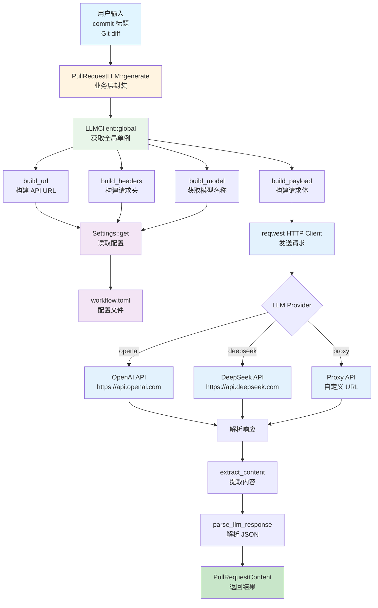

# LLM 模块架构文档

## 📋 概述

LLM 模块是 Workflow CLI 的核心功能之一，提供统一配置驱动的 LLM（大语言模型）客户端实现。该模块通过**统一客户端**和**Settings 配置系统**，实现所有 LLM 提供商的统一调用，支持 OpenAI、DeepSeek 和代理 API。所有 LLM 提供商都遵循 OpenAI 兼容格式，使用相同的请求和响应处理逻辑。

**模块统计：**
- 总代码行数：约 790 行
- 文件数量：4 个
- 支持提供商：OpenAI、DeepSeek、Proxy（代理 API）
- 主要结构体：`LLMClient`、`LLMRequestParams`、`PullRequestLLM`、`PullRequestContent`

### 核心设计原则

1. **统一客户端**：所有 LLM 提供商使用同一个客户端实现
2. **配置驱动**：所有参数（URL、API Key、Model、Response Format）从 `Settings` 动态获取
3. **易于扩展**：添加新的 LLM 提供商只需配置，无需写代码
4. **向后兼容**：保持现有 API 不变，支持从 `workflow.toml` 配置

### 为什么选择统一配置驱动方案？

基于 API 调用分析，所有 LLM 提供商都遵循 **OpenAI 兼容格式**：

- ✅ **请求格式完全相同**：都使用 POST 到 `/v1/chat/completions` 或 `/chat/completions`，请求体结构相同
- ✅ **响应格式完全相同**：都从 `choices[0].message.content` 提取内容（或通过自定义 JSON path）
- ✅ **唯一差异**：URL 和 API Key（配置差异，非代码差异）

**结论**：**不需要传统插件系统**（trait、registry、manager），只需要**配置驱动 + 统一客户端**方案。

---

## 📁 模块结构

```
src/lib/base/llm/
├── mod.rs          # LLM 模块声明和导出 (12行)
├── client.rs       # LLMClient 统一客户端 (503行)
└── types.rs        # LLMRequestParams 类型定义 (34行)
```

### 业务层封装

```
src/lib/pr/llm.rs   # PullRequestLLM 业务层封装 (253行)
```

**职责**：
- 提供 PR 专用的 LLM 服务（生成分支名、PR 标题、描述）
- 封装 LLM 调用逻辑，提供业务友好的接口

### 依赖模块

- **`lib/base/settings/`**：配置管理（从 `workflow.toml` 读取 LLM 配置）
- **`lib/base/http/`**：HTTP 响应处理（`HttpResponse`）
- **`lib/pr/helpers/`**：PR 辅助函数（分支名转换等）

### 模块集成

#### PR 模块集成

**使用场景**：
- 生成 PR 分支名
- 生成 PR 标题
- 生成 PR 描述

**关键调用**：
```rust
// 通过 PullRequestLLM 调用
let llm = PullRequestLLM::new(commits, config);
let result = llm.generate()?;
```

**位置**：`src/lib/pr/llm.rs`

---

## 🏗️ 架构设计

### 设计原则

1. **统一客户端**：所有 LLM 提供商使用同一个客户端实现
2. **配置驱动**：所有参数从 `Settings` 动态获取
3. **单例模式**：使用 `OnceLock` 实现线程安全的全局单例
4. **无状态设计**：客户端不存储配置，每次调用时从 `Settings` 获取
5. **统一错误处理**：所有提供商使用相同的错误处理逻辑

### 核心组件

#### 1. LLMClient（统一客户端）

**职责**：提供所有 LLM 提供商的统一调用接口

**位置**：`src/lib/base/llm/client.rs`

**关键方法**：
- `global()` - 获取全局单例
- `call()` - 调用 LLM API
- `build_url()` - 构建 API URL（根据 provider 动态构建）
- `build_headers()` - 构建请求头（从 Settings 获取 API Key）
- `build_model()` - 构建模型名称（根据 provider 获取默认值）
- `build_payload()` - 构建请求体（统一格式）
- `extract_content()` - 提取响应内容（支持标准格式和自定义 JSON path）
- `extract_by_path()` - 通过 JSON path 提取内容
- `handle_error()` - 统一错误处理

**关键特性**：
- ✅ **单例模式**：使用 `OnceLock` 实现线程安全的全局单例
- ✅ **无状态**：不存储配置，每次调用时从 `Settings::get()` 获取
- ✅ **动态配置**：所有配置（URL、Key、Model）都从 `Settings` 动态获取
- ✅ **统一处理**：所有提供商使用相同的请求和响应处理逻辑
- ✅ **超时控制**：60 秒超时设置
- ✅ **自定义响应格式**：支持通过 JSON path 提取内容

#### 2. LLMRequestParams（请求参数）

**职责**：定义 LLM API 请求参数

**位置**：`src/lib/base/llm/types.rs`

**字段**：
- `system_prompt` - 系统提示词
- `user_prompt` - 用户提示词
- `max_tokens` - 最大 token 数
- `temperature` - 温度参数（控制输出的随机性）
- `model` - 模型名称（实际使用时从 Settings 获取）

#### 3. PullRequestLLM（业务层）

**职责**：提供 PR 专用的 LLM 服务

**位置**：`src/lib/pr/llm.rs`

**关键方法**：
- `generate()` - 生成分支名、PR 标题和描述
- `system_prompt()` - 生成系统提示词
- `user_prompt()` - 生成用户提示词
- `parse_llm_response()` - 解析 LLM 响应

**关键特性**：
- ✅ **业务封装**：封装 LLM 调用逻辑，提供业务友好的接口
- ✅ **智能生成**：根据 commit 标题和 Git diff 生成分支名和 PR 标题
- ✅ **多语言支持**：自动翻译非英文内容为英文
- ✅ **响应解析**：支持 JSON 和 Markdown 代码块格式

#### 4. PullRequestContent（业务数据）

**职责**：定义 PR 内容结构

**位置**：`src/lib/pr/llm.rs`

**字段**：
- `branch_name` - 分支名称（小写，使用连字符分隔）
- `pr_title` - PR 标题（简洁，不超过 8 个单词）
- `description` - PR 描述（基于 Git 修改内容生成，可选）

#### 5. Settings（配置系统）

**职责**：从 `workflow.toml` 读取 LLM 配置

**配置位置**：`workflow.toml` 文件的 `[llm]` 部分

**配置字段**：

| 字段 | 类型 | 必需 | 说明 |
|------|------|------|------|
| `provider` | String | ✅ | 提供商名称：`openai`、`deepseek`、`proxy` |
| `key` | String | ✅ | API Key |
| `url` | String | ⚠️ | API URL（仅 `proxy` 提供商需要） |
| `model` | String | ⚠️ | 模型名称（`openai`/`deepseek` 有默认值，`proxy` 必填） |
| `response_format` | String | ❌ | 响应格式路径（默认：`choices[0].message.content`） |

**默认值**：
- `provider`: `"openai"`
- `model`:
  - `openai`: `"gpt-4.0"`
  - `deepseek`: `"deepseek-chat"`
  - `proxy`: 无默认值，必须配置
- `response_format`: `"choices[0].message.content"`

### 设计模式

#### 1. 单例模式

通过 `OnceLock` 实现线程安全的全局单例：

```rust
pub fn global() -> &'static Self {
    static CLIENT: OnceLock<Self> = OnceLock::new();
    CLIENT.get_or_init(Self::new)
}
```

**优势**：
- 客户端只初始化一次，提高性能
- 线程安全，可以在多线程环境中安全使用
- 统一管理，所有模块使用同一个客户端实例

#### 2. 配置驱动模式

所有配置从 `Settings` 动态获取，无需硬编码：

```rust
let settings = Settings::get();
let url = self.build_url(&settings.llm.provider, &settings.llm.url)?;
let model = self.build_model(&settings.llm)?;
```

**优势**：
- 易于配置，无需修改代码
- 支持运行时切换提供商
- 配置集中管理

#### 3. 统一客户端模式

所有 LLM 提供商使用同一个客户端实现：

```rust
impl LLMClient {
    pub fn call(&self, params: &LLMRequestParams) -> Result<String> {
        // 统一的请求和响应处理逻辑
    }
}
```

**优势**：
- 代码复用，减少重复
- 易于维护，修改一处即可
- 统一的错误处理和日志记录

#### 4. 策略模式（隐式）

通过配置选择不同的 LLM 提供商：

```rust
match provider.as_str() {
    "openai" => "https://api.openai.com/v1/chat/completions",
    "deepseek" => "https://api.deepseek.com/chat/completions",
    "proxy" => format!("{}/chat/completions", url),
    _ => bail!("Unsupported LLM provider: {}", provider),
}
```

**优势**：
- 易于扩展，添加新提供商只需配置
- 无需修改代码，只需配置文件

### 错误处理

#### 分层错误处理

1. **配置错误**：
   - Provider 不支持：返回错误
   - API Key 未配置：返回错误
   - URL 未配置（proxy 提供商）：返回错误

2. **网络错误**：
   - 连接失败：返回错误
   - 超时（60 秒）：返回错误

3. **API 错误**：
   - HTTP 状态码非 200：返回错误
   - 响应格式错误：返回错误

4. **解析错误**：
   - JSON 解析失败：返回错误
   - 响应内容提取失败：返回错误

#### 容错机制

- **配置验证**：在调用前验证配置是否完整
- **超时控制**：60 秒超时设置，避免长时间等待
- **详细错误信息**：提供详细的错误信息，包含 HTTP 状态码和响应体
- **统一错误处理**：所有提供商使用相同的错误处理逻辑

---

## 🔄 调用流程与数据流

### 整体架构流程

```
用户输入（commit 标题、Git diff）
  ↓
PullRequestLLM::generate()
  ↓
LLMClient::global() (获取全局单例)
  ↓
LLMClient::call() (调用 LLM API)
  ├─ build_url() (从 Settings 获取 URL)
  ├─ build_headers() (从 Settings 获取 API Key)
  ├─ build_model() (从 Settings 获取 Model)
  ├─ build_payload() (构建请求体)
  └─ extract_content() (提取响应内容)
  ↓
reqwest HTTP Client (发送请求)
  ↓
LLM API (OpenAI/DeepSeek/Proxy)
  ↓
解析响应并返回
```

#### 架构流程图



### 典型调用示例

#### 1. 生成 PR 标题和分支名

```
PullRequestLLM::generate(commit_title, exists_branches, git_diff)
  ↓
LLMClient::global() (获取全局单例)
  ↓
LLMClient::call(&params)
  ├─ build_url() → Settings::get().llm.provider
  │   ├─ "openai" → "https://api.openai.com/v1/chat/completions"
  │   ├─ "deepseek" → "https://api.deepseek.com/chat/completions"
  │   └─ "proxy" → Settings::get().llm.url + "/chat/completions"
  ├─ build_headers() → Settings::get().llm.key
  ├─ build_model() → Settings::get().llm.model (或默认值)
  ├─ build_payload() → 构建统一格式的请求体
  └─ extract_content() → 根据 response_format 提取内容
  ↓
reqwest::Client::post() (发送 HTTP 请求)
  ↓
LLM API 响应
  ↓
parse_llm_response() → PullRequestContent
```

### 数据流

#### 生成 PR 标题和分支名数据流

```mermaid
flowchart LR
    Input[用户输入<br/>commit 标题<br/>Git diff] --> PRLLM[PullRequestLLM::generate]

    PRLLM --> BuildParams[构建请求参数<br/>system_prompt<br/>user_prompt]

    BuildParams --> Client[LLMClient::global<br/>获取单例]

    Client --> ReadConfig[读取配置<br/>Settings::get]

    ReadConfig --> Config[workflow.toml<br/>llm.provider<br/>llm.key<br/>llm.model]

    Config --> BuildRequest[构建请求<br/>URL/Headers/Payload]

    BuildRequest --> HTTP[发送 HTTP 请求<br/>reqwest]

    HTTP --> Provider{LLM Provider}

    Provider -->|openai| OpenAI[OpenAI API]
    Provider -->|deepseek| DeepSeek[DeepSeek API]
    Provider -->|proxy| Proxy[Proxy API]

    OpenAI --> Response[HTTP 响应]
    DeepSeek --> Response
    Proxy --> Response

    Response --> ParseJSON[解析 JSON]
    ParseJSON --> Extract[提取内容<br/>extract_content]
    Extract --> ParseResponse[解析业务数据<br/>parse_llm_response]
    ParseResponse --> Result[PullRequestContent<br/>branch_name<br/>pr_title<br/>description]

    style Input fill:#e1f5ff
    style PRLLM fill:#fff4e1
    style Client fill:#e8f5e9
    style Config fill:#f3e5f5
    style HTTP fill:#e3f2fd
    style OpenAI fill:#e3f2fd
    style DeepSeek fill:#e3f2fd
    style Proxy fill:#e3f2fd
    style Result fill:#c8e6c9
```



---

## 📝 扩展性

### 添加新的 LLM 提供商

1. 在 `Settings` 中添加新的 provider 名称
2. 在 `LLMClient::build_url()` 中添加新 provider 的 URL 构建逻辑
3. 在 `LLMClient::build_model()` 中添加新 provider 的默认模型（如需要）
4. 在 `workflow.toml` 中配置新 provider 的 URL 和 API Key

**示例**：
```rust
// lib/base/llm/client.rs
fn build_url(&self) -> Result<String> {
    let settings = Settings::get();
    match settings.llm.provider.as_str() {
        "openai" => Ok("https://api.openai.com/v1/chat/completions".to_string()),
        "deepseek" => Ok("https://api.deepseek.com/chat/completions".to_string()),
        "proxy" => Ok(format!("{}/chat/completions", settings.llm.url?)),
        "new_provider" => Ok("https://api.newprovider.com/chat/completions".to_string()), // 新增
        _ => Err(anyhow::anyhow!("Unsupported LLM provider: {}", provider)),
    }
}
```

### 添加新的业务功能

1. 在 `lib/pr/llm.rs` 或新建业务模块中添加新的业务方法
2. 使用 `LLMClient::global()` 调用 LLM API
3. 实现业务特定的 prompt 构建和响应解析逻辑

### 自定义响应格式

通过 `response_format` 配置支持自定义 JSON path：

```toml
[llm]
provider = "proxy"
url = "https://api.example.com"
key = "your-api-key"
model = "custom-model"
response_format = "candidates[0].content.parts[0].text"  # 自定义路径
```

---

## 📚 相关文档

- [主架构文档](../ARCHITECTURE.md)
- [PR 模块架构文档](./PR_ARCHITECTURE.md) - PR 模块如何使用 LLM 功能
- [Settings 模块架构文档](./SETTINGS_ARCHITECTURE.md) - Settings 配置系统架构

---

## 📋 使用示例

### 基本使用（业务层）

```rust
use workflow::pr::PullRequestLLM;

// 生成分支名和 PR 标题
let content = PullRequestLLM::generate(
    "Fix login bug",
    Some(vec!["feature-1".to_string(), "feature-2".to_string()]),
    Some(git_diff),
)?;

println!("Branch: {}", content.branch_name);
println!("PR Title: {}", content.pr_title);
if let Some(desc) = content.description {
    println!("Description: {}", desc);
}
```

### 直接使用 LLMClient

```rust
use workflow::base::llm::{LLMClient, LLMRequestParams};

let client = LLMClient::global();

let params = LLMRequestParams {
    system_prompt: "You are a helpful assistant.".to_string(),
    user_prompt: "What is Rust?".to_string(),
    max_tokens: 100,
    temperature: 0.5,
    model: String::new(), // 从 Settings 自动获取
};

let response = client.call(&params)?;
println!("{}", response);
```

### 配置 OpenAI

```toml
# workflow.toml
[llm]
provider = "openai"
key = "sk-xxx"
model = "gpt-4.0"  # 可选，默认 "gpt-4.0"
```

### 配置 DeepSeek

```toml
# workflow.toml
[llm]
provider = "deepseek"
key = "sk-xxx"
model = "deepseek-chat"  # 可选，默认 "deepseek-chat"
```

### 配置 Proxy（代理 API）

```toml
# workflow.toml
[llm]
provider = "proxy"
url = "https://proxy.example.com"  # 必需
key = "your-api-key"                # 必需
model = "qwen-3-235b"               # 必需
response_format = "choices[0].message.content"  # 可选，默认值
```

### 自定义响应格式

```toml
# workflow.toml
[llm]
provider = "proxy"
url = "https://api.example.com"
key = "your-api-key"
model = "custom-model"
response_format = "candidates[0].content.parts[0].text"  # 自定义 JSON path
```

---

## ✅ 总结

LLM 模块采用统一配置驱动架构设计：

1. **统一客户端**：所有 LLM 提供商使用同一个 `LLMClient` 实现
2. **配置驱动**：所有参数从 `Settings` 动态获取，支持通过 `workflow.toml` 配置
3. **单例模式**：使用 `OnceLock` 实现线程安全的全局单例
4. **业务封装**：`PullRequestLLM` 提供业务友好的接口
5. **灵活扩展**：添加新提供商只需配置，无需写代码

**设计优势**：
- ✅ **代码复用**：消除代码重复，从多个独立客户端减少到一个统一客户端
- ✅ **易于扩展**：添加新提供商只需配置，无需写代码
- ✅ **统一管理**：所有配置集中在 `workflow.toml`
- ✅ **灵活配置**：支持自定义响应格式（JSON path）
- ✅ **向后兼容**：保持现有 API 不变
- ✅ **维护成本低**：只需维护一个统一客户端

**当前实现状态**：

✅ **已实现**：
- 统一 `LLMClient` 实现
- 基于 `Settings` 的配置系统
- 支持 OpenAI、DeepSeek、Proxy 提供商
- 自定义响应格式支持（JSON path）
- PR 业务层封装（`PullRequestLLM`）
- 单例模式实现

**配置说明**：
- 当前实现使用 `workflow.toml` 的 `[llm]` 部分进行配置
- 所有 LLM 相关配置统一存储在 `workflow.toml` 中，与项目配置统一管理
- 通过 `workflow setup` 命令可以交互式配置 LLM 提供商
