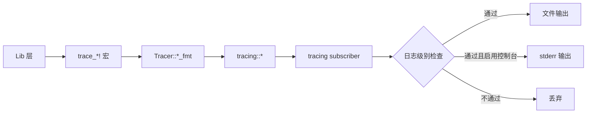
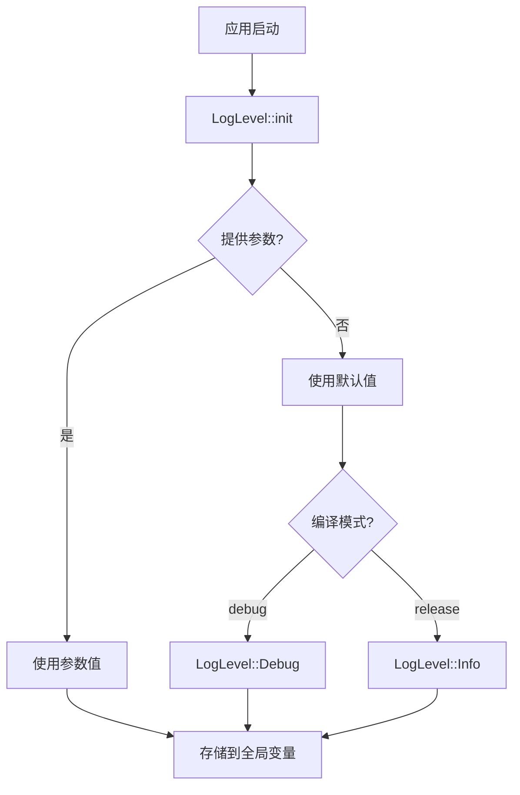

# Logger 模块架构文档

## 📋 概述

本文档描述 Workflow CLI 的 Logger 模块架构，包括：
- 日志级别管理（LogLevel）
- 用户友好的控制台输出（Logger，用于 Commands 层）
- 结构化日志记录（Tracer，用于 Lib 层）
- 颜色输出工具函数

该模块采用**分离的日志系统设计**，实现了职责分离：
- **Commands 层**：使用 `log_*!` 宏进行用户友好的控制台输出（带颜色、Emoji）
- **Lib 层**：使用 `trace_*!` 宏进行结构化日志记录（默认不输出，可配置启用）

**注意**：本模块是基础设施模块，被整个项目广泛使用。所有用户可见的输出都通过 `log_*!` 宏，所有内部调试日志都通过 `trace_*!` 宏。

**模块统计：**
- 总代码行数：约 848 行
- 文件数量：4 个核心文件
- 主要组件：3 个（LogLevel, Logger, Tracer）
- 日志宏：8 个（log_success!, log_error!, log_warning!, log_info!, log_debug!, log_message!, log_break!, trace_debug!, trace_info!, trace_warn!, trace_error!）

---

## 📁 模块结构

### 核心模块文件

```
src/lib/base/logger/
├── mod.rs          # 模块声明和导出 (16行)
├── log_level.rs    # 日志级别管理 (122行)
├── console.rs      # 用户友好的控制台输出 (421行)
└── tracing.rs      # 结构化日志记录封装 (289行)
```

### 依赖模块

- **`console` crate**：提供颜色和样式格式化功能
- **`tracing` crate**：提供结构化日志记录功能（tracing, tracing-subscriber）
- **`lib/base/settings/`**：配置管理（读取日志级别配置）
- **`lib/base/settings/paths/`**：路径管理（获取日志文件路径）
- **`chrono` crate**：日期时间处理（生成日志文件名）

### 模块集成

#### Commands 层使用

- **所有命令模块**：使用 `log_*!` 宏输出用户可见的消息
  - `log_success!()` - 成功消息（绿色 ✓）
  - `log_error!()` - 错误消息（红色 ✗）
  - `log_warning!()` - 警告消息（黄色 ⚠）
  - `log_info!()` - 信息消息（蓝色 ℹ）
  - `log_debug!()` - 调试消息（灰色 ⚙）
  - `log_message!()` - 说明信息（无图标，总是输出）
  - `log_break!()` - 分隔线或换行

#### Lib 层使用

- **所有业务逻辑模块**：使用 `trace_*!` 宏记录内部调试日志
  - `trace_debug!()` - 调试级别日志
  - `trace_info!()` - 信息级别日志
  - `trace_warn!()` - 警告级别日志
  - `trace_error!()` - 错误级别日志

#### 初始化

- **应用启动**：在 `src/bin/workflow.rs` 中初始化
  - `LogLevel::init()` - 初始化日志级别
  - `Tracer::init()` - 初始化 tracing subscriber

---

## 🏗️ 架构设计

### 设计原则

1. **职责分离**：
   - Commands 层使用 `log_*!` 宏进行用户友好的控制台输出
   - Lib 层使用 `trace_*!` 宏进行结构化日志记录（默认不输出）

2. **用户友好优先**：
   - 用户输出使用颜色、Emoji 图标，提供清晰的视觉反馈
   - 成功消息总是显示，不受日志级别限制

3. **可配置性**：
   - 日志级别可通过配置文件或环境变量控制
   - 调试日志默认关闭，可按需启用

4. **向后兼容**：
   - 保持现有 API 不变（705 处 `log_*!` 无需修改）
   - 用户输出格式保持不变

5. **可扩展性**：
   - 未来如需 Span 追踪，可逐步引入
   - 未来如需结构化日志，可添加 JSON formatter

### 核心组件

#### 1. LogLevel（日志级别管理）

**文件路径**：`src/lib/base/logger/log_level.rs`

**职责**：管理全局日志级别，提供级别判断和转换功能

**主要方法**：
- `default_level()` - 获取默认日志级别（根据编译模式自动决定）
- `init(level)` - 初始化日志级别（从参数或使用默认值）
- `set_level(level)` - 设置日志级别
- `get_level()` - 获取当前日志级别
- `as_str()` - 将 LogLevel 转换为字符串
- `should_log(level)` - 检查是否应该输出指定级别的日志

**关键特性**：
- 使用 `Mutex` 保证线程安全
- 根据编译模式自动选择默认级别（debug 模式使用 Debug，release 模式使用 Info）
- 支持从字符串解析（"off", "error", "warn", "info", "debug"）
- 实现 `PartialOrd` 和 `Ord`，支持级别比较

**使用场景**：
- 应用启动时初始化日志级别
- Logger 判断是否应该输出特定级别的日志
- 配置文件解析时转换字符串为 LogLevel

#### 2. Logger（用户友好的控制台输出）

**文件路径**：`src/lib/base/logger/console.rs`

**职责**：提供带颜色的日志输出功能，用于 Commands 层

**主要方法**：
- `print_success(message)` - 打印成功消息（总是输出）
- `print_error(message)` - 打印错误消息（日志级别 >= Error）
- `print_warning(message)` - 打印警告消息（日志级别 >= Warn）
- `print_info(message)` - 打印信息消息（日志级别 >= Info）
- `print_debug(message)` - 打印调试消息（日志级别 >= Debug）
- `print_message(message)` - 打印说明信息（总是输出）
- `print_separator(char, length)` - 打印分隔线
- `print_separator_with_text(char, length, text)` - 打印带文本的分隔线
- `print_newline()` - 打印换行符

**关键特性**：
- 使用 `console` crate 实现颜色和样式
- 支持多种日志级别样式（success, error, warning, info, debug）
- 使用 ASCII 字符作为图标（✓✗⚠ℹ⚙）
- 支持分隔线样式（separator, separator_with_text）
- 根据当前日志级别决定是否输出（success 和 message 除外）

**使用场景**：
- Commands 层输出命令执行结果
- 显示用户友好的错误、警告、信息消息
- 输出分隔线和格式化文本

#### 3. Tracer（结构化日志记录封装）

**文件路径**：`src/lib/base/logger/tracing.rs`

**职责**：提供对 tracing 库的封装，用于 Lib 层的结构化日志记录

**主要方法**：
- `init()` - 初始化 tracing subscriber（从配置读取日志级别）
- `debug(message)` - 记录调试级别日志
- `info(message)` - 记录信息级别日志
- `warn(message)` - 记录警告级别日志
- `error(message)` - 记录错误级别日志
- `debug_fmt(args)` - 记录带格式化的调试级别日志
- `info_fmt(args)` - 记录带格式化的信息级别日志
- `warn_fmt(args)` - 记录带格式化的警告级别日志
- `error_fmt(args)` - 记录带格式化的错误级别日志
- `get_log_file_path()` - 获取日志文件路径（私有方法）

**关键特性**：
- 封装 tracing crate，提供统一的接口
- 默认情况下不输出到控制台（通过配置控制）
- 支持输出到文件（`~/.workflow/logs/tracing/workflow-YYYY-MM-DD.log`）
- 支持同时输出到文件和控制台（通过 `enable_trace_console` 配置）
- 如果日志级别为 "off"，输出到 sink（/dev/null）
- 日志文件按日期分割，便于管理

**使用场景**：
- Lib 层记录内部调试信息
- 记录函数调用流程
- 记录错误和异常信息
- 性能分析和问题排查

### 设计模式

#### 1. 职责分离模式

**模式说明**：
- Commands 层和 Lib 层使用不同的日志系统
- Commands 层关注用户友好性（颜色、图标、格式化）
- Lib 层关注结构化记录（可配置、可分析）

**优势**：
- 清晰的职责划分，易于理解和维护
- 用户输出和调试日志互不干扰
- 可以独立优化和扩展

#### 2. 封装模式

**模式说明**：
- Tracer 封装 tracing crate，提供统一接口
- 如果未来需要替换日志库，只需要修改 Tracer 实现

**优势**：
- 降低耦合度，提高可维护性
- 便于未来替换或升级日志库
- 统一的 API，使用简单

#### 3. 单例模式

**模式说明**：
- LogLevel 使用全局静态变量（Mutex 保护）存储当前级别
- 所有组件共享同一个日志级别配置

**优势**：
- 全局统一的日志级别控制
- 线程安全（使用 Mutex）
- 配置简单，无需传递参数

### 设计决策

#### 为什么采用分离的日志系统？

本模块采用**分离的日志系统设计**（Commands 层使用 `log_*!`，Lib 层使用 `trace_*!`），而不是统一使用 tracing。以下是决策原因和对比分析：

**采用当前设计的原因**：

1. ✅ **满足需求**：满足所有核心功能需求
   - 用户友好的输出：`log_*!` 宏（带颜色、Emoji）
   - 调试日志记录：`trace_*!` 宏（tracing 封装）
   - 输出分离：默认关闭，可配置启用
   - 日志级别控制：`LogLevel` 枚举

2. ✅ **实现简单**：代码量适中（约 848 行），逻辑清晰，易于维护
   - 使用日志宏（`log_*!`）和 tracing 封装
   - 职责分离，易于理解
   - 无需自定义 formatter

3. ✅ **向后兼容**：无需修改 Commands 层代码（705 处 `log_*!` 保持不变）
   - 用户输出格式保持不变
   - 迁移成本低

4. ✅ **可扩展**：未来可以逐步添加高级功能
   - 未来如需 Span 追踪，可逐步引入
   - 未来如需结构化日志，可添加 JSON formatter
   - 当前设计不阻碍未来扩展

5. ✅ **成本效益**：在简单性和功能性之间取得良好平衡

**与统一使用 tracing 的对比**：

| 方面 | 当前设计 | 统一使用 tracing |
|------|---------|-----------------|
| **实现复杂度** | ✅ 简单 | ⚠️ 中等偏高 |
| **维护成本** | ✅ 低 | ⚠️ 中等 |
| **用户输出** | ✅ 支持（带颜色） | ⚠️ 需自定义 formatter |
| **调试日志** | ✅ 支持（可配置） | ✅ 支持（更灵活） |
| **Span 追踪** | ❌ 不支持 | ✅ 支持 |
| **结构化日志** | ❌ 不支持 | ✅ 支持 |
| **性能分析** | ❌ 不支持 | ✅ 支持 |
| **代码量** | ✅ ~848 行 | ⚠️ ~800-1000 行 |

**结论**：当前设计在实现简单性和功能需求之间取得了良好平衡。虽然统一使用 tracing 可以提供更强大的功能（Span 追踪、结构化日志），但需要更高的实现复杂度和维护成本，且当前这些功能不是必需功能。

#### 已知限制

1. **不支持 Span 追踪**
   - **影响**：无法自动追踪函数调用链，无法自动记录函数耗时
   - **解决方案**：如需性能分析，可手动添加时间戳，或使用专门的性能分析工具

2. **不支持结构化日志**
   - **影响**：无法输出 JSON 格式日志，无法使用日志聚合工具
   - **解决方案**：如需结构化日志，可添加 JSON formatter，或使用日志分析工具解析文本日志

3. **输出分离需要手动处理**
   - **影响**：启用调试时，tracing 输出到 stderr，需要用户手动重定向或配置
   - **解决方案**：文档说明如何分离输出，提供最佳实践指南

#### 未来扩展方向

1. **可选：添加 Span 追踪**
   - 如果未来需要性能分析，可以在关键函数中添加 Span
   - 使用 tracing 的 span 功能
   - 保持与当前设计的兼容性

2. **可选：添加结构化日志**
   - 如果未来需要日志聚合，可以添加 JSON formatter
   - 输出到文件，不影响用户输出

3. **可选：统一使用 tracing**
   - 如果未来需要更强大的功能，可以逐步迁移到统一使用 tracing
   - 实现自定义 formatter
   - 保持 API 兼容性

### 错误处理

#### 分层错误处理

1. **配置读取错误**：
   - 如果配置文件不存在或字段缺失，使用默认值（LogLevel::None）
   - 如果日志文件创建失败，回退到 stderr 输出

2. **日志输出错误**：
   - 文件写入错误：回退到 stderr
   - 控制台输出错误：忽略（不影响程序运行）

#### 容错机制

- **场景1**：日志文件创建失败
  - 处理方式：回退到 stderr 输出，不中断程序运行

- **场景2**：配置文件解析失败
  - 处理方式：使用默认日志级别（LogLevel::None），不输出调试日志

- **场景3**：日志级别未初始化
  - 处理方式：自动使用默认级别（根据编译模式决定）

---

## 🔄 调用流程与数据流

### 整体架构流程

```
应用启动
  ↓
LogLevel::init() - 初始化日志级别
  ↓
Tracer::init() - 初始化 tracing subscriber
  ↓
应用运行
  ├─ Commands 层
  │   └─ log_*! 宏 → Logger::print_*() → 控制台输出（带颜色）
  └─ Lib 层
      └─ trace_*! 宏 → Tracer::*_fmt() → tracing → 文件/控制台（可配置）
```

### 典型调用示例

#### 1. Commands 层输出成功消息

```
用户执行命令
  ↓
log_success!("Operation completed")
  ↓
Logger::print_success("Operation completed")
  ↓
success("Operation completed") - 格式化（添加绿色和 ✓ 图标）
  ↓
log_success!("Operation completed") - 输出到控制台（通过日志系统）
```

#### 2. Lib 层记录调试日志

```
Lib 层函数执行
  ↓
trace_debug!("Processing data: {}", data)
  ↓
Tracer::debug_fmt(format_args!("Processing data: {}", data))
  ↓
tracing::debug!("Processing data: {}", data)
  ↓
tracing subscriber 处理
  ├─ 检查日志级别（如果 >= Debug）
  ├─ 输出到文件（~/.workflow/logs/tracing/workflow-YYYY-MM-DD.log）
  └─ 如果启用控制台输出，同时输出到 stderr
```

#### 3. 日志级别控制流程

```
Logger::print_info("message")
  ↓
LogLevel::current() - 获取当前日志级别
  ↓
current_level.should_log(LogLevel::Info) - 检查是否应该输出
  ↓
如果 true：格式化并输出
如果 false：不输出
```

### 数据流

#### 用户输出数据流


#### 调试日志数据流



#### 日志级别初始化流程



---

## 📋 使用示例

### 基本使用

#### Commands 层使用

```rust
use workflow::log_success;
use workflow::log_error;
use workflow::log_info;
use workflow::log_break;

// 输出成功消息（总是显示）
log_success!("Operation completed");

// 输出错误消息（日志级别 >= Error）
log_error!("Operation failed: {}", error);

// 输出信息消息（日志级别 >= Info）
log_info!("Processing {} items", count);

// 输出分隔线
log_break!('-', 80);

// 输出带文本的分隔线
log_break!('=', 80, "Section Title");
```

#### Lib 层使用

```rust
use workflow::trace_debug;
use workflow::trace_info;
use workflow::trace_warn;
use workflow::trace_error;

// 记录调试日志（默认不输出，可通过配置启用）
trace_debug!("Processing data: {}", data);

// 记录信息日志
trace_info!("Starting download");

// 记录警告日志
trace_warn!("Retrying operation");

// 记录错误日志
trace_error!("Operation failed: {}", error);
```

### 初始化使用

```rust
use workflow::LogLevel;
use workflow::Tracer;

// 初始化日志级别（从配置文件读取或使用默认值）
LogLevel::init(None);

// 或指定日志级别
LogLevel::init(Some(LogLevel::Debug));

// 初始化 tracing subscriber（从配置文件读取日志级别）
Tracer::init();
```

### 配置使用

#### 配置文件（~/.workflow/config/workflow.toml）

```toml
[log]
level = "debug"  # none, error, warn, info, debug
enable_trace_console = false  # 是否同时输出到控制台
```

#### 环境变量

```bash
# 启用 tracing 输出到控制台
RUST_LOG=lib=debug workflow config
```

---

## 📝 扩展性

### 添加新的日志级别

1. 在 `LogLevel` 枚举中添加新级别
2. 在 `FromStr` 实现中添加字符串解析
3. 在 `as_str` 方法中添加字符串转换
4. 在 `should_log` 方法中确保级别比较正确
5. 添加对应的日志宏（如果需要）

**示例**：
```rust
// 在 log_level.rs 中添加
pub enum LogLevel {
    // ... 现有级别
    Trace = 5,  // 新增级别
}

// 在 FromStr 实现中添加
"trace" => Ok(LogLevel::Trace),

// 在 as_str 方法中添加
LogLevel::Trace => "trace",
```

### 添加新的日志宏

1. 在 `console.rs` 中添加格式化函数（如果需要）
2. 在 `Logger` 中添加打印方法
3. 添加对应的宏定义（使用 `#[macro_export]`）

**示例**：
```rust
// 在 console.rs 中添加
pub fn trace(text: impl fmt::Display) -> String {
    style(format!("→ {}", text)).cyan().to_string()
}

impl Logger {
    pub fn print_trace(message: impl fmt::Display) {
        let current_level = LogLevel::current();
        if current_level.should_log(LogLevel::Trace) {
            log_message!("{}", trace(message));
        }
    }
}

// 添加宏
#[macro_export]
macro_rules! log_trace {
    ($($arg:tt)*) => {
        $crate::Logger::print_trace(format!($($arg)*));
    };
}
```

### 添加新的输出目标

1. 在 `Tracer::init()` 中添加新的 layer
2. 支持输出到其他目标（如网络、数据库等）

**示例**：
```rust
// 在 tracing.rs 中添加
if enable_network {
    let network_layer = tracing_subscriber::fmt::layer()
        .with_writer(network_writer);
    registry = registry.with(network_layer);
}
```

### 添加结构化日志支持

1. 添加 JSON formatter
2. 配置 tracing subscriber 使用 JSON 格式
3. 保持与现有 API 的兼容性

**示例**：
```rust
use tracing_subscriber::fmt::format::JsonFields;

let json_layer = tracing_subscriber::fmt::layer()
    .json()
    .with_writer(file);
```

---

## 📚 相关文档

- [主架构文档](../ARCHITECTURE.md) - 总体架构设计文档
- [LOG 命令架构文档](../commands/LOG_COMMAND_ARCHITECTURE.md) - 日志命令模块架构文档
- [Settings 模块架构文档](./SETTINGS_ARCHITECTURE.md) - 配置管理模块（日志配置相关）

---

## ✅ 总结

Logger 模块采用清晰的**职责分离**设计：

1. **双系统架构**：Commands 层使用 `log_*!` 宏，Lib 层使用 `trace_*!` 宏
2. **用户友好优先**：用户输出使用颜色、图标，提供清晰的视觉反馈
3. **可配置性**：日志级别可通过配置文件或环境变量控制
4. **向后兼容**：保持现有 API 不变，迁移成本低
5. **可扩展性**：未来可以逐步添加高级功能（Span 追踪、结构化日志等）

**设计优势**：
- ✅ **职责清晰**：用户输出和调试日志分离，互不干扰
- ✅ **实现简单**：代码量适中（约 848 行），逻辑清晰，易于维护
- ✅ **向后兼容**：无需修改现有代码（705 处 `log_*!` 保持不变）
- ✅ **可扩展**：未来可以逐步添加高级功能，不阻碍扩展
- ✅ **成本效益**：在简单性和功能性之间取得良好平衡

**当前实现状态**：
- ✅ 日志级别管理已实现
- ✅ 用户友好的控制台输出已实现
- ✅ 结构化日志记录已实现
- ✅ 配置文件支持已实现
- ⚠️ Span 追踪暂不支持（未来可扩展）
- ⚠️ 结构化日志（JSON）暂不支持（未来可扩展）

**配置说明**：
- 日志级别通过 `~/.workflow/config/workflow.toml` 配置文件中的 `log.level` 字段控制
- 调试日志默认输出到文件（`~/.workflow/logs/tracing/workflow-YYYY-MM-DD.log`）
- 可通过 `log.enable_trace_console` 配置同时输出到控制台
- 日志文件按日期分割，便于管理和分析
