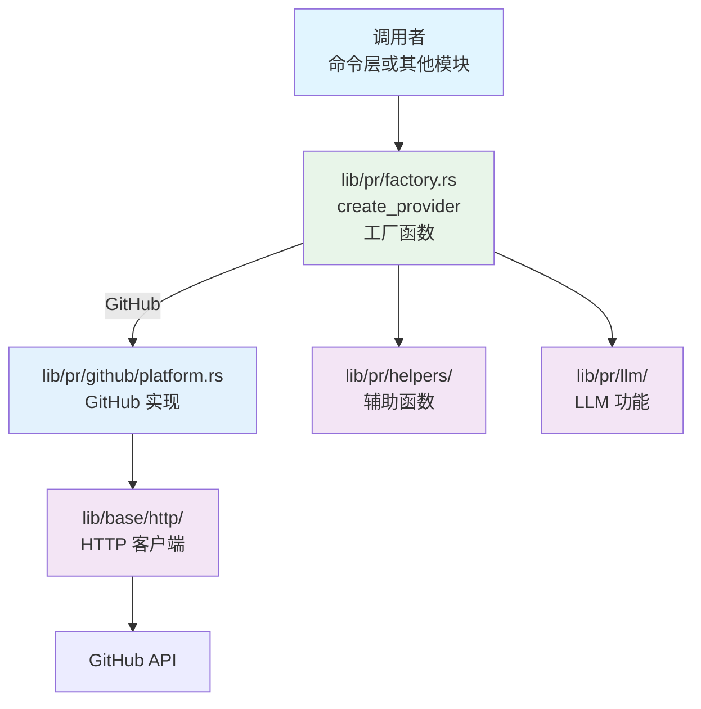
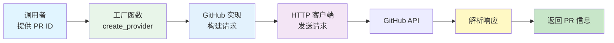

# PR 模块架构文档

## 📋 概述

PR 模块（`lib/pr/`）是 Workflow CLI 的核心库模块，提供 Pull Request 的平台抽象层。目前支持 GitHub 平台，通过 `PlatformProvider` trait 实现统一的平台接口，使用工厂函数实现多态分发。该模块专注于平台 API 的抽象和调用，不涉及命令层的业务逻辑。

**注意**：本文档仅描述 `lib/pr/` 模块的架构。关于 PR 命令层的详细内容，请参考 [PR 命令模块架构文档](../commands/PR_COMMAND_ARCHITECTURE.md)。

**模块统计：**
- 总代码行数：约 3000+ 行
- 文件数量：20+ 个
- 支持平台：GitHub
- 主要结构体：`PlatformProvider` trait、`GitHub`、`CreateGenerator`、`RewordGenerator`、`SummaryGenerator`、`SourcePrInfo`、`ExtractedPrInfo`

---

## 📁 模块结构

```
src/lib/pr/
├── mod.rs              # PR 模块声明和导出
├── platform.rs         # PlatformProvider trait 定义
├── factory.rs          # 平台工厂函数（create_provider）
├── body_parser.rs      # PR Body 解析器（提取 Jira ticket、描述、变更类型等）
├── table.rs            # PR 表格显示结构体
│
├── github/             # GitHub 平台实现
│   ├── mod.rs          # GitHub 模块导出
│   ├── platform.rs     # GitHub 平台实现
│   ├── requests.rs     # GitHub API 请求结构体
│   ├── responses.rs    # GitHub API 响应结构体
│   └── errors.rs       # GitHub 错误处理
│
├── llm/                # LLM 内容生成
│   ├── mod.rs          # LLM 模块导出
│   ├── create.rs       # PR 创建内容生成
│   ├── reword.rs       # PR 标题和描述重写
│   ├── summary.rs      # PR 总结生成
│   ├── file_summary.rs # 单文件总结生成
│   └── helpers.rs      # LLM 辅助函数
│
└── helpers/            # PR 辅助函数（已拆分）
    ├── mod.rs
    ├── pr_id.rs        # PR ID 相关
    ├── repo.rs         # 仓库信息相关
    └── content.rs      # 内容生成相关
```

### 依赖模块

- **`lib/git/`**：Git 操作（检测仓库类型，用于工厂函数自动选择平台）
- **`lib/base/llm/`**：AI 功能（PR 标题生成，通过 `llm.rs` 模块封装）
- **`lib/base/http/`**：HTTP 客户端（API 请求）
- **`lib/base/settings/`**：配置管理（环境变量读取，如 `GITHUB_TOKEN` 等）

**注意**：PR 模块不直接依赖 Jira、Git 分支操作、工具函数等模块，这些集成由命令层（`commands/pr/`）负责协调。

---

## 🏗️ 架构设计

### 设计原则

1. **平台抽象**：通过 `PlatformProvider` trait 实现统一的平台接口
2. **多态分发**：使用工厂函数 `create_provider()` 实现动态分发
3. **模块化设计**：按平台拆分模块，职责清晰
4. **统一错误处理**：平台特定错误处理统一封装
5. **代码复用**：请求/响应结构体分离，便于维护

### 核心组件

#### 1. 平台抽象层 (`platform.rs`)

**职责**：定义统一的 PR 平台接口和工厂函数

- **`PlatformProvider` trait**：定义所有平台必须实现的 12 个方法
  - `create_pull_request()` - 创建 PR
  - `merge_pull_request()` - 合并 PR
  - `get_pull_request_info()` - 获取 PR 信息
  - `get_pull_request_url()` - 获取 PR URL
  - `get_pull_request_title()` - 获取 PR 标题
  - `get_current_branch_pull_request()` - 获取当前分支的 PR ID
  - `get_pull_requests()` - 列出 PR（可选）
  - `get_pull_request_status()` - 获取 PR 状态
  - `close_pull_request()` - 关闭 PR
  - `add_comment()` - 添加 PR 评论
  - `approve_pull_request()` - 批准 PR
  - `update_pr_base()` - 更新 PR 的 base 分支

- **`create_provider()` 工厂函数**（位于 `factory.rs`）：
  - 自动检测仓库类型（GitHub）
  - 返回 `Box<dyn PlatformProvider>` trait 对象
  - 实现真正的多态分发

- **`PullRequestStatus` 结构体**：PR 状态信息（state, merged, merged_at）

- **`TYPES_OF_CHANGES` 常量**：PR 变更类型定义

#### 2. GitHub 平台实现 (`github/`)

**职责**：GitHub REST API v3 的完整实现

- **`platform.rs`**：实现 `PlatformProvider` trait
- **`requests.rs`**：GitHub API 请求结构体
- **`responses.rs`**：GitHub API 响应结构体
- **`errors.rs`**：GitHub 特定错误处理

**关键特性**：
- 使用 GitHub REST API v3
- 需要 `GITHUB_TOKEN` 环境变量
- 支持所有 trait 方法

#### 3. 工厂函数层 (`factory.rs`)

**职责**：提供平台工厂函数，实现平台实例的创建

- **`create_provider()`**：根据仓库类型创建对应的平台提供者
- 自动检测仓库类型（通过 `GitRepo::detect_repo_type()`）
- 目前仅支持 GitHub 平台

#### 4. LLM 功能层 (`llm/`)

**职责**：提供使用 LLM 生成 PR 内容的功能

- **`CreateGenerator`**：PR 创建内容生成（分支名、标题、描述）
- **`RewordGenerator`**：PR 标题和描述重写（基于 PR diff）
- **`SummaryGenerator`**：PR 总结生成（详细的总结文档）
- **`FileSummaryGenerator`**：单文件修改总结生成

**关键特性**：
- 统一的 Generator 模式（struct + impl）
- 支持 diff 长度限制，避免超过 LLM token 限制
- 使用 `lib/base/llm/` 模块进行 LLM 调用

#### 5. 辅助函数层 (`helpers/`)

**职责**：提供 PR 相关的通用辅助函数

**主要函数**：
- `pr_id.rs`：PR ID 相关函数
  - `extract_pull_request_id_from_url()` - 从 URL 提取 PR ID
- `repo.rs`：仓库信息相关函数
  - `extract_github_repo_from_url()` - 从 URL 提取 GitHub 仓库信息
- `content.rs`：内容生成相关函数
  - `generate_commit_title()` - 生成 commit 标题
  - `generate_pull_request_body()` - 生成 PR body
- `mod.rs`：公共函数
  - `get_current_branch_pr_id()` - 获取当前分支的 PR ID
  - `detect_repo_type()` - 检测仓库类型（向后兼容）

#### 6. PR Body 解析器 (`body_parser.rs`)

**职责**：从 PR body 中提取信息的纯函数，无用户交互

**主要函数**：
- `extract_info_from_source_pr()` - 从源 PR 提取所有信息（Jira ticket、描述、变更类型）
- `extract_jira_ticket_from_body()` - 从 PR body 提取 Jira ticket ID
- `extract_description_from_body()` - 从 PR body 提取描述
- `parse_change_types_from_body()` - 从 PR body 解析变更类型

**数据结构**：
- `SourcePrInfo` - 源 PR 信息（标题、URL、body）
- `ExtractedPrInfo` - 提取的信息（Jira ticket、描述、变更类型）

**使用场景**：
- `pr pick` 命令：从源 PR 提取信息用于创建新 PR
- 可被其他命令复用（如 sync、rebase 等）

#### 7. PR 表格显示 (`table.rs`)

**职责**：提供统一的 PR 列表表格行结构，用于表格格式显示

**核心组件**：

#### PullRequestRow 结构体

```rust
#[derive(Tabled)]
pub struct PullRequestRow {
    #[tabled(rename = "#")]
    pub number: String,
    #[tabled(rename = "State")]
    pub state: String,
    #[tabled(rename = "Branch")]
    pub branch: String,
    #[tabled(rename = "Title")]
    pub title: String,
    #[tabled(rename = "Author")]
    pub author: String,
    #[tabled(rename = "URL")]
    pub url: String,
}
```

**特性**：
- 使用 `tabled` crate 的 `Tabled` trait
- 自动格式化表格列
- 支持自定义列名（通过 `#[tabled(rename = "...")]`）

**使用场景**：
- `pr list` 命令：使用 `TableBuilder` 和 `PullRequestRow` 显示 PR 列表
- 统一的表格格式，提供一致的用户体验

---

## 🔄 调用流程

### 整体架构流程

```
调用者（命令层或其他模块）
  ↓
lib/pr/factory.rs (工厂函数 create_provider())
  ↓
lib/pr/github/platform.rs (GitHub 平台实现)
  ↓
lib/base/http/ (HTTP 客户端)
  ↓
GitHub API
```

#### 架构流程图



### 典型调用示例

#### 1. 创建 PR

```rust
use workflow::pr::create_provider;

let provider = create_provider()?;

// 创建 PR
let pr_url = provider.create_pull_request(
    "Fix bug in login",
    "This PR fixes a bug in the login functionality",
    "feature/fix-login",
    None,
)?;
```

#### 2. 合并 PR

```rust
use workflow::pr::create_provider;

let provider = create_provider()?;

// 检查 PR 状态
let status = provider.get_pull_request_status("123")?;
if !status.merged {
    // 合并 PR
    provider.merge_pull_request("123", true)?;
}
```

#### 3. 获取 PR 信息

```rust
use workflow::pr::create_provider;

let provider = create_provider()?;

// 获取当前分支的 PR ID
if let Some(pr_id) = provider.get_current_branch_pull_request()? {
    // 获取 PR 详细信息
    let info = provider.get_pull_request_info(&pr_id)?;
    log_message!("PR URL: {}", info.url);
}
```

#### 4. 更新 PR base 分支

```rust
use workflow::pr::create_provider;

let provider = create_provider()?;

// 更新 PR 的 base 分支
provider.update_pr_base("123", "master")?;
```

### 数据流

#### 创建 PR 数据流


### 获取 PR 信息数据流



---

## 📝 扩展性

### 添加新平台

1. 在 `lib/pr/` 下创建新的平台目录（如 `gitlab/`）
2. 创建以下文件：
   - `mod.rs` - 模块导出
   - `platform.rs` - 实现 `PlatformProvider` trait
   - `requests.rs` - API 请求结构体
   - `responses.rs` - API 响应结构体
   - `errors.rs` - 错误处理
3. 在 `lib/pr/platform.rs` 的 `create_provider()` 函数中添加新平台的分支
4. 在 `lib/git/repo.rs` 中添加仓库类型检测逻辑
5. 在 `lib/pr/mod.rs` 中导出新平台

**示例**：
```rust
// lib/pr/factory.rs
pub fn create_provider() -> Result<Box<dyn PlatformProvider>> {
    match GitRepo::detect_repo_type()? {
        RepoType::GitHub => Ok(Box::new(GitHub)),
        RepoType::GitLab => Ok(Box::new(GitLab)),  // 新增
        RepoType::Unknown => anyhow::bail!("Unsupported repository type"),
    }
}
```

### 添加新的辅助函数

1. 在 `lib/pr/helpers.rs` 中添加新函数
2. 在 `lib/pr/mod.rs` 中导出（如需要）
3. 更新文档

---

## 📚 相关文档

- [主架构文档](../ARCHITECTURE.md)
- [PR 命令模块架构文档](../commands/PR_COMMAND_ARCHITECTURE.md) - PR 命令层详情
- [Jira 模块架构文档](./JIRA_ARCHITECTURE.md) - Jira 集成详情
- [Git 模块架构文档](./GIT_ARCHITECTURE.md) - Git 操作详情
- [LLM 模块架构文档](./LLM_ARCHITECTURE.md) - AI 功能详情

---

## 📋 使用示例

### 基本使用

```rust
use workflow::pr::create_provider;

// 创建平台提供者（自动检测仓库类型）
let provider = create_provider()?;

// 创建 PR
let pr_url = provider.create_pull_request(
    "Fix bug in login",
    "This PR fixes a bug in the login functionality",
    "feature/fix-login",
    None,
)?;

// 获取 PR 信息
let info = provider.get_pull_request_info("123")?;

// 合并 PR
provider.merge_pull_request("123", true)?;

// 关闭 PR
provider.close_pull_request("123")?;

// 添加评论
provider.add_comment("123", "Looks good!")?;

// 批准 PR
provider.approve_pull_request("123")?;
```

### 获取当前分支的 PR

```rust
use workflow::pr::create_provider;

let provider = create_provider()?;

// 获取当前分支的 PR ID
if let Some(pr_id) = provider.get_current_branch_pull_request()? {
    log_message!("Current branch has PR: {}", pr_id);

    // 获取 PR 状态
    let status = provider.get_pull_request_status(&pr_id)?;
    log_message!("PR status: {}, merged: {}", status.state, status.merged);
}
```

### 列出 PR

```rust
use workflow::pr::create_provider;

let provider = create_provider()?;

// 列出所有打开的 PR
let prs = provider.get_pull_requests(Some("open"), Some(10))?;
log_message!("{}", prs);
```

### 使用辅助函数

```rust
use workflow::pr::helpers::{
    generate_commit_title,
    generate_pull_request_body,
};

// 生成 commit 标题
let commit_title = generate_commit_title("PROJ-123", "Add new feature", false)?;

// 生成 PR body
let pr_body = generate_pull_request_body(
    "This is a new feature",
    &["New feature (non-breaking change which adds functionality)"],
    Some("PROJ-123"),
    None,
)?;
```

### 使用表格显示 PR 列表

```rust
use workflow::pr::table::PullRequestRow;
use workflow::base::table::{TableBuilder, TableStyle};

// 构建 PR 行数据
let pr_rows = vec![
    PullRequestRow {
        number: "123".to_string(),
        state: "open".to_string(),
        branch: "feature/new".to_string(),
        title: "Add new feature".to_string(),
        author: "alice".to_string(),
        url: "https://github.com/...".to_string(),
    },
    // ...
];

// 使用 TableBuilder 显示
let output = TableBuilder::new(pr_rows)
    .with_title("Pull Requests")
    .with_style(TableStyle::Modern)
    .render();
log_message!("{}", output);
```

### 使用 LLM 生成 PR 内容

```rust
use workflow::pr::llm::CreateGenerator;

// 生成 PR 内容（分支名、标题、描述）
let content = CreateGenerator::generate(
    "Add user authentication",
    Some(vec!["feature-login".to_string()]),
    Some(git_diff),
)?;

log_message!("Branch: {}", content.branch_name);
log_message!("Title: {}", content.pr_title);
log_message!("Description: {:?}", content.description);
```

---

## ✅ 总结

PR 模块采用清晰的分层架构设计：

1. **平台抽象层**：`PlatformProvider` trait 定义统一的平台接口
2. **工厂函数层**：`create_provider()` 实现多态分发，自动检测仓库类型
3. **平台实现层**：GitHub 实现 trait，模块化组织
4. **LLM 功能层**：提供 PR 内容的 AI 生成功能（创建、重写、总结）
5. **辅助函数层**：提供通用的 PR 相关辅助函数（已按功能拆分）

**设计优势**：
- ✅ **多态支持**：通过 trait 对象实现真正的多态
- ✅ **代码复用**：消除调用层的重复代码
- ✅ **易于扩展**：添加新平台只需实现 trait
- ✅ **模块化**：按平台拆分，职责清晰
- ✅ **类型安全**：使用 trait 和类型系统保证类型安全
- ✅ **平台无关**：调用者无需关心具体平台实现

通过平台抽象和工厂模式，实现了代码复用、易于维护和扩展的目标。命令层（`commands/pr/`）使用本模块提供的接口，实现了完整的 PR 生命周期管理功能。

---

**最后更新**: 2025-12-16
