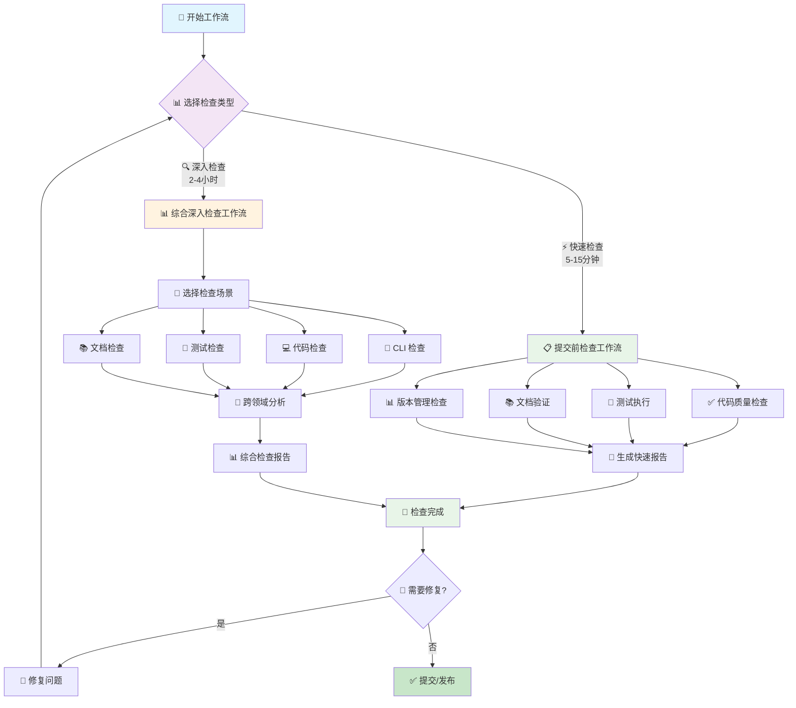

# 开发工作流

> 🤖 **AI 工作流文档**：本文档是专为 AI 助手设计的开发工作流指南，提供标准化的开发流程和检查流程，帮助 AI 助手按照项目规范完成开发任务。
>
> 📋 **文档说明**：本文档是 Workflow CLI 项目开发工作流的索引和总览，提供具体的开发流程指南和检查流程指南。

---

## 📋 目录

- [概述](#-概述)
- [开发工作流列表](#-开发工作流列表)
- [检查工作流列表](#-检查工作流列表)
- [使用指南](#-使用指南)
- [相关文档](#-相关文档)
- [贡献指南](#-贡献指南)

---

## 📋 概述

> 🤖 **AI 工作流文档说明**：本目录下的所有文档都是专为 AI 助手设计的工作流指南，提供标准化的开发流程和检查流程，帮助 AI 助手按照项目规范完成开发任务和代码检查。

工作流提供具体的开发流程指南和检查流程指南，帮助开发者和 AI 助手按照标准流程完成开发任务和代码检查。

### 🎯 设计目标

- **标准化流程**：为开发者和 AI 助手提供统一的工作标准和检查流程
- **AI 友好**：专为 AI 助手设计，提供结构化的流程和检查清单
- **提升效率**：通过快速参考和一键命令提升开发效率
- **保证质量**：系统化的检查确保代码、测试、文档的高质量
- **易于使用**：分层设计，从快速检查到深入分析的渐进式体验

### 工作流类型

**开发工作流**（如何开发）：
- **新功能开发**：从需求分析到功能实现的完整流程
- **重构**：代码重构的标准流程
- **添加依赖**：添加新依赖的流程和注意事项
- **添加模块**：添加新模块的流程
- **Bug 修复**：Bug 修复的标准流程

**检查工作流**（如何检查）：
- **提交前检查**：日常提交前的快速验证（5-15分钟）
- **综合深入检查**：功能完成后、定期审查的深入检查（2-4小时）

### 🔄 检查工作流程图



---

## 开发工作流列表

### 新功能开发流程

**文档**：[新功能开发流程](./new-feature.md)

**流程概述**：
1. 需求分析
2. 实现核心业务逻辑（lib/）
3. 添加 CLI 命令封装（commands/）
4. 注册命令（main.rs）
5. 添加测试
6. 更新文档

**时间投入**：2-8小时

### 重构流程

**文档**：[重构流程](./refactoring.md)

**流程概述**：
1. 分析重构范围
2. 制定重构计划
3. 执行重构
4. 更新测试
5. 更新文档

**时间投入**：2-8小时

### 添加依赖流程

**文档**：[添加依赖流程](./add-dependency.md)

**流程概述**：
1. 评估依赖必要性
2. 检查依赖安全漏洞（`cargo audit`）
3. 添加依赖（`cargo add`）
4. 更新文档
5. 运行测试

**时间投入**：5-30分钟

### 添加模块流程

**文档**：[添加模块流程](./add-module.md)

**流程概述**：
1. 确定模块位置（commands/ 或 lib/）
2. 创建模块文件
3. 实现模块功能
4. 添加测试
5. 更新文档

**时间投入**：30分钟-2小时

### Bug 修复流程

**文档**：[Bug 修复流程](./bug-fix.md)

**流程概述**：
1. 复现 Bug
2. 定位问题
3. 修复 Bug
4. 添加测试
5. 更新文档

**时间投入**：30分钟-4小时

---

## 检查工作流列表

### ⚡ 提交前检查工作流（5-15分钟）

**文档**：[pre-commit.md](./pre-commit.md)

**使用场景**：日常开发，代码提交前的快速验证

**核心功能**：
- 🔥 一键检查命令
- ✅ 代码质量验证
- 🧪 测试执行
- 📊 版本管理检查
- 📚 文档更新验证

**时间投入**：5-15分钟

### 🔍 综合深入检查工作流（2-4小时）

**文档**：[review.md](./review.md)

**使用场景**：功能完成后、定期审查、重大重构前、发布前

**核心功能**：
- 🎯 多场景检查选择
- 🔧 专门检查指南集成
- 🔗 跨领域问题分析
- 📄 综合检查报告生成
- 📅 定期审查工作流

**时间投入**：2-4小时

---

## 🎯 使用指南

### 📊 选择合适的工作流

| 场景 | 推荐工作流 | 时间投入 | 使用频率 |
|------|------------|----------|----------|
| 🚀 **日常提交** | 提交前检查 | 5-15分钟 | 每次提交前 |
| 🎉 **功能完成** | 综合深入检查 | 1-2小时 | 功能完成后 |
| 📅 **定期审查** | 综合深入检查 | 2-4小时 | 每周/月 |
| 🔧 **重构前** | 综合深入检查 | 2-4小时 | 重大重构前 |
| 🎁 **发布前** | 综合深入检查 | 2-4小时 | 每次发布前 |

### 📈 工作流进度示例

#### ⚡ 提交前检查进度 (5-15分钟)

```
🚀 提交前检查进度: ████████████████████ 100%

✅ 代码质量    ████████████████████ 100% (2分钟)
✅ 测试执行    ████████████████████ 100% (5分钟)
✅ CLI补全     ████████████████████ 100% (1分钟)
✅ 编译验证    ████████████████████ 100% (1分钟)
✅ 版本检查    ████████████████████ 100% (1分钟)

🎉 检查完成! 总用时: 10分钟 | 状态: 全部通过 ✅
```

#### 🔍 综合深入检查进度 (2-4小时)

```
🔍 综合检查进度: ██████████████░░░░░░ 70% (预计剩余: 45分钟)

✅ 准备环境    ████████████████████ 100% (5分钟)
✅ CLI检查     ████████████████████ 100% (30分钟)
✅ 代码检查    ████████████████████ 100% (90分钟)
🔄 测试检查    ████████████░░░░░░░░  60% (30/50分钟)
⏳ 文档检查    ░░░░░░░░░░░░░░░░░░░░   0% (等待中)
⏳ 跨领域分析  ░░░░░░░░░░░░░░░░░░░░   0% (等待中)
⏳ 报告生成    ░░░░░░░░░░░░░░░░░░░░   0% (等待中)

📊 当前发现: P0问题(0个) P1问题(2个) P2问题(5个)
```

### 🚀 快速开始

#### 1️⃣ 新手入门

```markdown
1. 阅读 [快速参考指南](../references/quick-reference.md)（1分钟）
2. 尝试 [提交前检查](./pre-commit.md)（5-15分钟）
3. 熟悉后进行 [综合深入检查](./review.md)（2-4小时）
```

#### 2️⃣ 日常使用

```markdown
1. 提交前：运行提交前检查工作流
2. 功能完成：运行综合深入检查工作流
3. 遇到问题：查阅对应的专门检查指南
```

#### 3️⃣ 团队协作

```markdown
1. 统一使用相同的工作流标准
2. 参考样式规范编写文档
3. 定期进行团队检查和审查
```

---

## 📚 相关文档

### 开发规范

- [开发规范索引](../README.md) - 开发规范总览
- [代码风格规范](../code-style.md) - 代码风格规范
- [错误处理规范](../error-handling.md) - 错误处理规范
- [模块组织规范](../module-organization.md) - 模块组织规范

### 检查参考文档

> 检查参考文档位于 [`references/`](../references/) 目录下

#### 🚀 快速参考

**文档**：[quick-reference.md](../references/quick-reference.md)

**核心价值**：1分钟快速查找所有关键信息

**包含内容**：
- 检查类型选择对照表
- 核心检查命令汇总
- 问题优先级速览
- 报告文件位置规范
- 故障排除快速指南

#### 📝 样式规范

**文档**：[style.md](../references/style.md)

**核心价值**：统一文档格式和术语标准

**包含内容**：
- 术语规范（检查类型、优先级、状态）
- 视觉元素规范（图标、标题、代码块、表格）
- 检查清单格式和链接格式
- 信息框和文档结构模板

#### 🔍 专门检查指南

| 检查领域 | 文档 | 时间投入 | 核心内容 |
|---------|------|----------|----------|
| 🔧 **CLI** | [review-cli.md](../references/review-cli.md) | 30分钟-1小时 | 命令结构、补全脚本、参数复用 |
| 💻 **代码** | [review-code.md](../references/review-code.md) | 1-2小时 | 重复代码、工具复用、第三方库 |
| 🧪 **测试** | [review-test-case.md](../references/review-test-case.md) | 1-2小时 | 覆盖情况、合理性、缺失测试 |
| 📊 **测试覆盖检查** | [test-coverage-check.md](../references/test-coverage-check.md) | 30分钟-1小时 | 测试覆盖检查机制、定期检查流程 |
| 📚 **文档** | [review-document-completeness.md](../references/review-document-completeness.md) | 30分钟-1小时 | README、架构文档、CHANGELOG 完整性检查 |
| 🏗️ **架构文档一致性** | [review-architecture-consistency.md](../references/review-architecture-consistency.md) | 30分钟-1小时 | 架构文档与代码一致性检查 |

### 其他开发指南

- [开发规范索引](../README.md) - 开发规范总览和最佳实践
- [测试规范](../../testing/README.md) - 测试规范和方法
- [文档编写指南](../../document.md) - 文档编写规范和模板

### 架构文档

- [总体架构](../../../architecture/architecture.md) - 项目整体架构设计
- [CLI 架构](../../../architecture/cli.md) - CLI 层架构设计

---

## ✅ 快速检查清单

开始开发工作流前，请确保：

- [ ] 已阅读相关开发规范
- [ ] 已了解工作流程
- [ ] 已准备好开发环境

---

---

## 📁 目录结构

```
docs/guidelines/development/workflows/
├── README.md                           # 本文件（工作流索引）
├── new-feature.md                      # 新功能开发流程
├── refactoring.md                      # 重构流程
├── add-dependency.md                   # 添加依赖流程
├── add-module.md                      # 添加模块流程
├── bug-fix.md                         # Bug 修复流程
├── pre-commit.md                       # 提交前检查工作流
└── review.md                           # 综合深入检查工作流
```

## 💡 贡献指南

### 改进工作流

1. **发现问题**：在使用过程中发现问题或改进机会
2. **提出建议**：通过 GitHub Issues 提出改进建议
3. **讨论方案**：团队讨论改进方案的可行性
4. **实施改进**：按照样式规范更新文档
5. **验证效果**：在实际使用中验证改进效果

### 文档维护

- **遵循样式规范**：使用统一的术语和格式
- **保持同步更新**：工作流变更时及时更新文档
- **定期审查**：定期检查文档的准确性和完整性

---

**最后更新**: 2025-12-23

