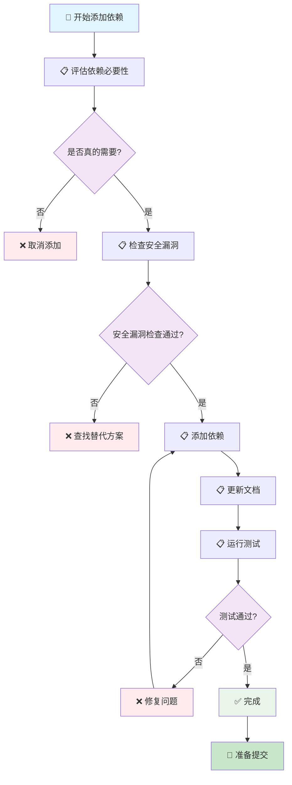

# 添加依赖流程

> 🤖 **AI 工作流文档**：本文档是专为 AI 助手设计的添加依赖工作流指南，提供标准化的依赖添加流程和检查清单，帮助 AI 助手按照项目规范添加新依赖。
>
> 📋 **开发工作流**：添加新依赖的标准流程和注意事项
>
> 🚀 **快速开始**：[跳转到快速检查清单](#-快速检查清单) | [查看开发规范索引](../README.md)

---

## 📖 相关指南

| 指南类型 | 时间投入 | 使用场景 | 链接 |
|---------|----------|----------|------|
| 🚀 **开发规范索引** | 1分钟 | 快速查找规范 | [开发规范索引](../README.md) |
| ⚡ **添加依赖** | 5-30分钟 | 添加新依赖 | 本文档 |
| 🔍 **检查工作流** | 5-15分钟 | 代码完成后检查 | [提交前检查](./pre-commit.md) |

### 相关规范

- [依赖管理规范](../references/dependency-management.md) - 依赖管理规范
- [安全性规则](../references/security.md) - 安全性规则（包含依赖安全检查）

---

## 📋 快速导航

### 🎯 核心步骤（必做）

- [⚡ 快速检查清单](#-快速检查清单) - 1分钟了解核心步骤
- [📋 步骤1：评估依赖必要性](#-步骤1评估依赖必要性) - 评估是否真的需要这个依赖
- [📋 步骤2：检查依赖安全漏洞](#-步骤2检查依赖安全漏洞) - 使用 cargo audit 检查
- [📋 步骤3：添加依赖](#-步骤3添加依赖) - 使用 cargo add 添加

---

## 🚀 工作流步骤

### 📊 工作流程图



### 📋 详细步骤

按照以下步骤依次完成依赖添加：

### 步骤 1：评估依赖必要性

评估是否真的需要这个依赖。

**检查清单**：
- [ ] 是否真的需要这个依赖？
- [ ] 是否有更轻量的替代方案？
- [ ] 依赖的维护状态如何？
- [ ] 依赖的许可证是否兼容？

**参考规范**：[依赖管理规范](../references/dependency-management.md#依赖原则)

**对应章节**：[步骤1：评估依赖必要性](#-步骤1评估依赖必要性)

### 步骤 2：检查依赖安全漏洞

使用 `cargo audit` 检查依赖是否有已知安全漏洞。

**检查清单**：
- [ ] 已使用 `cargo audit` 检查
- [ ] 依赖没有已知安全漏洞
- [ ] 依赖的维护状态良好

**参考规范**：[安全性规则](../references/security.md#依赖安全检查)

**命令示例**：

```bash
# 安装 cargo-audit（如果未安装）
cargo install cargo-audit

# 检查安全漏洞
cargo audit
```

**对应章节**：[步骤2：检查依赖安全漏洞](#-步骤2检查依赖安全漏洞)

### 步骤 3：添加依赖

使用 `cargo add` 添加依赖。

**检查清单**：
- [ ] 依赖已添加到 `Cargo.toml`
- [ ] 版本号符合规范（使用语义化版本）
- [ ] 功能标志已配置（如需要）

**参考规范**：[依赖管理规范](../references/dependency-management.md#添加依赖)

**命令示例**：

```bash
# 添加依赖
cargo add serde --features derive

# 添加开发依赖
cargo add --dev mockito

# 添加特定版本的依赖
cargo add serde@1.0
```

**对应章节**：[步骤3：添加依赖](#-步骤3添加依赖)

### 步骤 4：更新文档

更新相关文档说明新依赖的使用。

**检查清单**：
- [ ] 架构文档已更新（如需要）
- [ ] README.md 已更新（如需要）
- [ ] 依赖说明已添加

**参考规范**：[文档规范](../references/documentation.md)

**对应章节**：[步骤4：更新文档](#-步骤4更新文档)

### 步骤 5：运行测试

运行测试确保依赖添加后功能正常。

**检查清单**：
- [ ] 所有测试通过（`cargo test`）
- [ ] 代码可以正常编译（`cargo build`）
- [ ] 没有引入新的警告

**命令示例**：

```bash
# 运行测试
cargo test

# 检查编译
cargo build

# 运行 Clippy 检查
cargo clippy -- -D warnings
```

**对应章节**：[步骤5：运行测试](#-步骤5运行测试)

---

## ⚡ 快速检查清单

### 准备阶段

- [ ] 依赖必要性已评估
- [ ] 安全漏洞已检查
- [ ] 许可证已确认

### 执行阶段

- [ ] 依赖已添加
- [ ] 文档已更新
- [ ] 测试已运行

### 验证阶段

- [ ] 所有测试通过
- [ ] 代码可以正常编译
- [ ] 没有引入新的警告

---

## 📄 后续步骤

完成本工作流后，建议：

1. **运行检查工作流**：参考 [提交前检查](./pre-commit.md)
2. **代码审查**：参考 [代码审查规范](../code-review.md)
3. **提交代码**：参考 [提交规范](../commit.md)

---

## ❓ 常见问题

### 问题 1：依赖有安全漏洞

**症状**：`cargo audit` 检查发现安全漏洞

**解决方案**：

1. 查找修复版本
2. 评估风险并制定缓解措施
3. 考虑使用替代依赖
4. 参考 [依赖管理规范](../references/dependency-management.md#依赖安全漏洞处理流程)

### 问题 2：依赖版本冲突

**症状**：依赖版本冲突导致编译失败

**解决方案**：

1. 检查依赖版本是否兼容
2. 更新依赖到兼容版本
3. 使用 `cargo tree` 查看依赖树

---

## 📚 相关文档

### 开发规范

- [依赖管理规范](../references/dependency-management.md) - 依赖管理规范
- [安全性规则](../references/security.md) - 安全性规则

### 检查工作流

- [提交前检查](./pre-commit.md) - 代码质量检查流程

---

## ✅ 检查清单

使用本工作流时，请确保：

- [ ] 依赖必要性已评估
- [ ] 安全漏洞已检查
- [ ] 依赖已添加
- [ ] 文档已更新
- [ ] 测试已运行

---

**最后更新**: 2025-12-23

