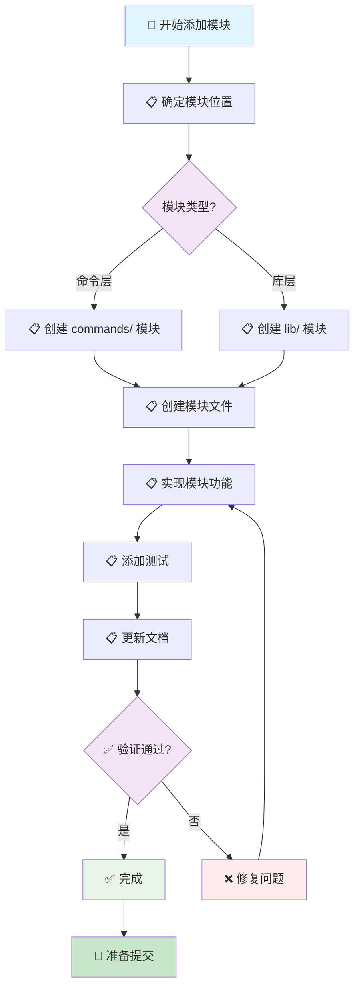

# 添加模块流程

> 🤖 **AI 工作流文档**：本文档是专为 AI 助手设计的添加模块工作流指南，提供标准化的模块添加流程和检查清单，帮助 AI 助手按照项目规范添加新模块。
>
> 📋 **开发工作流**：添加新模块的标准流程
>
> 🚀 **快速开始**：[跳转到快速检查清单](#-快速检查清单) | [查看开发规范索引](../README.md)

---

## 📖 相关指南

| 指南类型 | 时间投入 | 使用场景 | 链接 |
|---------|----------|----------|------|
| 🚀 **开发规范索引** | 1分钟 | 快速查找规范 | [开发规范索引](../README.md) |
| ⚡ **添加模块** | 30分钟-2小时 | 添加新模块 | 本文档 |
| 🔍 **检查工作流** | 5-15分钟 | 代码完成后检查 | [提交前检查](./pre-commit.md) |

### 相关规范

- [模块组织规范](../module-organization.md) - 模块组织规范
- [命名规范](../naming.md) - 命名规范
- [文档规范](../references/documentation.md) - 文档规范

---

## 📋 快速导航

### 🎯 核心步骤（必做）

- [⚡ 快速检查清单](#-快速检查清单) - 1分钟了解核心步骤
- [📋 步骤1：确定模块位置](#-步骤1确定模块位置) - 确定模块放在 commands/ 还是 lib/
- [📋 步骤2：创建模块文件](#-步骤2创建模块文件) - 创建模块文件和 mod.rs
- [📋 步骤3：实现模块功能](#-步骤3实现模块功能) - 实现模块核心功能

---

## 🚀 工作流步骤

### 📊 工作流程图



### 📋 详细步骤

按照以下步骤依次完成模块添加：

### 步骤 1：确定模块位置

确定模块放在 `commands/` 还是 `lib/`。

**检查清单**：
- [ ] 模块类型已确定（命令层或库层）
- [ ] 模块位置已确定
- [ ] 模块依赖关系已分析

**参考规范**：[模块组织规范](../module-organization.md#模块职责)

**规则**：
- **`commands/`**：CLI 命令封装，处理用户交互、参数解析
- **`lib/`**：核心业务逻辑，可复用的功能模块

**对应章节**：[步骤1：确定模块位置](#-步骤1确定模块位置)

### 步骤 2：创建模块文件

创建模块文件和 `mod.rs`。

**检查清单**：
- [ ] 模块文件已创建
- [ ] `mod.rs` 已创建
- [ ] 模块声明已添加

**参考规范**：[命名规范](../naming.md#文件命名)

**代码示例**：

```rust
// src/lib/my_module/mod.rs
/// 我的模块
pub mod feature;
pub mod helper;

pub use feature::MyFeature;
pub use helper::MyHelper;

// src/lib/my_module/feature.rs
use color_eyre::Result;

/// 功能实现
pub struct MyFeature {
    // 字段
}

impl MyFeature {
    /// 创建实例
    pub fn new() -> Result<Self> {
        // 实现
    }
}
```

**对应章节**：[步骤2：创建模块文件](#-步骤2创建模块文件)

### 步骤 3：实现模块功能

实现模块核心功能。

**检查清单**：
- [ ] 核心功能已实现
- [ ] 错误处理符合规范
- [ ] 添加了必要的文档注释

**参考规范**：
- [代码风格规范](../code-style.md)
- [错误处理规范](../error-handling.md)
- [文档规范](../references/documentation.md)

**对应章节**：[步骤3：实现模块功能](#-步骤3实现模块功能)

### 步骤 4：添加测试

添加单元测试和集成测试。

**检查清单**：
- [ ] 单元测试已添加
- [ ] 集成测试已添加（如需要）
- [ ] 所有测试通过

**参考规范**：[测试规范](../../testing/README.md)

**对应章节**：[步骤4：添加测试](#-步骤4添加测试)

### 步骤 5：更新文档

更新架构文档和文档索引。

**检查清单**：
- [ ] 架构文档已创建
- [ ] 文档索引已更新
- [ ] README.md 已更新（如需要）

**参考规范**：[文档规范](../references/documentation.md)

**对应章节**：[步骤5：更新文档](#-步骤5更新文档)

---

## ⚡ 快速检查清单

### 准备阶段

- [ ] 模块位置已确定
- [ ] 模块依赖关系已分析
- [ ] 分支已创建

### 实现阶段

- [ ] 模块文件已创建
- [ ] 模块功能已实现
- [ ] 测试已添加
- [ ] 文档已更新

### 验证阶段

- [ ] 代码已格式化
- [ ] 通过 Clippy 检查
- [ ] 所有测试通过
- [ ] 文档已同步更新

---

## 📄 后续步骤

完成本工作流后，建议：

1. **运行检查工作流**：参考 [提交前检查](./pre-commit.md)
2. **代码审查**：参考 [代码审查规范](../code-review.md)
3. **提交代码**：参考 [提交规范](../commit.md)

---

## ❓ 常见问题

### 问题 1：不确定模块位置

**症状**：不确定模块应该放在 commands/ 还是 lib/

**解决方案**：

1. 核心业务逻辑放在 `lib/`
2. CLI 命令封装放在 `commands/`
3. 参考 [模块组织规范](../module-organization.md)

### 问题 2：模块依赖混乱

**症状**：模块依赖方向不清晰

**解决方案**：

1. 检查模块依赖是否符合三层架构规则
2. 避免命令层和库层之间的反向依赖
3. 参考 [模块组织规范](../module-organization.md#模块依赖规则)

---

## 📚 相关文档

### 开发规范

- [模块组织规范](../module-organization.md) - 模块组织规范
- [命名规范](../naming.md) - 命名规范
- [文档规范](../references/documentation.md) - 文档规范

### 检查工作流

- [提交前检查](./pre-commit.md) - 代码质量检查流程

---

## ✅ 检查清单

使用本工作流时，请确保：

- [ ] 模块位置已确定
- [ ] 模块文件已创建
- [ ] 模块功能已实现
- [ ] 测试已添加
- [ ] 文档已更新

---

**最后更新**: 2025-12-23

