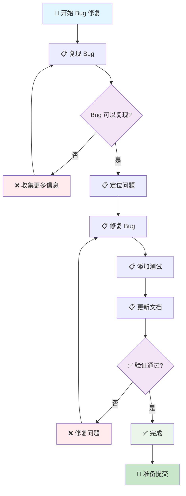

# Bug 修复流程

> 🤖 **AI 工作流文档**：本文档是专为 AI 助手设计的 Bug 修复工作流指南，提供标准化的 Bug 修复流程和检查清单，帮助 AI 助手按照项目规范完成 Bug 修复。
>
> 📋 **开发工作流**：Bug 修复的标准流程
>
> 🚀 **快速开始**：[跳转到快速检查清单](#-快速检查清单) | [查看开发规范索引](../README.md)

---

## 📖 相关指南

| 指南类型 | 时间投入 | 使用场景 | 链接 |
|---------|----------|----------|------|
| 🚀 **开发规范索引** | 1分钟 | 快速查找规范 | [开发规范索引](../README.md) |
| ⚡ **Bug 修复** | 30分钟-4小时 | 修复 Bug | 本文档 |
| 🔍 **检查工作流** | 5-15分钟 | 代码完成后检查 | [提交前检查](./pre-commit.md) |

### 相关规范

- [代码风格规范](../code-style.md) - 代码风格规范
- [错误处理规范](../error-handling.md) - 错误处理规范
- [测试规范](../../testing.md) - 测试规范

---

## 📋 快速导航

### 🎯 核心步骤（必做）

- [⚡ 快速检查清单](#-快速检查清单) - 1分钟了解核心步骤
- [📋 步骤1：复现 Bug](#-步骤1复现-bug) - 确认 Bug 可以复现
- [📋 步骤2：定位问题](#-步骤2定位问题) - 找到 Bug 的根本原因
- [📋 步骤3：修复 Bug](#-步骤3修复-bug) - 修复 Bug

---

## 🚀 工作流步骤

### 📊 工作流程图

### 📋 详细步骤

按照以下步骤依次完成 Bug 修复：

### 步骤 1：复现 Bug

确认 Bug 可以复现。

**检查清单**：
- [ ] Bug 可以稳定复现
- [ ] 复现步骤已记录
- [ ] Bug 影响范围已评估

**对应章节**：[步骤1：复现 Bug](#-步骤1复现-bug)

### 步骤 2：定位问题

找到 Bug 的根本原因。

**检查清单**：
- [ ] Bug 根本原因已找到
- [ ] 问题代码已定位
- [ ] 修复方案已确定

**参考规范**：[错误处理规范](../error-handling.md)

**对应章节**：[步骤2：定位问题](#-步骤2定位问题)

### 步骤 3：修复 Bug

修复 Bug。

**检查清单**：
- [ ] Bug 已修复
- [ ] 代码已格式化
- [ ] 通过 Clippy 检查
- [ ] 错误处理符合规范

**参考规范**：
- [代码风格规范](../code-style.md)
- [错误处理规范](../error-handling.md)

**对应章节**：[步骤3：修复 Bug](#-步骤3修复-bug)

### 步骤 4：添加测试

添加测试用例防止 Bug 再次出现。

**检查清单**：
- [ ] 测试用例已添加
- [ ] 测试覆盖了 Bug 场景
- [ ] 所有测试通过

**参考规范**：[测试规范](../../testing.md)

**对应章节**：[步骤4：添加测试](#-步骤4添加测试)

### 步骤 5：更新文档

更新相关文档（如需要）。

**检查清单**：
- [ ] 架构文档已更新（如需要）
- [ ] README.md 已更新（如需要）
- [ ] CHANGELOG.md 已更新

**参考规范**：[文档规范](../references/documentation.md)

**对应章节**：[步骤5：更新文档](#-步骤5更新文档)

---

## ⚡ 快速检查清单

### 准备阶段

- [ ] Bug 可以稳定复现
- [ ] 复现步骤已记录
- [ ] 分支已创建（`fix/bug-description`）

### 修复阶段

- [ ] Bug 根本原因已找到
- [ ] Bug 已修复
- [ ] 测试已添加
- [ ] 文档已更新

### 验证阶段

- [ ] Bug 已修复
- [ ] 所有测试通过
- [ ] 没有引入新的 Bug
- [ ] 文档已同步更新

---

## 📄 后续步骤

完成本工作流后，建议：

1. **运行检查工作流**：参考 [提交前检查](./pre-commit.md)
2. **代码审查**：参考 [代码审查规范](../code-review.md)
3. **提交代码**：参考 [提交规范](../commit.md)

---

## ❓ 常见问题

### 问题 1：Bug 无法复现

**症状**：Bug 无法稳定复现

**解决方案**：

1. 收集更多信息（日志、环境信息等）
2. 尝试不同的复现步骤
3. 检查是否有特定的触发条件

### 问题 2：修复引入新 Bug

**症状**：修复 Bug 后引入了新的 Bug

**解决方案**：

1. 添加回归测试防止 Bug 再次出现
2. 运行完整测试套件
3. 进行代码审查

---

## 📚 相关文档

### 开发规范

- [代码风格规范](../code-style.md) - 代码风格规范
- [错误处理规范](../error-handling.md) - 错误处理规范
- [测试规范](../../testing.md) - 测试规范

### 检查工作流

- [提交前检查](./pre-commit.md) - 代码质量检查流程

---

## ✅ 检查清单

使用本工作流时，请确保：

- [ ] Bug 可以稳定复现
- [ ] Bug 根本原因已找到
- [ ] Bug 已修复
- [ ] 测试已添加
- [ ] 文档已更新

---

**最后更新**: 2025-12-23

