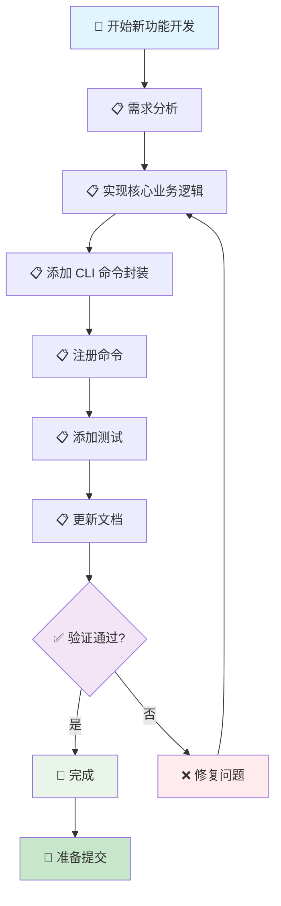

# 新功能开发流程

> 🤖 **AI 工作流文档**：本文档是专为 AI 助手设计的新功能开发工作流指南，提供标准化的开发流程和检查清单，帮助 AI 助手按照项目规范完成新功能开发。
>
> 📋 **开发工作流**：从需求分析到功能实现的完整流程
>
> 🚀 **快速开始**：[跳转到快速检查清单](#-快速检查清单) | [查看开发规范索引](../README.md)

---

## 📖 相关指南

| 指南类型 | 时间投入 | 使用场景 | 链接 |
|---------|----------|----------|------|
| 🚀 **开发规范索引** | 1分钟 | 快速查找规范 | [开发规范索引](../README.md) |
| ⚡ **新功能开发** | 2-8小时 | 开发新功能 | 本文档 |
| 🔍 **检查工作流** | 5-15分钟 | 代码完成后检查 | [提交前检查](./pre-commit.md) |

### 相关规范

- [代码风格规范](../code-style.md) - 代码风格规范
- [错误处理规范](../error-handling.md) - 错误处理规范
- [模块组织规范](../module-organization.md) - 模块组织规范
- [Git 工作流规范](../git-workflow.md) - Git 工作流规范

---

## 📋 快速导航

### 🎯 核心步骤（必做）

- [⚡ 快速检查清单](#-快速检查清单) - 1分钟了解核心步骤
- [📋 步骤1：需求分析](#-步骤1需求分析) - 分析需求，确定实现方案
- [📋 步骤2：实现核心业务逻辑](#-步骤2实现核心业务逻辑) - 在 lib/ 中实现核心功能
- [📋 步骤3：添加 CLI 命令封装](#-步骤3添加-cli-命令封装) - 在 commands/ 中添加命令

### 📚 详细步骤（按需）

- [📚 步骤4：注册命令](#-步骤4注册命令) - 在 main.rs 中注册命令
- [📚 步骤5：添加测试](#-步骤5添加测试) - 添加单元测试和集成测试
- [📚 步骤6：更新文档](#-步骤6更新文档) - 更新架构文档和 README

---

## 🚀 工作流步骤

### 📊 工作流程图



### 📋 详细步骤

按照以下步骤依次完成新功能开发：

### 步骤 1：需求分析

分析需求，确定实现方案。

**检查清单**：
- [ ] 需求已明确
- [ ] 实现方案已确定
- [ ] 模块位置已确定（lib/ 或 commands/）

**参考规范**：[模块组织规范](../module-organization.md#目录结构)

**对应章节**：[步骤1：需求分析](#-步骤1需求分析)

### 步骤 2：实现核心业务逻辑

在 `lib/` 中实现核心业务逻辑。

**检查清单**：
- [ ] 代码已格式化（`cargo fmt`）
- [ ] 通过 Clippy 检查（`cargo clippy`）
- [ ] 错误处理符合规范
- [ ] 添加了必要的文档注释

**参考规范**：
- [代码风格规范](../code-style.md)
- [错误处理规范](../error-handling.md)
- [文档规范](../references/documentation.md)

**代码示例**：

```rust
// src/lib/my_module/mod.rs
/// 新功能模块
pub mod feature;

pub use feature::MyFeature;

// src/lib/my_module/feature.rs
use color_eyre::Result;

/// 新功能实现
pub struct MyFeature {
    // 字段
}

impl MyFeature {
    /// 创建新功能实例
    pub fn new() -> Result<Self> {
        // 实现
    }

    /// 执行功能
    pub fn execute(&self) -> Result<()> {
        // 实现
    }
}
```

**对应章节**：[步骤2：实现核心业务逻辑](#-步骤2实现核心业务逻辑)

### 步骤 3：添加 CLI 命令封装

在 `commands/` 中添加 CLI 命令封装。

**检查清单**：
- [ ] 命令参数定义正确
- [ ] 用户交互友好
- [ ] 错误消息清晰

**参考规范**：
- [命名规范](../naming.md#cli-参数命名规范)
- [错误处理规范](../error-handling.md)

**代码示例**：

```rust
// src/commands/my_command/mod.rs
use clap::Args;
use color_eyre::Result;

/// 新功能命令
#[derive(Args, Debug, Clone)]
pub struct MyCommand {
    /// 参数说明
    #[arg(value_name = "PARAM")]
    pub param: Option<String>,
}

impl MyCommand {
    pub fn execute(&self) -> Result<()> {
        // 调用 lib 层实现
        let feature = workflow::my_module::MyFeature::new()?;
        feature.execute()?;
        Ok(())
    }
}
```

**对应章节**：[步骤3：添加 CLI 命令封装](#-步骤3添加-cli-命令封装)

### 步骤 4：注册命令

在 `main.rs` 中注册命令。

**检查清单**：
- [ ] 命令已注册
- [ ] 命令路径正确
- [ ] 补全脚本已更新（如需要）

**命令示例**：

```rust
// src/main.rs
use clap::{Command, Subcommand};

#[derive(Subcommand)]
pub enum MySubcommand {
    /// 新功能命令
    MyCommand(commands::my_command::MyCommand),
}

fn main() -> Result<()> {
    // 注册命令
    let matches = Command::new("workflow")
        .subcommand(Subcommand::from(MySubcommand::MyCommand))
        .get_matches();

    // 处理命令
    match matches.subcommand() {
        Some(("my-command", args)) => {
            commands::my_command::MyCommand::from(args).execute()?;
        }
        _ => {}
    }

    Ok(())
}
```

**对应章节**：[步骤4：注册命令](#-步骤4注册命令)

### 步骤 5：添加测试

添加单元测试和集成测试。

**检查清单**：
- [ ] 单元测试已添加
- [ ] 集成测试已添加（如需要）
- [ ] 所有测试通过

**参考规范**：[测试规范](../../testing.md)

**代码示例**：

```rust
// src/lib/my_module/feature.rs
#[cfg(test)]
mod tests {
    use super::*;

    #[test]
    fn test_my_feature() {
        let feature = MyFeature::new().unwrap();
        assert!(feature.execute().is_ok());
    }
}
```

**对应章节**：[步骤5：添加测试](#-步骤5添加测试)

### 步骤 6：更新文档

更新架构文档和 README。

**检查清单**：
- [ ] 架构文档已创建/更新
- [ ] README.md 中的命令清单已更新
- [ ] 文档索引已更新（如需要）

**参考规范**：[文档规范](../references/documentation.md)

**对应章节**：[步骤6：更新文档](#-步骤6更新文档)

---

## ⚡ 快速检查清单

### 准备阶段

- [ ] 需求已明确
- [ ] 实现方案已确定
- [ ] 分支已创建（`feature/feature-name`）

### 实现阶段

- [ ] 核心业务逻辑已实现（lib/）
- [ ] CLI 命令封装已添加（commands/）
- [ ] 命令已注册（main.rs）
- [ ] 测试已添加
- [ ] 文档已更新

### 验证阶段

- [ ] 代码已格式化（`cargo fmt`）
- [ ] 通过 Clippy 检查（`cargo clippy`）
- [ ] 所有测试通过（`cargo test`）
- [ ] 文档已同步更新

---

## 📄 后续步骤

完成本工作流后，建议：

1. **运行检查工作流**：参考 [提交前检查](./pre-commit.md)
2. **代码审查**：参考 [代码审查规范](../code-review.md)
3. **提交代码**：参考 [提交规范](../commit.md)

---

## ❓ 常见问题

### 问题 1：不确定模块位置

**症状**：不确定功能应该放在 lib/ 还是 commands/

**解决方案**：

1. 核心业务逻辑放在 `lib/`
2. CLI 命令封装放在 `commands/`
3. 参考 [模块组织规范](../module-organization.md)

### 问题 2：测试覆盖率不足

**症状**：测试覆盖率低于要求

**解决方案**：

1. 添加缺失的测试用例
2. 重点关注关键业务逻辑的测试覆盖
3. 使用 `cargo tarpaulin` 检查覆盖率

---

## 📚 相关文档

### 开发规范

- [代码风格规范](../code-style.md) - 代码风格规范
- [错误处理规范](../error-handling.md) - 错误处理规范
- [模块组织规范](../module-organization.md) - 模块组织规范
- [文档规范](../references/documentation.md) - 文档规范

### 检查工作流

- [提交前检查](./pre-commit.md) - 代码质量检查流程

---

## ✅ 检查清单

使用本工作流时，请确保：

- [ ] 需求已明确
- [ ] 核心业务逻辑已实现
- [ ] CLI 命令封装已添加
- [ ] 命令已注册
- [ ] 测试已添加
- [ ] 文档已更新

---

**最后更新**: 2025-12-23

