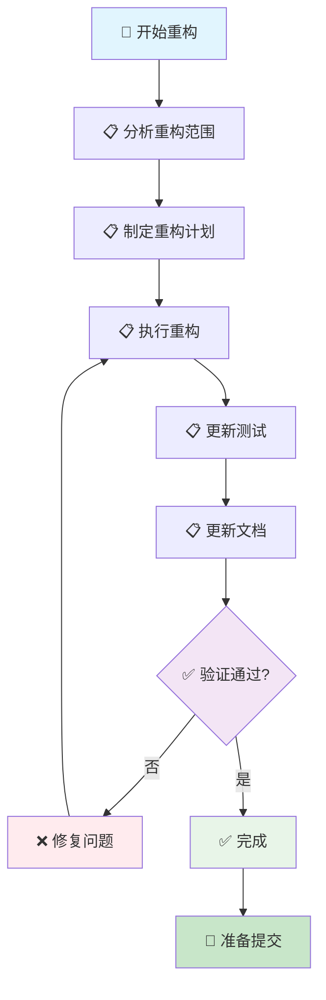

# 重构流程

> 🤖 **AI 工作流文档**：本文档是专为 AI 助手设计的代码重构工作流指南，提供标准化的重构流程和检查清单，帮助 AI 助手按照项目规范完成代码重构。
>
> 📋 **开发工作流**：代码重构的标准流程
>
> 🚀 **快速开始**：[跳转到快速检查清单](#-快速检查清单) | [查看开发规范索引](../README.md)

---

## 📖 相关指南

| 指南类型 | 时间投入 | 使用场景 | 链接 |
|---------|----------|----------|------|
| 🚀 **开发规范索引** | 1分钟 | 快速查找规范 | [开发规范索引](../README.md) |
| ⚡ **重构** | 2-8小时 | 代码重构 | 本文档 |
| 🔍 **检查工作流** | 5-15分钟 | 代码完成后检查 | [提交前检查](./pre-commit.md) |

### 相关规范

- [代码风格规范](../code-style.md) - 代码风格规范
- [模块组织规范](../module-organization.md) - 模块组织规范
- [文档规范](../references/documentation.md) - 文档规范

---

## 📋 快速导航

### 🎯 核心步骤（必做）

- [⚡ 快速检查清单](#-快速检查清单) - 1分钟了解核心步骤
- [📋 步骤1：分析重构范围](#-步骤1分析重构范围) - 分析需要重构的代码范围
- [📋 步骤2：制定重构计划](#-步骤2制定重构计划) - 制定详细的重构计划
- [📋 步骤3：执行重构](#-步骤3执行重构) - 逐步执行重构

---

## 🚀 工作流步骤

### 📊 工作流程图

### 📋 详细步骤

按照以下步骤依次完成重构：

### 步骤 1：分析重构范围

分析需要重构的代码范围。

**检查清单**：
- [ ] 重构范围已确定
- [ ] 重构目标已明确
- [ ] 影响范围已评估

**参考规范**：[模块组织规范](../module-organization.md)

**对应章节**：[步骤1：分析重构范围](#-步骤1分析重构范围)

### 步骤 2：制定重构计划

制定详细的重构计划。

**检查清单**：
- [ ] 重构步骤已规划
- [ ] 测试策略已确定
- [ ] 回滚方案已准备

**对应章节**：[步骤2：制定重构计划](#-步骤2制定重构计划)

### 步骤 3：执行重构

逐步执行重构。

**检查清单**：
- [ ] 重构已执行
- [ ] 代码已格式化
- [ ] 通过 Clippy 检查
- [ ] 功能保持不变

**参考规范**：
- [代码风格规范](../code-style.md)
- [模块组织规范](../module-organization.md)

**对应章节**：[步骤3：执行重构](#-步骤3执行重构)

### 步骤 4：更新测试

更新测试以反映重构后的代码结构。

**检查清单**：
- [ ] 测试已更新
- [ ] 所有测试通过
- [ ] 测试覆盖率保持或提高

**参考规范**：[测试规范](../../testing.md)

**对应章节**：[步骤4：更新测试](#-步骤4更新测试)

### 步骤 5：更新文档

更新架构文档以反映重构后的结构。

**检查清单**：
- [ ] 架构文档已更新
- [ ] 文档索引已更新
- [ ] README.md 已更新（如需要）

**参考规范**：[文档规范](../references/documentation.md)

**对应章节**：[步骤5：更新文档](#-步骤5更新文档)

---

## ⚡ 快速检查清单

### 准备阶段

- [ ] 重构范围已确定
- [ ] 重构计划已制定
- [ ] 分支已创建（`refactor/description`）

### 执行阶段

- [ ] 重构已执行
- [ ] 测试已更新
- [ ] 文档已更新

### 验证阶段

- [ ] 功能保持不变
- [ ] 所有测试通过
- [ ] 代码质量提高
- [ ] 文档已同步更新

---

## 📄 后续步骤

完成本工作流后，建议：

1. **运行检查工作流**：参考 [提交前检查](./pre-commit.md)
2. **代码审查**：参考 [代码审查规范](../code-review.md)
3. **提交代码**：参考 [提交规范](../commit.md)

---

## ❓ 常见问题

### 问题 1：重构影响范围过大

**症状**：重构影响范围过大，难以一次性完成

**解决方案**：

1. 将重构拆分为多个小步骤
2. 每个步骤完成后运行测试
3. 逐步推进重构

### 问题 2：重构后功能异常

**症状**：重构后功能出现异常

**解决方案**：

1. 检查测试是否覆盖所有场景
2. 运行完整测试套件
3. 进行回归测试

---

## 📚 相关文档

### 开发规范

- [代码风格规范](../code-style.md) - 代码风格规范
- [模块组织规范](../module-organization.md) - 模块组织规范
- [文档规范](../references/documentation.md) - 文档规范

### 检查工作流

- [提交前检查](./pre-commit.md) - 代码质量检查流程
- [深入检查指南](./review.md) - 综合深入检查流程

---

## ✅ 检查清单

使用本工作流时，请确保：

- [ ] 重构范围已确定
- [ ] 重构计划已制定
- [ ] 重构已执行
- [ ] 测试已更新
- [ ] 文档已更新

---

**最后更新**: 2025-12-23

