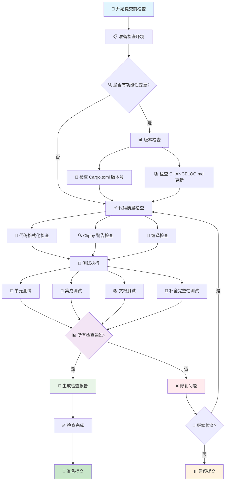

# 提交前检查指南

> 📋 **快速检查清单**：代码开发完成后、提交代码前需要完成的检查项（5-15分钟）
>
> 🚀 **快速开始**：[跳转到快速检查清单](#-快速检查清单) | [查看快速参考指南](./references/QUICK_REFERENCE_GUIDELINES.md)

## 📖 相关指南

| 指南类型 | 时间投入 | 使用场景 | 链接 |
|---------|----------|----------|------|
| 🚀 **快速参考** | 1分钟 | 快速查找命令和清单 | [快速参考指南](./references/QUICK_REFERENCE_GUIDELINES.md) |
| ⚡ **提交前检查** | 5-15分钟 | 日常提交前验证 | 本文档 |
| 🔍 **深入检查** | 2-4小时 | 功能完成后、定期审查 | [检查指南](./REVIEW_GUIDELINES.md) |

### 专门检查指南

- [代码检查指南](./references/REVIEW_CODE_GUIDELINES.md) - 重复代码、工具复用、第三方库检查
- [测试用例检查指南](./references/REVIEW_TEST_CASE_GUIDELINES.md) - 测试覆盖、合理性、缺失测试检查
- [文档检查指南](./references/REVIEW_DOCUMENT_GUIDELINES.md) - README、架构文档、CHANGELOG 检查
- [架构文档审查指南](./references/REVIEW_ARCHITECTURE_DOC_GUIDELINES.md) - 架构文档与代码一致性检查
- [CLI 检查指南](./references/REVIEW_CLI_GUIDELINES.md) - CLI 命令结构、补全脚本检查

---

## 📋 快速导航

### 🎯 核心检查（必做）
- [⚡ 快速检查清单](#-快速检查清单) - 1分钟了解核心命令
- [✅ 代码质量检查](#-代码质量检查) - 格式化、Clippy、编译
- [🧪 测试用例检查](#-测试用例检查) - 运行测试、检查覆盖
- [🔎 版本管理检查](#61-版本管理) - 版本号更新验证

### 📚 详细检查（按需）
- [📚 文档检查](#-文档检查) - README、架构文档更新
- [🔧 CLI 检查](#-cli-和-completion-检查) - 命令注册、补全脚本
- [🔍 代码优化检查](#-代码优化检查) - 重复代码、工具复用
- [🔎 其他检查项](#-其他检查项) - 依赖、性能、安全等

### 📄 报告和帮助
- [📄 生成检查报告](#-生成检查报告) - 创建检查记录
- [❓ 常见问题](#-常见问题) - 故障排除指南

---

## 🚀 检查步骤

### 📊 检查流程图



### 📋 详细检查步骤

按照以下步骤依次完成检查：

### 第一步：CLI 和 Completion 检查

检查 CLI 命令结构和补全脚本：
- CLI 命令注册和参数定义
- 补全脚本完整性测试
- 补全脚本优化

**对应章节**：[CLI 和 Completion 检查](#-cli-和-completion-检查)

### 第二步：代码优化检查

检查代码是否已优化：
- 共用代码提取（参数、工具函数、错误处理）
- 代码重复检查
- 工具函数复用
- 配置管理

**对应章节**：[代码优化检查](#-代码优化检查)

### 第三步：测试用例检查

检查测试覆盖：
- 单元测试
- 集成测试
- 文档测试
- 测试数据和边界情况
- 测试冗余检查（重复测试、过时测试、无效测试）

**对应章节**：[测试用例检查](#-测试用例检查)

### 第四步：代码质量检查

检查代码质量：
- 代码格式化
- Clippy 警告
- 编译检查
- 导入语句和顺序
- 自动修复

**对应章节**：[代码质量检查](#-代码质量检查)

### 第五步：文档检查

检查所有文档是否已更新，包括：
- README.md 命令清单和版本号
- 架构文档更新
- 文档索引更新
- 迁移文档（如有需要）

**对应章节**：[文档检查](#-文档检查)

### 第六步：其他检查项

检查其他重要项：
- 版本管理
- 依赖管理
- 平台兼容性
- 性能检查
- 安全性检查
- 用户体验

**对应章节**：[其他检查项](#-其他检查项)

### 最后：生成检查报告

完成所有检查后，生成检查报告文档。

**对应章节**：[生成检查报告](#-生成检查报告)

---

## 📚 文档检查

> **详细检查指南**：本文档提供快速检查清单，如需进行系统性的文档检查，请参考 [文档检查指南](./references/REVIEW_DOCUMENT_GUIDELINES.md)，该指南包含完整的检查流程、检查方法和示例。如需进行架构文档与代码一致性检查，请参考 [架构文档审查指南](./references/REVIEW_ARCHITECTURE_DOC_GUIDELINES.md)。

### 快速检查清单

**检查项**：
- [ ] README.md 命令清单和版本号是否已更新
- [ ] 架构文档与代码实现一致（如适用，参考 [架构文档审查指南](./references/REVIEW_ARCHITECTURE_DOC_GUIDELINES.md)）
- [ ] 架构文档是否已更新（`docs/architecture/`）
- [ ] 文档索引是否已更新（`docs/README.md`）
- [ ] 迁移文档是否已创建（如有破坏性变更）

### 详细检查项

#### 1.1 README.md 更新

**检查项**：
- [ ] 命令清单部分是否已更新新增/修改的命令
- [ ] 架构总览部分是否反映了架构变更
- [ ] 快速开始部分是否准确
- [ ] 版本号是否与 `Cargo.toml` 一致

**位置**：`README.md`

#### 1.2 架构文档更新

**检查项**：
- [ ] 相关命令架构文档是否已更新（`docs/architecture/commands/*_COMMAND_ARCHITECTURE.md`）
- [ ] 相关 lib 层架构文档是否已更新（`docs/architecture/lib/*_ARCHITECTURE.md`）
- [ ] `CLI_ARCHITECTURE.md` 是否反映了命令结构变更
- [ ] `COMPLETION_ARCHITECTURE.md` 是否反映了补全相关变更

**位置**：`docs/architecture/`

#### 1.3 文档索引更新

**检查项**：
- [ ] 新增文档是否已添加到 `docs/README.md` 索引

**位置**：`docs/README.md`

#### 1.4 迁移文档

**检查项**：
- [ ] 如有破坏性变更，是否已创建迁移指南（`docs/migration/`）
- [ ] 版本号是否正确

### 更多检查项

详细的文档检查包括但不限于：
- 文档完整性检查（README.md、docs/ 目录、CHANGELOG.md）
- 重复内容检查（跨文档重复、文档内部重复）
- 文档位置检查（文档分类、命名规范）
- 文档优化和补全检查（内容完整性、准确性、格式规范性、可读性、链接有效性）

**参考**：[文档检查指南](./references/REVIEW_DOCUMENT_GUIDELINES.md) 获取完整的检查方法和示例。

---

## 🔧 CLI 和 Completion 检查

> **详细检查指南**：本文档提供快速检查清单，如需进行系统化的 CLI 和 Completion 检查，请参考 [CLI 检查指南](./references/REVIEW_CLI_GUIDELINES.md)，该指南包含完整的检查流程、参数复用检查、参数提取指南和自动化检查工具。

### 快速检查清单

**检查项**：
- [ ] 新增命令是否已在 `Commands` 枚举中注册（`src/lib/cli/commands.rs`）
- [ ] 子命令是否已在对应枚举中定义
- [ ] 命令文档注释（`///`）是否完整
- [ ] 参数文档注释（`///`）是否完整
- [ ] 参数命名是否一致（如 `jira_id` vs `jira_ticket`）
- [ ] 运行补全完整性测试：`cargo test --test completeness`
- [ ] 新增命令是否包含在补全脚本中
- [ ] 需要输出格式的命令是否使用了 `OutputFormatArgs`？
- [ ] 需要 dry-run 模式的命令是否使用了 `DryRunArgs`？
- [ ] 需要 JIRA ID 的命令是否使用了 `JiraIdArg`？
- [ ] 重复参数是否已提取为共用参数组（出现 2+ 次必须提取）
- [ ] 是否使用 `#[command(flatten)]` 复用参数组

**测试命令**：
```bash
# 运行补全完整性测试
cargo test --test completeness

# 运行参数检查测试
cargo test --test args_check

# 手动生成补全脚本验证
cargo run -- completion generate
```

**位置**：
- CLI 命令定义：`src/lib/cli/`
- 共用参数定义：`src/lib/cli/args.rs`
- 补全完整性测试：`tests/completion/completeness.rs`
- 参数检查测试：`tests/args_check.rs`（已从 `tests/cli/args_check.rs` 移至根目录）

**参考**：
- [CLI 检查指南](./references/REVIEW_CLI_GUIDELINES.md) - 完整的检查方法和参数提取指南
- [代码优化检查 - 提取共用参数](#提取共用参数)

---

## 🔍 代码优化检查

> **详细检查指南**：本文档提供快速检查清单，如需进行系统性的代码检查，请参考 [代码检查指南](./references/REVIEW_CODE_GUIDELINES.md)，该指南包含完整的检查流程、10 种重复代码模式检查、已封装工具清单和第三方工具检查方法。

### 快速检查清单

**检查项**：
- [ ] 共用代码是否已提取（参数、工具函数、错误处理）
- [ ] 代码重复是否已消除
- [ ] 工具函数是否已复用
- [ ] 配置管理是否统一
- [ ] **避免过度设计**：代码是否简洁实用，没有不必要的抽象层

### 基本检查项

#### 3.1 共用代码提取

**检查项**：
- [ ] 共用参数是否已提取为共用结构体（如 `OutputFormatArgs`、`DryRunArgs`）
- [ ] 共用工具函数是否已提取到 `helpers.rs` 模块
- [ ] 错误处理是否统一使用 `anyhow::Context`

**参考**：见 [代码检查指南 - 重复代码检查](./references/REVIEW_CODE_GUIDELINES.md#-重复代码检查) 获取详细的提取方法和示例。

#### 3.2 代码重复检查

**检查项**：
- [ ] 输出格式处理逻辑是否已提取
- [ ] 参数解析逻辑是否可复用
- [ ] 文件操作是否使用共用工具（`lib/base/util`）
- [ ] HTTP 请求是否统一使用 `HttpClient`
- [ ] Git 操作是否统一使用 `lib/git` 模块

**工具函数位置**：
- `lib/base/util/` - 通用工具函数
- `lib/base/dialog/` - 交互式对话框
- `lib/base/indicator/` - 进度指示器
- `commands/*/helpers.rs` - 命令特定帮助函数

#### 3.3 工具函数复用

**检查项**：
- [ ] 是否使用 `lib/base/util` 中的工具函数
- [ ] 是否使用 `lib/base/dialog` 进行用户交互
- [ ] 是否使用 `lib/base/indicator` 显示进度

**参考**：见 [代码检查指南 - 已封装工具检查](./references/REVIEW_CODE_GUIDELINES.md#️-已封装工具检查) 获取完整的工具函数清单和使用方法。

#### 3.4 配置管理

**检查项**：
- [ ] 是否使用 `Settings` 统一管理配置
- [ ] 是否使用 `Paths` 统一管理路径
- [ ] 配置验证是否统一

#### 3.5 避免过度设计

**检查原则**：
- **YAGNI（You Aren't Gonna Need It）**：不要为未来可能的需求添加功能
- **KISS（Keep It Simple, Stupid）**：保持简单，避免不必要的复杂性
- **实用主义**：优先满足当前需求，避免过度抽象

**检查项**：
- [ ] 是否有为单一实现创建的 trait？是否可以简化为直接实现？
- [ ] 是否有不必要的抽象层？是否可以减少中间层？
- [ ] 是否有为未来需求添加的功能？是否可以移除？
- [ ] 是否有过度封装的简单函数？是否可以简化为直接函数调用？
- [ ] 代码复杂度是否与实际需求匹配？
- [ ] 是否使用了不必要的设计模式？
- [ ] 是否有不必要的泛型参数？

**常见过度设计模式**：
- ❌ 为单一实现创建 trait
- ❌ 创建多层抽象但只有一层实现
- ❌ 为简单场景使用复杂的设计模式
- ❌ 为未来可能的需求添加功能
- ❌ 创建过于灵活的配置系统但实际只需要简单配置
- ❌ 将简单函数包装成复杂的结构体

**示例**：
```rust
// ❌ 过度设计：为单一实现创建 trait
trait FileReader {
    fn read(&self, path: &Path) -> Result<String>;
}

// ✅ 简洁设计：直接使用函数
pub fn read_file(path: &Path) -> Result<String> {
    fs::read_to_string(path)
        .context(format!("Failed to read file: {:?}", path))
}
```

### 更多检查项

详细的代码检查包括但不限于：
- **10 种重复代码模式检查**：文件操作、Git 命令、错误处理、字符串处理、路径处理、HTTP 请求、配置读取、日志输出、用户交互、进度指示器
- **已封装工具检查**：文件操作工具、字符串处理工具、格式化工具、平台检测工具、浏览器和剪贴板工具、解压和校验和工具、日期格式化工具、表格输出工具、Git 操作工具、HTTP 客户端工具、日志工具、对话框工具、进度指示器工具、配置管理工具
- **第三方工具检查**：正则表达式处理、JSON 处理、TOML 处理、命令行参数解析、异步处理、并发处理、时间处理、路径处理、环境变量处理、错误处理
- **过度设计检查**：不必要的抽象层、过度封装、过早优化、不必要的复杂性

**参考**：[代码检查指南](./references/REVIEW_CODE_GUIDELINES.md) 获取完整的检查方法、搜索模式和示例分析。

---

## 🧪 测试用例检查

> **详细检查指南**：本文档提供快速检查清单，如需进行系统性的测试用例检查，请参考 [测试用例检查指南](./references/REVIEW_TEST_CASE_GUIDELINES.md)，该指南包含完整的检查流程、测试覆盖情况分析、测试用例合理性检查和缺失测试用例识别方法。

### 快速检查清单

**检查项**：
- [ ] 单元测试是否覆盖新增功能
- [ ] 集成测试是否覆盖主要流程
- [ ] 测试是否全部通过
- [ ] 测试冗余是否已清理

### 基本检查项

#### 4.1 单元测试

**检查项**：
- [ ] 新增功能是否有对应的单元测试
- [ ] 边界情况是否已覆盖
- [ ] 错误处理是否已测试

**位置**：与源代码在同一文件中（`#[cfg(test)]` 模块）

**运行测试**：
```bash
# 运行所有测试（包括单元测试、集成测试和文档测试）
make test
# 或
cargo test --verbose

# 运行特定测试
cargo test --test completeness  # 补全完整性测试
cargo test --lib --tests      # 仅单元测试和集成测试（不包括文档测试）
cargo test --doc              # 仅文档测试
```

#### 4.2 集成测试

**检查项**：
- [ ] CLI 命令是否在 `tests/cli/` 中有测试
- [ ] 补全完整性测试是否通过（`tests/completion/completeness.rs`）
- [ ] 集成测试是否覆盖主要流程（`tests/integration/`）

**位置**：`tests/` 目录

#### 4.3 测试覆盖率

**检查项**：
- [ ] 运行 `make test` 或 `cargo test --verbose` 确保所有测试通过（包括 doctest）
- [ ] 新增代码路径是否被测试覆盖
- [ ] 测试用例命名是否清晰（`test_*`）
- [ ] 文档中的代码示例（doctest）是否能够正常编译和运行

#### 4.4 测试数据

**检查项**：
- [ ] 测试 fixtures（`tests/fixtures/`）是否需要更新
- [ ] Mock 数据是否准确

#### 4.5 测试冗余检查

**检查项**：
- [ ] 是否存在重复的测试用例（测试相同功能或相同代码路径）
- [ ] 是否有过时或不再需要的测试（功能已移除或重构，但测试未更新）
- [ ] 测试是否真正有效（是否测试了正确的功能，断言是否正确）
- [ ] 是否有测试用例测试了已不存在的代码路径（代码已删除但测试仍存在）
- [ ] 是否有测试用例测试了已废弃的 API 或方法

**检查方法**：
```bash
# 搜索测试文件，查找相似的测试用例
grep -r "test_" tests/ src/ | sort | uniq -d
```

### 更多检查项

详细的测试用例检查包括但不限于：
- **测试覆盖情况检查**：模块覆盖检查、功能覆盖检查、覆盖率评估（总体覆盖率、核心模块覆盖率、工具模块覆盖率、CLI 层覆盖率）
- **测试用例合理性检查**：测试工具使用检查（参数化测试、断言工具、快照测试、Mock 测试）、测试结构检查（AAA 模式、测试组织、测试数据管理）、测试内容检查（成功路径测试、错误路径测试、边界条件测试、集成测试）
- **缺失测试用例检查**：缺失模块测试识别、缺失功能测试识别、缺失测试类型识别（错误路径测试、边界条件测试、集成测试）

**参考**：[测试用例检查指南](./references/REVIEW_TEST_CASE_GUIDELINES.md) 获取完整的检查方法、检查报告格式和示例输出。

---

## ✅ 代码质量检查

### 5.1 格式化检查

**命令**：
```bash
make lint
# 或
cargo fmt --check
```

**检查项**：
- [ ] 代码格式是否符合 `rustfmt.toml` 配置
- [ ] 缩进是否统一（4 个空格）
- [ ] 行宽是否在 100 字符以内

**自动修复**：
```bash
cargo fmt
```

### 5.2 Clippy 检查

**命令**：
```bash
cargo clippy -- -D warnings
```

**检查项**：
- [ ] 所有 Clippy 警告是否已修复
- [ ] 复杂度阈值是否符合 `.clippy.toml` 配置
- [ ] 是否使用了不必要的 `unwrap()`（应使用 `expect()` 或错误处理）

**自动修复**：
```bash
cargo clippy --fix --allow-dirty --allow-staged
```

### 5.3 编译检查

**命令**：
```bash
cargo check
```

**检查项**：
- [ ] 代码是否能够编译通过
- [ ] 是否有未使用的导入或变量
- [ ] 类型是否匹配

### 5.4 导入检查

**检查项**：
- [ ] 所有导入是否统一从文件顶部导入
- [ ] 是否避免在代码中间使用 `crate::` 路径直接调用函数
- [ ] 导入语句是否按标准库、第三方库、本地模块的顺序组织

**正确示例**：
```rust
// 文件顶部统一导入
use crate::repo::config::RepoConfig;
use anyhow::{Context, Result};

pub fn get_branch_prefix() -> Option<String> {
    // 使用顶部导入的函数
    RepoConfig::get_branch_prefix()
}
```

**错误示例**：
```rust
// ❌ 错误：在代码中间使用 crate:: 路径直接调用
pub fn get_branch_prefix() -> Option<String> {
    crate::repo::config::RepoConfig::get_branch_prefix()
}
```

**导入顺序规范**：
1. 标准库导入（`std::*`）
2. 第三方库导入（按字母顺序）
3. 本地模块导入（`crate::*`）

**示例**：
```rust
// 标准库
use std::path::PathBuf;
use std::fs;

// 第三方库
use anyhow::{Context, Result};
use clap::Args;

// 本地模块
use crate::repo::config::RepoConfig;
use crate::base::util::format_size;
```

### 5.5 自动修复

**命令**：
```bash
make fix
# 或手动执行：
cargo fmt
cargo clippy --fix --allow-dirty --allow-staged
cargo fix --allow-dirty --allow-staged
```

**检查项**：
- [ ] 运行自动修复后是否还有问题
- [ ] 自动修复后的代码是否仍需手动调整

---

## 🔎 其他检查项

### 6.1 版本管理

#### 6.1.1 判断是否需要更新版本号

**检查场景**：
- 新增功能（feat）→ 需要更新版本号（minor 或 patch）
- Bug 修复（fix）→ 需要更新版本号（patch）
- 重构（refactor）→ 通常不需要更新版本号（除非影响 API）
- 文档更新（docs）→ 不需要更新版本号
- 代码风格（style）→ 不需要更新版本号
- 测试（test）→ 不需要更新版本号
- 构建/工具（chore、ci）→ 不需要更新版本号

**判断依据**：
1. **功能性变更**：如果提交包含了新功能或修复了 bug，需要更新版本号
2. **用户可见变更**：如果变更会影响用户使用，需要更新版本号
3. **API 变更**：如果变更了公共 API，需要更新版本号
4. **发布周期**：如果计划发布新版本，需要更新版本号

**版本号规则**（遵循语义化版本）：
- **Major (x.0.0)**：破坏性变更（BREAKING CHANGE）
- **Minor (x.x.0)**：新功能，向后兼容（feat）或 patch >= 9
- **Patch (x.x.x)**：Bug 修复和小改进（fix、perf）

#### 6.1.2 检查版本号是否已更新

**快速检查命令**：
```bash
# 检查当前分支是否修改了版本号
git diff master -- Cargo.toml | grep "^+version"

# 或检查最近一次提交
git diff HEAD~1 HEAD -- Cargo.toml | grep "version ="
```

**详细检查清单**：
- [ ] `Cargo.toml` 版本号是否已更新
- [ ] `Cargo.lock` 是否已同步更新
- [ ] `CHANGELOG.md` 是否已添加新版本记录
- [ ] `README.md` 中的版本示例是否已更新（可选）
- [ ] 版本号是否符合语义化版本规范
- [ ] 新版本号是否已正确递增

**检查方法**：

1. **检查 Cargo.toml**：
```bash
# 查看当前版本
grep "^version" Cargo.toml

# 查看版本变更
git diff master -- Cargo.toml
```

2. **检查 Cargo.lock**：
```bash
# 查看 workflow 包的版本
grep -A 1 'name = "workflow"' Cargo.lock | grep version

# 验证版本是否同步
git diff master -- Cargo.lock | grep -A 5 'name = "workflow"'
```

3. **检查 CHANGELOG.md**：
```bash
# 查看最新版本记录
head -30 CHANGELOG.md

# 验证版本格式
grep "\[.*\] - 20" CHANGELOG.md | head -5
```

4. **检查 README.md**（可选）：
```bash
# 查看版本号引用
grep -n "VERSION=v" README.md
grep -n "version.*1\." README.md
```

**常见问题**：

1. **忘记更新 Cargo.lock**：
   - 问题：只更新了 Cargo.toml，没有同步 Cargo.lock
   - 解决：运行 `cargo update -p workflow --precise <version>`

2. **CHANGELOG.md 未更新**：
   - 问题：版本号已更新，但 CHANGELOG.md 未添加新版本记录
   - 解决：将 `[Unreleased]` 内容移到新版本记录

3. **版本号递增错误**：
   - 问题：版本号跳跃或递增错误（如 1.6.3 → 1.6.5）
   - 解决：按照语义化版本规范正确递增

**示例**：

正确的版本更新应该包含以下文件：
```bash
$ git status
modified:   Cargo.toml      # 版本号 1.6.3 → 1.6.4
modified:   Cargo.lock      # 自动同步版本号
modified:   CHANGELOG.md    # 添加 [1.6.4] 记录
modified:   README.md       # 更新版本示例（可选）
```

**提示**：
- 如果不确定是否需要更新版本号，可以先提交到特性分支，由 code review 确认
- 版本号更新应该在功能完成后、合并到 master 前进行
- GitHub Actions 会根据 Cargo.toml 中的版本号自动创建 tag 和 release

### 6.2 依赖管理

**检查项**：
- [ ] 新增依赖是否必要
- [ ] 依赖版本是否合理
- [ ] 是否有安全漏洞（可运行 `cargo audit`）

### 6.3 平台兼容性

**检查项**：
- [ ] 是否考虑了跨平台兼容性（macOS/Linux/Windows）
- [ ] 平台特定代码是否使用了条件编译（`#[cfg(...)]`）
- [ ] 是否测试了不同平台

**示例**：
```rust
#[cfg(target_os = "macos")]
fn get_system_proxy() -> Result<String> {
    // macOS 特定实现
}

#[cfg(target_os = "linux")]
fn get_system_proxy() -> Result<String> {
    // Linux 特定实现
}
```

### 6.4 性能检查

**检查项**：
- [ ] 是否有明显的性能问题（如不必要的克隆、重复计算）
- [ ] 大文件处理是否使用了流式处理
- [ ] 网络请求是否使用了重试机制

### 6.5 安全性检查

**检查项**：
- [ ] 敏感信息（API keys、tokens）是否硬编码
- [ ] 文件操作是否检查了路径安全性
- [ ] 用户输入是否进行了验证

### 6.6 用户体验

**检查项**：
- [ ] 错误消息是否对用户友好
- [ ] 进度提示是否清晰
- [ ] 帮助信息是否完整（`--help`）

---

## 📄 生成检查报告

完成所有检查步骤后，需要生成检查报告文档。

### 报告位置

**文件路径**：`report/CHECK_REPORT_{timestamp}.md`

其中 `{timestamp}` 为当前日期和时间，格式为 `YYYY-MM-DD_HH-MM-SS`（如：`2024-12-19_14-30-00`）。

**生成带时间戳的文件名**：

在 Rust 代码中（自动获取当前时间）：
```rust
use workflow::base::util::date::format_filename_timestamp;

// 函数会自动获取当前时间，无需提前获取
let timestamp = format_filename_timestamp();
let report_path = format!("report/CHECK_REPORT_{}.md", timestamp);
// 输出：report/CHECK_REPORT_2024-12-19_14-30-00.md
```

> **注意**：`format_filename_timestamp()` 函数会在调用时自动获取当前系统时间，无需提前获取。每次调用都会返回最新的时间戳。

在命令行中（手动获取当前时间）：
```bash
# Unix/macOS/Linux
TIMESTAMP=$(date +%Y-%m-%d_%H-%M-%S)
echo "report/CHECK_REPORT_${TIMESTAMP}.md"

# Windows PowerShell
$timestamp = Get-Date -Format "yyyy-MM-dd_HH-mm-ss"
Write-Host "report/CHECK_REPORT_${timestamp}.md"
```

**示例文件名**：`report/CHECK_REPORT_2024-12-19_14-30-00.md`

### 报告内容

检查报告应包含以下内容：

#### 1. 检查概览

- 检查日期和时间
- 检查人员
- 检查范围（本次提交涉及的功能/模块）
- **重要**：说明这是快速检查汇总，详细检查请参考单个检查报告

#### 1.1 详细检查报告引用（可选）

如果已生成详细的单个检查报告，应在概览部分引用：

```markdown
> **详细检查报告**：
> - [代码检查报告](../report/CODE_CHECK_REPORT.md) - 详细的重复代码、已封装工具、第三方工具检查
> - [测试覆盖报告](../report/TEST_COVERAGE_REPORT.md) - 详细的测试覆盖情况分析
> - [文档检查报告](../report/DOCUMENT_CHECK_REPORT.md) - 详细的文档完整性、准确性检查
> - [CLI 和 Completion 检查报告](../report/CODE_REVIEW_CHECK_REPORT.md) - 详细的 CLI 命令结构和补全脚本检查
> - [测试用例检查报告](../report/TEST_CASE_GUIDELINES_CHECK_REPORT.md) - 详细的测试用例合理性检查
```

**说明**：
- 快速检查汇总报告：提供各检查步骤的概览和关键问题，适合快速了解检查结果
- 详细检查报告：按照专门的检查指南（如 `reviews/REVIEW_CODE_GUIDELINES.md`）生成的深度检查报告，包含具体的问题位置、代码示例、改进方案等
- 建议：在提交前，先运行快速检查汇总，如果发现问题，再运行相应的详细检查报告获取更多信息

#### 2. 各步骤检查结果

按照检查步骤，记录每个步骤的检查结果：

**第一步：CLI 和 Completion 检查**
- [ ] CLI 命令结构检查结果
- [ ] 补全脚本完整性测试结果
- [ ] 补全脚本优化情况
- 问题记录和修复情况

**第二步：代码优化检查**
- [ ] 共用代码提取情况
- [ ] 代码重复检查结果
- [ ] 工具函数复用情况
- [ ] 配置管理情况
- 问题记录和修复情况

**第三步：测试用例检查**
- [ ] 单元测试覆盖情况
- [ ] 集成测试覆盖情况
- [ ] 文档测试结果
- [ ] 测试数据和边界情况
- [ ] 测试冗余检查结果（重复测试、过时测试、无效测试）
- 问题记录和修复情况

**第四步：代码质量检查**
- [ ] 代码格式化结果
- [ ] Clippy 警告检查结果
- [ ] 编译检查结果
- [ ] 导入语句检查结果
- [ ] 自动修复情况
- 问题记录和修复情况

**第五步：文档检查**
- [ ] README.md 更新情况
- [ ] 架构文档更新情况
- [ ] 文档索引更新情况
- [ ] 迁移文档情况
- 问题记录和修复情况

**第六步：其他检查项**
- [ ] 版本管理检查结果
- [ ] 依赖管理检查结果
- [ ] 平台兼容性检查结果
- [ ] 性能检查结果
- [ ] 安全性检查结果
- [ ] 用户体验检查结果
- 问题记录和修复情况

#### 3. 问题汇总

- **P0（必须修复）**：列出所有必须修复的问题
- **P1（建议修复）**：列出所有建议修复的问题
- **P2（可选修复）**：列出所有可选修复的问题

每个问题应包含：
- 问题描述
- 问题位置（文件路径和行号）
- 修复状态（已修复/待修复/已记录）
- 修复方案（如适用）

#### 4. 测试结果汇总

- 单元测试：通过/失败数量
- 集成测试：通过/失败数量
- 文档测试：通过/失败数量
- 补全完整性测试：通过/失败数量
- 总体测试覆盖率（如适用）

#### 5. 代码质量指标

- 代码格式化：通过/失败
- Clippy 警告：数量（0 为通过）
- 编译状态：通过/失败
- 代码重复率（如适用）

#### 6. 总结

- 检查完成度（百分比）
- 是否准备好提交（是/否）
- 剩余待办事项
- 建议和备注

### 报告模板

```markdown
# 提交前检查报告

**检查日期**：YYYY-MM-DD HH:MM:SS
**检查人员**：[姓名]
**检查范围**：[本次提交涉及的功能/模块]

---

## 检查概览

[简要描述本次检查的范围和目的]

---

## 各步骤检查结果

### 第一步：CLI 和 Completion 检查

**状态**：✅ 通过 / ⚠️ 部分通过 / ❌ 未通过

**检查项**：
- [x] CLI 命令结构检查结果：[描述]
- [x] 补全脚本完整性测试结果：[描述]
- [x] 补全脚本优化情况：[描述]

**问题记录**：
- [问题描述] - [修复状态] - [修复方案]

---

### 第二步：代码优化检查

**状态**：✅ 通过 / ⚠️ 部分通过 / ❌ 未通过

**检查项**：
- [x] 共用代码提取情况：[描述]
- [x] 代码重复检查结果：[描述]
- [x] 工具函数复用情况：[描述]
- [x] 配置管理情况：[描述]

**问题记录**：
- [问题描述] - [修复状态] - [修复方案]

---

### 第三步：测试用例检查

**状态**：✅ 通过 / ⚠️ 部分通过 / ❌ 未通过

**检查项**：
- [x] 单元测试覆盖情况：[描述]
- [x] 集成测试覆盖情况：[描述]
- [x] 文档测试结果：[描述]
- [x] 测试数据和边界情况：[描述]
- [x] 测试冗余检查结果：[描述]（重复测试、过时测试、无效测试）

**问题记录**：
- [问题描述] - [修复状态] - [修复方案]

---

### 第四步：代码质量检查

**状态**：✅ 通过 / ⚠️ 部分通过 / ❌ 未通过

**检查项**：
- [x] 代码格式化结果：[描述]
- [x] Clippy 警告检查结果：[描述]
- [x] 编译检查结果：[描述]
- [x] 导入语句检查结果：[描述]
- [x] 自动修复情况：[描述]

**问题记录**：
- [问题描述] - [修复状态] - [修复方案]

---

### 第五步：文档检查

**状态**：✅ 通过 / ⚠️ 部分通过 / ❌ 未通过

**检查项**：
- [x] README.md 更新情况：[描述]
- [x] 架构文档更新情况：[描述]
- [x] 文档索引更新情况：[描述]
- [x] 迁移文档情况：[描述]

**问题记录**：
- [问题描述] - [修复状态] - [修复方案]

---

### 第六步：其他检查项

**状态**：✅ 通过 / ⚠️ 部分通过 / ❌ 未通过

**检查项**：

#### 6.1 版本管理检查结果

- [x] **是否需要更新版本号**：[是/否] - [判断依据：新功能/bug修复/重构/文档等]
- [x] **Cargo.toml 版本号**：[原版本] → [新版本] / [未修改]
- [x] **Cargo.lock 同步状态**：[已同步/未同步/不适用]
- [x] **CHANGELOG.md 更新**：[已添加版本记录/未添加/不适用]
- [x] **README.md 版本示例**：[已更新/未更新/不适用]
- [x] **版本号递增规则**：[符合/不符合] - [major/minor/patch]

**检查命令结果**：
```bash
# Cargo.toml 版本检查
$ grep "^version" Cargo.toml
[输出结果]

# Cargo.lock 版本检查
$ grep -A 1 'name = "workflow"' Cargo.lock | grep version
[输出结果]

# CHANGELOG.md 最新版本
$ head -30 CHANGELOG.md
[输出结果]
```

#### 6.2 依赖管理检查结果

- [x] 依赖管理检查结果：[描述]

#### 6.3 平台兼容性检查结果

- [x] 平台兼容性检查结果：[描述]

#### 6.4 性能检查结果

- [x] 性能检查结果：[描述]

#### 6.5 安全性检查结果

- [x] 安全性检查结果：[描述]

#### 6.6 用户体验检查结果

- [x] 用户体验检查结果：[描述]

**问题记录**：
- [问题描述] - [修复状态] - [修复方案]

---

## 问题汇总

### P0（必须修复）

- [ ] [问题描述] - [位置] - [修复状态]

### P1（建议修复）

- [ ] [问题描述] - [位置] - [修复状态]

### P2（可选修复）

- [ ] [问题描述] - [位置] - [修复状态]

---

## 测试结果汇总

- **单元测试**：X 通过，Y 失败
- **集成测试**：X 通过，Y 失败
- **文档测试**：X 通过，Y 失败
- **补全完整性测试**：X 通过，Y 失败

---

## 代码质量指标

- **代码格式化**：✅ 通过 / ❌ 失败
- **Clippy 警告**：X 个警告
- **编译状态**：✅ 通过 / ❌ 失败

---

## 总结

**检查完成度**：X%

**是否准备好提交**：✅ 是 / ❌ 否

**剩余待办事项**：
- [待办事项 1]
- [待办事项 2]

**建议和备注**：
[其他建议和备注]
```

### 生成报告命令

完成所有检查后，创建或更新报告文件：

```bash
# 创建或更新检查报告
vim report/CHECK_REPORT_{timestamp}.md
# 或使用其他编辑器
```

### 报告使用

- 报告应保存在 `report/CHECK_REPORT_{timestamp}.md`
- 报告应在提交代码前完成
- 报告可用于代码审查和问题追踪
- **报告类型说明**：
  - **快速检查汇总报告**（`CHECK_REPORT_*.md`）：按照本指南模板生成，提供各检查步骤的概览和关键问题
  - **详细检查报告**（`CODE_CHECK_REPORT.md`、`TEST_COVERAGE_REPORT.md` 等）：按照专门的检查指南生成，包含详细的问题分析、代码示例、改进方案等
- **使用建议**：
  - 日常提交前：使用快速检查汇总报告，快速了解检查结果
  - 发现问题时：参考相应的详细检查报告，获取详细的问题分析和改进建议
  - 代码审查时：结合快速汇总和详细报告，全面了解代码质量

---

## ⚡ 快速检查清单

> 🎯 **目标**：5-15分钟完成提交前核心检查
>
> 🚀 **快速执行**：复制下方命令块，一键执行所有检查

### 🔥 一键检查命令

```bash
# 📋 完整检查流程（复制执行）
echo "🚀 开始提交前检查..."
echo ""

# 1️⃣ 代码质量检查
echo "🎨 [进行中...] 代码质量检查"
if make lint > /dev/null 2>&1; then
    echo "🎨 [✅ 通过] 代码质量检查 - 格式化和 Clippy 检查通过"
else
    echo "🎨 [❌ 失败] 代码质量检查 - 请运行 'make fix' 修复"
    exit 1
fi

# 2️⃣ 运行所有测试
echo "🧪 [进行中...] 测试执行"
if make test > /dev/null 2>&1; then
    echo "🧪 [✅ 通过] 测试执行 - 所有测试通过"
else
    echo "🧪 [❌ 失败] 测试执行 - 请检查失败的测试"
    exit 1
fi

# 3️⃣ 补全脚本完整性
echo "🔧 [进行中...] CLI 补全检查"
if cargo test --test completeness > /dev/null 2>&1; then
    echo "🔧 [✅ 通过] CLI 补全检查 - 补全脚本完整"
else
    echo "🔧 [❌ 失败] CLI 补全检查 - 请检查命令注册"
    exit 1
fi

# 4️⃣ 编译验证
echo "🔨 [进行中...] 编译验证"
if cargo check > /dev/null 2>&1; then
    echo "🔨 [✅ 通过] 编译验证 - 代码编译成功"
else
    echo "🔨 [❌ 失败] 编译验证 - 请修复编译错误"
    exit 1
fi

echo ""
echo "🎉 [✅ 完成] 所有必要检查已通过！"
echo "📊 总用时: $(date)"
echo "✅ 代码已准备好提交"
```

### 📊 实时进度显示

执行检查时，您将看到如下进度显示：

```
🚀 开始提交前检查...

🎨 [进行中...] 代码质量检查
🎨 [✅ 通过] 代码质量检查 - 格式化和 Clippy 检查通过

🧪 [进行中...] 测试执行
🧪 [✅ 通过] 测试执行 - 所有测试通过

🔧 [进行中...] CLI 补全检查
🔧 [✅ 通过] CLI 补全检查 - 补全脚本完整

🔨 [进行中...] 编译验证
🔨 [✅ 通过] 编译验证 - 代码编译成功

🎉 [✅ 完成] 所有必要检查已通过！
```

### 📊 版本检查（功能性变更时）

```bash
# 🔍 检查是否需要更新版本号
git diff master -- Cargo.toml | grep "^+version"

# 📚 验证 CHANGELOG.md 是否已更新
head -30 CHANGELOG.md
```

### 📊 检查优先级和状态

#### 🚨 P0 必须完成项（阻止提交）

| 检查项 | 状态 | 预计时间 | 检查命令 |
|--------|------|----------|----------|
| 🎨 代码质量检查 | `[ 待检查 ]` | ⏱️ 1-2分钟 | `make lint` |
| 🧪 测试通过 | `[ 待检查 ]` | ⏱️ 2-5分钟 | `make test` |
| 🔧 补全脚本完整性 | `[ 待检查 ]` | ⏱️ 1分钟 | `cargo test --test completeness` |
| 🔨 编译通过 | `[ 待检查 ]` | ⏱️ 1分钟 | `cargo check` |
| 📊 版本检查* | `[ 待检查 ]` | ⏱️ 1分钟 | 手动检查 |

> 💡 **状态说明**：`[ 待检查 ]` → `[ 进行中... ]` → `[ ✅ 通过 ]` / `[ ❌ 失败 ]`

#### ⚠️ P1 建议完成项（提升质量）

| 检查项 | 状态 | 预计时间 | 参考文档 |
|--------|------|----------|----------|
| 📚 文档更新 | `[ 待检查 ]` | ⏱️ 5-10分钟 | [文档检查](#-文档检查) |
| 🔧 CLI 命令注册 | `[ 待检查 ]` | ⏱️ 2-5分钟 | [CLI 检查](#-cli-和-completion-检查) |
| 🧪 基本测试用例 | `[ 待检查 ]` | ⏱️ 5-15分钟 | [测试检查](#-测试用例检查) |

#### 💡 P2 可选完成项（长期改进）

| 检查项 | 状态 | 预计时间 | 参考文档 |
|--------|------|----------|----------|
| 🔍 代码优化 | `[ 可选 ]` | ⏱️ 15-30分钟 | [代码优化检查](#-代码优化检查) |
| 📊 测试覆盖率提升 | `[ 可选 ]` | ⏱️ 10-30分钟 | [测试检查](#-测试用例检查) |
| ⚡ 性能优化 | `[ 可选 ]` | ⏱️ 15-60分钟 | [性能检查](#64-性能检查) |

#### 📊 状态图例

```
🟢 [ ✅ 通过 ]     - 检查成功完成
🔴 [ ❌ 失败 ]     - 检查失败，需要修复
🟡 [ ⚠️ 警告 ]     - 有问题但不阻止提交
🔵 [ 进行中... ]   - 正在执行检查
⚪ [ 待检查 ]      - 尚未开始检查
⚫ [ 已跳过 ]      - 已跳过此检查
💡 [ 可选 ]       - 可选检查项
```

> 💡 **说明**：*版本检查仅在包含新功能（feat）、bug修复（fix）或破坏性变更时需要

---

## ❓ 常见问题

### Q: 如何判断是否需要更新版本号？

**A**: 按照以下规则判断：
- ✅ **需要更新**：新功能（feat）、bug 修复（fix）、性能优化（perf）、破坏性变更（BREAKING CHANGE）
- ❌ **不需要更新**：文档更新（docs）、代码风格（style）、测试（test）、构建/工具（chore、ci）、不影响用户的重构（refactor）

**快速检查命令**：
```bash
# 检查当前分支的提交类型
git log master..HEAD --oneline

# 检查是否有功能性变更
git diff master --stat
```

### Q: 更新版本号时忘记更新 Cargo.lock 怎么办？

**A**: 运行以下命令同步版本号：
```bash
# 方法 1：使用 cargo update（推荐）
cargo update -p workflow --precise <新版本号>

# 方法 2：重新构建（会自动更新）
cargo build

# 验证版本是否已同步
grep -A 1 'name = "workflow"' Cargo.lock | grep version
```

### Q: 如何快速检查所有项？

**A**: 运行 `make lint && make test`，然后手动检查文档和测试覆盖率。

### Q: 补全脚本测试失败怎么办？

**A**: 检查 `src/lib/cli/` 中的命令结构，确保所有命令都已正确注册。运行 `cargo run -- completion generate` 手动生成补全脚本验证。

### Q: 如何提取共用代码？

**A**: 参考 [代码检查指南](./references/REVIEW_CODE_GUIDELINES.md) 获取详细的提取方法和示例：
- 使用 clap 的 `Args` trait 和 `#[command(flatten)]` 提取共用参数
- 创建 `helpers.rs` 模块提取共用工具函数
- 使用 `anyhow::Context` 统一错误处理
- 检查 10 种重复代码模式（文件操作、Git 命令、错误处理等）

### Q: 如何进行详细的测试用例检查？

**A**: 参考 [测试用例检查指南](./references/REVIEW_TEST_CASE_GUIDELINES.md) 获取完整的检查方法：
- 测试覆盖情况分析（模块覆盖、功能覆盖、覆盖率评估）
- 测试用例合理性检查（测试工具使用、测试结构、测试内容）
- 缺失测试用例识别（缺失模块测试、缺失功能测试、缺失测试类型）

### Q: 如何进行详细的文档检查？

**A**: 参考 [文档检查指南](./references/REVIEW_DOCUMENT_GUIDELINES.md) 获取完整的检查流程：
- README.md、docs/ 目录和 CHANGELOG.md 的系统化检查
- 重复内容检查（跨文档重复、文档内部重复）
- 文档位置检查和文档优化补全检查

### Q: 文档更新优先级？

**A**: 优先更新 README.md 和相关的命令架构文档，其他文档可以后续补充。详细检查方法请参考 [文档检查指南](./references/REVIEW_DOCUMENT_GUIDELINES.md)。

### Q: 如何验证补全脚本？

**A**:
1. 运行 `cargo test --test completeness` 验证完整性
2. 运行 `cargo run -- completion generate` 生成补全脚本
3. 手动测试补全功能（在 shell 中按 Tab 键）

### Q: 代码优化是必须的吗？

**A**: 不是必须的，但强烈建议。代码优化可以提高代码质量、可维护性和可读性。如果时间紧迫，可以先完成 P0 和 P1 项，P2 项可以后续优化。

---

## 📝 提交前最终检查

在提交代码前，确认以下所有项：

- [ ] 所有 P0 检查项已通过
- [ ] 代码已格式化（`cargo fmt`）
- [ ] 测试全部通过（`cargo test`）
- [ ] 文档已更新
- [ ] 提交信息清晰且符合规范
- [ ] 已推送到远程分支
- [ ] PR 描述完整（如适用）

---

**完成以上检查后，代码即可提交！** 🎉

---

**最后更新**: 2025-12-16
