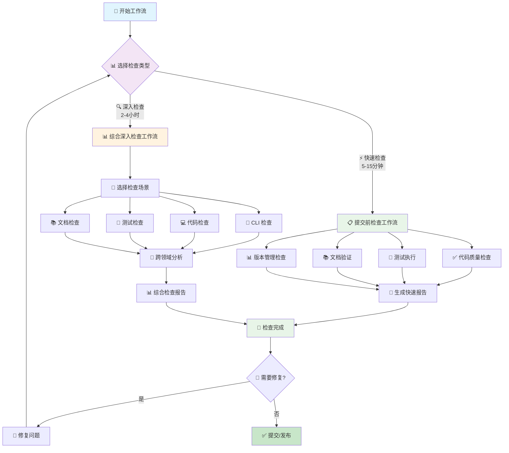

# 🤖 AI 工作流指南

> 本目录包含 AI 辅助开发的工作流指南，提供标准化的检查流程和参考文档。

## 📋 工作流概述

AI 工作流指南旨在为 AI 辅助开发提供标准化、系统化的检查流程，确保代码质量和项目规范。

### 🎯 设计目标

- **标准化流程**：为 AI 提供统一的工作标准和检查流程
- **提升效率**：通过快速参考和一键命令提升开发效率
- **保证质量**：系统化的检查确保代码、测试、文档的高质量
- **易于使用**：分层设计，从快速检查到深入分析的渐进式体验

### 🔄 工作流程图



---

## 🚀 核心工作流

### ⚡ 提交前检查工作流（5-15分钟）

**文档**：[pre-commit.md](./pre-commit.md)

**使用场景**：日常开发，代码提交前的快速验证

**核心功能**：
- 🔥 一键检查命令
- ✅ 代码质量验证
- 🧪 测试执行
- 📊 版本管理检查
- 📚 文档更新验证

### 🔍 综合深入检查工作流（2-4小时）

**文档**：[review.md](./review.md)

**使用场景**：功能完成后、定期审查、重大重构前、发布前

**核心功能**：
- 🎯 多场景检查选择
- 🔧 专门检查指南集成
- 🔗 跨领域问题分析
- 📄 综合检查报告生成
- 📅 定期审查工作流

---

## 📚 参考文档

> 参考文档位于 [`references/`](./references/) 目录下

### 🚀 快速参考

**文档**：[quick-reference.md](./references/quick-reference.md)

**核心价值**：1分钟快速查找所有关键信息

**包含内容**：
- 检查类型选择对照表
- 核心检查命令汇总
- 问题优先级速览
- 报告文件位置规范
- 故障排除快速指南

### 📝 样式规范

**文档**：[style.md](./references/style.md)

**核心价值**：统一文档格式和术语标准

**包含内容**：
- 术语规范（检查类型、优先级、状态）
- 视觉元素规范（图标、标题、代码块、表格）
- 检查清单格式和链接格式
- 信息框和文档结构模板

### 🔍 专门检查指南

| 检查领域 | 文档 | 时间投入 | 核心内容 |
|---------|------|----------|----------|
| 🔧 **CLI** | [review-cli.md](./references/review-cli.md) | 30分钟-1小时 | 命令结构、补全脚本、参数复用 |
| 💻 **代码** | [review-code.md](./references/review-code.md) | 1-2小时 | 重复代码、工具复用、第三方库 |
| 🧪 **测试** | [review-test-case.md](./references/review-test-case.md) | 1-2小时 | 覆盖情况、合理性、缺失测试 |
| 📊 **测试覆盖检查** | [test-coverage-check.md](./references/test-coverage-check.md) | 30分钟-1小时 | 测试覆盖检查机制、定期检查流程 |
| 📚 **文档** | [review-document.md](./references/review-document.md) | 30分钟-1小时 | README、架构文档、CHANGELOG |

---

## 🎯 使用指南

### 📊 选择合适的工作流

| 场景 | 推荐工作流 | 时间投入 | 使用频率 |
|------|------------|----------|----------|
| 🚀 **日常提交** | 提交前检查 | 5-15分钟 | 每次提交前 |
| 🎉 **功能完成** | 综合深入检查 | 1-2小时 | 功能完成后 |
| 📅 **定期审查** | 综合深入检查 | 2-4小时 | 每周/月 |
| 🔧 **重构前** | 综合深入检查 | 2-4小时 | 重大重构前 |
| 🎁 **发布前** | 综合深入检查 | 2-4小时 | 每次发布前 |

### 📈 工作流进度示例

#### ⚡ 提交前检查进度 (5-15分钟)

```
🚀 提交前检查进度: ████████████████████ 100%

✅ 代码质量    ████████████████████ 100% (2分钟)
✅ 测试执行    ████████████████████ 100% (5分钟)
✅ CLI补全     ████████████████████ 100% (1分钟)
✅ 编译验证    ████████████████████ 100% (1分钟)
✅ 版本检查    ████████████████████ 100% (1分钟)

🎉 检查完成! 总用时: 10分钟 | 状态: 全部通过 ✅
```

#### 🔍 综合深入检查进度 (2-4小时)

```
🔍 综合检查进度: ██████████████░░░░░░ 70% (预计剩余: 45分钟)

✅ 准备环境    ████████████████████ 100% (5分钟)
✅ CLI检查     ████████████████████ 100% (30分钟)
✅ 代码检查    ████████████████████ 100% (90分钟)
🔄 测试检查    ████████████░░░░░░░░  60% (30/50分钟)
⏳ 文档检查    ░░░░░░░░░░░░░░░░░░░░   0% (等待中)
⏳ 跨领域分析  ░░░░░░░░░░░░░░░░░░░░   0% (等待中)
⏳ 报告生成    ░░░░░░░░░░░░░░░░░░░░   0% (等待中)

📊 当前发现: P0问题(0个) P1问题(2个) P2问题(5个)
```

### 🚀 快速开始

#### 1️⃣ 新手入门
```markdown
1. 阅读 [快速参考指南](./references/quick-reference.md)（1分钟）
2. 尝试 [提交前检查](./pre-commit.md)（5-15分钟）
3. 熟悉后进行 [综合深入检查](./review.md)（2-4小时）
```

#### 2️⃣ 日常使用
```markdown
1. 提交前：运行提交前检查工作流
2. 功能完成：运行综合深入检查工作流
3. 遇到问题：查阅对应的专门检查指南
```

#### 3️⃣ 团队协作
```markdown
1. 统一使用相同的工作流标准
2. 参考样式规范编写文档
3. 定期进行团队检查和审查
```

---

## 📁 目录结构

```
docs/guidelines/workflows/
├── README.md                           # 本文件（工作流索引）
├── pre-commit.md                       # 提交前检查工作流
├── review.md                           # 综合深入检查工作流
└── references/                         # 参考文档
    ├── quick-reference.md                 # 快速参考指南
    ├── style.md                           # 样式规范指南
    ├── review-cli.md                      # CLI 检查指南
    ├── review-code.md                     # 代码检查指南
    ├── review-test-case.md                # 测试检查指南
    ├── test-coverage-check.md             # 测试覆盖检查机制指南
    └── review-document.md                 # 文档检查指南
```

---

## 🔗 相关文档

### 传统开发指南
- [开发规范](../development.md) - 传统开发规范和最佳实践
- [测试规范](../testing.md) - 传统测试规范和方法
- [文档编写指南](../document.md) - 传统文档编写规范

### 架构文档
- [总体架构](../../architecture/architecture.md) - 项目整体架构设计
- [CLI 架构](../../architecture/cli.md) - CLI 层架构设计

---

## 💡 贡献指南

### 改进工作流

1. **发现问题**：在使用过程中发现问题或改进机会
2. **提出建议**：通过 GitHub Issues 提出改进建议
3. **讨论方案**：团队讨论改进方案的可行性
4. **实施改进**：按照样式规范更新文档
5. **验证效果**：在实际使用中验证改进效果

### 文档维护

- **遵循样式规范**：使用统一的术语和格式
- **保持同步更新**：工作流变更时及时更新文档
- **定期审查**：定期检查文档的准确性和完整性

---

**最后更新**: 2025-12-18
**维护者**: AI 工作流团队
