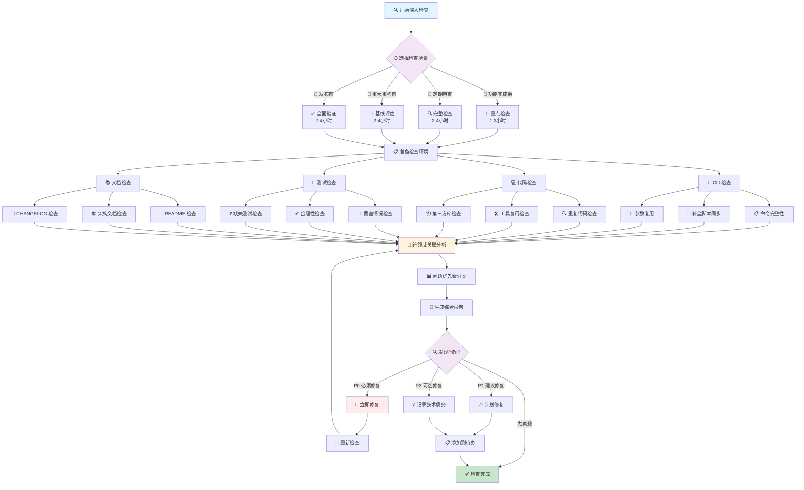

# 综合深入检查指南

> 🔍 **深度检查流程**：系统化的综合检查方法，用于功能完成后、定期全面审查和重大重构前（2-4小时）
>
> 🚀 **快速开始**：[选择检查场景](#-何时进行深入检查) | [查看快速参考](./references/QUICK_REFERENCE_GUIDELINES.md)

## 📖 检查指南体系

| 指南类型 | 时间投入 | 使用场景 | 链接 |
|---------|----------|----------|------|
| 🚀 **快速参考** | 1分钟 | 快速查找命令和清单 | [快速参考指南](./references/QUICK_REFERENCE_GUIDELINES.md) |
| ⚡ **提交前检查** | 5-15分钟 | 日常提交前验证 | [提交前检查指南](./PRE_COMMIT_GUIDELINES.md) |
| 🔍 **深入检查** | 2-4小时 | 功能完成后、定期审查 | 本文档 |

### 专门检查指南

- [🔧 CLI 检查指南](./references/REVIEW_CLI_GUIDELINES.md) - 命令结构、补全脚本、参数复用
- [💻 代码检查指南](./references/REVIEW_CODE_GUIDELINES.md) - 重复代码、工具复用、第三方库
- [🧪 测试检查指南](./references/REVIEW_TEST_CASE_GUIDELINES.md) - 测试覆盖、合理性、缺失测试
- [📚 文档检查指南](./references/REVIEW_DOCUMENT_GUIDELINES.md) - README、架构文档、CHANGELOG

---

## 📋 快速导航

### 🎯 开始检查
- [⏰ 选择检查场景](#-何时进行深入检查) - 确定检查类型和范围
- [🚀 执行检查步骤](#-检查步骤) - 按步骤完成检查
- [📊 查看检查概述](#-检查概述) - 了解检查目标和范围

### 🔍 专门检查
- [🔧 CLI 检查](#1-cli-检查) - 命令完整性、补全脚本（30分钟-1小时）
- [💻 代码检查](#2-代码检查) - 重复代码、工具复用（1-2小时）
- [🧪 测试检查](#3-测试用例检查) - 测试覆盖、合理性（1-2小时）
- [📚 文档检查](#4-文档检查) - 文档完整性、准确性（30分钟-1小时）

### 📊 分析和报告
- [🔗 跨领域分析](#-跨领域问题关联分析) - 识别问题关联
- [📄 生成报告](#-生成综合检查报告) - 创建综合检查报告
- [📅 定期审查](#-定期审查工作流) - 建立定期检查机制

---

## 🎯 检查概述

> 🔍 **深度质量保障**：系统化检查所有代码、测试、文档、CLI，确保项目质量

### 🎯 检查目标

| 目标 | 描述 | 输出 |
|------|------|------|
| 🔍 **全面质量评估** | 系统化检查所有领域 | 质量评分和改进建议 |
| 🚨 **问题识别** | 发现代码重复、测试缺失等 | 问题清单和优先级 |
| 💡 **改进建议** | 提供具体解决方案 | 改进计划和时间安排 |
| 🔗 **跨领域分析** | 识别问题关联和优化机会 | 关联分析和整体优化 |

### 📊 检查范围

| 领域 | 检查内容 | 时间估算 | 专门指南 |
|------|----------|----------|----------|
| 🔧 **CLI** | 命令结构、补全脚本、参数复用 | 30分钟-1小时 | [CLI检查指南](./references/REVIEW_CLI_GUIDELINES.md) |
| 💻 **代码** | 重复代码、工具复用、依赖优化 | 1-2小时 | [代码检查指南](./references/REVIEW_CODE_GUIDELINES.md) |
| 🧪 **测试** | 覆盖情况、合理性、缺失测试 | 1-2小时 | [测试检查指南](./references/REVIEW_TEST_CASE_GUIDELINES.md) |
| 📚 **文档** | README、架构文档、CHANGELOG | 30分钟-1小时 | [文档检查指南](./references/REVIEW_DOCUMENT_GUIDELINES.md) |

### ⏱️ 时间投入规划

| 检查类型 | 时间投入 | 适用场景 | 检查深度 |
|---------|----------|----------|----------|
| 🚀 **快速检查** | 30分钟-1小时 | 单个领域问题 | 使用专门指南 |
| ⚡ **重点检查** | 1-2小时 | 选择2-3个重点领域 | 部分深入分析 |
| 🔍 **完整检查** | 2-4小时 | 功能完成后、定期审查 | 全面深入分析 |

### 📊 检查进度指示器

#### 🔍 完整检查进度 (2-4小时)

```
总体进度: ████████░░ 80% (4/5 阶段完成)

📋 准备阶段     ████████████████████ 100% ✅ 已完成 (5分钟)
🔧 CLI 检查     ████████████████████ 100% ✅ 已完成 (45分钟)
💻 代码检查     ████████████████████ 100% ✅ 已完成 (90分钟)
🧪 测试检查     ████████████████████ 100% ✅ 已完成 (75分钟)
📚 文档检查     ██████████░░░░░░░░░░  50% 🔄 进行中 (15/30分钟)
🔗 跨领域分析   ░░░░░░░░░░░░░░░░░░░░   0% ⏳ 等待中
📄 报告生成     ░░░░░░░░░░░░░░░░░░░░   0% ⏳ 等待中

预计剩余时间: 45分钟
```

#### ⚡ 重点检查进度 (1-2小时)

```
总体进度: ██████████████░░░░░░ 70% (2/3 领域完成)

🔧 CLI 检查     ████████████████████ 100% ✅ 已完成 (30分钟)
💻 代码检查     ████████████████████ 100% ✅ 已完成 (60分钟)
🧪 测试检查     ████████░░░░░░░░░░░░  40% 🔄 进行中 (20/50分钟)

预计剩余时间: 30分钟
```

#### 🚀 快速检查进度 (30分钟-1小时)

```
总体进度: ████████████████████ 100% ✅ 检查完成

🔧 CLI 检查     ████████████████████ 100% ✅ 已完成 (25分钟)

总用时: 25分钟 | 发现问题: 3个 | 优先级: P1(2个) P2(1个)
```

---

## ⏰ 何时进行深入检查

> 🎯 **选择合适的检查时机**：根据开发阶段和需求选择检查类型

### 📋 检查场景对照表

| 场景 | 检查类型 | 时间投入 | 检查重点 | 频率 |
|------|----------|----------|----------|------|
| 🚀 **功能完成后** | 重点检查 | 1-2小时 | 新功能相关领域 | 每次功能完成 |
| 📅 **定期审查** | 完整检查 | 2-4小时 | 所有领域 + 跨领域分析 | 每周/月/季度 |
| 🔧 **重大重构前** | 完整检查 | 2-4小时 | 基线评估 + 影响分析 | 重构前必做 |
| 🎉 **发布前检查** | 完整检查 | 2-4小时 | 全面检查 + 版本文档 | 每次发布前 |

### 🎯 详细场景指南

#### 1️⃣ 功能完成后检查

```
🎯 目标：确保新功能质量
⏱️ 时间：1-2小时
🔍 范围：重点检查
```

**检查重点**：
- ✅ 新功能相关的代码检查
- ✅ 新功能的测试覆盖检查
- ✅ 相关文档更新检查
- ✅ CLI 命令注册检查（如涉及新命令）

#### 2️⃣ 定期全面审查

```
🎯 目标：维护整体代码质量
⏱️ 时间：2-4小时
🔍 范围：完整检查
```

**检查频率**：
- 📅 **每周**：重点领域检查（选择2-3个领域）
- 📅 **每月**：全面深入检查（所有领域）
- 📅 **每季度**：全面检查 + 架构评估

**检查重点**：
- ✅ 所有领域的全面检查
- ✅ 跨领域问题关联分析
- ✅ 长期技术债务识别

#### 3️⃣ 重大重构前检查

```
🎯 目标：评估重构基线和影响
⏱️ 时间：2-4小时
🔍 范围：完整检查 + 特殊分析
```

**检查重点**：
- ✅ 当前代码质量基线评估
- ✅ 重构影响范围分析
- ✅ 测试覆盖情况评估
- ✅ 文档完整性检查

#### 4️⃣ 发布前检查

```
🎯 目标：确保发布质量
⏱️ 时间：2-4小时
🔍 范围：完整检查 + 发布验证
```

**检查重点**：
- ✅ 所有领域的全面检查
- ✅ 版本相关文档更新检查
- ✅ 迁移文档检查（如有破坏性变更）
- ✅ 发布流程验证

---

## 🚀 检查步骤

### 📊 综合检查流程图



### 📋 详细检查步骤

按照以下步骤依次完成综合深入检查：

### 第一步：准备检查环境

1. **确保代码最新**：
   ```bash
   git pull origin main
   git status  # 确认工作区干净
   ```

2. **运行基础检查**：
   ```bash
   # 确保代码可以编译
   cargo check

   # 确保测试通过
   cargo test

   # 确保格式化通过
   cargo fmt --check

   # 确保 Clippy 通过
   cargo clippy -- -D warnings
   ```

3. **准备检查报告目录**：
   ```bash
   mkdir -p report
   ```

### 第二步：运行专门指南检查

按照以下顺序运行各个专门指南的检查：

1. **CLI 检查**（`reviews/REVIEW_CLI_GUIDELINES.md`）
2. **代码检查**（`reviews/REVIEW_CODE_GUIDELINES.md`）
3. **测试用例检查**（`reviews/REVIEW_TEST_CASE_GUIDELINES.md`）
4. **文档检查**（`reviews/REVIEW_DOCUMENT_GUIDELINES.md`）

**说明**：
- 每个专门指南都会生成详细的检查报告
- 报告保存在 `report/` 目录下
- 记录每个检查的发现和问题

### 第三步：整合检查结果

1. **汇总所有检查报告**：
   - 收集所有专门指南生成的报告
   - 汇总问题列表
   - 统计问题数量

2. **问题分类**：
   - 按领域分类（代码、测试、文档、CLI）
   - 按优先级分类（P0、P1、P2）
   - 按类型分类（重复代码、缺失测试、文档不完整等）

### 第四步：跨领域问题关联分析

识别跨领域的问题关联：

1. **代码与测试关联**：
   - 代码重复是否影响测试覆盖？
   - 新增代码是否有对应测试？
   - 重构代码是否更新了测试？

2. **代码与文档关联**：
   - 代码变更是否更新了文档？
   - 文档是否准确反映了代码实现？
   - 架构文档是否反映了代码结构？

3. **CLI 与文档关联**：
   - CLI 命令是否在文档中说明？
   - 文档中的命令示例是否准确？
   - 补全脚本是否与文档一致？

4. **测试与文档关联**：
   - 测试用例是否覆盖了文档中的功能？
   - 文档中的示例是否可测试？

### 第五步：生成综合检查报告

根据整合的检查结果和跨领域分析，生成综合深入检查报告。

**对应章节**：[生成综合检查报告](#-生成综合检查报告)

---

## 📚 专门指南检查

### 1. CLI 检查

**指南**：[CLI 检查指南](./references/REVIEW_CLI_GUIDELINES.md)

**检查内容**：
- 命令完整性检查
- 补全脚本同步检查
- 参数复用检查
- 参数提取机会检查
- 命名一致性检查

**检查方法**：
```bash
# 运行补全完整性测试
cargo test --test completeness

# 运行参数检查测试
cargo test --test args_check

# 手动生成补全脚本验证
cargo run -- completion generate
```

**报告位置**：`report/REVIEW_CLI_{timestamp}.md`

其中 `{timestamp}` 为当前日期和时间，格式为 `YYYY-MM-DD_HH-MM-SS`（如：`2024-12-19_14-30-00`）。

**生成带时间戳的文件名**：

在 Rust 代码中：
```rust
use workflow::base::util::date::format_filename_timestamp;

let timestamp = format_filename_timestamp();
let report_path = format!("report/REVIEW_CLI_{}.md", timestamp);
```

在命令行中：
```bash
# Unix/macOS/Linux
TIMESTAMP=$(date +%Y-%m-%d_%H-%M-%S)
echo "report/REVIEW_CLI_${TIMESTAMP}.md"

# Windows PowerShell
$timestamp = Get-Date -Format "yyyy-MM-dd_HH-mm-ss"
Write-Host "report/REVIEW_CLI_${timestamp}.md"
```

**时间估算**：30 分钟-1 小时

### 2. 代码检查

**指南**：[代码检查指南](./references/REVIEW_CODE_GUIDELINES.md)

**检查内容**：
- 重复代码检查（10 种模式）
- 已封装工具检查
- 第三方工具检查

**检查方法**：
```bash
# 使用 grep 搜索重复模式
grep -r "fs::read_to_string" src/
grep -r "fs::write" src/
grep -r "cmd(\"git\"" src/

# 使用语义搜索查找相似代码
# （在 IDE 或代码审查工具中）
```

**报告位置**：`report/REVIEW_CODE_{timestamp}.md`

其中 `{timestamp}` 为当前日期和时间，格式为 `YYYY-MM-DD_HH-MM-SS`（如：`2024-12-19_14-30-00`）。

**生成带时间戳的文件名**：

在 Rust 代码中：
```rust
use workflow::base::util::date::format_filename_timestamp;

let timestamp = format_filename_timestamp();
let report_path = format!("report/REVIEW_CODE_{}.md", timestamp);
```

在命令行中：
```bash
# Unix/macOS/Linux
TIMESTAMP=$(date +%Y-%m-%d_%H-%M-%S)
echo "report/REVIEW_CODE_${TIMESTAMP}.md"

# Windows PowerShell
$timestamp = Get-Date -Format "yyyy-MM-dd_HH-mm-ss"
Write-Host "report/REVIEW_CODE_${timestamp}.md"
```

**时间估算**：1-2 小时

### 3. 测试用例检查

**指南**：[测试用例检查指南](./references/REVIEW_TEST_CASE_GUIDELINES.md)

**检查内容**：
- 测试覆盖情况检查
- 测试用例合理性检查
- 缺失测试用例检查

**检查方法**：
```bash
# 运行所有测试
cargo test --verbose

# 检查测试文件结构
find tests/ -name "*.rs" -type f

# 检查单元测试
grep -r "#[cfg(test)]" src/
```

**报告位置**：`report/REVIEW_TEST_{timestamp}.md`

其中 `{timestamp}` 为当前日期和时间，格式为 `YYYY-MM-DD_HH-MM-SS`（如：`2024-12-19_14-30-00`）。

**生成带时间戳的文件名**：

在 Rust 代码中：
```rust
use workflow::base::util::date::format_filename_timestamp;

let timestamp = format_filename_timestamp();
let report_path = format!("report/REVIEW_TEST_{}.md", timestamp);
```

在命令行中：
```bash
# Unix/macOS/Linux
TIMESTAMP=$(date +%Y-%m-%d_%H-%M-%S)
echo "report/REVIEW_TEST_${TIMESTAMP}.md"

# Windows PowerShell
$timestamp = Get-Date -Format "yyyy-MM-dd_HH-mm-ss"
Write-Host "report/REVIEW_TEST_${timestamp}.md"
```

**时间估算**：1-2 小时

### 4. 文档检查

**指南**：[文档检查指南](./references/REVIEW_DOCUMENT_GUIDELINES.md)

**检查内容**：
- README.md 检查
- docs/ 目录检查
- CHANGELOG.md 检查
- 重复内容检查
- 文档位置检查
- 文档优化和补全检查

**检查方法**：
```bash
# 检查文档链接
# （使用文档检查工具或手动检查）

# 检查文档结构
tree docs/

# 检查文档索引
cat docs/README.md
```

**报告位置**：`report/REVIEW_DOCUMENT_{timestamp}.md`

其中 `{timestamp}` 为当前日期和时间，格式为 `YYYY-MM-DD_HH-MM-SS`（如：`2024-12-19_14-30-00`）。

**生成带时间戳的文件名**：

在 Rust 代码中：
```rust
use workflow::base::util::date::format_filename_timestamp;

let timestamp = format_filename_timestamp();
let report_path = format!("report/REVIEW_DOCUMENT_{}.md", timestamp);
```

在命令行中：
```bash
# Unix/macOS/Linux
TIMESTAMP=$(date +%Y-%m-%d_%H-%M-%S)
echo "report/REVIEW_DOCUMENT_${TIMESTAMP}.md"

# Windows PowerShell
$timestamp = Get-Date -Format "yyyy-MM-dd_HH-mm-ss"
Write-Host "report/REVIEW_DOCUMENT_${timestamp}.md"
```

**时间估算**：30 分钟-1 小时

---

## 🔗 跨领域问题关联分析

### 分析目标

识别跨领域的问题关联，发现：
- 一个问题在多个领域的影响
- 多个问题的共同根源
- 优化一个领域可以改善其他领域的机会

### 分析方法

#### 1. 代码与测试关联

**检查项**：
- [ ] 新增代码是否有对应测试？
- [ ] 重构代码是否更新了测试？
- [ ] 代码重复是否影响测试覆盖？
- [ ] 测试用例是否覆盖了所有代码路径？

**示例**：
- 如果发现代码重复，检查是否有重复的测试用例
- 如果发现缺失测试，检查相关代码是否复杂或关键

#### 2. 代码与文档关联

**检查项**：
- [ ] 代码变更是否更新了文档？
- [ ] 文档是否准确反映了代码实现？
- [ ] 架构文档是否反映了代码结构？
- [ ] API 文档是否与代码一致？

**示例**：
- 如果发现代码重构，检查架构文档是否更新
- 如果发现新增功能，检查 README.md 是否更新

#### 3. CLI 与文档关联

**检查项**：
- [ ] CLI 命令是否在文档中说明？
- [ ] 文档中的命令示例是否准确？
- [ ] 补全脚本是否与文档一致？
- [ ] 命令参数是否在文档中说明？

**示例**：
- 如果发现新增 CLI 命令，检查 README.md 是否更新
- 如果发现参数变更，检查文档中的示例是否更新

#### 4. 测试与文档关联

**检查项**：
- [ ] 测试用例是否覆盖了文档中的功能？
- [ ] 文档中的示例是否可测试？
- [ ] 测试用例是否验证了文档中的行为？

**示例**：
- 如果文档中描述了某个功能，检查是否有对应测试
- 如果测试用例验证了某个行为，检查文档是否说明

### 关联问题优先级

**P0（必须修复）**：
- 跨领域影响核心功能的问题
- 导致功能不一致的问题
- 影响用户体验的问题

**P1（建议修复）**：
- 跨领域影响代码质量的问题
- 导致维护困难的问题
- 影响开发效率的问题

**P2（可选修复）**：
- 跨领域优化机会
- 长期技术债务
- 代码风格改进

---

## 📄 生成综合检查报告

完成所有检查后，生成综合深入检查报告。

### 报告位置

**文件路径**：`report/REVIEW_REPORT_{timestamp}.md`

其中 `{timestamp}` 为当前日期和时间，格式为 `YYYY-MM-DD_HH-MM-SS`（如：`2024-12-19_14-30-00`）。

**生成带时间戳的文件名**：

在 Rust 代码中（自动获取当前时间）：
```rust
use workflow::base::util::date::format_filename_timestamp;

// 函数会自动获取当前时间，无需提前获取
let timestamp = format_filename_timestamp();
let report_path = format!("report/REVIEW_REPORT_{}.md", timestamp);
// 输出：report/REVIEW_REPORT_2024-12-19_14-30-00.md
```

> **注意**：`format_filename_timestamp()` 函数会在调用时自动获取当前系统时间，无需提前获取。每次调用都会返回最新的时间戳。

在命令行中（手动获取当前时间）：
```bash
# Unix/macOS/Linux
TIMESTAMP=$(date +%Y-%m-%d_%H-%M-%S)
echo "report/REVIEW_REPORT_${TIMESTAMP}.md"

# Windows PowerShell
$timestamp = Get-Date -Format "yyyy-MM-dd_HH-mm-ss"
Write-Host "report/REVIEW_REPORT_${timestamp}.md"
```

**示例文件名**：`report/REVIEW_REPORT_2024-12-19_14-30-00.md`

### 报告内容

#### 1. 检查概览

- 检查日期和时间
- 检查人员
- 检查范围（本次检查涉及的功能/模块）
- 检查类型（功能完成、定期审查、重大重构前、发布前）

#### 2. 专门指南检查结果

按照检查顺序，记录每个专门指南的检查结果：

**CLI 检查结果**：
- 检查状态：✅ 通过 / ⚠️ 部分通过 / ❌ 未通过
- 主要发现：问题数量、关键问题
- 详细报告：引用 `report/REVIEW_CLI_{timestamp}.md`

**代码检查结果**：
- 检查状态：✅ 通过 / ⚠️ 部分通过 / ❌ 未通过
- 主要发现：重复代码数量、工具复用机会、第三方库替换机会
- 详细报告：引用 `report/REVIEW_CODE_{timestamp}.md`

**测试用例检查结果**：
- 检查状态：✅ 通过 / ⚠️ 部分通过 / ❌ 未通过
- 主要发现：测试覆盖情况、缺失测试、测试合理性
- 详细报告：引用 `report/REVIEW_TEST_{timestamp}.md`

**文档检查结果**：
- 检查状态：✅ 通过 / ⚠️ 部分通过 / ❌ 未通过
- 主要发现：文档完整性、文档准确性、文档一致性
- 详细报告：引用 `report/REVIEW_DOCUMENT_{timestamp}.md`

#### 3. 跨领域问题关联分析

**代码与测试关联**：
- 发现的问题
- 影响范围
- 改进建议

**代码与文档关联**：
- 发现的问题
- 影响范围
- 改进建议

**CLI 与文档关联**：
- 发现的问题
- 影响范围
- 改进建议

**测试与文档关联**：
- 发现的问题
- 影响范围
- 改进建议

#### 4. 问题汇总

**P0（必须修复）**：
- 问题描述
- 问题位置（文件路径和行号）
- 影响范围（跨领域影响）
- 修复状态（已修复/待修复/已记录）
- 修复方案

**P1（建议修复）**：
- 问题描述
- 问题位置
- 影响范围
- 修复状态
- 修复方案

**P2（可选修复）**：
- 问题描述
- 问题位置
- 影响范围
- 修复状态
- 修复方案

#### 5. 统计信息

- **代码检查**：重复代码数量、工具复用机会、第三方库替换机会
- **测试检查**：测试覆盖情况、缺失测试数量、测试合理性评分
- **文档检查**：文档完整性评分、文档准确性评分、文档一致性评分
- **CLI 检查**：命令完整性、补全脚本同步、参数复用情况

#### 6. 改进建议

**短期改进**（1-2 周）：
- 必须修复的问题
- 高优先级的改进

**中期改进**（1-2 月）：
- 建议修复的问题
- 代码质量提升

**长期改进**（3-6 月）：
- 可选修复的问题
- 架构优化
- 技术债务清理

#### 7. 总结

- 检查完成度（百分比）
- 总体质量评估
- 关键发现
- 下一步行动

### 报告模板

```markdown
# 综合深入检查报告

**检查日期**：YYYY-MM-DD HH:MM:SS
**检查人员**：[姓名]
**检查范围**：[本次检查涉及的功能/模块]
**检查类型**：[功能完成 / 定期审查 / 重大重构前 / 发布前]

---

## 检查概览

[简要描述本次检查的范围和目的]

---

## 专门指南检查结果

### CLI 检查

**状态**：✅ 通过 / ⚠️ 部分通过 / ❌ 未通过

**主要发现**：
- 问题数量：X 个
- 关键问题：[描述]

**详细报告**：[CLI 检查报告](./REVIEW_CLI_{timestamp}.md)（替换 `{timestamp}` 为实际时间戳）

---

### 代码检查

**状态**：✅ 通过 / ⚠️ 部分通过 / ❌ 未通过

**主要发现**：
- 重复代码：X 处
- 工具复用机会：X 处
- 第三方库替换机会：X 处

**详细报告**：[代码检查报告](./REVIEW_CODE_{timestamp}.md)（替换 `{timestamp}` 为实际时间戳）

---

### 测试用例检查

**状态**：✅ 通过 / ⚠️ 部分通过 / ❌ 未通过

**主要发现**：
- 测试覆盖情况：[描述]
- 缺失测试：X 个
- 测试合理性：[描述]

**详细报告**：[测试覆盖报告](./REVIEW_TEST_{timestamp}.md)（替换 `{timestamp}` 为实际时间戳）

---

### 文档检查

**状态**：✅ 通过 / ⚠️ 部分通过 / ❌ 未通过

**主要发现**：
- 文档完整性：[描述]
- 文档准确性：[描述]
- 文档一致性：[描述]

**详细报告**：[文档检查报告](./REVIEW_DOCUMENT_{timestamp}.md)（替换 `{timestamp}` 为实际时间戳）

---

## 跨领域问题关联分析

### 代码与测试关联

**发现的问题**：
- [问题描述] - [影响范围] - [改进建议]

### 代码与文档关联

**发现的问题**：
- [问题描述] - [影响范围] - [改进建议]

### CLI 与文档关联

**发现的问题**：
- [问题描述] - [影响范围] - [改进建议]

### 测试与文档关联

**发现的问题**：
- [问题描述] - [影响范围] - [改进建议]

---

## 问题汇总

### P0（必须修复）

- [ ] [问题描述] - [位置] - [影响范围] - [修复状态]

### P1（建议修复）

- [ ] [问题描述] - [位置] - [影响范围] - [修复状态]

### P2（可选修复）

- [ ] [问题描述] - [位置] - [影响范围] - [修复状态]

---

## 统计信息

- **代码检查**：重复代码 X 处，工具复用机会 X 处，第三方库替换机会 X 处
- **测试检查**：测试覆盖 X%，缺失测试 X 个
- **文档检查**：文档完整性 X%，文档准确性 X%
- **CLI 检查**：命令完整性 X%，补全脚本同步 X%

---

## 改进建议

### 短期改进（1-2 周）

- [改进建议 1]
- [改进建议 2]

### 中期改进（1-2 月）

- [改进建议 1]
- [改进建议 2]

### 长期改进（3-6 月）

- [改进建议 1]
- [改进建议 2]

---

## 总结

**检查完成度**：X%

**总体质量评估**：[优秀 / 良好 / 需要改进]

**关键发现**：
- [发现 1]
- [发现 2]

**下一步行动**：
- [行动 1]
- [行动 2]
```

---

## 📅 定期审查工作流

### 每周审查

**时间**：每周一次（建议周五下午）

**检查范围**：
- 快速检查（`PRE_COMMIT_GUIDELINES.md`）
- 重点领域深入检查（选择 2-3 个领域）

**检查流程**：
1. 运行快速检查（5-15 分钟）
2. 根据本周工作重点，选择 2-3 个领域进行深入检查
3. 生成重点领域检查报告
4. 记录关键问题和改进建议

**时间估算**：1-2 小时

### 每月审查

**时间**：每月一次（建议月末）

**检查范围**：
- 所有领域的全面深入检查

**检查流程**：
1. 运行所有专门指南检查
2. 进行跨领域问题关联分析
3. 生成综合深入检查报告
4. 制定下月改进计划

**时间估算**：2-4 小时

### 每季度审查

**时间**：每季度一次（建议季度末）

**检查范围**：
- 所有领域的全面深入检查
- 架构评估
- 技术债务评估

**检查流程**：
1. 运行所有专门指南检查
2. 进行跨领域问题关联分析
3. 架构评估
4. 技术债务评估
5. 生成综合深入检查报告
6. 制定下季度改进计划

**时间估算**：4-6 小时

---

## ⚡ 快速参考

### 检查命令

```bash
# 1. 基础检查
cargo check
cargo test
cargo fmt --check
cargo clippy -- -D warnings

# 2. CLI 检查
cargo test --test completeness
cargo test --test args_check

# 3. 代码检查
grep -r "fs::read_to_string" src/
grep -r "fs::write" src/
grep -r "cmd(\"git\"" src/

# 4. 测试检查
cargo test --verbose
find tests/ -name "*.rs" -type f
grep -r "#[cfg(test)]" src/
```

### 专门指南链接

- [CLI 检查指南](./references/REVIEW_CLI_GUIDELINES.md)
- [代码检查指南](./references/REVIEW_CODE_GUIDELINES.md)
- [测试用例检查指南](./references/REVIEW_TEST_CASE_GUIDELINES.md)
- [文档检查指南](./references/REVIEW_DOCUMENT_GUIDELINES.md)

### 报告位置

- CLI 检查报告：`report/REVIEW_CLI_{timestamp}.md`
- 代码检查报告：`report/REVIEW_CODE_{timestamp}.md`
- 测试覆盖报告：`report/REVIEW_TEST_{timestamp}.md`
- 文档检查报告：`report/REVIEW_DOCUMENT_{timestamp}.md`
- 综合检查报告：`report/REVIEW_REPORT_{timestamp}.md`

其中 `{timestamp}` 为当前日期和时间，格式为 `YYYY-MM-DD_HH-MM-SS`（如：`2024-12-19_14-30-00`）。

**生成时间戳**：使用 `workflow::base::util::date::format_filename_timestamp()` 函数或命令行 `date` 命令。

---

## ❓ 常见问题

### Q: 什么时候使用快速检查，什么时候使用深入检查？

**A**:
- **快速检查**（`PRE_COMMIT_GUIDELINES.md`）：日常提交前，快速验证代码质量（5-15 分钟）
- **深入检查**（`REVIEW_GUIDELINES.md`）：功能完成后、定期审查、重大重构前（2-4 小时）

### Q: 必须运行所有专门指南吗？

**A**:
- **完整检查**：运行所有 4 个专门指南（2-4 小时）
- **重点检查**：根据工作重点，选择 2-3 个领域（1-2 小时）
- **单个检查**：使用对应的专门指南（30 分钟-1 小时）

### Q: 如何选择重点检查领域？

**A**:
- 根据本周/本月的工作重点
- 根据最近发现的问题
- 根据代码变更范围
- 根据项目优先级

### Q: 综合检查报告和单个检查报告有什么区别？

**A**:
- **单个检查报告**：专注于单一领域，详细分析该领域的问题
- **综合检查报告**：整合所有领域，进行跨领域问题关联分析，提供整体质量评估

### Q: 如何利用跨领域问题关联分析？

**A**:
- 识别问题的根本原因
- 发现优化一个领域可以改善其他领域的机会
- 制定更有效的改进计划
- 避免重复修复相同根源的问题

---

**完成综合深入检查后，代码质量将得到全面提升！** 🎉

---

**最后更新**: 2025-12-16
