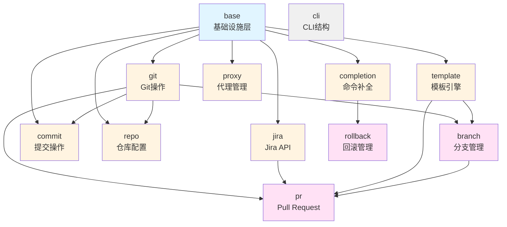

# src/lib 模块依赖关系分析

本文档详细分析了 `src/lib` 目录下各个模块之间的依赖关系。

## 快速参考

### 模块层级
- **L0**: `cli` - CLI 结构定义（无业务依赖）
- **L1**: `base` - 基础设施层
- **L2**: `git`, `jira`, `commit`, `completion`, `proxy`, `repo`, `template` - 基础业务模块
- **L3**: `branch`, `pr`, `rollback` - 高级业务模块

### 关键依赖路径
1. `base` → `git` → `branch`/`commit`/`repo`
2. `base` → `jira` → `pr`
3. `base` → `template` → `branch`/`pr`
4. `base` → `completion` → `rollback`
5. `git` + `jira` + `branch` + `template` → `pr`

### 高耦合模块
- `pr` - 依赖 5 个模块
- `branch` - 依赖 5 个模块

### 核心模块（被广泛依赖）
- `base` - 被 10 个模块依赖
- `git` - 被 4 个模块依赖
- `template` - 被 2 个模块依赖

## 模块概览

`src/lib` 目录包含以下主要模块：

1. **base** - 基础设施模块（最底层）
2. **git** - Git 操作模块
3. **jira** - Jira API 集成模块
4. **pr** - Pull Request 相关模块
5. **branch** - 分支管理模块
6. **commit** - 提交操作模块
7. **completion** - 命令补全模块
8. **proxy** - 代理管理模块
9. **repo** - 仓库配置模块
10. **template** - 模板引擎模块
11. **rollback** - 回滚管理模块
12. **cli** - CLI 命令结构定义模块

## 依赖关系图

### Mermaid 依赖关系图



### 层级结构（文本版）

```
┌─────────────────────────────────────────────────────────────┐
│                        base (基础设施层)                      │
│  - http, logger, format, util, settings, shell, interactive  │
│  - llm, prompt, alias, concurrent, constants, verify       │
└─────────────────────────────────────────────────────────────┘
                            │
        ┌───────────────────┼───────────────────┐
        │                   │                   │
┌───────▼──────┐   ┌────────▼────────┐   ┌─────▼──────┐
│     git      │   │      jira       │   │  template  │
│  (Git操作)    │   │  (Jira API)     │   │  (模板引擎) │
└───────┬──────┘   └────────┬────────┘   └─────┬──────┘
        │                   │                   │
        └───────────────────┼───────────────────┘
                            │
        ┌───────────────────┼───────────────────┐
        │                   │                   │
┌───────▼──────┐   ┌────────▼────────┐   ┌─────▼──────┐
│    branch    │   │       pr        │   │   commit   │
│  (分支管理)   │   │  (Pull Request) │   │  (提交操作) │
└───────┬──────┘   └────────┬────────┘   └────────────┘
        │                   │
        └───────────────────┼───────────────────┐
                            │                   │
                    ┌───────▼──────┐   ┌────────▼────────┐
                    │   completion │   │     repo        │
                    │  (命令补全)   │   │  (仓库配置)      │
                    └──────────────┘   └─────────────────┘
                            │
                    ┌───────▼──────┐
                    │   rollback   │
                    │   (回滚管理)  │
                    └──────────────┘
```

## 详细依赖关系

### 1. base 模块（基础设施层）

**位置**: `src/lib/base/`

**子模块**:
- `http` - HTTP 客户端
- `logger` - 日志功能
- `format` - 格式化工具
- `util` - 工具函数
- `settings` - 配置管理
- `shell` - Shell 检测和管理
- `interactive` - 交互式对话框和表单
- `llm` - LLM 客户端
- `prompt` - Prompt 管理
- `alias` - 别名管理
- `concurrent` - 并发执行器
- `constants` - 常量定义
- `verify` - 验证功能
- `mcp` - MCP 配置

**被依赖关系**:
- ✅ **所有其他模块都依赖 base**
- base 模块是基础设施层，不依赖任何业务模块

**依赖的外部模块**: 无（只依赖标准库和第三方库）

---

### 2. git 模块

**位置**: `src/lib/git/`

**依赖关系**:
- ✅ `base::interactive::spinner` - 进度指示器
- ✅ `base::util::file::FileReader` - 文件读取
- ✅ `base::logger` - 日志功能（通过宏）

**被依赖关系**:
- ✅ `branch::sync` - 分支同步需要 Git 操作
- ✅ `commit::*` - 所有提交操作都依赖 Git
- ✅ `pr::platform` - PR 平台需要 Git 仓库信息
- ✅ `pr::helpers::resolution` - PR 解析需要 Git
- ✅ `repo::config` - 仓库配置需要 Git 信息

**依赖层级**: L2（依赖 base）

---

### 3. jira 模块

**位置**: `src/lib/jira/`

**子模块**:
- `api` - Jira API 客户端
- `attachments` - 附件下载
- `client` - Jira 客户端包装器
- `config` - 配置管理
- `helpers` - 辅助函数
- `history` - 工作历史
- `logs` - 日志管理
- `status` - 状态管理
- `ticket` - Ticket 操作
- `types` - 类型定义
- `users` - 用户管理

**依赖关系**:
- ✅ `base::http::HttpClient` - HTTP 请求
- ✅ `base::settings::Settings` - 配置读取
- ✅ `base::settings::paths::Paths` - 路径管理
- ✅ `base::util::file::{FileReader, FileWriter}` - 文件操作
- ✅ `base::util::directory::DirectoryWalker` - 目录遍历
- ✅ `base::format::DisplayFormatter` - 格式化显示
- ✅ `base::concurrent::TaskResult` - 并发任务结果

**被依赖关系**:
- ✅ `pr::body_parser` - PR 解析需要提取 Jira ticket
- ✅ `pr::github::platform` - GitHub 平台需要 Jira 历史记录

**依赖层级**: L2（依赖 base）

---

### 4. pr 模块

**位置**: `src/lib/pr/`

**子模块**:
- `body_parser` - PR 正文解析
- `github` - GitHub 集成
- `helpers` - 辅助函数
- `llm` - LLM 生成器
- `platform` - 平台抽象
- `table` - 表格显示

**依赖关系**:
- ✅ `base::llm::{LLMClient, LLMRequestParams}` - LLM 功能
- ✅ `base::prompt::*` - Prompt 管理
- ✅ `base::http::HttpClient` - HTTP 请求
- ✅ `base::settings::Settings` - 配置管理
- ✅ `base::constants` - 常量定义
- ✅ `git::{GitBranch, GitRepo, RepoType}` - Git 操作
- ✅ `jira::history::JiraWorkHistory` - Jira 历史记录
- ✅ `jira::helpers::extract_jira_ticket_id` - Jira 辅助函数
- ✅ `branch::BranchType` - 分支类型
- ✅ `template::*` - 模板引擎

**被依赖关系**:
- ✅ `branch::naming` - 分支命名使用 PR LLM 生成器
- ✅ `branch::sync` - 分支同步需要 PR 辅助函数

**依赖层级**: L3（依赖 base, git, jira, branch, template）

---

### 5. branch 模块

**位置**: `src/lib/branch/`

**子模块**:
- `llm` - LLM 分支生成
- `naming` - 分支命名
- `sync` - 分支同步
- `types` - 类型定义

**依赖关系**:
- ✅ `base::llm::{LLMClient, LLMRequestParams}` - LLM 功能
- ✅ `base::prompt::TRANSLATE_SYSTEM_PROMPT` - 翻译 Prompt
- ✅ `base::interactive::spinner` - 进度指示器
- ✅ `git::{GitBranch, GitCommit, GitRepo, GitStash}` - Git 操作
- ✅ `pr::llm::CreateGenerator` - PR 创建生成器
- ✅ `repo::config::RepoConfig` - 仓库配置
- ✅ `template::{BranchTemplateVars, TemplateConfig, TemplateEngine}` - 模板引擎
- ✅ `commands::pr::helpers` - PR 命令辅助函数

**被依赖关系**:
- ✅ `pr::platform` - PR 平台需要分支类型

**依赖层级**: L3（依赖 base, git, pr, repo, template）

---

### 6. commit 模块

**位置**: `src/lib/commit/`

**子模块**:
- `amend` - 修改提交
- `reword` - 重写提交信息
- `squash` - 压缩提交

**依赖关系**:
- ✅ `base::constants::errors::file_operations` - 错误常量
- ✅ `base::util::file::FileWriter` - 文件写入
- ✅ `git::{CommitInfo, GitBranch, GitCommit, GitStash, WorktreeStatus}` - Git 操作

**被依赖关系**: 无（仅被 commands 层使用）

**依赖层级**: L2（依赖 base, git）

---

### 7. completion 模块

**位置**: `src/lib/completion/`

**依赖关系**:
- ✅ `base::alias::AliasManager` - 别名管理
- ✅ `base::settings::paths::Paths` - 路径管理
- ✅ `base::util::directory::DirectoryWalker` - 目录遍历
- ✅ `base::util::file::FileWriter` - 文件写入
- ✅ `base::shell::ShellConfigManager` - Shell 配置管理

**被依赖关系**:
- ✅ `rollback` - 回滚需要补全文件列表

**依赖层级**: L2（依赖 base）

---

### 8. proxy 模块

**位置**: `src/lib/proxy/`

**依赖关系**:
- ✅ `base::shell::ShellConfigManager` - Shell 配置管理

**被依赖关系**: 无（仅被 commands 层使用）

**依赖层级**: L2（依赖 base）

---

### 9. repo 模块

**位置**: `src/lib/repo/`

**依赖关系**:
- ✅ `base::settings::paths::Paths` - 路径管理
- ✅ `base::util::file::{FileReader, FileWriter}` - 文件操作
- ✅ `base::util::path::PathAccess` - 路径访问
- ✅ `git::GitRepo` - Git 仓库信息

**被依赖关系**:
- ✅ `branch::naming` - 分支命名需要仓库配置
- ✅ `branch::types` - 分支类型需要仓库配置

**依赖层级**: L2（依赖 base, git）

---

### 10. template 模块

**位置**: `src/lib/template/`

**依赖关系**:
- ✅ `base::settings::paths::Paths` - 路径管理
- ✅ `base::util::file::FileReader` - 文件读取
- ✅ `base::util::date::get_unix_timestamp_nanos` - 时间戳

**被依赖关系**:
- ✅ `branch::naming` - 分支命名使用模板
- ✅ `pr::helpers::generation` - PR 生成使用模板

**依赖层级**: L2（依赖 base）

---

### 11. rollback 模块

**位置**: `src/lib/rollback/`

**依赖关系**:
- ✅ `base::util::directory::DirectoryWalker` - 目录遍历
- ✅ `completion::get_all_completion_files` - 获取补全文件

**被依赖关系**: 无（仅被 commands 层使用）

**依赖层级**: L3（依赖 base, completion）

---

### 12. cli 模块

**位置**: `src/lib/cli/`

**说明**: CLI 模块只定义命令结构，不包含业务逻辑，因此不依赖其他业务模块。

**依赖关系**: 仅依赖 `clap` 库

**被依赖关系**: 被 `bin/workflow.rs` 使用

**依赖层级**: L0（无业务依赖）

---

## 依赖关系矩阵

| 模块 | base | git | jira | pr | branch | commit | completion | proxy | repo | template | rollback | cli |
|------|------|-----|------|----|--------|--------|------------|-------|------|----------|----------|-----|
| **base** | - | ❌ | ❌ | ❌ | ❌ | ❌ | ❌ | ❌ | ❌ | ❌ | ❌ | ❌ |
| **git** | ✅ | - | ❌ | ❌ | ❌ | ❌ | ❌ | ❌ | ❌ | ❌ | ❌ | ❌ |
| **jira** | ✅ | ❌ | - | ❌ | ❌ | ❌ | ❌ | ❌ | ❌ | ❌ | ❌ | ❌ |
| **pr** | ✅ | ✅ | ✅ | - | ✅ | ❌ | ❌ | ❌ | ❌ | ✅ | ❌ | ❌ |
| **branch** | ✅ | ✅ | ❌ | ✅ | - | ❌ | ❌ | ❌ | ✅ | ✅ | ❌ | ❌ |
| **commit** | ✅ | ✅ | ❌ | ❌ | ❌ | - | ❌ | ❌ | ❌ | ❌ | ❌ | ❌ |
| **completion** | ✅ | ❌ | ❌ | ❌ | ❌ | ❌ | - | ❌ | ❌ | ❌ | ❌ | ❌ |
| **proxy** | ✅ | ❌ | ❌ | ❌ | ❌ | ❌ | ❌ | - | ❌ | ❌ | ❌ | ❌ |
| **repo** | ✅ | ✅ | ❌ | ❌ | ❌ | ❌ | ❌ | ❌ | - | ❌ | ❌ | ❌ |
| **template** | ✅ | ❌ | ❌ | ❌ | ❌ | ❌ | ❌ | ❌ | ❌ | - | ❌ | ❌ |
| **rollback** | ✅ | ❌ | ❌ | ❌ | ❌ | ❌ | ✅ | ❌ | ❌ | ❌ | - | ❌ |
| **cli** | ❌ | ❌ | ❌ | ❌ | ❌ | ❌ | ❌ | ❌ | ❌ | ❌ | ❌ | - |

**图例**:
- ✅ = 依赖该模块
- ❌ = 不依赖该模块
- - = 自身（不适用）

## 依赖关系总结

### 依赖层级划分

- **L0 (无业务依赖)**: `cli`
- **L1 (基础设施)**: `base`
- **L2 (依赖 base)**: `git`, `jira`, `commit`, `completion`, `proxy`, `repo`, `template`
- **L3 (依赖 L2)**: `branch`, `pr`, `rollback`

### 核心依赖路径

1. **base → git → branch/commit/repo**
2. **base → jira → pr**
3. **base → template → branch/pr**
4. **base → completion → rollback**
5. **git + jira + branch + template → pr**

### 循环依赖检查

✅ **无循环依赖** - 所有模块的依赖关系都是单向的，形成有向无环图（DAG）

### 模块耦合度分析

**高耦合模块**（依赖数量多）:
- `pr` - 依赖 5 个模块（base, git, jira, branch, template）
- `branch` - 依赖 5 个模块（base, git, pr, repo, template）

**中等耦合模块**:
- `commit` - 依赖 2 个模块（base, git）
- `repo` - 依赖 2 个模块（base, git）
- `rollback` - 依赖 2 个模块（base, completion）

**低耦合模块**（依赖数量少）:
- `git` - 依赖 1 个模块（base）
- `jira` - 依赖 1 个模块（base）
- `completion` - 依赖 1 个模块（base）
- `proxy` - 依赖 1 个模块（base）
- `template` - 依赖 1 个模块（base）
- `cli` - 无业务依赖

### 被依赖统计

**高被依赖模块**（被多个模块依赖）:
- `base` - 被 10 个模块依赖（所有业务模块）
- `git` - 被 4 个模块依赖（branch, commit, repo, pr）
- `template` - 被 2 个模块依赖（branch, pr）
- `jira` - 被 1 个模块依赖（pr）
- `completion` - 被 1 个模块依赖（rollback）
- `pr` - 被 1 个模块依赖（branch）

**低被依赖模块**:
- `commit`, `proxy`, `repo`, `rollback`, `cli` - 仅被 commands 层使用

### 建议

1. **保持 base 模块的纯净性** - base 不应依赖任何业务模块
2. **pr 和 branch 模块的复杂性** - 这两个模块依赖较多，需要特别注意维护
3. **模块边界清晰** - 当前设计良好，各模块职责明确
4. **避免循环依赖** - 当前无循环依赖，继续保持

### 解耦方案

虽然当前架构没有循环依赖，但 `pr` 和 `branch` 模块之间存在相互依赖的潜在风险。如需进一步解耦，请参考：

📄 **[解耦策略文档](./lib-decoupling-strategy.md)** - 详细的解耦方案和实施步骤

**快速解耦建议**:
1. 提取 `BranchType` 到 `base::workflow::types` - 消除 `pr` → `branch` 依赖
2. 移动 `handle_stash_pop_result` 到 `git::stash` - 修复架构分层问题
3. 抽象 `BranchNameGenerator` trait - 完全解耦 `branch` 和 `pr`
