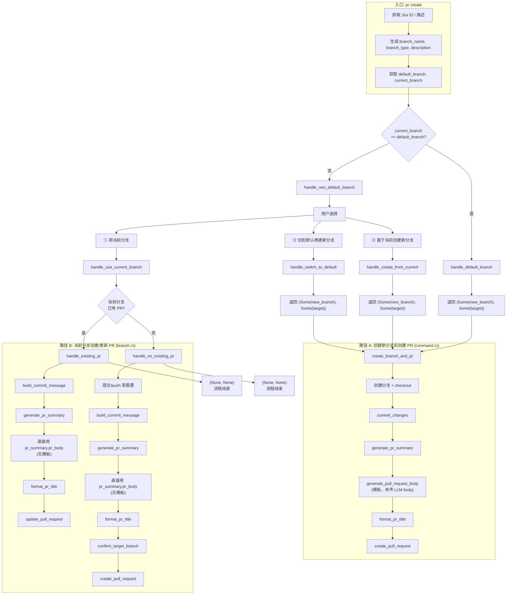
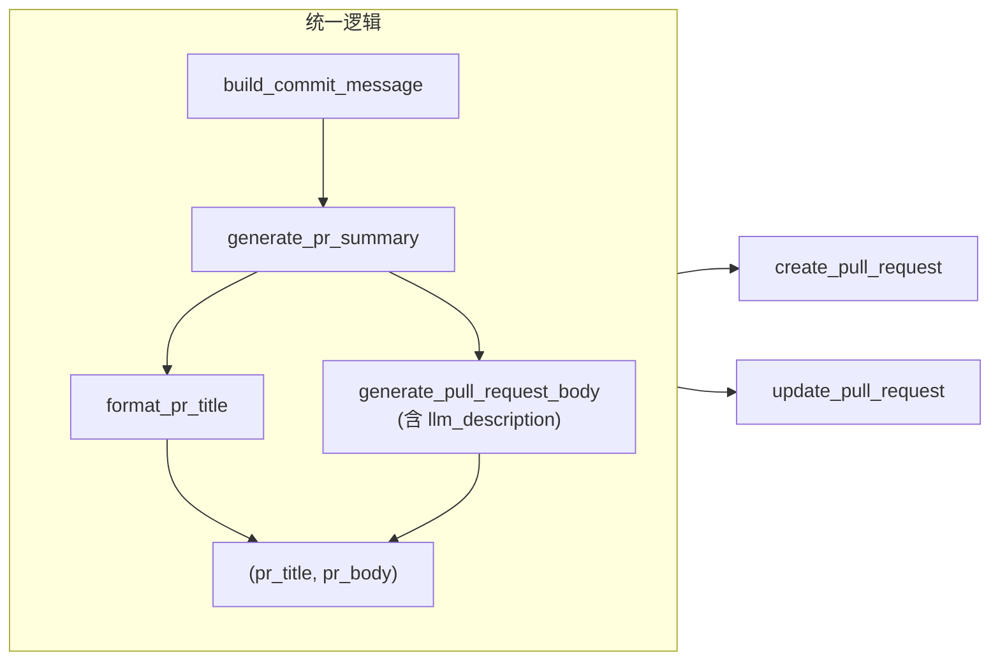

# PR Create 当前流程分析

## 流程图（现状）

## 两条「创建/更新 PR」路径对比

| 步骤 | 路径 A：create_branch_and_pr (command.rs) | 路径 B：handle_existing_pr / handle_no_existing_pr (branch.rs) |
|------|------------------------------------------|----------------------------------------------------------------|
| 提交 | `commit_changes`（新分支上） | 有未提交则 `commit_changes`，否则 `push_branch`（当前分支） |
| 标题 | `format_pr_title(pr_summary.type_, scope, commit_message)` | 同左 |
| **Body** | **`generate_pull_request_body(...)`** → 有 PR Ready、Types of changes、Jira 链接，**但没有 LLM 分析内容** | **直接用 `pr_summary.pr_body`** → 只有 LLM 分析内容，**没有模板** |
| 目标分支 | 调用方传入的 `target_branch` | `confirm_target_branch` 推断并确认 |
| 创建/更新 | `create_pull_request` | 已有 PR 则 `update_pull_request`，否则 `create_pull_request` |

## 结论

- **路径 A**：走模板，PR body = 模板渲染（short_description + change_types + jira），**未把 `pr_summary.pr_body` 传入模板**。
- **路径 B**：不走模板，PR body = `pr_summary.pr_body`，**没有** PR Ready、Types of changes、Jira 链接。

因此「推送后创建 PR」的逻辑在两条路径上不一致：一条只有模板、一条只有 LLM 内容。若要统一，应**抽成同一套「生成 PR 标题 + 生成 PR body」逻辑**，两处都复用。

---

## 分析：当前流程里「模板 vs LLM 内容」的实际使用

### 两处对 `generate_pr_summary` 的用法

`generate_pr_summary(base_branch)` 会返回 `PrSummaryResult { type_, scope, pr_body }`，其中 `pr_body` 是三阶段分析渲染出的 **LLM Markdown**。两条路径对这份结果的用法不同：

| 路径 | 使用的 pr_summary 内容 | 最终 PR body 来源 | 是否用模板 |
|------|------------------------|--------------------|------------|
| **A：create_branch_and_pr** (command.rs) | 只用 **type_**、**scope**（给 `format_pr_title`） | `generate_pull_request_body(...)`，**未传入** `pr_summary.pr_body` | ✅ 用模板；❌ **未用** LLM body |
| **B：handle_existing_pr / handle_no_existing_pr** (branch.rs) | 用 **type_**、**scope**（标题）和 **pr_body**（直接当 PR 描述） | `pr_summary.pr_body` 直接作为 body | ❌ 不用模板；✅ **只用** LLM body |

### 代码依据

**路径 A（command.rs 234–261 行）**

- 调用 `generate_pr_summary(target_branch)?` 得到 `pr_summary`。
- 用 `pr_summary.type_`、`pr_summary.scope` 参与 `format_pr_title`。
- PR body 来自 `generate_pull_request_body(..., ctx.description, jira_id, None, jira_info)`，**没有**把 `pr_summary.pr_body` 传进去。
- 因此：**只用了 LLM 的 type/scope，没有用 LLM 生成的 body；body 完全是模板**（PR Ready + Types of changes + short_description + Jira）。

**路径 B（branch.rs 82–101、161–194 行）**

- 调用 `generate_pr_summary(None)?` 得到 `pr_summary`。
- 用 `pr_summary.type_`、`pr_summary.scope` 参与 `format_pr_title`。
- PR body 直接是 `pr_summary.pr_body`（`update_pull_request(..., Some(&pr_summary.pr_body))` / `create_pull_request(..., &pr_summary.pr_body, ...)`）。
- **没有**调用 `generate_pull_request_body`。
- 因此：**只用了 LLM 生成的内容（含 body），没有使用模板**。

### 小结

- 从「**只使用了 generate_pr_summary 的 LLM 生成内容、没有使用模板**」这个说法来看，**完全符合的是路径 B**（当前分支创建/更新 PR）：这里 PR 描述就是 LLM 的 `pr_body`，没有任何模板。
- 路径 A 则相反：**使用了模板，但没有把 LLM 的 `pr_body` 用上**，只用了 type/scope 做标题。
- 整体上：**没有任何一条路径同时做到「模板 + LLM body」**；要么只有模板（A），要么只有 LLM（B）。

---

## 分析：在调用 generate_pr_summary 后用 generate_pull_request_body 完成目标

### 目标

两处路径在拿到 `generate_pr_summary` 的结果后，**统一用 `generate_pull_request_body` 生成最终 PR body**，使 PR 内容 = 模板（PR Ready + Types of changes + Jira 链接）+ **LLM 分析内容**（`pr_summary.pr_body`）。

### 当前缺口

1. **`generate_pull_request_body` 没有「LLM 描述」入参**  
   - 当前参数：`selected_change_types`, `short_description`, `jira_ticket`, `dependency`, `jira_info`。  
   - 没有 `llm_description`，无法把 `pr_summary.pr_body` 塞进模板。

2. **模板变量没有「LLM 描述」字段**  
   - `PullRequestTemplateVars` 只有：`jira_key`, `jira_summary`, `jira_description`, `jira_type`, `jira_service_address`, `change_types`, `short_description`, `dependency`。  
   - 缺少 `llm_description`（或等价字段），模板里无法渲染 LLM 内容。

3. **默认 PR 模板没有 LLM 内容占位**  
   - 当前默认模板只有：PR Ready、change_types、short_description、Jira 链接、dependency。  
   - 没有类似 `{{#if llm_description}}{{llm_description}}{{/if}}` 的块，即使传了变量也渲染不出来。

4. **branch.rs 路径没有调用 `generate_pull_request_body`**  
   - 当前直接用 `pr_summary.pr_body` 作为 body。  
   - 要达成目标，这里也要改为：先得到 `pr_summary`，再调用 `generate_pull_request_body(..., llm_description: Some(&pr_summary.pr_body))` 得到最终 body。  
   - branch 路径还需要 `selected_change_types`：可从当前分支名推断 `BranchType`，再 `get_change_types_by_branch_type(branch_type)`，或默认用 `BranchType::Feature`。

### 结论：是否应该这样改？

**应该。** 在调用 `generate_pr_summary` 之后，用 `generate_pull_request_body` 生成最终 body，并**把 LLM 内容作为模板变量传入**，这样：

- 两条路径逻辑统一：都是「`generate_pr_summary` → `generate_pull_request_body`(含 llm_description) → 用返回的 body 创建/更新 PR」。
- 最终 PR 内容一致：PR Ready + Types of changes + LLM 描述 + Jira 链接。

### 需要做的改动（概要）

| 层级 | 改动 |
|------|------|
| **domain** | 在 `PullRequestTemplateVars` 中增加 `llm_description: Option<String>`；默认 PR 模板中增加 `{{#if llm_description}}{{llm_description}}{{/if}}`（建议放在 Types of changes 之后、Jira 链接之前）。 |
| **app (workflows)** | `generate_pull_request_body` 增加参数 `llm_description: Option<&str>`，渲染时赋给 `vars.llm_description`。 |
| **app (command.rs)** | 在 `create_branch_and_pr` 中，`generate_pr_summary` 之后调用 `generate_pull_request_body(..., llm_description: Some(&pr_summary.pr_body), ...)`，用其返回值作为 PR body（不再用仅含 short_description 的模板结果）。 |
| **app (branch.rs)** | 在 `handle_existing_pr` 与 `handle_no_existing_pr` 中，`generate_pr_summary` 之后不再直接用 `pr_summary.pr_body`；改为根据当前分支得到 `selected_change_types`（分支名→BranchType→change_types 或默认 Feature），再调用 `generate_pull_request_body(..., llm_description: Some(&pr_summary.pr_body), ...)`，用其返回值作为 PR body。 |

这样，两处都是在「调用 `generate_pr_summary` 之后，用 `generate_pull_request_body` 完成目标」的同一套应用方式。

---

## 修改方向：统一「创建/更新 PR」逻辑

目标：不论是从当前分支还是新创建分支，**推送后的「生成 PR 标题 + 生成 PR body → 创建/更新 PR」** 使用同一套逻辑。

### 1. 抽象出统一的「准备 PR 内容」步骤

建议在 `pr.rs`（或单独模块）中提供**单一入口**，例如：

- **输入**：当前分支名、目标分支（可选）、commit 用描述、jira_id、jira_info、branch_type（用于 change_types，当前分支时可从分支名推断或默认 Feature）。
- **输出**：`(pr_title: String, pr_body: String)`。
- **内部步骤**：
  1. `build_commit_message(jira_id, description)` → `commit_message`
  2. `generate_pr_summary(base_branch)` → `pr_summary`（含 type、scope、pr_body）
  3. `format_pr_title(pr_summary.type_, pr_summary.scope, commit_message)` → `pr_title`
  4. 根据 branch_type 得到 `selected_change_types`，调用 `generate_pull_request_body(..., llm_description: Some(pr_summary.pr_body), ...)` → `pr_body`（需先扩展模板变量与 `generate_pull_request_body` 参数，见下）

这样两条路径都只做：**拿到 (pr_title, pr_body) → create_pull_request / update_pull_request**。

### 2. 模板与参数扩展（使 body 同时包含模板 + LLM 内容）

- 在 **domain**：`PullRequestTemplateVars` 增加字段，如 `llm_description: Option<String>`；默认 PR 模板中增加一块，例如 `{{#if llm_description}}{{llm_description}}{{/if}}`。
- 在 **app**：`generate_pull_request_body` 增加参数 `llm_description: Option<&str>`，渲染时赋给上述变量。
- 调用处：统一入口内用 `pr_summary.pr_body` 作为 `llm_description` 传入。

### 3. 两处调用改为使用统一入口

- **command.rs** 的 `create_branch_and_pr`：在 `generate_pr_summary` 之后，不再单独调用 `generate_pull_request_body` 和 `format_pr_title`，改为调用上述统一入口，得到 `(pr_title, pr_body)` 后执行 `create_pull_request`。
- **branch.rs** 的 `handle_existing_pr` 与 `handle_no_existing_pr`：同样改为调用统一入口得到 `(pr_title, pr_body)`，再根据是否有已有 PR 调用 `update_pull_request(pr_id, Some(pr_title), Some(pr_body))` 或 `create_pull_request(..., pr_title, pr_body, ...)`。当前分支的 branch_type 可由分支名推断或默认 `BranchType::Feature`。

### 4. 流程统一后的简化示意

两条路径在「提交/推送」完成后，都进入同一套 unified 逻辑，再根据是否已有 PR 决定 create 或 update。
